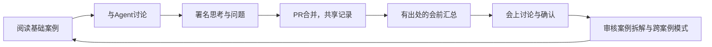

# FDE AI School

**读案例，与AI讨论，把自己的判断留给下一位学习者。**

这里有24个FDE落地案例，涵盖制造、政务、法律、设计、零售、供应链等场景。每例包含口语化简介、行业约束、方案形成过程、交付物、成效与边界、迁移练习，以及完整访谈和原图。建议每次用6分钟理解案例、4分钟讨论一个关键判断；详解可在课前阅读。

学校的内容会随学习长厚：基础教材提供证据，学员记录保留不同想法，会议聚焦真实问题，经过审核的拆解和模式形成下一轮教材。

[开始学习](START_HERE.md) · [24个案例](cases/README.md) · [学习方法](HOW_TO_LEARN.md) · [会前汇总](docs/meeting-workflow.md) · [参与贡献](docs/contributing.md)

## 直接对Agent说

在Codex或Claude Code打开本仓库后，可以说：

> 我是 alice，昵称小艾。带我用10分钟学习案例04，记录我的思考和问题。

> 看看同学对案例06有哪些不同判断，并把我的反馈记在我的文件里。

> 提交我今天的课前记录，创建一个PR。

> 汇总主分支里案例01、04、06的课前记录，列出问题、分歧和建议讨论顺序。

以上名字仅用于演示。首次使用请给自己一个稳定的学习者标识和可公开昵称。Agent按仓库skill保存每轮实质讨论；本地保存后，提交并合并到主分支的记录才成为默认共享学习资料。

## 内容放在哪里

```text
FDE AI School/
├── README.md / HOW_TO_LEARN.md       介绍、校规与学习循环
├── AGENTS.md / CLAUDE.md             Agent入口
├── .codex/skills/school-guide/       唯一的完整skill规则
├── .agents/skills/school-guide/      Codex发现入口
├── .claude/skills/school-guide/      Claude Code发现入口
├── cases/
│   └── case-04-urban-planning-tools/
│       ├── base/                    案例详解与完整访谈
│       ├── reflections/             学员记录：一人一天一个文件
│       └── canon/                   经PR审核的案例拆解
├── patterns/                        经PR审核的跨案例方法
├── meetings/                        会前资料、Agent整理、会议决定
├── sources/ / assets/ / data/        原始证据、图片和结构化索引
├── templates/ / tools/ / tests/      记录模板、辅助工具和验证
└── .github/                         CODEOWNERS、PR模板和自动检查
```

## 校规：保留判断，也保留分歧

| 内容 | 它能说明什么 | 怎么更新 |
|---|---|---|
| `base/` | 访谈陈述和明确标注的教材分析 | 仅教材维护，走受保护的PR审核 |
| `reflections/` | 某位学员在某时刻的想法，不代表共识 | 自动追加自己的记录，更正也保留前文；PR共享 |
| `canon/` | 关于一个案例的系统拆解 | 提案与已审版本分开，由CODEOWNER审核 |
| `patterns/` | 多个案例支持、带适用边界的方法 | 引用至少两个案例，PR审核后沉淀 |
| `meetings/` | 有范围的会前资料和实际会议产出 | 自动资料、Agent分析与已确认决定分别保存 |

不把Agent回答写成学员观点，不把提问次数当成赞成票，不因Agent回答过就关闭问题。引用尽量落到案例、PDF页码或具体记录编号。公开记录使用适合公开的内容；私密学习可让Agent仅写到Git忽略的`.school/private/`。

CODEOWNERS与分支保护共同约束基础资料、正式拆解和模式的改动；具体规则与管理员例外见[治理说明](docs/governance.md)。它们不提供逐文件的保密能力，公共仓库内的内容可被公开阅读。

## 一次共学如何留下成果



仓库提供规则与工具，需要Agent在每轮学习中执行记录操作。GitHub链接本身是教材入口；它不会自动创建一个所有人共享聊天历史的AI。每个人的对话通过提交的署名记录汇合，详见[接入说明](docs/access-options.md)。

维护者可运行`python tools/validate.py`与`python -m unittest discover -s tests -v`检查资料完整性、记录行为和汇总边界。资料字段见[数据结构说明](data/schema-guide.md)，原始来源见[sources](sources/README.md)。
