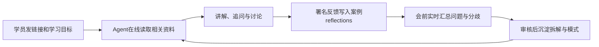

# FDE AI School

**给Agent一个学校链接，让它在线读案例，带你学习。**

学校的教材、学员讨论和正式拆解持续保存在GitHub。Agent在每轮需要资料时访问线上来源，结合你的问题讲解、追问和比较，让同一份在线知识服务不同学习者。

学员只需使用能直接读取网页或GitHub内容的Agent。学习不要求克隆仓库、建立本地项目、安装Git或Python，也不要求先登录GitHub。

## 先安装school-guide

把[school-guide文件夹](https://github.com/littleduckycoin-ai/DP-FDE-school/tree/main/.codex/skills/school-guide)发给Codex：

> 请使用 $skill-installer 安装这个skill：https://github.com/littleduckycoin-ai/DP-FDE-school/tree/main/.codex/skills/school-guide

安装后直接说“使用`$school-guide`，根据我的问题推荐一个案例并开始学习”。[安装说明](INSTALL_SKILL.md)

## 不安装也能开始

> 请在线读取 https://github.com/littleduckycoin-ai/DP-FDE-school/blob/main/START_HERE.md ，按照其中的线上教学规则带我学习。每轮需要资料时读取线上当前版本，不建立本地教材副本。先用10分钟带我学习案例04，先讲清项目，再围绕我的判断展开讨论，并给出出处。

[安装skill](INSTALL_SKILL.md) · [直接开始学习](START_HERE.md) · [24个案例](cases/README.md) · [学习方法](HOW_TO_LEARN.md) · [如何留下思考](docs/contributing.md)

## 一所持续生长的学校

| 在线资料 | 学习时如何使用 |
|---|---|
| `cases/<case-id>/base/` | 24个基础案例：口语化简介、行业约束、解法形成、交付与成效、完整访谈和原图 |
| `cases/<case-id>/reflections/` | 每位学员的署名知识文件，保存思考、评价、问题、分歧和修订 |
| `cases/<case-id>/canon/` | 经PR审核的案例拆解；待审与已审版本分开 |
| `patterns/` | 跨至少两个案例的方法、适用边界与反例 |
| `meetings/` | 已发布的会前资料、Agent整理和实际确认的会议决定 |

## 校规

访谈事实、教材分析、学员观点和Agent建议分别标明。相近提问不等于共识，Agent给答案不等于学员的问题已解决；原文不足时明确说明。

学习者可以先匿名阅读，需要署名反馈时再提供稳定标识和昵称。首次明确授权后，具备GitHub写入能力的Agent把每轮表达追加到对应案例的reflection文件，并复用同一分支和PR。没有写入连接时继续教学，给出准确路径、完整Markdown和网页提交入口；不能声称已保存。

案例教学以当轮线上读取为准。reflection是署名学习知识，合并后即可用于后续学习和会前整理；它仍是个人表达。canon与patterns须经过PR审核才是正式知识。公共记录应使用适合公开的昵称和内容。

## 给Agent与维护者

[AGENTS.md](AGENTS.md)是入口，[school-guide](.codex/skills/school-guide/SKILL.md)维护完整规则；Codex和Claude Code的发现入口共用它。Agent也可通过[在线服务索引](data/online-school.json)找到各类URL。

仓库中的脚本和CI服务于维护、验证和归档。它们不是学员的初始化步骤。现有基础案例与144段完整问答保留；[数据结构](data/schema-guide.md)、[来源](sources/README.md)、[在线读取协议](docs/online-protocol.md)、[反馈流程](docs/contributing.md)和[审核规则](docs/governance.md)可按需查阅。
