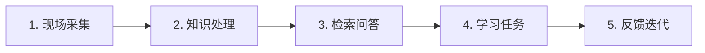

# CASE 01｜把师傅经验变成培训闭环

**行业**：零部件制造　 **学习主题**：知识与专业工作台　 **共学时间**：约10分钟

## 一句话简介

FDE团队帮一家德国零部件工厂解决了老师傅快退休、新人反复问问题、培训进度看不清的麻烦，把调参数和处理异常的经验整理进知识库，再接到员工原来的培训平台里，让新人能边学边问、师傅能看到学到了哪一步，把经验传承变成了一套能持续运行的流程。

[返回目录](../README.md) · [本例JSON](case.json) · [完整访谈](#full-interview) · [原PDF](../../sources/original-interviews.pdf#page=7)

原题：从师徒带教到AI辅助培训：FDE用AI破解制造业经验传承难题

来源范围：PDF物理页 7–14；书内页码 6–13。

**本例值得讨论的判断（编辑提炼）**：知识能回答问题之后，还要有人真正学会。

> 阅读提示：标为“访谈概括”的内容来自受访者陈述；“补充分析”是编辑解释；“迁移演练”是迁移假设。效果数字保留原文的试点、目标、估算和脱敏条件。前半部用于备课和学习，后半部完整保留原访谈。

## 1. 业务现场与行业特点

### 发生了什么｜访谈概括

这家工厂位于德国斯图加特，约有七八十名员工。它不是一种产品重复生产到底，而是多条产线同时处理不同型号的零部件。材料配比、设备状态和参数设置会影响耐磨、耐酸等性能，因此同一句操作要求放到不同产品上，处理方法可能并不相同。

过去新人主要跟着老师傅学，培养周期可能是两三个月甚至更长。师傅既要完成自己的生产任务，又要反复解释常见问题；随着部分熟练员工接近退休，企业担心的已经不只是带教忙，而是一些处理异常的经验会随人离开。

关键现场事实：

- 德国斯图加特零部件企业，约70–80人
- 多产线、多型号；参数与金属配比影响质量
- 新人、带教师傅、产线主管共同使用

**原工作路径**：新人入职 → 反复询问师傅 → 现场跟学 → 师傅凭观察评估

**重新定义的问题**：“沉淀经验”还不够具体：新人到底缺什么、在哪里卡住、学会没有？

依据：[原PDF物理页 8、9](../../sources/original-interviews.pdf#page=8)；需要核实具体说法请查看[完整访谈](#full-interview)。

扩充段落主要参照：[Q1](#q1)、[Q2](#q2)；原PDF物理页 7–14。

### 为什么需要FDE｜补充分析

从行业特点看，这类知识有两层：操作手册能写下标准步骤，经验则说明什么时候不能照搬标准步骤。学习系统如果只收集标准答案，就容易漏掉产品条件、异常信号和经验适用范围；因此知识整理必须和真实任务、师傅复核一起设计。

经验有适用条件和例外；师傅既承担生产又承担带教。退休与扩张让个人记忆成为组织瓶颈。

需要同时把隐性经验变成知识、把知识变成培训步骤，并和主管共同定义验收。

## 2. 解决思路怎样形成

### 从调研到方案的过程｜访谈概括

客户最初表达的是“把老师傅经验沉淀下来”。FDE没有直接据此建设大知识库，而是先找主管梳理生产线和新人培训流程，继续追问新人缺什么、经常在哪一步出错、哪些问题一定要找师傅，最终把模糊诉求拆成具体的学习任务与知识地图。

前期只做访谈时，一线员工既不一定愿意花时间，也很难讲完整自己的工作习惯。FDE随即改为跟着员工走一天的流程，观察他们在哪里停下来、问别人什么、哪些问题反复出现。这些现场问题后来直接成为知识库测试集，调研与验收由此连在了一起。

知识处理从已有文档开始，再补进师傅的隐性经验，通过文档解析与检索增强组织回答。小范围技术验证之后，团队把这项能力接入原培训平台，增加课程任务、进度查看和逐课问答，让AI服务于新人实际的培训安排。

| 现场信号 | 形成的决定 |
|---|---|
| 只靠访谈，员工难以说清习惯 | 改为跟岗；记录高频问题与反复出错点 |
| 已有文档不能覆盖老师傅经验 | 形成知识地图，补充情境与例外知识 |
| 知识库能答，却不等于员工会用 | 接入原培训平台，增加进度、课程问答和陪跑 |

依据：[原PDF物理页 9、10、12](../../sources/original-interviews.pdf#page=9)；需要核实具体说法请查看[完整访谈](#full-interview)。

扩充段落主要参照：[Q3](#q3)、[Q5](#q5)、[Q6](#q6)；原PDF物理页 7–14。

### 这些取舍为什么重要｜补充分析

第一个取舍是覆盖面与可验证性。先抓高频学习任务，比较容易找到明确的使用者、测试问题和反馈人；如果一开始追求所有经验都入库，难以确认新人是否真的因此学会了工作。

第二个取舍是复用原平台与另建入口。原有培训平台已经承载员工的日常任务，接进去可以减少切换；代价是FDE必须同时处理页面、课程和组织安排，不能把自己局限在模型问答效果上。

## 3. 工作流程与人机分工

以下流程图和职责划分是依据访谈所作的业务抽象，不补造未披露的技术架构。



| 步骤 | 实际作用 |
|---|---|
| 1. 现场采集 | 高频问题＋已有文档＋师傅经验 |
| 2. 知识处理 | 文档解析、知识整理与RAG |
| 3. 检索问答 | 用真实高频问题检验召回 |
| 4. 学习任务 | 课程、打卡、逐课问答 |
| 5. 反馈迭代 | 师傅看进度；复杂问题回到人 |

| 角色 | 负责什么 |
|---|---|
| AI | 检索知识、承担重复问题的第一轮解答 |
| 系统 | 课程任务、进度记录、知识与问答入口 |
| 人 | 师傅确认经验与例外，主管共定验收 |

依据：[原PDF物理页 10、11](../../sources/original-interviews.pdf#page=10)；需要核实具体说法请查看[完整访谈](#full-interview)。

## 4. 交付物、实际使用与组织采用

### 交付后怎样工作｜访谈概括

新人最终使用的是带知识问答的培训流程：知道规定时间内要学哪些内容，可以就当前课程提问，并完成课后问题。师傅使用同一套平台查看进度，把精力放到学员卡住的地方和复杂问题上；因此交付对象同时包括学习者与带教者。

交付资产还包括知识地图、可检索知识内容和真实问题测试集。它们各有作用：知识地图帮助企业看清关键经验，知识内容支撑日常回答，测试集则用于判断改版后是否仍能解决最初发现的问题。把文档上传成功，只完成了其中一部分。

| 交付物 | 交付内容 |
|---|---|
| 知识地图与知识库 | 把产品、操作与高频问题组织成可检索内容 |
| 培训工作流 | 嵌入现有平台的课程、打卡与学习验收 |
| 真实问题测试集 | 将前期调研的问题转为技术验证样本 |

### 实施与推广｜访谈概括

全程约半年，实际投入约4个月；上线陪跑接近2个月，持续改页面与易用性。

访谈给出的完整项目跨度约半年，实际投入时间约四个月，其中上线后的陪跑接近两个月。陪跑内容包括前端易用性、页面与问答效果调整，还要持续观察新人看不看得懂、师傅愿不愿意回来查看。这里的上线是开始收集使用反馈的节点。

依据：[原PDF物理页 10、11、12](../../sources/original-interviews.pdf#page=10)；需要核实具体说法请查看[完整访谈](#full-interview)。

扩充段落主要参照：[Q3](#q3)、[Q4](#q4)、[Q5](#q5)；原PDF物理页 7–14。

## 5. 实际成效与证据边界

### 原文报告的变化

| 指标 | 原来或参照 | 后来或状态 | 必须保留的限定 |
|---|---|---|---|
| 原培训周期 | 2–3个月或更长 | 新周期未披露 | 原文未证明新人培训时间缩短多少 |
| 技术验收口径 | 共同约定 | 约95% / ≥80% | 分别为文档解析与召回片段准确口径；非业务收益 |
| 组织变化 | 经验依赖个人 | 学习进度可追踪 | 师傅转向处理复杂问题；定性反馈 |

### 如何理解效果｜补充分析

能确认的变化是经验被系统整理、师傅从重复解答转向进度关注与复杂问题、新人学习过程更可追踪。约95%的文档解析和80%以上的召回片段准确口径，是双方在小范围试验中讨论的技术标准；原文没有报告培训后周期，因此不能把原先两三个月直接写成缩短了多少。

**证据边界**：未披露培训后周期、错误率或财务收益；技术阈值不能替代学习效果。

依据：[原PDF物理页 10、11、12](../../sources/original-interviews.pdf#page=10)；需要核实具体说法请查看[完整访谈](#full-interview)。

## 6. 难点、应对与可复用经验

| 难点 | 原文中的应对 |
|---|---|
| 经验难说清 | 跟岗观察，少依赖抽象访谈 |
| 指标谁说了算 | 小范围试验后与客户共同设定 |
| 上线后不一定用 | 复用现有平台，持续陪跑 |

依据：[原PDF物理页 10、11、12](../../sources/original-interviews.pdf#page=10)；需要核实具体说法请查看[完整访谈](#full-interview)。

**可复用的方法（编辑归纳）**：结合第2节的关键取舍，关注真实任务如何被重新定义、可交付结果由谁确认，以及组织如何继续使用和修改。原受访者的全部经验保留在[Q6](#q6)。

## 7. 迁移到其他工作场景的讨论｜4分钟

以下是通用研发场景中的假设练习，不代表案例客户或任何学习者所在组织已经开展或验证了这些项目。

某材料研发团队希望把资深科学家的参数设置和失败排查经验传给新人。

**讨论问题**：第一版应先覆盖全部文档，还是先跑通一种新人任务？

**本组应交出的产物**：画出一个学习任务，列出3个真实考题，并指定谁判断“学会了”。

个人思考40秒 → 小组讨论100秒 → 共识与质疑70秒 → 主持人收束30秒。

<details>
<summary>展开：迁移试点、验收与主持人参考</summary>

迁移到实际工作时，可以选一个真实的材料计算或实验流程，例如新人按既定方法提交计算任务并处理常见失败。先整理“适用体系、输入要求、参数理由、失败迹象、处理方法、何时找专家”，每项经验都带上条件和来源。

第一轮让新人完成正常任务、处理一个常见异常、识别一个超出适用范围的问题。用任务完成质量、错误判断和专家复核时间验证学习效果，再决定是否扩大知识范围；这比只统计提问次数更能说明是否形成能力。

**建议切口**：先选一种计算或实验流程，记录“适用体系—参数—异常—处理—依据”。

**建议验收**：建议验收：新人独立完成真实任务的成功率、师傅复核时间、错误案例覆盖。

**适用限制**：经验迁移要带体系和条件；涉及安全与科学判断的例外由专家确认。

**主持人参考**：参考：从一种高频任务开始；题目覆盖正常、异常和超出知识边界三类。

</details>

可以直接对Codex说：

```text
请带我学习案例01。先讲清项目做了什么，再用一个关键问题让我做判断。
讲事实时引用原PDF页码；讨论迁移方案时明确标为假设。
```

## 8. 原图与受访者介绍

[查看原案例封面与受访者介绍](../../assets/cover_7.png)。人物姓名、职位及图片内文字以原PDF为准。

本例没有单独提取出的正文图片；封面、图内文字与全部页面仍保存在原PDF。上方流程图是编辑抽象。

<a id="full-interview"></a>

## 9. 完整原始访谈

以下6组问答逐段保留原PDF文字层的原始提取内容。原有换行、术语或转义保留，不以编辑详解替代原文。文字层未包含的图片信息，请查看上方原图及[完整PDF第7–14页](../../sources/original-interviews.pdf#page=7)。

<details>
<summary>展开全部访谈：Q1–Q6</summary>

<a id="q1"></a>

### Q1

Q1：作为FDE，你应用AI的具体场景是什么？在这个场景下遇到
的具体问题长什么样？
我当时服务的是德国斯图加特一家制造零部件的企业，大概有七八十名员工。企业有多
条产线，也有很多不同型号的产品。
这个行业有一个明显的特点，很多生产知识非常细。比如生产不同零部件时，需要调整
参数，也会涉及不同金属材料的比例。因为零部件最终面对的使用环境不同，有些可能
需要应对强酸环境，有些需要耐磨损，所以不同的材料配比、设备操作和生产经验，会
直接影响产品质量。
真正让企业焦虑的，是这些知识并不完全存在于标准文档里，相当一部分经验掌握在老
师傅手里。
老师傅知道某个产品应该怎么调、什么情况下参数应该发生变化、设备出现某种状态时
应该怎么处理。这些东西很多属于长期实践形成的隐性经验，很难简单靠一份操作手册
完整记录下来。
企业最担心的是，如果人走了，经验会不会也跟着人一起走了。
所以我进场之后，没有先问“要用什么模型”，先去看他们到底怎么培养新人。
现在回头看，这一步其实比后面选什么模型更重要。因为企业最开始说的是“我们想把
老师傅的经验沉淀下来”，但这句话还不能直接变成一个AI项目。
我必须继续往业务里走，直到把它变成一个更具体的问题，新人学习过程中到底缺哪些
知识，这些知识在哪里，以及怎样才能让它在真正需要的时候被找到。

<a id="q2"></a>

### Q2

Q2：在你参与之前，这个问题过去是怎么解决的？
过去主要还是靠“人带人”。
新人进入企业之后，要经历一套比较长的培训和实习过程，老师傅在这个过程中承担了
很重要的带教角色。根据我当时了解到的情况，培养一个新人可能需要两三个月甚至更
长。
制造业里的很多经验，本来就是在长期实践中形成的，老师傅不仅知道标准答案，还知
道什么时候不能机械地照标准答案执行，所以过去依靠师徒制，其实是一种非常自然的
知识传递方式。
真正的问题，是企业的业务环境开始变化了。一方面，老师傅自己的生产任务很重，没
有足够时间持续带新人；另一方面，一些经验丰富的员工开始接近退休。与此同时，企
业又希望把过去依赖个人的经验沉淀成组织能够长期使用的知识。
所以我做的，是先把老师傅最有价值的经验留下来，让那些过去必须反复问老师傅的问
题，可以通过另一种方式完成第一次解答；真正复杂、需要判断的问题，再回到老师傅
这里。这样，老师傅的时间就不需要一直消耗在重复性的知识传递上。
从这个角度看，我做的事比“传统培训改AI培训”更进一步，是在重新分配人在培训流程
里的作用。

<a id="q3"></a>

### Q3

Q3：后来你使用AI解决这个问题的整体思路和关键步骤是什
么？
整个项目真正花时间的地方，其实在于前后几个环节怎么串起来，把知识库搭出来只是
其中一步。
第一步，先进入业务，把技术往后放。
一开始，我原本比较习惯通过访谈了解客户需求，高层、中层、一线员工都会聊。
但实际做项目的时候，我发现一个问题，一线员工不一定愿意花很多时间接受访谈，而
且很多日常工作中的细节，他自己也未必能在访谈里完整描述出来。所以后来我调整了
方法。
除了访谈，我会直接跟着员工走一遍他每天的工作流程，看他一天具体在做什么、在哪
里停下来、哪里需要问别人、哪些问题不断重复出现。
这样得到的问题，比单纯问一句“你有什么痛点”具体得多。
这个项目里，我也是先找到主管，把生产线和新人培训流程梳理出来，然后统计新人最
常出现的问题、最容易反复出错的知识，以及哪些内容属于老师傅才能掌握的隐性经
验，最后把这些内容整理成一张知识地图。
第二步，把人的经验变成AI能够使用的知识。
知识地图有了之后，下一步才真正进入知识处理。
企业本身已经存在一部分知识文档，我先把这些已有材料导入，再通过文档解析、RAG
等方式进行处理。但只有文档还不够，我更重要的一项工作，是把老师傅过去存在脑子
里的隐性经验抽象出来，让它能够进入企业的知识体系，最终能够被AI理解和检索。
这里很容易出现一个误区，觉得把文档扔进去，AI能回答问题，知识库就算做完了。我
没有按这个标准验收。
前期调研时统计出来的那些高频问题，本身就会成为后面的测试集。比如当时我会看文
档解析是否能够达到大约95%，问题召回片段的准确率是否能够达到80%以上，在一个
最小范围的测试里达到约定标准，我才认为这条技术路径初步跑通。
我觉得这正是FDE和单纯做技术开发不太一样的地方，前面发现的问题，最后一定要重
新回到这些问题上验证。
第三步，把AI放回原来的培训流程。
技术通路跑通以后，项目其实还没有结束。如果只是给员工一个新的AI入口，让大家自
己去用，很多时候最后是用不起来的。
所以我继续往业务流程里做。当时企业原本就有新人培训环节，我把AI知识能力接进了
他们实际使用的平台，并进一步设计了一套类似在线课程打卡的培训流程。
新人能够看到自己在规定时间内完成了多少学习内容；带教师傅也能够回到平台查看新
人当前的学习进度；每节课程还会设置问答，对学习结果做一次简单验收。也就是说，
AI进入了原来的新人培训流程，没有额外增加一个“聊天机器人”。
第四步，陪着企业把它真正用起来。
上线以后，我还持续调整前端易用性、页面和实际问答效果。这个过程不是一天两天，
当时仅陪跑就接近两个月，整个项目如果从立项、调研一直算到最终陪跑，大约经历半
年；如果只算真正投入在项目里的时间，大约四个月左右。
所以企业AI落地很少是“系统上线=项目结束”。真正的落地，往往发生在上线之后。
员工怎么使用、哪里不习惯、老师傅愿不愿意看、新人能不能看懂，这些问题最后都会
反过来要求我继续修改产品。

<a id="q4"></a>

### Q4

Q4：相比传统方式，使用AI后的实际效果如何？
从实际业务变化来看，有几个变化是比较明确的。
首先，过去分散在老师傅个人经验里的知识，开始被系统化整理，企业第一次能够比较
完整地知道哪些经验真正不能随着老师傅退休而流失。
其次，老师傅的角色开始发生变化，从重复回答所有问题，逐渐转向关注新人学习进度
以及处理更复杂的问题。
第三，培训本身变得更可追踪。以前新人“学到了哪里”“到底掌握了多少”，很大程度
依赖带教师傅自己的观察，现在这些进展都能在平台上被清楚地看到和跟踪。
对我来说，这个项目真正的价值，在于企业原本高度依赖个人的经验传承过程，开始变
成一套能够沉淀、检索、学习和追踪的组织流程。

<a id="q5"></a>

### Q5

Q5：在部署AI过程中，是否遇到了新问题或挑战？你是怎么解
决的？
这个项目里，我觉得至少有三个挑战值得单独拿出来讲。
第一个挑战，是用户说不清需求，也说不清经验。
最开始我采用访谈，希望通过和不同层级员工交流了解问题。但做下来才意识到，一线
员工未必愿意投入很多时间，而且很多隐性的工作习惯很难靠问答完整说出来。
所以我后来减少对纯访谈的依赖，直接跟着员工走他的日常流程。这是一个很小的调
整，但对FDE来说非常重要。有时候你不能继续追问用户“你需要什么”，得自己去现场
看，看他到底怎么工作。
第二个挑战，是技术指标不能由FDE自己关起门来定义。
比如文档解析率、召回准确率做到多少算合格，没有一个可以直接套用的行业标准。我
的做法是先做一个小范围测试，看看当前条件下大概能达到什么水平，再和客户沟通他
们真正需要什么，最后双方共同确定验收标准。所以验收标准本身，也是业务沟通的一
部分。
第三个挑战，是技术跑通以后，员工不一定愿意用。
所以后来我花了很多时间调整前端页面、学习流程和易用性。我没有要求新人改变整个
工作习惯去适应AI，尽量把AI放进他们已经存在的培训和协作环境里。
我做企业项目时一直比较坚持这一点，如果客户已经有能够解决问题的技术栈、平台或
者模型，我会尽可能复用，避免为了展示技术能力把客户已有的东西全部推翻重做。因
为站在客户角度看清楚“什么已经能用、什么真正需要改”，本身就是建立信任的过
程。

<a id="q6"></a>

### Q6

Q6：根据你的经验，我们怎么才能更好地把AI部署到实际业务
中？
做完这个项目以后，我更清楚地认识到，FDE最重要的能力其实不在“知道多少模型”
上。我更愿意把FDE理解成一个团队，团队里有人需要真正进入客户现场，判断业务问
题；有人要把需求变成能在客户环境里跑起来的东西；还需要更专业的技术人员保证架
构、性能和未来的扩展性。
但不管角色怎么分，最后做的都是同一件事，把企业模糊的问题，变成可落地、可验证
的AI解决方案，再把它真正推进到企业业务流程里。如果让我把这次项目里的经验再压
缩一下，我会总结成四点。
第一，不要从“企业想做什么AI”开始，要从“企业每天到底怎么工作”开始。
用户自己有明确需求当然很好，但即使没有明确需求，只要他的业务SOP足够清晰，我
也可以沿着流程一个环节一个环节去判断哪里适合AI。所以对企业来说，在做AI之前，
把自己的核心业务流程先梳理清楚，本身就非常重要。
第二，不要急着推翻客户已有的东西。
我做前期调研时，会先看企业现在用了什么技术栈、什么平台、什么模型，哪些东西能
够继续复用。如果已有能力能够解决问题，就尽可能沿用。FDE要做的，是找到客户成
本和业务效果之间更合适的方案，不必去证明自己的技术方案最复杂。
第三，前期发现的问题，要直接变成后面的测试标准。
这个案例里，新人高频问题在访谈结束后没有停留在报告里，直接变成了知识库测试
集。我认为这是非常关键的一步。只有这样，AI最终验证的才是“能不能解决真实业务
问题”，单纯的技术指标漂不漂亮退居其次。
第四，AI一定要进入流程，不能停在Demo里。
知识库能回答问题，只能证明技术通路跑通了。新人真的愿意学、带教师傅真的愿意
看、学习结果能够被验收，这才说明它开始进入业务。所以我最后花了接近两个月陪
跑。很多企业AI项目真正困难的部分，其实在最后这一公里，怎么让AI和企业原来的业
务流程真正连接起来。
这就是我对FDE这个角色的理解。AI能力还会继续变强，做AI应用的门槛也会越来越
低，但企业自身的流程、组织和真实业务环境不会因此自动变得清晰。FDE真正要解决
的，就是AI与企业之间最后这一公里的问题。未来技术会变、模型会变、服务形式也会
变，但这种“深入现场、发现问题、验证方案、进入流程”的能力，我认为仍然会长期
存在。

</details>

[返回案例目录](../README.md) · [本例结构化数据](case.json)
