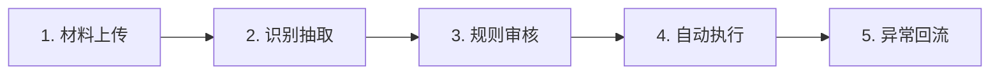
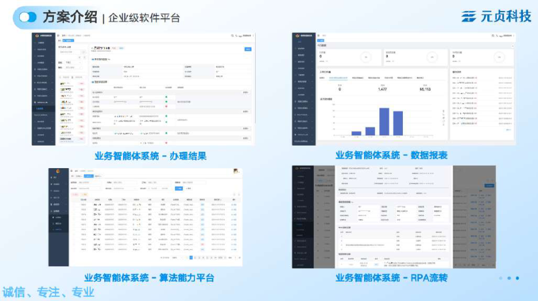
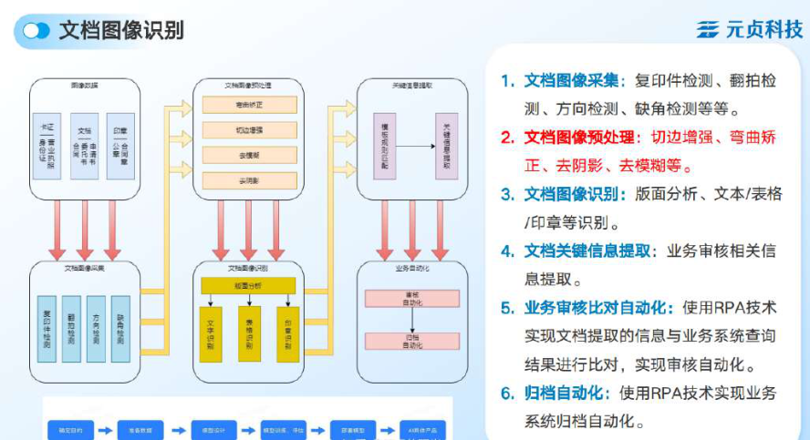

# CASE 02｜从驻场运维发现审核瓶颈

**行业**：政务网办　 **学习主题**：流程执行与采用　 **共学时间**：约10分钟

## 一句话简介

FDE团队在车管所做系统运维时，发现工作人员每天都在人工看证件照片、核材料、填系统，于是把图片识别、信息提取和跨系统填报串起来，让正常业务自动往下走、异常再交给人，访谈中一单审核从约15分钟降到3—5分钟，日均办件量从约七八百件提高到1100件左右。

[返回目录](../README.md) · [本例JSON](case.json) · [完整访谈](#full-interview) · [原PDF](../../sources/original-interviews.pdf#page=15)

原题：从人工审材料到自动化办件：FDE用AI提升车管所网办效率

来源范围：PDF物理页 15–24；书内页码 14–23。

**本例值得讨论的判断（编辑提炼）**：第一个运维项目，打开了真正的业务入口。

> 阅读提示：标为“访谈概括”的内容来自受访者陈述；“补充分析”是编辑解释；“迁移演练”是迁移假设。效果数字保留原文的试点、目标、估算和脱敏条件。前半部用于备课和学习，后半部完整保留原访谈。

## 1. 业务现场与行业特点

### 发生了什么｜访谈概括

项目的入口是遗留系统运维：原承建商倒闭，源代码与文档不完整，系统还横跨.NET客户端、安卓显示端和Web管理调度。FDE先把这项难接的服务做起来，由此长期进入现场，获得观察真实办事流程和建立信任的机会。

群众已经可以在线提交申请，但后台仍要一张张查看身份证、营业执照、合同和发票等图片。审核产能还影响驻点快递企业的人员成本和寄递业务，所以“看图太累”同时关联工作人员负担、群众服务与合作方经营。

关键现场事实：

- 车管所网办；原承建商倒闭，代码与文档不完整
- 材料为身份证、合同、发票等约9类图像
- 车管所、审核人员与驻点快递企业共同受影响

**原工作路径**：群众上传图片 → 逐张肉眼审核 → 人工填单 → 跨系统搬运

**重新定义的问题**：单件约15分钟，重复盯图疲劳；业务可运行，所以客户最初并不愿新立AI项目。

依据：[原PDF物理页 16、17、18](../../sources/original-interviews.pdf#page=16)；需要核实具体说法请查看[完整访谈](#full-interview)。

扩充段落主要参照：[Q1](#q1)、[Q2](#q2)；原PDF物理页 15–24。

### 为什么需要FDE｜补充分析

政务服务中的自动化同时受到材料质量、业务规则和组织责任约束。机器识别到文字，只回答了“图片里有什么”；能否受理、哪些异常要补充材料、谁承担审核责任，需要沿用真实业务规定和决策关系。这也是识别工具与可运行业务系统之间的差别。

线上受理不等于后台自动化；审核产能既影响群众服务，也影响驻点合作方的经营。

必须理解遗留系统、捕捉需求触发时机、协调审核尺度与不同参与者的利益。

## 2. 解决思路怎样形成

### 从调研到方案的过程｜访谈概括

客户起初认为原流程已经能运转，对新增投入和AI可靠性都不确定。FDE没有强推一个大项目，而是在运维服务中持续展示交付能力，并先承担部分售前验证。人员投入和业务量压力变大后，前期验证才和预算、立项及创新需求衔接起来。

团队把人工动作拆成“看、读、填、搬”：机器视觉和OCR处理图片与字段，复杂合同文本逐步引入大模型，RPA负责重复填单和系统之间的数据流转。分工来自工作人员的具体动作，而不是先选一个模型再寻找应用位置。

约九类材料分别采集真实样本、标注、训练和回收异常。有人只拍身份证国徽，有的合同字体极小，复印再拍照还会损失清晰度；这些现场样本推动持续约半年的研发迭代。识别后还要联动原Web系统和后续统一业务系统，才能释放整条链路的产能。

| 现场信号 | 形成的决定 |
|---|---|
| 接下多技术栈遗留系统运维 | 以持续交付建立信任，获得长期观察机会 |
| 后台大量“看、读、填、搬” | 分别匹配视觉/OCR、大模型与RPA |
| 人工曾放宽部分材料要求 | 把不同尺度的影响呈现给甲方，由业务负责人决策 |

依据：[原PDF物理页 18、19、20、22](../../sources/original-interviews.pdf#page=18)；需要核实具体说法请查看[完整访谈](#full-interview)。

扩充段落主要参照：[Q3](#q3)、[Q5](#q5)、[Q6](#q6)；原PDF物理页 15–24。

### 这些取舍为什么重要｜补充分析

最难的取舍出现在规则上：自动审核暴露了过去人工处理中某些放宽尺度。如果按更严格标准执行，可能影响通过量和合作关系。FDE应列出问题材料、不同口径及对应业务量，由甲方负责人决定，不能把业务决策伪装成模型阈值选择。

项目扩展也依赖多个角色认可价值：信息部门关心稳定，现场人员关心是否少做重复动作，管理者与合作方关心服务量和成本。技术路线相同，若没有解释清楚这些角色将如何工作，系统仍可能进不了生产流程。

## 3. 工作流程与人机分工

以下流程图和职责划分是依据访谈所作的业务抽象，不补造未披露的技术架构。



| 步骤 | 实际作用 |
|---|---|
| 1. 材料上传 | 真实业务图像，含模糊与残缺样本 |
| 2. 识别抽取 | 视觉、OCR；复杂合同逐步引入大模型 |
| 3. 规则审核 | 按客户确定的业务尺度处理 |
| 4. 自动执行 | RPA填单并流转到原有业务系统 |
| 5. 异常回流 | 人工核验；样本回收再训练 |

| 角色 | 负责什么 |
|---|---|
| AI | 识别材料、读取信息、辅助复杂文本提取 |
| 系统 | 规则校验、RPA搬运、结果与报表 |
| 人 | 审核异常；甲方决定管理规则与责任 |

依据：[原PDF物理页 18、19](../../sources/original-interviews.pdf#page=18)；需要核实具体说法请查看[完整访谈](#full-interview)。

## 4. 交付物、实际使用与组织采用

### 交付后怎样工作｜访谈概括

工作人员最终看到的是原业务流程中的审核结果、报表与异常任务。正常材料可以继续进入审核、填单和后续流转，异常业务再由人核验；不需要先到另一个AI页面识别，再把结果复制回工作系统。

交付物不仅有识别模型，还包含各类材料样本、审核与字段规则、RPA执行链路，以及上线后的异常处理安排。业务系统成果与算法接入图分别展示最终用户界面和底层能力怎样进入流程，两者应一起理解。

| 交付物 | 交付内容 |
|---|---|
| 材料识别能力 | 约9类素材的采集、标注、训练和异常样本库 |
| 嵌入式办件流程 | 识别—审核—填单—系统流转的连续链路 |
| 持续共建机制 | 通过验收后继续驻点，共建AI创新实验室 |

### 实施与推广｜访谈概括

研发与迭代约半年；先承担部分售前验证，再在真实需求与预算条件成熟后立项。

项目经过观察、验证、建立信任、立项和迭代，最终通过验收。访谈还报告客户继续交付新业务、双方成立AI创新实验室并持续驻点研发。这里的长期合作能说明客户继续采用，但原文没有公开合同金额或完整投资回报。

依据：[原PDF物理页 19、21](../../sources/original-interviews.pdf#page=19)；需要核实具体说法请查看[完整访谈](#full-interview)。

扩充段落主要参照：[Q3](#q3)、[Q4](#q4)、[Q5](#q5)；原PDF物理页 15–24。

## 5. 实际成效与证据边界

### 原文报告的变化

| 指标 | 原来或参照 | 后来或状态 | 必须保留的限定 |
|---|---|---|---|
| 单件全流程审核 | 约15分钟 | 约3–5分钟 | 访谈陈述，未披露统一统计周期 |
| 日均办件量 | 约700–800件 | 约1100件 | 释放已有需求的处理产能，非AI创造需求 |
| 材料识别率 | 70%多 | 约98% | 迭代所得技术指标，未披露测试集口径 |

### 如何理解效果｜补充分析

单件全流程审核约15分钟变为3—5分钟，日均约700—800件变为约1100件，材料识别率约70%多提升到98%左右，三类数字描述不同层次。更高办件量主要承接已有需求；不能据此说AI创造了相同数量的新需求，也不能把识别率当成所有审核决定的正确率。

**证据边界**：不能由技术团队自行决定审核宽严；数字为受访者陈述，缺独立审计。

依据：[原PDF物理页 19、20、21、22](../../sources/original-interviews.pdf#page=19)；需要核实具体说法请查看[完整访谈](#full-interview)。

## 6. 难点、应对与可复用经验

| 难点 | 原文中的应对 |
|---|---|
| 真实图像不标准 | 反复补充正负样本与迭代训练 |
| 审核尺度冲突 | 展示事实与方案影响，让甲方拍板 |
| 组织利益不一致 | 对齐收益、角色变化与最终决策权 |

依据：[原PDF物理页 19、20、21、22](../../sources/original-interviews.pdf#page=19)；需要核实具体说法请查看[完整访谈](#full-interview)。

**可复用的方法（编辑归纳）**：结合第2节的关键取舍，关注真实任务如何被重新定义、可交付结果由谁确认，以及组织如何继续使用和修改。原受访者的全部经验保留在[Q6](#q6)。

## 7. 迁移到其他工作场景的讨论｜4分钟

以下是通用研发场景中的假设练习，不代表案例客户或任何学习者所在组织已经开展或验证了这些项目。

一个交付团队为大型研发客户维护计算平台时，发现研究人员反复上传、核对和搬运实验材料。

**讨论问题**：客户说“现在也能做”，FDE如何判断何时值得推动改造？

**本组应交出的产物**：列出业务触发条件、可观察的损失与一个低成本验证方案。

个人思考40秒 → 小组讨论100秒 → 共识与质疑70秒 → 主持人收束30秒。

<details>
<summary>展开：迁移试点、验收与主持人参考</summary>

研发团队可把类似思路用于科研申请、实验记录或费用材料进入正式流程前的整理：先把“读取资料、核对字段、检查规则、填报、提交、处理异常”逐项拆开，明确哪些动作只需确定性程序，哪些适合模型理解。

第一轮不要只展示识别结果，要跑通一笔材料从进入到异常被确认的全过程。拿正常样本、缺字段样本和规则有争议的样本检验，要求技术人员说明问题与影响，业务责任人决定尺度，保留需要人工处理的分支。

**建议切口**：从运维工单追踪一个高频流程，把识别、字段校验和跨系统执行连起来。

**建议验收**：建议验收：端到端周期、人工异常率、数据回写成功率与追溯完整性。

**适用限制**：科学有效性、机构审批和数据权限须由客户的责任人决定。

**主持人参考**：参考：先用真实样本证明能力；再核对需求强度、资源与责任人，而非强行制造需求。

</details>

可以直接对Codex说：

```text
请带我学习案例02。先讲清项目做了什么，再用一个关键问题让我做判断。
讲事实时引用原PDF页码；讨论迁移方案时明确标为假设。
```

## 8. 原图与受访者介绍

[查看原案例封面与受访者介绍](../../assets/cover_15.png)。人物姓名、职位及图片内文字以原PDF为准。

### 原图 1｜原PDF第20页



[回到原PDF第20页](../../sources/original-interviews.pdf#page=20)

### 原图 2｜原PDF第22页



[回到原PDF第22页](../../sources/original-interviews.pdf#page=22)

<a id="full-interview"></a>

## 9. 完整原始访谈

以下6组问答逐段保留原PDF文字层的原始提取内容。原有换行、术语或转义保留，不以编辑详解替代原文。文字层未包含的图片信息，请查看上方原图及[完整PDF第15–24页](../../sources/original-interviews.pdf#page=15)。

<details>
<summary>展开全部访谈：Q1–Q6</summary>

<a id="q1"></a>

### Q1

Q1：作为FDE，你应用AI的具体场景是什么？在这个场景下遇到
的具体问题长什么样？
这个案例有一点特殊，一开始客户并没有提出一个“AI需求”。我进入车管所，最早只是
为了接一个系统运维项目。
当时原来的系统承建商已经倒闭，留下来的源代码并不完整，文档也缺失，而且整个系
统涉及多种技术，有\.NET客户端、安卓端显示程序，也有Web管理和调度系统。很多
公司评估以后都不愿意接，因为这不是找一个工程师简单维护一下就能解决的问题，需
要真正把遗留系统扎进去看懂。我把这个项目接了下来。
但现在回过头来看，运维只是我进入业务现场的入口，真正有价值的需求，是进入现场
以后才慢慢发现的。在驻场过程中，我开始观察车管所的网办业务。
浙江的政务服务数字化程度已经比较高，很多事情群众在线上就可以办理，甚至一次都
不用跑。但我发现一个很有意思的问题，前台已经数字化了，后台却还有大量工作依赖
人工。
群众在线提交业务后，会上传各种材料，比如身份证、营业执照、合同、发票等。这些
材料基本都是图片，而且拍摄质量五花八门。
工作人员要一张一张点开，再用肉眼判断材料对不对、信息是否完整，然后继续进行后
续审核和录入。这个流程一直这么运行，所以大家甚至已经习惯了。但我在现场看下
来，问题其实很明显，可以总结成三个特征，慢、累、量上不去。
第一是慢。大量图片都需要人工打开、查看、核对，再把相关信息录入系统。单件业务
从头到尾审核下来，大概要15分钟。
第二是累。这种工作谈不上复杂，只是高度重复。工作人员每天长时间盯着屏幕看照
片，有人直接反馈“眼睛都受不了”。
第三是业务量上不去。车管所的网办业务背后还有一个比较特殊的业务关系。部分服务
由驻点快递企业参与，车管所完成审核和制证以后，由快递公司负责后续打包和寄递。
快递企业需要投入人员驻点，如果业务量不够、人工成本又高，这项服务本身就会面临
经营压力。
所以这件事情表面上看，是“工作人员看图片太累”，但往后拆，其实牵扯的是整个业
务链条。审核效率决定办件能力，办件能力影响群众服务，也影响合作方的运营成本和
整个服务模式能不能持续。
我在现场待得越久，越清楚一件事，FDE不能只等着客户把需求写成一句“我要一个AI审
核系统”再来做。很多时候，真正的需求并不会自己跳出来。你得先进入现场，看业务
是怎么跑的，看人在做什么，看哪个环节每天重复发生，再去判断这里有没有值得被AI
重新改造的地方。

<a id="q2"></a>

### Q2

Q2：在你参与之前，这个问题过去是怎么解决的？
其实没有特别的解决方案，就是靠人。
群众把材料上传以后，工作人员打开图片，用肉眼审核，再人工处理后面的业务。这个
流程已经运行了很长时间，对车管所来说，它甚至不被认为是一个特别需要解决的问
题。这点我觉得很重要。
我们今天回头看，会觉得“这么明显的重复劳动，为什么不自动化？”但站在当时业务
部门的角度，它是可以运行的。人员在那里，流程已经形成，大家知道每天该怎么做，
虽然慢一点、累一点，但没有影响到系统基本运转。
所以我第一次跟客户提出，可以用视觉技术替代一部分人工审核的时候，对方其实并没
有马上接受。他们的第一反应是，现在这样不也能干吗，为什么还要再花钱上一套新东
西。另外，他们对AI能不能真的达到业务要求也没有把握，哪怕市面上已经有一些现成
能力，一方面价格不低，另一方面谁也不敢保证拿过来就能解决车管所真实场景里的问
题。
所以从传统方式走向AI，原来的方式并没有突然失效。真正的变化来自业务条件。当时
经济环境发生变化，驻点服务企业也开始面临经营压力，希望减少人员投入，同时把业
务量做上去。原来“不够痛”的效率问题，一下子变得现实起来。这时候，我们前期准
备的方案才真正有了落地机会。
所以我后来做项目有一个很深的感受，很多AI需求一直都在，只是还没有痛到需要改
变。FDE要做的，是提前看见这个问题，在业务真正需要改变的时候，已经有一个可以
验证的方案放在那里，不去强行制造需求。

<a id="q3"></a>

### Q3

Q3：后来你使用AI解决这个问题的整体思路和关键步骤是什
么？
整个项目没有先设计出一套完整方案，再一次性上线。实际上，它经历了一个很长的观
察、验证、建立信任、立项、迭代的过程。
第一步，是先把问题看清楚，不急着选模型。
我没有一开始就跟客户讲“我们要上AI”。我先把业务拆开来看，人工到底在干什么。拆
完以后会发现，整个审核过程本质上主要有几类工作，看图片、识别材料类型、读取关
键信息、判断材料是否符合要求、填写相关数据，以及在不同系统之间搬运信息。
这样一拆，技术路径其实就自然出来了。需要“看”的部分，用机器视觉、OCR和相关
识别算法；需要从合同等复杂文本中提取信息的部分，后来逐步引入大模型；需要重复
填写和系统间流转的部分，则通过RPA完成。
所以我们最终围绕的是一个目标，尽可能让机器替代人工去完成重复性的“看、读、
填、搬”。
第二步，是用真实业务数据一点点把能力磨出来。
车管所材料审核最大的特点，是数据非常不标准。我们最后做了大约9类图像材料，包
括合同、发票、营业执照、身份证复印件等。每一种材料都要重新收集真实素材、标
注、训练，再上线观察效果。这里跟实验室环境完全不一样。
比如身份证国徽面，正常情况下应该拍完整身份证，但有些群众上传的照片可能只拍了
一个国徽。合同更麻烦，机动车抵押登记涉及大量金融机构，每家公司的格式合同都不
一样，有些为了把内容压缩在一页纸上，字体非常小，还有很多材料本身就是复印件，
再经过拍照上传以后，图像质量进一步下降。
所以训练不可能一次就结束，要不断把真实业务中的异常样本拿回来，补充正样本、负
样本，再继续优化。整个研发和迭代周期前后大概持续了半年，识别率也是这样一点点
从70%多提升到98%左右。
第三步，是把AI嵌回原来的业务流程，不做孤立工具。
这一点是我觉得非常关键的。如果只是做一个识别Demo，识别完告诉工作人员“这张
图片是什么”，价值其实很有限。真正要解决的，是识别之后业务能不能继续往下跑。
所以我们把识别、审核、填单以及后续系统流转整个串起来。车管所原有业务涉及不同
Web系统，审核通过之后，数据还需要进入公安部统一的业务系统。我们没有要求工作
人员重新学习一套完全独立的工作方式，而是通过RPA把不同系统联动起来，实现了数
据搬运。
最终，大部分正常业务可以自动完成，工作人员主要看结果和报表，只有异常情况才需
要人工介入核验。换句话说，我们把AI直接变成了原业务流程中的一个执行环节，工作
人员不需要再面对一个独立工具。
第四步，是先用结果建立信任，再推动正式立项。
政务项目还有一个很现实的问题，不是技术做出来就能上线。最开始客户对AI效果没有
把握，项目要正式启动，还涉及报告、立项、预算以及技术可行性论证。所以我们前期
承担了一部分售前成本，先选取部分场景做起来。
与其让客户相信我们的PPT，不如让他先看到真实效果。与此同时，我们原来的运维服
务也在持续推进，通过一次次交付，客户知道我们不是“画饼”，技术能力和服务能力
都逐渐得到认可。等到AI方案本身也跑出了一定效果，再叠加人员减少、业务效率压力
以及政府创新需求等条件，项目才真正获得立项机会。
所以在这个项目里，信任是在一次次交互结果里建立起来的，光靠认识远远不够。FDE
进入一个组织以后，第一个项目未必就是最终最有价值的项目。有时候先从一个小切口
进去，把第一件事情做好，才有机会真正看见后面的需求。

<a id="q4"></a>

### Q4

Q4：相比传统方式，使用AI后的实际效果如何？
先看效率。原来一单业务全流程审核大概需要15分钟，现在基本可以缩短到三五分钟。
随着审核效率提高，日均办件量也从原来的约七八百件，提高到1100件左右。
图1：业务系统成果演示图
这里需要说明的是，AI并没有凭空创造这些需求。很多群众原本就有办理需求，只是过
去受制于审核产能，业务处理不过来。AI把原来卡在人工审核环节里的产能释放出来以
后，这部分需求才真正被承接。
但我觉得，比数字更重要的是人的工作发生了变化。原来工作人员需要把大量时间花在
打开图片、检查材料、填写信息这些重复劳动上。自动化以后，这部分工作减少了，他
们可以把时间用在群众咨询、新增业务以及更需要人工判断和沟通的事情上。
比如群众来到大厅以后有很多问题需要解释，以前后台审核占掉大量精力，现在工作人
员可以把更多时间放到服务群众上。所以这件事的本质，是重新分配人的时间，让一个
人审核得更快只是表面收益。
对于参与驻点服务的合作方来说，变化同样明显。在人员不增加甚至减少的情况下，整
体办件量仍然能够保持并略有增长，这让原来因为人工成本过高而承压的服务模式有了
更好的经营空间。
而对车管所来说，项目最终顺利通过验收，后续又持续有新的业务交给我们。后来双方
还共同成立了AI创新实验室，我们也继续派人员驻点，共同研发新的应用。在我看来，
这可能比某一个技术指标更能说明项目到底有没有真正创造价值。一个AI项目真正成功
的标志，是验收通过之后，客户还愿意继续和你做第二个、第三个项目。

<a id="q5"></a>

### Q5

Q5：在部署AI过程中，是否遇到了新问题或挑战？你是怎么解
决的？
如果让我总结这个项目最难的地方，最难的是组织和规则，算法反而排在后面。
第一个挑战，是材料数据太不标准，识别率上不去。
车管所的材料不像实验室数据集那么干净，身份证、合同、发票这些常见材料在实际上
传时会出现各种意想不到的形态。这些问题相对明确，但解决起来并不轻松。识别率不
够，我们就继续收集样本；负样本不足，就补负样本；参数不合适，就继续优化。这些
问题虽然麻烦，但基本都有工程上的解决路径，真正难的在后面。
第二个挑战，是AI把过去人工审核里的“放宽”暴露了出来。
自动审核跑起来以后，我们发现有些业务过去人工审核时存在一定程度的“放宽”。这
时候问题从“模型能不能识别出来”，变成了“识别出来以后到底应该怎么办”。
如果完全按照技术标准严格执行，可能影响原有业务量和合作关系；如果继续保持过去
的宽松尺度，又可能失去自动审核的意义。这种事情技术团队自己不能拍板。我们的做
法是把问题和数据客观呈现给甲方，哪些材料存在问题，按照不同审核尺度每天能处理
多少业务，业务量会发生什么变化，然后让甲方结合实际经营和管理要求做最终决策。
经过一段时间运行，大家有了真实业务数据，再逐渐找到效率、合规和业务量之间的平
衡点。这里FDE需要非常清楚自己的边界。我们的职责是把技术能力做出来，把问题暴
露出来，把不同选择可能产生的结果说明白；但涉及业务利益和管理规则的最终决策，
必须交给业务负责人。
第三个挑战，是组织协同。
图2：算法成果嵌入到业务流程中
一个项目刚进去的时候，你可能只跟一个部门、一个负责人打交道。但真正开始落地以
后，会涉及不同部门、不同角色甚至外部合作伙伴。信息化、数字化、智能化一旦真正
改变流程，就一定可能影响某些人的原有工作和利益。
所以FDE除了做技术，还必须会沟通、协调、项目管理，甚至要会“算利益账”。你要让
不同角色看到，这个变化对他意味着什么，谁会获得收益，谁的工作会改变，出现冲突
以后谁有最终决策权。这些问题处理不好，再好的模型也很难真正进入生产环境。

<a id="q6"></a>

### Q6

Q6：根据你的经验，我们怎么才能更好地把AI部署到实际业务
中？
做完这个项目，我心里渐渐笃定了一件事。AI应用一定是从业务内部生长出来的，外部
强行叠加进去的东西往往留不下来。
现在我去很多企业交流，大家都会说自己有“AI焦虑”。老板知道AI很重要，信息部门也
知道AI很重要，但你问“你具体想解决什么问题”，很多人反而说不清楚。这时候如果
FDE直接开始讲Agent、RAG、大模型，意义并不大。
我现在更习惯先问企业一个问题，你能不能先列出企业经营过程中最重要的十个问题。
如果十个问题能够列出来，我们再一起判断，哪些问题可以通过数字化解决，哪些可以
通过智能化解决，哪些问题现在值得投入，哪些问题即使AI能做，投入产出比也不成
立。这才是FDE真正应该做的第一步。所以我认为，FDE进入企业，首先应该更像一个
顾问，其次才是一个开发工程师。
第一，先找到真问题，再讨论AI。
不要从“我会什么技术”出发找应用，要从业务每天真实发生的问题出发。一个问题是
不是值得做，我会看几个很现实的指标，它是不是高频发生，是不是影响效率、收入、
成本或者服务质量，业务部门自己有没有解决意愿，有没有预算。只有这些条件成立，
AI项目才有真正落地的基础。
第二，从一个小切口进入，别一上来就做“大而全”。
我进入车管所的入口，甚至只是一个遗留系统运维项目。但这个小项目让我进入了现
场，也让我真正看见业务怎么运行。所以不要低估第一个小项目的价值。小切口的意
义，是建立信任，也是获得观察业务的机会。第一件事情做好以后，你才能逐渐进入更
核心的流程，看到更多原来在会议室里看不到的问题。
第三，FDE必须长期靠近现场。
很多需求不是访谈一次就能问出来的。这个案例里的材料审核问题，就是我在运维过程
中一点点观察出来的。客户一开始甚至不觉得这是一个特别需要解决的问题。所以我们
现在也会把人员派驻到客户现场，因为只有靠近现场，你才能知道工作人员每天到底在
做什么，什么事情最耗时间，哪些流程大家已经习以为常，却可能正是最值得AI改造的
地方。
第四，不要只把AI做成一个工具，要把它嵌进业务流程。
真正的业务价值，在于识别之后数据能不能自动流转，流程能不能继续往下执行，异常
情况谁来处理，原来的工作人员要不要多做一步操作。如果AI只是多出来一个页面，最
后还需要人工复制结果、粘贴到另一个系统里，那它带来的价值就会大打折扣。AI真正
落地，是它成为业务流程的一部分，旁边不用再单独多一个AI工具。
第五，组织能力往往比技术能力更决定项目成败。
技术能力当然重要。没有基本技术能力，这个事情根本接不下来。但到了真实项目里，
技术越来越像一项基本技能。真正拉开差距的，是沟通、管理、协调、需求分析以及理
解业务的综合能力。
因为FDE面对的，从来都超出模型本身，背后还有客户、管理者、一线工作人员、合作
伙伴、预算、流程、利益关系以及组织内部的决策机制。
一个FDE真正要搭建的，其实是业务与技术之间的桥梁。技术只是桥的一端，另一端是
业务问题、组织关系和真实价值。只有两边真正接起来，AI才算完成了从“技术能力”到
“业务能力”的最后一步。

</details>

[返回案例目录](../README.md) · [本例结构化数据](case.json)
