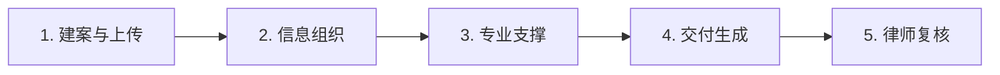
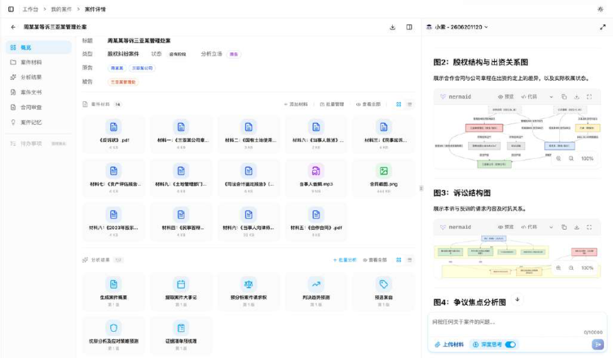
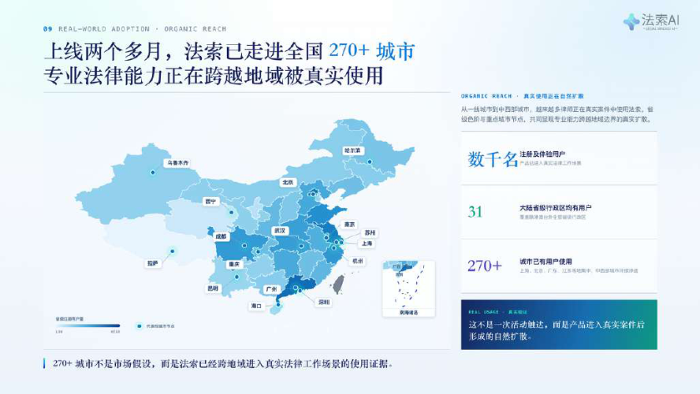

# CASE 03｜让案件成为长期工作空间

**行业**：诉讼法律服务　 **学习主题**：知识与专业工作台　 **共学时间**：约10分钟

## 一句话简介

FDE团队帮处理复杂商事诉讼的律师解决案卷太多、人物和证据关系难梳理、每次问AI都要重讲背景的问题，把材料、关系图、检索和文书草稿放进同一个案件工作台，访谈中的一个14名被告案件把原本两三天的整理压到了一个晚上，让律师有更多时间判断策略和与客户沟通。

[返回目录](../README.md) · [本例JSON](case.json) · [完整访谈](#full-interview) · [原PDF](../../sources/original-interviews.pdf#page=25)

原题：从案头工作到智能协作：FDE用AI优化诉讼律师的案件处理能力

来源范围：PDF物理页 25–33；书内页码 24–32。

**本例值得讨论的判断（编辑提炼）**：把上下文留在案件里，律师才能持续做判断。

> 阅读提示：标为“访谈概括”的内容来自受访者陈述；“补充分析”是编辑解释；“迁移演练”是迁移假设。效果数字保留原文的试点、目标、估算和脱敏条件。前半部用于备课和学习，后半部完整保留原访谈。

## 1. 业务现场与行业特点

### 发生了什么｜访谈概括

诉讼团队处理合同纠纷、公司股权争议等长周期案件，材料包括合同、聊天记录、财务凭证和多种证据，动辄上千页。一个案件持续数月甚至一年以上，新证据和争议点不断出现，律师需要反复恢复背景、维护事实关系并调整策略。

原来的法律数据库擅长查法条和判例，文档管理系统负责归档，但案件分析仍由律师在多个工具之间拼接。新人和资深律师的差距还体现在把当事人口语转换为法律上有意义的事实与问题，因此只提供一个更快的搜索框，难以覆盖主要瓶颈。

关键现场事实：

- 诉讼团队处理商事合同、股权等复杂案件
- 合同、聊天记录、财务凭证等材料可达上千页
- 律师需长期维护事实、证据、关系与策略

**原工作路径**：人工通读材料 → 转成法律要件 → 多库检索 → 分析并写文书

**重新定义的问题**：瓶颈集中在信息整理、关系梳理与反复恢复上下文；单点工具导致系统间切换。

依据：[原PDF物理页 26、27](../../sources/original-interviews.pdf#page=26)；需要核实具体说法请查看[完整访谈](#full-interview)。

扩充段落主要参照：[Q1](#q1)、[Q2](#q2)；原PDF物理页 25–33。

### 为什么需要FDE｜补充分析

这类专业工作的基本单位是一个持续演化的案件，而非一次提问。每份输出还对应不同接收方：律师自己、客户、法院或其他专业人员。工具设计需要保存上下文和形成过程，使处理结果能够进入后续工作；专业判断与责任仍依附于律师。

任务跨月持续、证据不断新增，专业责任最终由律师承担；一次问答难以承载案件全貌。

需要和优秀律师共同拆解思维框架，并围绕最终可交付结果重构工作空间。

## 2. 解决思路怎样形成

### 从调研到方案的过程｜访谈概括

FDE持续观察诉讼团队，带回脱敏资料研究，并与合伙人进行高频访谈。观察从接收邮件、阅读纸质案卷、切换系统一直延伸到案件讨论会，重点追问每一步要交付什么、给谁看，以及哪些地方即使节省时间，律师仍不放心交给AI。

团队重新拆解前期准备：案件概要、口语到专业问题的转换、证据和人物关系梳理等工作被纳入七个标准模块。大模型承担语言理解、摘要与初步分析，专业系统管理案件知识图谱、结构化法律检索与判例匹配，律师负责最终判断和策略。

最初产品入口是聊天框，但用户每次都要重述庞大背景。现场反馈促使团队改成“先建案，再交互”：上传材料后建立案件空间，分析、策略建议和草稿继续留在同一空间内，让后续工作沿着既有案件认知推进。

| 现场信号 | 形成的决定 |
|---|---|
| 持续跟岗并旁听案件讨论 | 追问每一步交付什么、给谁看、何谓可用 |
| 专业判断背后有隐性框架 | 拆为7个标准模块；把思维步骤工程化 |
| 聊天入口要求反复重述背景 | 转为先建案、上传材料，再在案件工作台交互 |

依据：[原PDF物理页 27、28、29、31](../../sources/original-interviews.pdf#page=27)；需要核实具体说法请查看[完整访谈](#full-interview)。

扩充段落主要参照：[Q3](#q3)、[Q5](#q5)、[Q6](#q6)；原PDF物理页 25–33。

### 这些取舍为什么重要｜补充分析

产品形态的取舍是聊天即时性与长期上下文之间的平衡。聊天仍可用于表达需求，但资料、证据与工作记录应归属案件，这样律师不需要在每轮对话重新建立背景。先建案的价值，需要通过第一次上传后可见的概要和关系图让用户体会。

效率与责任也必须区分。AI帮助整理信息，可以扩大律师可处理的材料范围，却不自动承担诉讼策略责任。交付是否可用，要看专业人员能否复查依据、理解分析过程并继续修改，而不是只看生成文本的速度。

## 3. 工作流程与人机分工

以下流程图和职责划分是依据访谈所作的业务抽象，不补造未披露的技术架构。



| 步骤 | 实际作用 |
|---|---|
| 1. 建案与上传 | 脱敏研究材料；实际案件持续更新 |
| 2. 信息组织 | 提取事实、人物与证据关系 |
| 3. 专业支撑 | 案件图谱、法条检索、判例匹配 |
| 4. 交付生成 | 概要、证据清单、分析与文书草稿 |
| 5. 律师复核 | 策略与责任归人；记录留在案件内 |

| 角色 | 负责什么 |
|---|---|
| AI | 理解、摘要、初步分析和文书整理 |
| 系统 | 承载案件上下文、图谱与可追溯引用 |
| 人 | 律师作最终专业判断与策略选择 |

依据：[原PDF物理页 28、29、31、32](../../sources/original-interviews.pdf#page=28)；需要核实具体说法请查看[完整访谈](#full-interview)。

## 4. 交付物、实际使用与组织采用

### 交付后怎样工作｜访谈概括

案件工作台是主要交付形态。律师先放入资料，系统形成案件概览和关系信息，再按具体需要生成证据清单、客户报告或文书草稿。用户表达的是自己的专业任务，不必先学习一套提示词技巧来拼装功能。

可复用资产还包括优秀律师的分析框架和流程节点。访谈提到请求权基础分析、证据链构建等思考方法被拆成系统步骤；重要之处在于保留专业思考顺序，使输出更接近律师真正会使用的材料，而非只给一段看似专业的文字。

| 交付物 | 交付内容 |
|---|---|
| 案件工作台 | 材料、分析、过程记录与草稿归入同一空间 |
| 7个标准模块 | 把高价值重复工作与专业思维步骤固化 |
| 面向实际使用的结果 | 可供客户、法院或专业人员继续处理的材料 |

### 实施与推广｜访谈概括

首次使用引导先上传材料，立即展示案件概要与关系图；持续与律师共同观察和迭代。

隐性经验结构化与用户采用都依赖持续协同。团队把优秀律师关注哪些事实、如何匹配依据、怎样组织证据的逻辑逐步工程化；对习惯寻找聊天框的用户，则引导先上传资料，用系统对案件的初步理解说明工作台的价值。

依据：[原PDF物理页 28、29、32](../../sources/original-interviews.pdf#page=28)；需要核实具体说法请查看[完整访谈](#full-interview)。

扩充段落主要参照：[Q3](#q3)、[Q4](#q4)、[Q5](#q5)；原PDF物理页 25–33。

## 5. 实际成效与证据边界

### 原文报告的变化

| 指标 | 原来或参照 | 后来或状态 | 必须保留的限定 |
|---|---|---|---|
| 14名被告的分析 | 约2–3天 | 一个晚上 | 单个案件，不代表所有法律任务 |
| 百余万字案件材料 | 距开庭仅3天 | 一天内梳理 | 个案反馈；另称整理效率提升约70% |
| 工作重心 | 大量案头执行 | 更多策略与沟通 | 专业方法沉淀为可复用能力 |

### 如何理解效果｜补充分析

原文报告了两个具体例子：14名被告相关分析从原本两三天到一个晚上；另一个超过100万字、距开庭三天的案件在一天内完成整体梳理，受访者称材料整理效率提高约70%。这些是特定案件反馈，不能推算全部案件平均节省多少，也不能据此推断胜诉率改善。

**证据边界**：效率来自具体案例与访谈估计；AI草稿仍需律师复核，引用应可追溯。

依据：[原PDF物理页 30、31、32](../../sources/original-interviews.pdf#page=30)；需要核实具体说法请查看[完整访谈](#full-interview)。

## 6. 难点、应对与可复用经验

| 难点 | 原文中的应对 |
|---|---|
| 隐性思维难结构化 | 与专家共拆请求权与证据链框架 |
| 对话装不下长期项目 | 先建案再交互，持久保存过程 |
| 使用习惯改变 | 以首次可见成果解释新入口 |

依据：[原PDF物理页 30、31、32](../../sources/original-interviews.pdf#page=30)；需要核实具体说法请查看[完整访谈](#full-interview)。

**可复用的方法（编辑归纳）**：结合第2节的关键取舍，关注真实任务如何被重新定义、可交付结果由谁确认，以及组织如何继续使用和修改。原受访者的全部经验保留在[Q6](#q6)。

## 7. 迁移到其他工作场景的讨论｜4分钟

以下是通用研发场景中的假设练习，不代表案例客户或任何学习者所在组织已经开展或验证了这些项目。

某药物或材料项目反复讨论同一靶点或体系，每次都重新解释文献、结构、计算与实验。

**讨论问题**：科研助手的中心对象应该是“对话”，还是“研究项目”？

**本组应交出的产物**：定义一个项目对象必须保存的5类信息，以及新证据到来时更新哪些内容。

个人思考40秒 → 小组讨论100秒 → 共识与质疑70秒 → 主持人收束30秒。

<details>
<summary>展开：迁移试点、验收与主持人参考</summary>

假设一个研发团队围绕长期研究问题持续协作。可把案件空间类比为研究项目空间，持续保存研究目标、样本或体系、文献、计算与实验记录、当前假设和版本，而不是每次让研究人员重新向AI解释背景。

一次最小试验可以只服务一个真实研究项目：加入一批新结果后，让AI指出哪些结论仍有效、哪些判断需要更新，并把依据链接回原记录。科学家确认解释与下一步选择，重点验证上下文更新是否可靠，而非只比较摘要写得是否流畅。

**建议切口**：建立项目工作空间，将体系、数据、版本、假设和运行记录组织为持续上下文。

**建议验收**：建议验收：恢复项目背景所需时间、证据定位时间、结论可复核性。

**适用限制**：科学判断要区分假设、计算预测和实验验证；不能把生成文本直接当结论。

**主持人参考**：参考：对象/体系、来源数据、假设、计算版本、实验结果与决策记录；结论要随证据更新。

</details>

可以直接对Codex说：

```text
请带我学习案例03。先讲清项目做了什么，再用一个关键问题让我做判断。
讲事实时引用原PDF页码；讨论迁移方案时明确标为假设。
```

## 8. 原图与受访者介绍

[查看原案例封面与受访者介绍](../../assets/cover_25.png)。人物姓名、职位及图片内文字以原PDF为准。

### 原图 1｜原PDF第29页



[回到原PDF第29页](../../sources/original-interviews.pdf#page=29)

### 原图 2｜原PDF第30页



[回到原PDF第30页](../../sources/original-interviews.pdf#page=30)

### 原图 3｜原PDF第33页


[回到原PDF第33页](../../sources/original-interviews.pdf#page=33)

<a id="full-interview"></a>

## 9. 完整原始访谈

以下6组问答逐段保留原PDF文字层的原始提取内容。原有换行、术语或转义保留，不以编辑详解替代原文。文字层未包含的图片信息，请查看上方原图及[完整PDF第25–33页](../../sources/original-interviews.pdf#page=25)。

<details>
<summary>展开全部访谈：Q1–Q6</summary>

<a id="q1"></a>

### Q1

Q1：作为FDE，你应用AI的具体场景是什么？在这个场景下遇到
的具体问题长什么样？
我们服务的对象是诉讼律师团队，主要处理商事合同纠纷、公司股权争议等复杂案件。
一个律师接到案件后，需要经历一个完整的长流程：理解客户需求、阅读大量案件材
料、梳理事实关系、寻找法律依据、设计诉讼策略，最终形成各种法律文书。
表面上看，这是一个知识密集型行业。但深入观察后我发现，律师每天有大量时间消耗
在案头工作上。
首先，案件材料规模庞大且高度非结构化。一个典型的商事诉讼案件可能包含合同、聊
天记录、财务凭证、证据文件等数十种材料类型，总页数动辄上千页。律师需要逐一阅
读、标注、归类，仅材料整理就可能耗费3到5个工作日。遇到涉及十几个当事人的复杂
案件，光是梳理人物关系就需要两三天。
其次，法律语言的转化门槛高。当事人的原始描述往往是日常口语，律师需要将其提炼
为具有法律意义的要件事实，再匹配相应的请求权基础。这个转化过程完全依赖律师个
人的法律功底，新人律师和资深律师的效率差距可达3到5倍。
第三，案件信息需要持续维护。诉讼周期通常持续数月甚至一年以上，期间新的证据、
争议点不断出现。律师必须持续维护对案件的完整认知，每次重新进入案件都要花费大
量时间恢复记忆，回顾之前的分析脉络。
我逐渐意识到，律师的产能瓶颈不在专业判断，而在信息处理的效率。他们既是决策
者，也是被案头工作困住的执行者。想要提升律师的整体办案能力，不能只让AI回答一
个孤立的法律问题，需要让AI进入律师完整的工作流程，成为持续协作的伙伴。

<a id="q2"></a>

### Q2

Q2：在你参与之前，这个问题过去是怎么解决的？
过去律师行业已经有一些工具。
法律数据库（如北大法宝、威科先行）可以查询法条和判例，文档管理系统帮助律师归
档文件，也有一些早期的法律问答工具尝试辅助生成简单文本。
但这些工具解决的只是“查”和“生成”两个单点动作。真实案件是持续变化的，律师需
要反复回到同一个案件，补充分析、更新判断。传统法律数据库的设计逻辑是一次性查
询，这与律师的实际工作节奏完全脱节。
过去的标准工作方式是这样的：律师收到案件材料后，人工阅读和整理；把自然语言描
述转换成法律专业语言；通过法律数据库寻找相关依据；结合自身经验形成判断；最后
输出报告、诉讼材料或策略建议。整个过程大量依赖律师个人的大脑和经验。
过去十年，律所也尝试过引入更多数字化工具，但落地效果普遍不理想。
原因有两个：第一，每个工具只解决一个单点问题，律师需要在五六个系统之间切换，
案件上下文被割裂，无法形成连贯的工作流；第二，这些工具的使用门槛与律师自然的
工作方式存在断层，律师需要学习特定的检索语法或操作逻辑，增加了额外负担。
最终，大部分工具沦为查法条的辅助手段，未能真正融入案件处理的完整流程。
传统方案的根本缺陷，是缺少一个能够同时理解技术和业务现场的角色，把律师真正需
要的能力翻译成可落地的系统。

<a id="q3"></a>

### Q3

Q3：后来你使用AI解决这个问题的整体思路和关键步骤是什
么？
第一步，是进入业务现场理解用户。
项目启动后，我没有直接设计功能，而是先进入了律师的真实工作环境。我们对律所诉
讼团队的观察是一直持续进行的，因为诉讼是一件很复杂的事情，我们会从现场带回已
经脱敏的各类资料回来研究。另外也会跟合伙人律师进行深度访谈调研，这样的调研频
率非常高，我们从调研中知道他们想要什么，想在哪些地方省时间，哪些地方即使省了
时间他们也不放心。这对我们的系统设计会很有指导意义，哪些留给人来决策，哪些让
AI直接干好交付，都围绕着真实的需求进行。
我们从早上九点律师打开电脑开始，观察他们如何接收客户邮件、如何翻阅纸质案卷、
如何在多个系统之间切换查找信息。我旁听了他们的案件讨论会，记录了合伙人如何拆
解一个看似简单的合同纠纷，他们讨论的焦点不只在于法条本身，更在于如何从微信聊
天记录中判断当事人的真实意思表示。
我会和律师深入沟通，追问一个案件从开始到结束到底经历哪些步骤，每一步需要什么
交付物，这些交付物最终给谁看，什么样的结果才是真正可用的。
这背后我一直把握一个原则：“交付价值”。AI需要生成的是一个律师能够直接使用、能
够交付给客户、法院或其他专业人员的结果。
第二步，是重新拆解案件流程。
我们没有改变律师原有工作方式，而是在原流程中寻找AI能够嵌入的位置。以案件前期
准备为例：以前律师需要人工通读上千页材料后手动整理案件概要，这一步AI可以辅助
完成；以前律师需要人工将当事人的口语描述转换为法律语言再进行检索，这一步AI可
以辅助完成；以前律师需要手动梳理证据关系、人物关系和法律关系，这一步AI也可以
辅助梳理。通过这样比较细致的梳理，最终我们形成了7个标准模块和高质量的法律思
维，让重复但是高价值工作可以自动化跑起来。
第三步，是设计AI和人的协作方式。
在技术方案上，我们采用了大模型与专业系统分工协作的架构。大模型负责自然语言理
解、文本摘要和初步法律推理，它擅长从非结构化材料中提取关键信息，理解律师用自
然语言表达的复杂需求。专业系统负责案件知识图谱的管理、法律条文的结构化检索和
判例的精确匹配，确保法律引用的准确性和可追溯性。两者通过统一的案件工作空间整
合，律师感知到的是一体化的协作体验。
在我们的设计中，AI负责大量信息处理、分析整理和重复性工作，专业系统承载案件上
下文和知识流程，律师负责最终判断、策略选择和专业责任。
我们希望达到的状态是，律师不需要学习复杂的AI技巧或提示词工程，他只需要用自己
的专业语言表达需求。比如说“基于这些案件材料，帮我分析一下下一步诉讼策略”，
“帮我整理一份证据清单”，“帮我形成一份给客户看的报告”，AI负责完成背后的工
作。
第四步，是根据现场反馈持续调整。
我们最初设计的入口是一个智能对话框，律师登录后可以直接向AI提问。但在现场观察
了一段时间后，一个关键问题浮现：律师每次提问前，都需要向AI重新描述案件背景。
一个案件的信息量巨大，律师不可能在每次对话中都完整复述。对话式交互实际上增加
了律师的负担。
图1：法索AI的案件工作台
于是我们调整了设计：将产品入口从聊天窗口改为案件工作台。律师先上传案件材料，
系统自动构建案件知识图谱，AI在完整理解案件上下文的基础上再与律师交互。律师不
需要每次解释背景，只需要用专业语言提出具体需求。这个调整让律师的使用门槛明显
降低，也让他们更快接受了AI的介入。

<a id="q4"></a>

### Q4

Q4：相比传统方式，使用AI后的实际效果如何？
AI带来的变化首先体现在效率数据上。
有一个案件涉及14个被告，按照过去的方式，一个被告对应的请求权基础分析需要2到3
小时，全部整理完成需要2到3天。在AI辅助下，律师把案件材料交给系统，一个晚上就
完成了原本需要几天的工作。
图2：上线两个月法索AI的用户已遍布全国多个城市
还有一个案例让我印象很深。一位律师临时接到案件，距离开庭只有3天，但案件材料
超过100万字。如果完全依靠人工阅读，很可能到开庭前仍无法充分理解案件全貌。通
过AI辅助，他在一天内完成了案件整体梳理，包括人物关系、法律关系和案件脉络，并
进一步制定了开庭策略。材料整理效率相比纯人工方式提升了约70%。
但效率数据只是表层结果，更重要的变化发生在流程层面。
过去，律师大量时间消耗在执行工作上：阅读材料、整理信息、检索法条。现在，AI帮
助律师完成这些基础工作，让律师能够把精力投入到更高价值的部分：与客户深入沟
通、判断案件方向、制定策略、做最终专业决策。律师的角色从执行者向决策者转移。
长期来看，更深层的价值在于让专业能力变得可复制。过去，一个优秀律师的个人经验
很难复制给团队，不同律师的经验差异导致交付质量不稳定。现在，通过AI系统，优秀
律师的专业方法可以被工程化沉淀，让更多律师获得稳定的辅助能力。这是FDE工作真
正的意义，既提升了单个项目的效率，又让专业能力变得可复用、可规模化。

<a id="q5"></a>

### Q5

Q5：在部署AI过程中，是否遇到了新问题或挑战？你是怎么解
决的？
第一个挑战，是隐性经验的结构化。
法律行业的难点超越了知识本身。很多时候，关键在于律师如何思考：什么样的事实需
要关注？如何把普通人的描述转换成法律语言？哪些法律依据真正匹配？不同证据之间
如何形成逻辑关系？这些都是律师多年实践形成的隐性经验。
我们的做法是，投入大量时间和优秀律师一起工作，观察他们的思考过程，拆解他们做
判断时的决策逻辑。具体来说，我们梳理了律师在案件分析中常用的思维框架，比如请
求权基础分析的三层四步法、证据链构建的逻辑规则，将这些框架转化为系统可以执行
的流程节点。这让AI能够按照律师的专业思考方式组织信息，超越了单纯的信息输出。
第二个挑战，是产品形态的定义。
很多AI产品的形态是一个聊天窗口，但这个形态对法律案件场景并不适用。一个案件更
像一个长期项目，需要持续承载大量材料、过程记录和变化中的信息，一次对话根本装
不下。
前面提到我们把产品入口从对话框改成了案件工作台，背后有一个关键的设计原则：让
用户先建案，再交互。所有分析结果、策略建议、文书草稿都沉淀在案件空间里，形成
可追溯的工作记录。律师不需要每次重新解释背景，AI也不需要反复重建理解。这个设
计让AI从一次性工具变成了持续陪伴案件全过程的协作系统。
最后一个是用户习惯的转变。
最开始很多律师进入产品，会习惯性地找输入框，想问“我要在哪里输入问题”。因为
大家已经习惯了聊天式AI。但实际使用后，他们发现：如果AI已经理解案件背景，自己
不需要不断描述问题，效率反而更高。
我们的应对方式是，不强迫用户改变习惯，在用户第一次使用时就引导他先上传材料，
让AI展示理解了案件背景之后能提供的价值。当律师看到AI自动生成的案件概要、自动
梳理的人物关系图时，他们自然理解了先建案件再交互的逻辑。这个过程中，我们发现
让用户亲眼看到价值，比任何解释都有效。

<a id="q6"></a>

### Q6

Q6：根据你的经验，我们怎么才能更好地把AI部署到实际业务
中？
第一，从业务问题出发，用业务语言定义需求。
很多团队开始做AI时，会先问“我们有什么模型”“我们能调用什么能力”。但真正应该
问的是：“谁会使用它”“他为什么需要它”“他的真实工作流程是什么”。不了解业
务，就无法判断什么问题值得解决。不了解技术，就无法找到合适的方法。在这个项目
中，如果我们一开始就从模型能力出发，可能会做出一个法律知识问答工具，但那只是
解决了律师工作中极小的一环，不会真正改变律师的工作方式。
第二，进入现场，与行业专家共同定义问题。
FDE一定要进入现场。不能通过想象理解用户，必须真正观察用户怎么工作。我们与律
师进行深度协同，观察他们工作状态的那段时间，会发现本来我们想象的，并不是真实
被需要的。更重要的是，要和行业专家一起工作，找到真正懂业务的人。当自己不了解
一个行业时，没有资格替行业定义问题。这个项目中，优秀律师的思维框架是AI系统设
计的核心输入，没有他们的深度参与，系统无法做到真正有用。
第三，关注落地细节胜过关注模型能力。
AI项目成功的关键，除了技术效果之外，还有更多维度。用户是否愿意使用？流程是否
自然？成本是否能够接受？结果是否真正能够交付？这些问题比模型能力本身更加重
要。
图3：法索AI在第九届世界人工智能大会
FDE的价值在于连接业务、技术和用户，让AI真正进入企业流程并产生价值。AI只是手
段，改变工作方式才是目的。
我认为FDE不能每接一个项目就重新定制一次。真正有价值的FDE，需要在一次次业务
落地过程中，把经验抽象成可复用的方法、模块和能力，让下一个项目更加高效。这也
是AI时代FDE能够规模化发展的关键。

</details>

[返回案例目录](../README.md) · [本例结构化数据](case.json)
