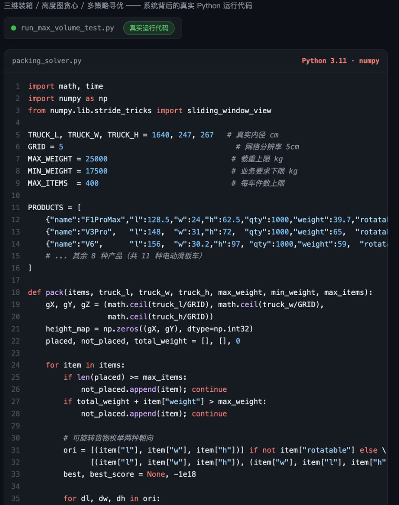
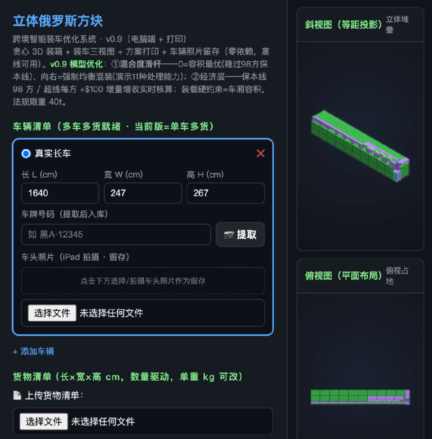
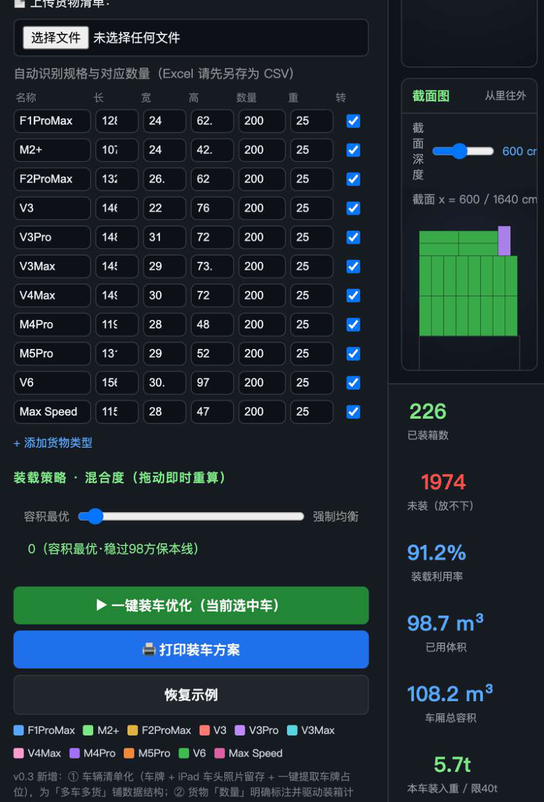

# CASE 06｜优化结果必须让工人能执行

**行业**：跨境物流装载　 **学习主题**：专业工具与计算　 **共学时间**：约10分钟

## 一句话简介

FDE团队帮黑河中俄跨境物流解决货车装不满、装车靠老师傅、电脑排出的方案工人不好照做的问题，先量准车厢内部空间，再用装箱算法排货，把结果做成编号和截面装车图，原型测试装到了约99立方米、超过文中98方保本线，但把实际装车从约5小时降到2小时仍是预期目标。

[返回目录](../README.md) · [本例JSON](case.json) · [完整访谈](#full-interview) · [原PDF](../../sources/original-interviews.pdf#page=57)

原题：从经验装车到智能规划：FDE用AI优化跨境物流装载效率

来源范围：PDF物理页 57–68；书内页码 56–67。

**本例值得讨论的判断（编辑提炼）**：一张装车指导图，才是算法到现场的最后一步。

> 阅读提示：标为“访谈概括”的内容来自受访者陈述；“补充分析”是编辑解释；“迁移演练”是迁移假设。效果数字保留原文的试点、目标、估算和脱敏条件。前半部用于备课和学习，后半部完整保留原访谈。

## 1. 业务现场与行业特点

### 发生了什么｜访谈概括

当地企业通过公路向俄罗斯出口机电产品，运输费用和可装载体积直接关联。访谈给出的经营口径是98方保本、每超过一方增加100美元运费，因此装载问题不仅关系空间利用，也关系一车货能否越过经营门槛。

现场存在两类困难：外部尺寸不等于可用内净尺寸，车壁和保温层会占空间；经验装车还要处理货物规格、车型、重量和顺序。过去部分软件虽然能画出三维方案，但工人看不懂或难执行，最终仍回到老师傅经验。

关键现场事实：

- 黑河自贸区，中俄机电产品公路运输
- 访谈称98方为保本线；超出每方增收100美元
- 工人、物流公司与货主的收益相互关联

**原工作路径**：按车辆信息估空间 → 老师傅凭经验摆货 → 现场反复调整 → 发车后总结

**重新定义的问题**：“装不满”可能来自尺寸不准、组合规划或执行困难，需要沿流程分别诊断。

依据：[原PDF物理页 58、59、61](../../sources/original-interviews.pdf#page=58)；需要核实具体说法请查看[完整访谈](#full-interview)。

扩充段落主要参照：[Q1](#q1)、[Q2](#q2)；原PDF物理页 57–68。

### 为什么需要FDE｜补充分析

装载是一个带执行约束的优化问题。可放入的几何体积只是目标的一部分，还要考虑重量、装载顺序、人员站位、搬运动作和安全。数学上更紧凑的摆法，如果需要反复挪货或踩踏货物，未必是总体更好的业务方案。

空间、重量、顺序与可操作性共同约束装车；理论容积和算法最优不等于现场可用。

必须把经济账、三维算法、真实测量和工人操作连接起来，才能形成可执行方案。

## 2. 解决思路怎样形成

### 从调研到方案的过程｜访谈概括

FDE先把现场拆成真实尺寸获取、货物信息整理、方案计算、多车调度、装车指导、执行与反馈，识别出输入精度和结果可执行性同样关键。为了取得车厢内净数据，采用iPad Pro LiDAR结合激光测距，将硬件成本控制在访谈所述约8500元。

技术分工是大模型理解任务、调用工具和解释结果，Python专业算法处理三维空间追踪、贪心放置、多策略排序和遗传算法等计算。大模型没有直接代替装箱优化算法，现场业务要求需要进入工具输入和约束。

团队最初考虑三维可视化交互，观察后发现装车环境不适合频繁操作手机或电脑，于是转为编号卡、方向和截面指导图。又根据人员反馈设计由里向外的截面顺序，使计算结果转化为可以照着完成的动作。

| 现场信号 | 形成的决定 |
|---|---|
| 外部尺寸可能高估内部空间 | LiDAR结合激光测距，先建立真实几何输入 |
| 大模型难以做确定空间计算 | 模型调度，Python装箱与优化算法求解 |
| 现场不适合频繁操作3D界面 | 改用编号卡、截面图和可打印装车指导 |

依据：[原PDF物理页 62、65](../../sources/original-interviews.pdf#page=62)；需要核实具体说法请查看[完整访谈](#full-interview)。

扩充段落主要参照：[Q3](#q3)、[Q5](#q5)、[Q6](#q6)；原PDF物理页 57–68。

### 这些取舍为什么重要｜补充分析

项目最值得学习的取舍是放弃单一空间最优，转而兼顾操作效率、安全和便利。现场反馈不是方案完成后的投诉，而是优化目标的重要输入；调整顺序可能牺牲少量理论最优，却让方案更容易被实际采用。

经营账也涉及不同角色。货主关心单车可装多少，物流方关心周转，工人关心工作强度和计酬。FDE需要找到几方都愿意配合的改进方式，但不能把预期中的共同增益提前写成已实现收益。

## 3. 工作流程与人机分工

以下流程图和职责划分是依据访谈所作的业务抽象，不补造未披露的技术架构。


| 步骤 | 实际作用 |
|---|---|
| 1. 真实测量 | 车厢内尺寸＋货物规格 |
| 2. 任务解析 | 理解车型、多车与装载要求 |
| 3. 算法求解 | 高度图、贪心、多策略、遗传算法 |
| 4. 指导输出 | 按截面由里向外安排顺序 |
| 5. 现场反馈 | 工人执行，兼顾安全与便利 |

| 角色 | 负责什么 |
|---|---|
| AI | 理解需求、调用工具、解释结果 |
| 系统 | 专业装箱计算、三维追踪与指导图 |
| 人 | 核对输入、执行装载、反馈操作约束 |

依据：[原PDF物理页 62、65](../../sources/original-interviews.pdf#page=62)；需要核实具体说法请查看[完整访谈](#full-interview)。

## 4. 交付物、实际使用与组织采用

### 交付后怎样工作｜访谈概括

规划人员获得依据真实尺寸与货物目录生成的装载方案；现场工人得到货物编号、摆放方向、截面和装载顺序。最终交付可以打印到车门前使用，不要求工人在搬运中理解复杂的三维系统。

交付资产包含测量方法、货物数据整理方式、装箱与调度工具，以及把结果转换成作业指引的规则。这些部分共同决定复用性：只复制算法而不复制可靠输入和现场指引，下一辆车仍可能无法执行。

| 交付物 | 交付内容 |
|---|---|
| 测量与货物数据 | iPad Pro LiDAR＋激光测距，硬件约8500元 |
| 规划原型与交互页面 | 对真实车型及11种电动车规格进行测试 |
| 纸面装车指引 | 货物编号、方向、截面和装载顺序 |

### 实施与推广｜访谈概括

已完成原型验证；由追求容积最优转向效率、安全与操作便利的平衡。

原型验证使用长16.4米、宽2.47米、高2.67米、内净约108方的车辆场景，结合11种电动车产品规格进行测试。该测试范围应与后续现场执行区分，换车型、货物或搬运条件后，需要重新确认约束和可用性。

依据：[原PDF物理页 60、62、64、65、66](../../sources/original-interviews.pdf#page=60)；需要核实具体说法请查看[完整访谈](#full-interview)。

扩充段落主要参照：[Q3](#q3)、[Q4](#q4)、[Q5](#q5)；原PDF物理页 57–68。

## 5. 实际成效与证据边界

### 原文报告的变化

| 指标 | 原来或参照 | 后来或状态 | 必须保留的限定 |
|---|---|---|---|
| 原型装载量 | 人工示例95–98方 | 测试约99方 | 真实车型内净约108方；原文称模拟/测试 |
| 现场装车时间 | 约5小时 | 预计约2小时 | 属于预期，不能写成已实测业务成效 |
| 硬件测量成本 | 专业扫描较贵 | 约8500元 | 特定方案成本，非项目总投入 |

### 如何理解效果｜补充分析

访谈报告原型模拟装载约99方；约5小时到2小时明确属于现场执行预期。文中另有60%—65%空间利用率等口径，和具体车辆的95—98方装载描述无法直接并为同一基线。课程因此保留原数值及语境，不计算统一提升倍数或承诺每车收益。

**证据边界**：原文另有60%–65%利用率，口径未统一；不与95–98方混算，不将预计时间当实绩。

依据：[原PDF物理页 58、59、63、65](../../sources/original-interviews.pdf#page=58)；需要核实具体说法请查看[完整访谈](#full-interview)。

## 6. 难点、应对与可复用经验

| 难点 | 原文中的应对 |
|---|---|
| 算得出但难执行 | 截面法约束装载顺序 |
| 内外尺寸不一致 | 现场测量真实可用空间 |
| 工人难用复杂界面 | 转为编号卡与打印指导图 |

依据：[原PDF物理页 58、59、63、65](../../sources/original-interviews.pdf#page=58)；需要核实具体说法请查看[完整访谈](#full-interview)。

**可复用的方法（编辑归纳）**：结合第2节的关键取舍，关注真实任务如何被重新定义、可交付结果由谁确认，以及组织如何继续使用和修改。原受访者的全部经验保留在[Q6](#q6)。

## 7. 迁移到其他工作场景的讨论｜4分钟

以下是通用研发场景中的假设练习，不代表案例客户或任何学习者所在组织已经开展或验证了这些项目。

一个研发团队为自动化实验或高通量计算设计资源调度，最优方案却难被现场执行。

**讨论问题**：吞吐最高的排程需要频繁换装；次优方案更易执行，应如何选？

**本组应交出的产物**：把“最优”改写为包含3项现场约束的目标，并设计一次验证。

个人思考40秒 → 小组讨论100秒 → 共识与质疑70秒 → 主持人收束30秒。

<details>
<summary>展开：迁移试点、验收与主持人参考</summary>

可将这一经验用于自动化实验排程或计算任务调度：最优排序除了吞吐量，还要包含仪器切换、样品稳定时间、维护、安全和人工操作限制。先让优化算法处理约束，模型负责理解任务和解释计划。

试验时同时评估计划质量和执行质量。找一个真实班次或小批任务，记录方案是否能执行、人工要改几处、发生了哪些约束冲突；先把计算输出改成操作者能照做的步骤，再追求更高的理论利用率。

**建议切口**：把设备切换、样本顺序、维护与操作限制写入求解器，并生成可执行操作单。

**建议验收**：建议验收：方案可行率、实际吞吐、人工介入次数与执行偏差。

**适用限制**：原型优化值须经过现场验证；实验安全、设备限制和科学约束属于硬边界。

**主持人参考**：参考：先满足安全和可执行性，再比较实测吞吐与总成本；把预计和实际分开记录。

</details>

可以直接对Codex说：

```text
请带我学习案例06。先讲清项目做了什么，再用一个关键问题让我做判断。
讲事实时引用原PDF页码；讨论迁移方案时明确标为假设。
```

## 8. 原图与受访者介绍

[查看原案例封面与受访者介绍](../../assets/cover_57.png)。人物姓名、职位及图片内文字以原PDF为准。

### 原图 1｜原PDF第60页



[回到原PDF第60页](../../sources/original-interviews.pdf#page=60)

### 原图 2｜原PDF第64页



[回到原PDF第64页](../../sources/original-interviews.pdf#page=64)

### 原图 3｜原PDF第66页



[回到原PDF第66页](../../sources/original-interviews.pdf#page=66)

<a id="full-interview"></a>

## 9. 完整原始访谈

以下6组问答逐段保留原PDF文字层的原始提取内容。原有换行、术语或转义保留，不以编辑详解替代原文。文字层未包含的图片信息，请查看上方原图及[完整PDF第57–68页](../../sources/original-interviews.pdf#page=57)。

<details>
<summary>展开全部访谈：Q1–Q6</summary>

<a id="q1"></a>

### Q1

Q1：作为FDE，你应用AI的具体场景是什么？在这个场景下遇到
的具体问题长什么样？
这个案例的应用场景是在黑河自贸区中俄跨境贸易中的货车装载优化。
当地很多企业通过公路运输方式向俄罗斯出口机电产品。在跨境物流中，运输成本是企
业非常关注的一部分，而货车每一次出境运输，本质上都是一次固定成本投入。
当地很多企业通过公路运输方式向俄罗斯出口机电产品。跨境运输的运费按“方”计
算，也就是说，这本质上是一场关于“车厢容积”的生意。
这里有一条非常硬的经济线：一辆约110方的货车，老师傅人工装载通常要5个小时，能
装到95～98方；而98方就是保本线。更关键的是，每超过保本线1立方米，就能额外增
收100美元运费。所以装载率不是技术指标，是利润开关：装不满98方就亏，装得越
满、越过保本线越多，赚得越多。
简单来说，一辆货车无论装多少货，都需要支付同样的运输费用，包括司机成本、燃油
成本、过境费用等。如果一辆车只装了一部分空间就发出去，剩余空间浪费掉，但运输
成本并不会降低。
因此，对于企业来说，提高单车装载量、尽可能利用车厢空间，就意味着同样一趟运输
可以承载更多货物，降低单件商品的物流成本，提高整体利润。
但在实际业务中，”把货装满”远不是往车里塞更多东西那么简单，这本质上是一个复
杂的空间优化问题。
一开始接触这个项目时，很多人会认为这只是一个简单的装箱问题，只需要计算一下哪
些货物怎么摆放，就能提高装载率。但真正进入现场之后，我发现事情远比想象复杂。
过去，企业装车主要依靠经验丰富的老师傅完成。他们根据货物尺寸、数量以及过往经
验判断：哪些货物应该放在哪里；哪些空间还能利用；怎样摆放能够装得更多。
但随着跨境贸易规模扩大，这种方式逐渐暴露出问题。
首先，是车辆空间判断不准确。
俄罗斯方面提供的很多车辆信息是车厢外部尺寸，但真正能够使用的内部空间会受到车
厢壁厚、保温层等因素影响，实际可利用空间往往比理论数据少5%～8%。
其次，是空间利用率不高。
过去没有标准化的三维规划方案，装车主要靠人工经验。同样一批货，不同装车人员可
能得到不同结果，整体空间利用率通常只有60%～65%左右，大量空间没有被充分利
用。
第三，是复杂场景下人工很难找到最优方案。
比如企业面对不同车型、不同尺寸货物，以及多辆车同时安排运输时，需要同时考虑空
间、重量、运输效率等多个因素，这已经超出了人工经验能够处理的范围。
但在调研过程中，我发现最关键的问题其实是算出来以后落地不了：算得出最优解，不
代表现场能够执行。
很多算法方案能够告诉企业理论上的最佳摆放方式，但现场工人真正执行时，会遇到很
多问题：货物应该从哪里开始放？装载顺序是否合理？是否需要进入车厢内部操作？这
样的方案是否符合现场安全要求？
所以，这个问题本质上是连接业务现场、算法能力和执行流程的综合问题，远不止算法
优化本身。
攻克技术问题只是第一步，真正要做的是让AI进入业务流程并产生实际价值。
图1：系统运行的Python代码

<a id="q2"></a>

### Q2

Q2：在你参与之前，这个问题过去是怎么解决的？
在我参与之前，企业主要依靠经验丰富的装车人员进行规划，但是会耗费时间长一些。
通常一辆车的装车时间是5\~6个小并且达不到最优化的装车效果，装车员其实靠的是体
力和时间来获得收入，所以通过这样的优化方式，能够提升装车效率。
通常情况下，老师傅会根据过去积累的经验判断：什么货应该放下面；哪些货物可以组
合摆放；哪些空间可以利用。
这种方式在业务规模较小时能够运行，但随着跨境贸易规模增加，问题越来越明显。
首先，经验无法复制。
一个优秀装车工人的经验，需要多年积累，新人很难快速掌握。
其次，人工无法解决复杂组合问题。
如果只是几十件货物，人工还能判断。但当车型、货物种类、数量不断增加之后，人工
很难快速找到最优方案。
另外，还有一个容易被忽视的问题：过去很多企业尝试过数字化工具，但效果并不好。
原因是这些工具通常只解决计算问题，没有考虑实际执行。
比如系统生成了一个复杂的三维方案，但是现场工人看不懂，最后还是回到人工经验。
所以算法本身不难获得，真正缺乏的是一个连接技术和现场的角色。

<a id="q3"></a>

### Q3

Q3：后来你使用AI解决这个问题的整体思路和关键步骤是什
么？
整个解决过程的起点，是先重新理解业务，技术开发要放在后面。
作为FDE，第一步一定是进入现场。
我需要先弄清楚：工人到底怎么装？为什么这么装？哪些环节影响效率？哪些事情机器
可以替代？哪些事情必须符合人的习惯？
通过现场观察，我发现装车流程其实可以拆解成几个步骤：车辆真实尺寸获取、货物信
息整理、装载方案计算、多车调度优化、生成装车指导、现场执行以及结果反馈。
其中，前面的规划和计算环节适合AI参与，但最终必须回到人的执行。
在方案设计上，我们采用的是“大模型负责调度，专业算法负责计算”的方式。
很多人会误以为大模型可以直接解决所有问题，但实际上三维装箱涉及复杂空间计算，
大模型在这方面难以胜任。
所以我们的设计思路是，让大模型理解人的需求并负责调用不同工具，让专业算法完成
确定性的计算。
具体来说，大模型负责：理解业务人员提出的问题；解析任务需求；调用装箱算法；解
释最终结果。
而真正的三维空间计算，则由Python算法完成，包括高度图3D空间追踪、贪心放置、
多策略排序和遗传算法等。
另外，在实际落地过程中，我们做了一个非常重要的调整。
最开始，我们希望通过三维可视化系统让工人查看方案。
但现场调研后发现，工人在装车环境中并不适合频繁操作手机或者电脑。
所以最后我们把算法结果转化成更加简单的形式，就是一张工人能够直接使用的装车指
导图。里面包含货物编号、摆放方向、截面示意以及装载顺序。
让算法结果真正变成现场可以执行的动作。

<a id="q4"></a>

### Q4

Q4：相比传统方式，使用AI后的实际效果如何？
目前项目已经完成原型验证。在测试过程中，我们针对长16\.4米、宽2\.47米、高
2\.67米（内净约108方）的真实运输车辆进行模拟装载，并结合11种不同规格电动车产
品目录进行测试。
从结果看，AI系统在不依赖老师傅的前提下，实测稳定达到约99方，逼近车厢容积上
限；更重要的是，它把一个原本要靠老师傅5小时经验判断、且结果波动的过程，压缩
为分钟级、可复用的标准方案，让“每一车都稳定冲过98方保本线”从靠人变成靠系
统。
而在现场执行层面，价值更明显：人工装一车通常要约5小时，引入AI规划与指导后，预
计可压缩到约2小时，装车效率提升约100%，同样工时内可装载的车次接近翻倍。工人
装完一车不用再等、不用再耗，可以立刻接着装下一车。
这条时间线一旦打通，收益是三层叠加的：第一，工人同样工时能装更多车，按车次计
的收入直接增加；第二，物流公司整体周转效率提升、单车装载最大化，运营效率随之
提高；第三，货主每一车都稳定越过98方保本线、逼近容积上限，按“超1方\+100美
元”的计费结构，多出来的每一方都是实打实的增收。
所以，这个项目的意义不是零和博弈里谁省了钱，而是做增量。把5小时压成2小时，多
出来的车次、多出来的方，工人、物流公司、货主三方一起分，三方共赢，做增量部
分。
但对我来说，这个项目最大的价值并不只是装载数字本身，更重要的是，它验证了一种
可复制的AI落地方式：过去企业里的很多经验存在于人的脑子里，现在AI可以把它转化
成数据和算法，再到最后的可执行方案。原来只有老师傅才能完成的工作，现在可以通
过标准化流程复制。
图2：系统运行的交互页面

<a id="q5"></a>

### Q5

Q5：在部署AI过程中，是否遇到了新问题或挑战？你是怎么解
决的？
最大的挑战其实来自业务方面，技术层面的问题相对更为可控。
第一个挑战是算法结果和现场执行之间存在差距。
最开始，算法会优先追求空间利用率最大化。但现场人员告诉我，有些方案虽然理论上
更优，但是实际操作很困难。比如需要工人进入车厢内部搬运，或者需要频繁调整货物
位置。
所以我们重新调整目标，从追求数学上的绝对最优，转向在效率、安全和操作便利之间
找到平衡。
后来我们设计了“截面法”。简单来说，就是按照车厢截面从里向外规划装载顺序。这
样工人只需要站在车门位置操作，不需要踩踏货物进入车厢。
第二个挑战是数据获取。
车辆真实内部尺寸是计算准确性的基础。
如果依靠专业扫描设备，成本较高，企业接受度有限。所以我们采用iPad Pro LiDAR结
合激光测距的方式，在保证精度的同时，把硬件成本控制在约8500元。
第三个挑战是让一线人员接受新的方式。
技术方案最终需要人使用。所以我们不断调整交互方式，把复杂算法结果转化成简单的
编号卡、截面图和打印指导图。
FDE的价值就在这里：交付技术只是起点，确保技术真正融入业务流程才是关键。
图3：系统运行的交互页面

<a id="q6"></a>

### Q6

Q6：根据你的经验，我们怎么才能更好地把AI部署到实际业务
中？
从这个项目来看，我认为AI落地最重要的一点，是从业务问题和背后多人群的真实需求
出发，把技术当作解决手段，而非出发点。
很多企业做AI项目时，会先想：“我们能不能接入一个大模型？”
但真正应该问的是：“业务中哪个问题最值得被解决？”
FDE首先需要具备业务理解能力。只有进入现场，才能知道真实问题是什么。
很多时候，业务人员表达的是：“装不满。”
但技术人员需要进一步拆解：是不是空间数据不准确？是不是规划效率低？是不是执行
流程有问题？
第二，需要做好技术和业务之间的翻译。
大模型很强，但需要用对地方。像这个案例，我们让大模型负责理解和调度，把专业计
算交给专业算法，充分发挥各自的优势。
第三，要重视落地过程中的细节。
AI项目最后能不能成功，往往取决于这些小问题：工人愿不愿意用？流程是否改变太
大？成本是否企业能接受？
所以FDE的角色远不止AI开发，其核心价值在于连接业务、技术和用户三者。
第四，也是我在这一行越来越看重的一点：AI落地要算清“经济账”。运费按方算、98
方保本、每方增收100美元，这些商业机制直接决定了装载优化的价值落点。只有既懂
算法、又懂业务账的FDE，才能把技术提升真正翻译成客户可感知的成本节约。这本身
也是一种稀缺能力。
第五，好的AI落地不是零和博弈，而是做增量。这个项目我的底层商业逻辑，是它让工
人、物流公司、货主三方都从“多出来的车次、多出来的方”里受益。把蛋糕做大，比
在旧蛋糕里抢份额更有价值，也更能走远。
有幸在黑河这样一个边境小城，碰到跨境物流、自贸区这些真实得不能再真实的业务场
景；有幸遇到一批不空谈、愿意跟我一起把AI从屏幕里，搬到车间、搬到车门前、搬到
一线工人手里的伙伴。所以我一直信一句话：未来真正有价值的AI，一定长在企业的真
实流程里，而不是停在Demo上。这也是FDE对我最大的意义，让AI从电脑，走到真实
世界里。

</details>

[返回案例目录](../README.md) · [本例结构化数据](case.json)
