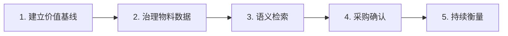

# CASE 08｜把“找不到”追到采购损失

**行业**：工业物料与ERP　 **学习主题**：经营协同与价值　 **共学时间**：约10分钟

## 一句话简介

FDE团队帮一家海外工业企业处理“ERP里明明有这个零件却找不到”的问题，先清理物料的重复名称、描述和单位，再让员工用日常说法也能找到已有物料，把容易导致重复录入、买错买重和库存积压的环节连起来检查，并和客户建立损失核算方法，不过访谈没有公开具体节省了多少钱。

[返回目录](../README.md) · [本例JSON](case.json) · [完整访谈](#full-interview) · [原PDF](../../sources/original-interviews.pdf#page=78)

原题：从物料难找到精准定位：FDE用AI减少工业企业采购浪费

来源范围：PDF物理页 78–87；书内页码 77–86。

**本例值得讨论的判断（编辑提炼）**：检索只是手段，少买错东西才是业务结果。

> 阅读提示：标为“访谈概括”的内容来自受访者陈述；“补充分析”是编辑解释；“迁移演练”是迁移假设。效果数字保留原文的试点、目标、估算和脱敏条件。前半部用于备课和学习，后半部完整保留原访谈。

## 1. 业务现场与行业特点

### 发生了什么｜访谈概括

客户管理从手套、螺丝和耳塞到卡车、机械臂的大量物料资产，约十五个团队参与录入、采购、合同与仓储。同一物料可能有不同名称、描述和单位，历史ERP的字段和关键词搜索难以覆盖这些表达差异。

员工找不到已有物料时，可能重新建档或再次采购，数据因此越来越重复，搜索又进一步变难。工业品买错后往往不能像消费品一样方便退货，错误库存可能放上几年，最后成为需要处理的经营损失。

关键现场事实：

- 海外工业企业，物料从小零件到卡车和机械臂
- 约15个团队与ERP交互，涉及采购、录入、仓储等
- 数月摸排后得到约15个可处理功能点

**原工作路径**：关键词查找 → 找不到就新建 → 采购错/买重 → 积压后报废

**重新定义的问题**：“ERP不好用”不是可开发需求；必须追到数据污染如何转化成真实财务损失。

依据：[原PDF物理页 79、80、81](../../sources/original-interviews.pdf#page=79)；需要核实具体说法请查看[完整访谈](#full-interview)。

扩充段落主要参照：[Q1](#q1)、[Q2](#q2)；原PDF物理页 78–87。

### 为什么需要FDE｜补充分析

物料名称只是识别对象的一部分，规格、单位和业务语境也会决定是否真的是同一种东西。因此语义接近不能直接等同于可替代，检索结果应帮助业务人员确认物料身份，而不自动承担采购决定。

同物异名、单位不一与关键词检索相互放大；找不到会造成重复录入，再导致错误采购和积压。

需要跨部门根因诊断、确认可写回条件，并让客户共同定义与认领价值。

## 2. 解决思路怎样形成

### 从调研到方案的过程｜访谈概括

团队进入客户时没有预设产品，先围绕ERP上下游持续数月访谈，坐在业务人员旁边看实际操作。大家反复抱怨ERP不好用，FDE继续追问发生在哪一步、后面造成什么影响，才把大约十五个功能点收敛到数据质量与搜索这两个优先问题。

问题定义沿业务链向后追：找不到、重复录入、数据污染、错误或重复采购、库存积压、最终报废。这样语义检索才从一项技术功能变成一个可以评估采购损失的干预位置，后续验收也有了方向。

多个业务团队参与确认优先级，FDE同时评估数据获取、能否写回系统、技术难度、采用意愿等条件。技术上先清洗标准化，再增加语义查找，让不同叫法可以找到候选物料；是否采购、买多少仍由业务人员决定。

| 现场信号 | 形成的决定 |
|---|---|
| 所有部门都抱怨ERP难用 | 坐在用户旁边看操作，持续追问“然后呢” |
| 搜索差会引出重复数据和库存损失 | 把问题定义为减少错误/重复采购 |
| 15个功能不能同时开工 | 业务投票＋多维可行性评估，优先可证明价值的场景 |

依据：[原PDF物理页 81、82、83](../../sources/original-interviews.pdf#page=81)；需要核实具体说法请查看[完整访谈](#full-interview)。

扩充段落主要参照：[Q3](#q3)、[Q5](#q5)、[Q6](#q6)；原PDF物理页 78–87。

### 这些取舍为什么重要｜补充分析

数据治理和语义检索不能互相替代。只加语义搜索，可能更快找出多条互相冲突的记录；只清理存量、不改变查找体验，又可能不断产生新重复。因此需要同时处理存量质量与新数据进入的原因。

用例优先级要同时看价值和可实施性。一个潜在收益很大的功能，如果老系统不允许写回、业务部门不愿采用，仍可能失败；小范围先证明有效，可以为后续跨部门合作建立信心。

## 3. 工作流程与人机分工

以下流程图和职责划分是依据访谈所作的业务抽象，不补造未披露的技术架构。



| 步骤 | 实际作用 |
|---|---|
| 1. 建立价值基线 | 分析历史重复数据与采购损失 |
| 2. 治理物料数据 | 清洗、去重、命名和单位标准化 |
| 3. 语义检索 | 理解不同叫法，定位既有物料 |
| 4. 采购确认 | 人员判断是否买、买多少 |
| 5. 持续衡量 | 采购行为变化与避免损失由客户确认 |

| 角色 | 负责什么 |
|---|---|
| AI | 理解物料描述并辅助语义匹配 |
| 系统 | 清洗标准化、ERP接入与数据回写 |
| 人 | 业务定义优先级，采购决策与收益确认 |

依据：[原PDF物理页 82、83、84](../../sources/original-interviews.pdf#page=82)；需要核实具体说法请查看[完整访谈](#full-interview)。

## 4. 交付物、实际使用与组织采用

### 交付后怎样工作｜访谈概括

员工得到的是原ERP流程中更可用的物料数据与查找能力，不需要靠完全一致的名称或编码才能定位已有记录。找到候选之后继续核对规格与单位，才有可能减少源头上的重复建档和错误采购。

另一类交付是价值确认方法：从历史记录建立基线，用小范围实验观察重复数据和采购行为变化，再由客户业务人员确认避免的损失。能把一笔节省解释清楚，比只展示搜索结果更快更接近这个项目的目标。

| 交付物 | 交付内容 |
|---|---|
| 根因与优先级清单 | 串起数据、搜索、采购与库存问题 |
| 清洗＋语义检索 | 在既有ERP上改善物料定位能力 |
| 客户认可的衡量方法 | 历史基线、小规模试验与持续效果跟踪 |

### 实施与推广｜访谈概括

前期数月访谈；实施优先选择可在数周内见初效的范围。业务采纳与持续有效是交付条件。

项目需要多轮集体讨论和利益相关方单独沟通，处理未必会在会上直接表达的顾虑。团队强调上线后移交给业务继续使用、检查效果是否保持，发现定义错误或范围过大时可以返回问题诊断，实施不是单向推进的功能清单。

依据：[原PDF物理页 82、83、85、86](../../sources/original-interviews.pdf#page=82)；需要核实具体说法请查看[完整访谈](#full-interview)。

扩充段落主要参照：[Q3](#q3)、[Q4](#q4)、[Q5](#q5)；原PDF物理页 78–87。

## 5. 实际成效与证据边界

### 原文报告的变化

| 指标 | 原来或参照 | 后来或状态 | 必须保留的限定 |
|---|---|---|---|
| 技术指标 | 只看搜索是否更快 | 回到采购行为变化 | 过程指标不替代业务结果 |
| 价值核算 | 历史损失不显性 | 建立基线并由客户确认 | 原文未披露节约金额与改善比例 |
| 复用对象 | 单个搜索功能 | 诊断与验证方法 | 方法可迁移，ERP和流程未必相同 |

### 如何理解效果｜补充分析

访谈没有公开错误采购减少百分比或节省金额，主要描述了数据清洗、语义检索及客户参与的价值核算方法。不能把计划建立的测量链写成已完成的财务审计，也不能把所有库存下降都归因于搜索能力。

**证据边界**：访谈阐明核算方法，未公开ROI数值；避免采购损失需要行为链证据。

依据：[原PDF物理页 83、84、85、86](../../sources/original-interviews.pdf#page=83)；需要核实具体说法请查看[完整访谈](#full-interview)。

## 6. 难点、应对与可复用经验

| 难点 | 原文中的应对 |
|---|---|
| 根因诊断慢、客户期待快 | 深入诊断后从易验证的小用例实施 |
| 跨部门顾虑未明说 | 大会与单独沟通结合 |
| 数据/回写/信任可能阻断 | 构建前多维打分，上线后持续检查 |

依据：[原PDF物理页 83、84、85、86](../../sources/original-interviews.pdf#page=83)；需要核实具体说法请查看[完整访谈](#full-interview)。

**可复用的方法（编辑归纳）**：结合第2节的关键取舍，关注真实任务如何被重新定义、可交付结果由谁确认，以及组织如何继续使用和修改。原受访者的全部经验保留在[Q6](#q6)。

## 7. 迁移到其他工作场景的讨论｜4分钟

以下是通用研发场景中的假设练习，不代表案例客户或任何学习者所在组织已经开展或验证了这些项目。

某实验室的化合物、样品或材料记录命名不一致，研究人员找不到历史实验而重复采购或计算。

**讨论问题**：检索命中率提高了，如何证明它减少了研发浪费？

**本组应交出的产物**：画出从“找到历史记录”到“少一次重复工作”的证据链。

个人思考40秒 → 小组讨论100秒 → 共识与质疑70秒 → 主持人收束30秒。

<details>
<summary>展开：迁移试点、验收与主持人参考</summary>

研发团队可把这一思路用于试剂、材料样本、计算资源或历史实验记录的查找。先追问找不到之后发生了什么：是否重买试剂、重做实验、重复计算，或者错用不同规格数据，再决定最值得治理的对象。

第一轮只选一种对象建立身份与单位规则，让使用者用真实叫法寻找已知记录，并跟踪是否改变下一步行为。建议把检索命中、人工确认、是否重复申请和实际资源消耗分开记录，避免用技术指标代替研发成本变化。

**建议切口**：选一个物料/体系类别，清理标识与单位，让检索结果连接到原始证据与现有库存。

**建议验收**：建议验收：重复试验/采购发生率、实际避免支出、检索后决策改变。

**适用限制**：相似名称不代表同一化合物、晶型或样品；身份、批次和状态由专业规则校验。

**主持人参考**：参考：记录查询、复用决策、取消的任务和实际支出；排除需求变化与库存变动的影响。

</details>

可以直接对Codex说：

```text
请带我学习案例08。先讲清项目做了什么，再用一个关键问题让我做判断。
讲事实时引用原PDF页码；讨论迁移方案时明确标为假设。
```

## 8. 原图与受访者介绍

[查看原案例封面与受访者介绍](../../assets/cover_78.png)。人物姓名、职位及图片内文字以原PDF为准。

本例没有单独提取出的正文图片；封面、图内文字与全部页面仍保存在原PDF。上方流程图是编辑抽象。

<a id="full-interview"></a>

## 9. 完整原始访谈

以下6组问答逐段保留原PDF文字层的原始提取内容。原有换行、术语或转义保留，不以编辑详解替代原文。文字层未包含的图片信息，请查看上方原图及[完整PDF第78–87页](../../sources/original-interviews.pdf#page=78)。

<details>
<summary>展开全部访谈：Q1–Q6</summary>

<a id="q1"></a>

### Q1

Q1：作为FDE，你应用AI的具体场景是什么？在这个场景下遇到
的具体问题长什么样？
这个案例的客户来自海外。坦白说，我们第一次去客户现场之前，并不知道最后要做什
么。虽然前面已经有过几轮沟通，但当时没有一个预设答案，客户到底需要大模型、
Agent，还是其他AI能力，谁都不确定。
所以我们没有带着现成产品进去，而是先做了一件看起来很“慢”的事情，访谈。前期
对整个客户的业务摸排持续了很长时间，我们跟不同部门沟通，理解组织架构、业务流
程，也观察不同业务人员对AI的态度。真正进入这个具体案例之后，我们又围绕ERP及
其上下游团队进行了持续数月的深入访谈。
这家企业属于工业场景，需要管理大量机械设备、物料和资产。小到一副手套、一颗螺
丝钉、一副耳塞，大到一辆卡车、一个机械臂，都需要进入ERP数据库。跟这套数据库
发生交互的团队大概有15个，有人负责录入，有人负责采购，有人负责合同，有人负责
仓储。
我们把这些团队一个个访谈下来，发现一个非常有意思的现象，几乎所有部门都在抱怨
同一件事情，ERP不好用。但“ERP不好用”还不能算一个可以直接交给工程师解决的问
题。于是我们继续追问，到底哪里不好用，平时是怎么操作的，问题发生在哪一步。
有时候我会直接坐在业务人员旁边，看他实际怎么工作。因为很多问题，如果只在会议
室里问，是问不出来的。访谈结束之后，我们自己还会继续研究和拆解，去做根因诊
断。
这个过程做下来，我们最后梳理出大约15个可以进一步处理的功能点，其中两个问题非
常典型。第一个是数据不干净。第二个是搜索能力非常弱。
客户使用的是一套比较老的工业软件。今天大家已经习惯了淘宝、京东、亚马逊这种搜
索体验，输入自己想找的东西，很自然就能得到结果。但在这套工业ERP里，搜索没有
这么顺畅。
业务人员经常遇到一种情况：“我明明知道这个部件数据库里有，我上次还用过，但现
在就是找不到。”这句话后来成为我们理解整个问题非常关键的入口。
因为“找不到”本身还不是最终的业务损失，真正的问题发生在后面。当一个员工找不
到某个物料时，他可能会认为数据库里没有，于是重新录入一条数据，可这个物料本来
就存在。于是形成一个循环：找不到物料 → 重新录入 → 出现重复数据 → 数据越来越脏
→ 更难找到正确物料 → 买错、买重或者搞错单位。
到工业采购环节，这就牵扯到真金白银了。消费者买错东西，可以退款。工业采购却常
常做不到这一点，东西买错了，往往不会退回去，只能再买一个正确的。错误采购的东
西就留在仓库里，一放可能就是几年。
仓库不可能无限存储。几年之后清理库存时，发现这些东西长期没人使用，最后只能按
照规则处理掉。企业真正损失的钱，就藏在这里。
所以我们后来把真正要解决的问题，定义为能不能通过改善数据质量和物料查找能力，
减少那些原本不应该发生的错误采购和重复采购。
这个问题一旦定义清楚，AI的价值也从“让系统更智能”，落到了一个真正能够影响企业
经营结果的问题上。

<a id="q2"></a>

### Q2

Q2：在你参与之前，这个问题过去是怎么解决的？
客户的这套ERP已经承载了企业长期的库存管理流程，各个团队围绕它形成了自己的工
作方式。录入、采购、合同、仓储，各个环节都有明确的职责，企业也一直靠这套流程
运转。
问题在于，随着数据不断积累，原有系统本身的限制越来越明显。尤其是工业物料的数
据非常复杂。同一个东西可能存在不同名称、不同描述方式、不同单位或者不同录入习
惯。如果系统的搜索又主要依赖传统字段和关键词，业务人员就很难快速确认，数据库
里到底有没有自己想要的物料。
以前碰到这种情况，业务人员依靠的是经验。知道编码，可以按编码找；知道准确名
称，可以按名称找；实在找不到，就按照原来的流程重新录入。
在数据规模还没有那么大、业务链路还没有那么复杂的时候，这套方式能够工作。但随
着历史数据越积越多，靠经验兜底越来越吃力，同样的流程开始失效。
所以这笔账，不能算在一线员工头上，先顶不住的是那套搜索系统。企业其实早就把流
程装进了ERP，数字化这一步早就迈出去了。真正卡住的是，这套系统的关键词检索和
字段匹配，处理不了工业物料那么多名称、描述和单位，于是数字化的工具本身成了新
的瓶颈。
这时候如果只是继续要求员工录入得更规范一点、搜索得更仔细一点，很难从根本上解
决问题。于是我们判断，AI应该在这里介入。

<a id="q3"></a>

### Q3

Q3：后来你使用AI解决这个问题的整体思路和关键步骤是什
么？
如果只看最后做出来的功能，这个案例其实一点都不“性感”。无非就是两件事，把已
有数据清洗、标准化，再增加语义检索能力。甚至有人会说，这不就是RAG或者智能搜
索吗。
我觉得这么说技术上没有问题，但如果只看到这里，就把这个案例最重要的部分漏掉
了。因为真正困难的事情，从来都在“为什么要做语义检索，以及做完以后究竟改变了
什么业务结果”上。我们整个过程大概经历了几个阶段。
第一步，进入现场，先做问题发现。
我们花了数月时间和业务部门沟通，重点看他们真实的工作过程，也听他们说自己希望
AI帮什么。因为业务人员会告诉你很多需求，但FDE不能直接把需求列表变成功能列
表。我们需要继续判断，这个问题是否真的存在，根因在哪里，AI能不能解决，解决之
后能产生多少业务价值。
在这个过程中，我们才逐渐把“ERP不好用”拆解成一个个具体问题，并进一步找到数据
质量和搜索这两个值得优先处理的问题。
第二步，把问题放回完整业务链条里。
这是我认为FDE和单纯做AI功能非常不一样的地方。我们没有停在“搜索不好，所以做一
个更好的搜索”这一步，继续往下追，搜索不好到底为什么会产生业务损失。最后才得
到这条链路，搜索困难 → 重复录入 → 数据污染 → 错误/重复采购 → 库存积压 → 最终
报废 → 产生真实财务损失。只有这条链路成立，我们才知道这个AI应用到底值多少钱。
第三步，和所有利益相关方一起确定优先级。
这个案例涉及十几个部门，不可能FDE自己拍脑袋决定先做什么。我们把诊断出来的功
能点整理成列表，再把不同业务部门的负责人和代表召集起来，一项项确认每个功能到
底解决什么问题、是不是业务真正需要的、应该先做哪个后做哪个，还会让业务部门参
与投票。
与此同时，FDE内部也会从七八个维度去评估每个用例，比如数据能不能拿到、数据处
理后能不能重新写回业务系统、AI到底能不能解决、技术难度怎么样，以及最终业务人
员是否愿意采用。
因为一个功能技术上做出来，不代表它真的能落地。有时候数据根本不存在；有时候老
系统不允许你把处理结果写回去；有时候技术能实现，但业务部门不愿意自己的系统被
碰；还有时候业务人员根本不相信AI输出的结果。这些问题，都要在真正开始构建之前
尽可能摸清楚。
第四步，把技术分工定清楚，让AI只做该做的部分。
我们没有把所有事情都塞给大模型。语义检索负责理解业务人员那句“我要找的东西”
背后的语义，把同一个物料的不同叫法对上号；数据清洗和标准化则负责在检索之前先
把历史数据里的重复和不一致处理掉，让语义检索有干净的底子。最终是不是采购、采
购多少，仍然由业务人员拍板。
第五步，从能快速证明价值的场景开始，允许中途反复。
我不建议一上来就挑最难、最酷的东西做。因为如果一个项目做了几个月还没有结果，
客户的耐心和信心都会快速下降。我们更愿意先找容易见效的场景，最好几个星期，甚
至两周左右，就能够让业务部门看到一个初步结果。
一旦业务人员看到“这个东西真的有效”，信心就建立起来了，后面才会更愿意主动参
加后续的行动。而且这条路不会一直笔直。
过程中经常会反复。有时候做到一半发现问题定义不对，我们会重新回到问题发现这一
步；有时候发现范围铺得太大，就重新缩回来。FDE真正做的，是持续验证“问题、方
案、业务价值”三者之间的关系，让每一步都建立在前一步的验证结果上。
最终，我们让业务人员更容易找到已经存在的物料。这样做的目的，是从源头减少重复
录入，进一步减少错误采购和重复采购，搜索只是手段。

<a id="q4"></a>

### Q4

Q4：相比传统方式，使用AI后的实际效果如何？
我们衡量效果的方法其实非常明确。最终看的是客户是不是少买错东西了，是不是少重
复购买了。模型准确率、员工觉得搜索速度快了多少，都只是过程指标，真正的业务结
果是采购行为有没有改变。
在做这个项目之前，客户其实知道错误采购和库存浪费存在，但这个问题在客户那里并
不显性。没有人真正把历史数据库里的记录找出来，仔细分析这些错误到底每年造成多
少损失。所以我们工作的一部分，是把过去不可见的问题变成可以计算的问题。
我们会从历史数据中建立基线，再通过小规模实验逐步扩大范围。每个阶段都去验证几
个问题，AI有没有减少重复数据，数据库的清洁程度有没有提高，原来因为数据问题造
成的错误采购有没有下降，最终对应的采购浪费有没有被避免。
更重要的是，这个价值不能由我们自己宣布。我们最后需要通过严格的计算方式得出结
果，而且计算出来的业务价值还需要客户自己的业务人员确认。只有客户说出那句
“对，这笔钱确实是因为这个应用被节省下来了”，我们才认为价值真正成立。
所以相比过去，这个案例最大的变化，是把原来“大家都知道有问题，但没人知道问题
值多少钱”的状态，变成了一个可以被发现、被干预、被持续衡量的经营问题。这正是
我理解的AI落地和AI演示之间最大的区别。

<a id="q5"></a>

### Q5

Q5：在部署AI过程中，是否遇到了新问题或挑战？你是怎么解
决的？
这个项目真正困难的地方，其实大部分都不在模型本身。
第一个挑战，找到真正的问题需要很长时间。
我们花数月去理解一个看起来和AI没有太大关系的ERP业务流程。对很多工程师来说，
这可能是最难接受的部分，大家更习惯客户给需求、自己写代码。但FDE不一样，很多
时候客户自己都不知道真正值得AI解决的问题在哪里。你必须坐下来理解采购怎么做、
仓储怎么做、数据怎么录、不同部门之间怎么协作，不做这些“脏活累活”，后面的AI很
可能只是在错误的问题上做得更漂亮。
诊断要深，客户对价值的期待又来得快。如果前面已经花了很长时间做业务梳理，进入
实施以后再连续几个月看不到结果，组织很容易失去耐心。所以我们会刻意从容易证明
价值的场景开始，先让业务部门看到有效，再逐步扩大。
第二个挑战，跨部门协调难。
这个案例涉及十几个团队，每个团队职责不同，诉求也不同。有些AI应用甚至会改变部
门之间原来的工作流程，因此天然可能产生冲突，而且很多冲突不会在会议上直接说出
来。所以我们会做多轮讨论，不仅开大会，还会提前和不同利益相关方单独沟通，把这
些没说出口的顾虑提前化解。
第三个挑战，技术能做，落地却难。
比如数据能不能拿出来，老ERP能不能让我们把处理后的数据写回去，业务部门是否允
许我们触碰现有系统，最终用户愿不愿意相信AI结果。这些问题任何一个解决不了，用
例都有可能失败。所以我们在正式构建之前，就会从多个维度给不同场景打分，AI能不
能实现只是其中一项。
上线之后，事情同样没有结束。项目最终要移交给业务部门，由他们决定是否真正采
纳。上线以后还要继续看，运行一段时间之后效果还在不在，和项目启动时定义的目标
相比有没有变化，如果效果下降，原因是什么，是不是还需要继续优化。
FDE不能是“东西做完、钱到账、人撤走”。如果业务部门最终不用，或者三个月之后效
果消失了，那这个应用就不能算真正落地。整个交付因此会反复回到问题诊断、范围选
择和验证环节，很难一条直线走到底。

<a id="q6"></a>

### Q6

Q6：根据你的经验，我们怎么才能更好地把AI部署到实际业务
中？
做完这个案例以后，我更加确信，FDE最重要的能力，在于找到真正值得解决的问题，
快速做一个AI应用反而排在后面。我会总结成几个原则。
第一，不要拿着AI去找问题，要先进入业务现场找问题。
很多人做AI应用的方式，是手里有一个Agent、有一个RAG、有一个工作流产品，然后
去问客户，你这里有没有什么场景能用。这很容易变成拿着锤子找钉子。我们更希望反
过来。
先长期跟客户接触，理解业务，做问题发现，再判断这个问题应该用生成式AI、传统机
器学习，还是根本不应该用AI。AI技术只是手段。
第二，不要停留在用户提出的表面需求，要一直追到根因。
业务人员说“ERP不好用”，这不是一个问题定义。他说“搜索不好用”，也还不是。继
续追下去，你才会发现，“搜索不好用”一路追到底，最后落到了真实的财务损失上。
FDE需要一直追问，为什么，然后呢，这件事最终影响了什么，直到找到能够和业务结
果连接起来的根因。
第三，优先选择能证明价值的用例。
一个AI场景值不值得做，我会同时考虑数据获取难度、系统集成难度、AI可行性、业务
复杂度、用户接受程度和潜在价值，最酷的往往先放一放。一开始尤其应该选择能够快
速产生结果的场景，因为早期的结果不仅是技术验证，也是建立组织信心的过程。
第四，把ROI定义放在项目开始。
很多AI项目上线之后才开始问，这个东西到底创造了多少价值，这时候往往已经晚了。
我们会在一开始就问清楚，如果这个问题解决了，企业一年能减少多少损失，这个数字
怎么算，数据从哪里来，最后谁来确认。这样到项目结束的时候，我们拿客户认可的业
务结果证明自己，模型指标只是过程参考。
第五，先标准化的应该是方法，产品可以先放一放。
我并不反对标准化产品，但现阶段AI技术变化太快。如果一开始就想着把某个功能沉淀
成一个标准产品，再拿着它去找下一批客户，很容易又回到老路上。
相比之下，我更看重可以复用的方法论。怎么做问题发现，怎么做根因分析，怎么判断
用例，怎么定义ROI，怎么做小规模实验，怎么和业务部门一起验证，怎么持续衡量。
这些东西，比某一个具体的AI功能更值得沉淀。因为下一个客户的ERP可能完全不同，
业务流程也可能完全不同，但解决问题的思维方式是可以复用的。
所以如果让我用一句话总结这个案例，我会说，FDE真正的工作，是先深入业务，把一
个模糊的抱怨还原成一个可以解决、可以验证、可以计算价值的问题，再决定AI应该出
现在哪里。
这个案例最后落地的是数据清洗和语义检索，但真正创造价值的，在于我们花了足够长
的时间，把“一个物料为什么找不到”一直追到了“企业为什么会因此浪费采购预算”。
当这条链路被找到之后，AI才真正从一个技术能力，变成了业务价值。

</details>

[返回案例目录](../README.md) · [本例结构化数据](case.json)
