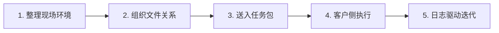
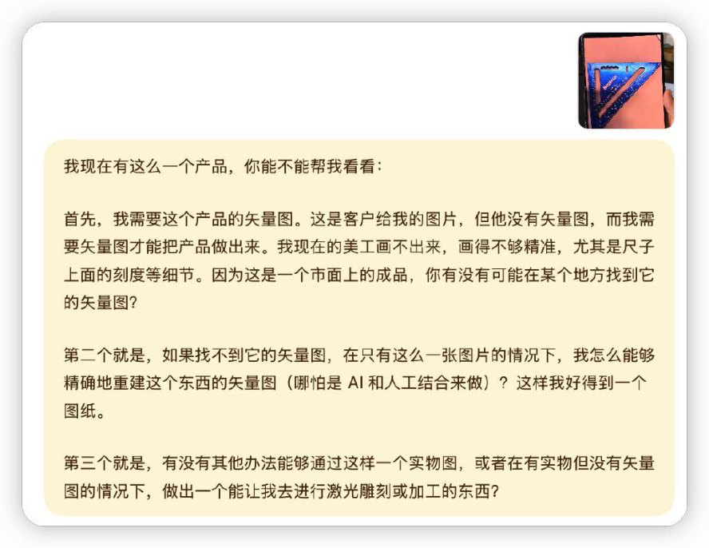
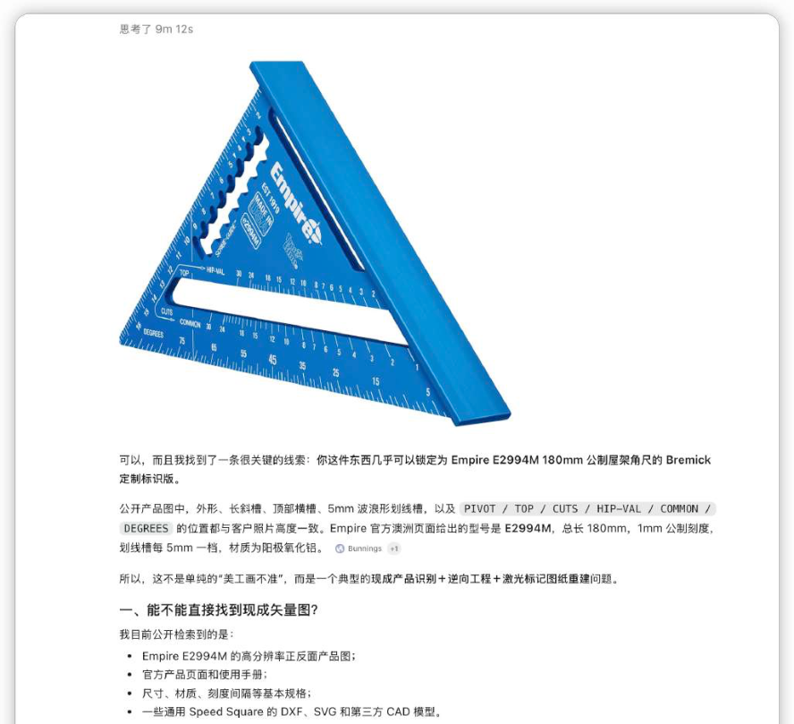
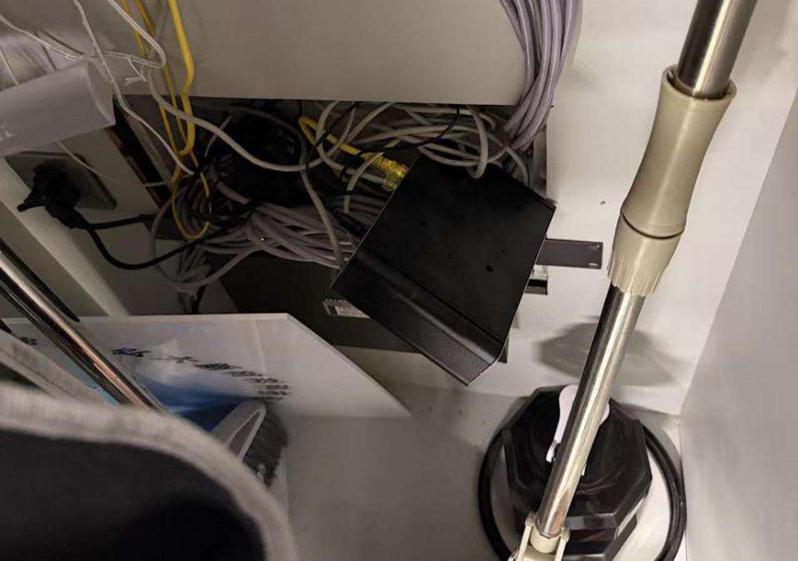
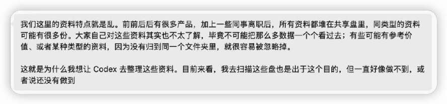
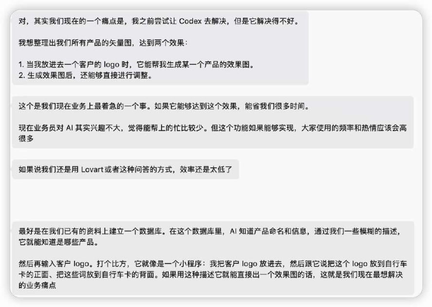
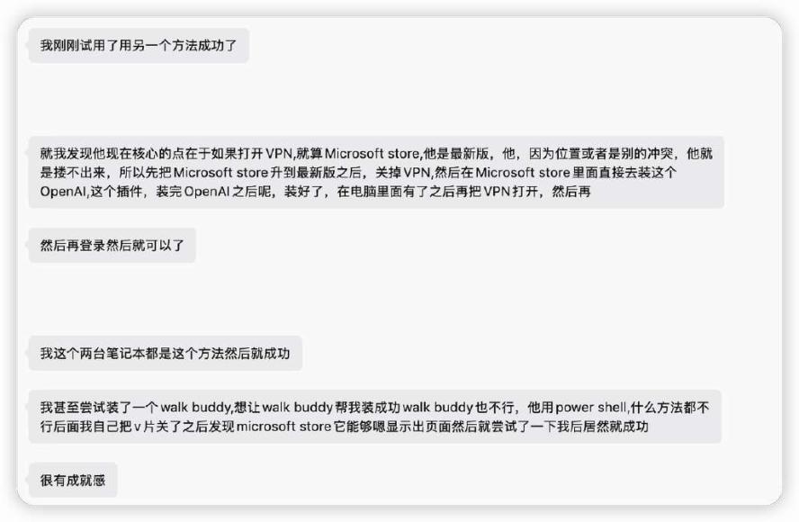
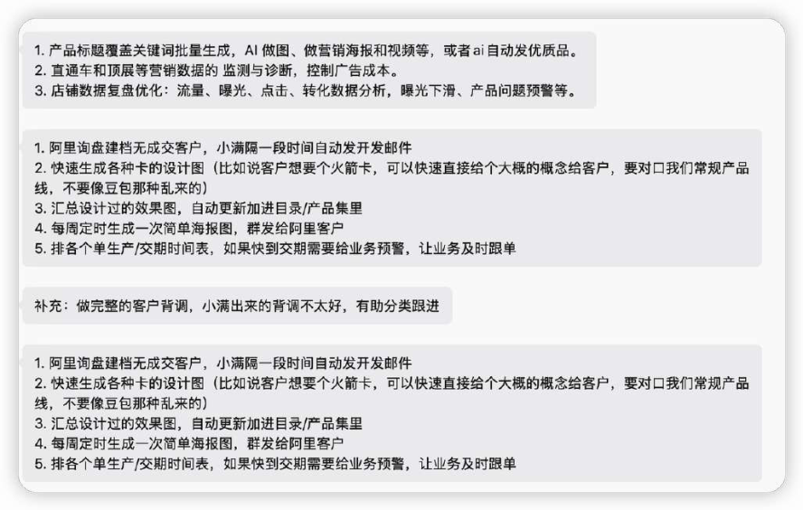
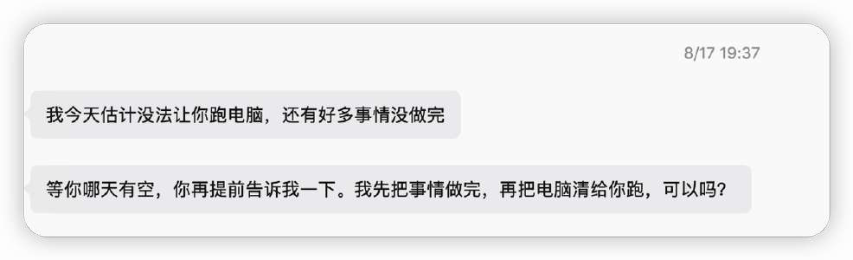

# CASE 11｜把开发能力送进客户环境

**行业**：外贸礼品　 **学习主题**：知识与专业工作台　 **共学时间**：约10分钟

## 一句话简介

FDE团队帮一家十几人的外贸礼品公司处理图片模板散在各台电脑、找客户旧资料很费劲的问题，先整理网络和文件关系，再把开发规范与任务包送到客户自己的Codex里继续适配；现场一个产品刻度查询约10分钟就查清，老板随后提出更多需求，但整个项目当时还在第一阶段测试。

[返回目录](../README.md) · [本例JSON](case.json) · [完整访谈](#full-interview) · [原PDF](../../sources/original-interviews.pdf#page=108)

原题：从文件散乱到随取随用：FDE用AI帮外贸企业把资料变成可用资产

来源范围：PDF物理页 108–120；书内页码 107–119。

**本例值得讨论的判断（编辑提炼）**：资料不能交出来，能力仍可进入企业。

> 阅读提示：标为“访谈概括”的内容来自受访者陈述；“补充分析”是编辑解释；“迁移演练”是迁移假设。效果数字保留原文的试点、目标、估算和脱敏条件。前半部用于备课和学习，后半部完整保留原访谈。

## 1. 业务现场与行业特点

### 发生了什么｜访谈概括

公司年销售额约几个亿元，团队只有十几人，电脑里同时保存样图、美工图、参考图、交付图和产品模板。老板想按客户和产品找旧资料，也希望分析国际站关键词、持续发布网站文章和把产品放入已有海报模板。

公司曾购买约五万元的相关数字化服务，但标准产品难以持续承接大量零碎、个性化需求。文件之间的关系没有组织好，运行环境也不统一，购买一个模型账号并不能自动让这些需求变成可用工具。

关键现场事实：

- 外贸礼品公司，十几人、年销售额约数亿元
- 样图、模板、客户交付图散在多台电脑
- 老板关心找文件、运营数据、文章与产品海报

**原工作路径**：凭记忆找文件 → 找美工或外包 → 反复解释需求 → 资料留在个人电脑

**重新定义的问题**：买过约5万元相关服务仍缺持续适配；企业核心资料不愿打包交给外部团队。

依据：[原PDF物理页 109、110、113、114](../../sources/original-interviews.pdf#page=109)；需要核实具体说法请查看[完整访谈](#full-interview)。

扩充段落主要参照：[Q1](#q1)、[Q2](#q2)；原PDF物理页 108–120。

### 为什么需要FDE｜补充分析

小型外贸公司的业务知识常附着在图片、客户往来与历史版本上。单个文件能被识别还不够，需要知道它属于哪个客户、产品和项目；资料本身又可能是核心经营资产，因此交付方式要适应客户能提供的访问条件。

小需求碎而多，文件关系未组织；网络、权限和客户配合时间共同决定能否交付。

需要现场解决基础环境、组织文件关系，并设计适配客户控制边界的交付方式。

## 2. 解决思路怎样形成

### 从调研到方案的过程｜访谈概括

FDE从老板眼前的小问题破冰：对一张带不规则刻度的产品照片继续检索产品来源、厂家与附件，大约十分钟找到了产品并解释刻度含义。这次现场解决让客户看到具体价值，推动后续更完整的需求交流。

进入开发后，团队先处理四台路由器、两台光猫、交换机和软路由组成的复杂网络，再重新组织散在不同电脑上的文件，建立客户、产品和项目之间的关联。网络、权限和文件结构成为AI能否工作的直接前提。

由于客户不愿把核心资料整体交给外部团队，FDE将框架、原则、规范和Demo整理为Harness任务包，部署到客户侧Codex，让客户环境内继续开发和测试，再通过日志与问题记录反馈迭代，改变了外部团队拿走数据开发的方式。

| 现场信号 | 形成的决定 |
|---|---|
| 现场产品刻度问题长期没解决 | 约10分钟找出产品与角度含义，先建立信任 |
| 4路由器等设备网络混乱 | 首日先排网络、权限与运行环境 |
| 无法把客户资料带回开发 | 把Harness任务包放到客户侧，由客户环境继续执行 |

依据：[原PDF物理页 111、112、113、114、115](../../sources/original-interviews.pdf#page=111)；需要核实具体说法请查看[完整访谈](#full-interview)。

扩充段落主要参照：[Q3](#q3)、[Q5](#q5)、[Q6](#q6)；原PDF物理页 108–120。

### 这些取舍为什么重要｜补充分析

这个案例把交付重心从传递数据转向传递开发规则和可执行任务。这样更贴近客户的资料边界，但增加了环境差异、调试日志质量和客户测试配合的重要性，不能假定把一个任务包拷过去就能稳定完成。

“客户本地Codex执行”描述了执行位置，并不能单独证明模型请求、遥测和日志完全没有离开网络边界。教学上应保留原访谈说法，同时在迁移设计中分别核对文件存放、工具执行和模型调用的数据流。

## 3. 工作流程与人机分工

以下流程图和职责划分是依据访谈所作的业务抽象，不补造未披露的技术架构。



| 步骤 | 实际作用 |
|---|---|
| 1. 整理现场环境 | 网络、电脑、权限 |
| 2. 组织文件关系 | 客户—产品—项目—资料 |
| 3. 送入任务包 | 框架、原则、规范与Demo |
| 4. 客户侧执行 | 客户自己的Codex适配本地环境 |
| 5. 日志驱动迭代 | 客户AI整理问题，双方调整任务 |

| 角色 | 负责什么 |
|---|---|
| AI | 辅助本地开发、文件处理与日志整理 |
| 系统 | 任务规范、客户运行环境与远程通道 |
| 人 | 老板确认资料边界、测试结果与真实需求 |

依据：[原PDF物理页 113、114、115、119](../../sources/original-interviews.pdf#page=113)；需要核实具体说法请查看[完整访谈](#full-interview)。

## 4. 交付物、实际使用与组织采用

### 交付后怎样工作｜访谈概括

交付首先是一套能在客户条件下运行的开发与适配方法，再逐步形成文件整理、搜索、模板处理等具体能力。客户侧AI根据任务规范执行，使用者测试结果，FDE依据反馈继续修改任务与规范。

长期目标是把资料文档化、关系整理清楚，沉淀工作流、Skill和Agent，使公司以后遇到相近问题能自己先尝试。访谈描述的是这一方向和正在进行的第一阶段，不应把所有想做的工具列为已完成交付。

| 交付物 | 交付内容 |
|---|---|
| 文件与环境基础 | 统一资料关系，改善运行条件 |
| Harness任务包 | 把框架、原则、规范和Demo送入客户环境 |
| 工作流、Skill与Agent | 目标是客户逐步能自主解决下一批问题 |

### 实施与推广｜访谈概括

框架准备几十小时，客户侧Codex约跑40小时；安排夜间任务减等待。项目第一阶段尚未全交付。

前期搭框架投入几十小时，客户侧Codex又运行约四十小时，随后进入测试。还出现程序换电脑后报错、老板没空测试、员工白天要工作等问题，团队调整环境与反馈方式，并把部分长任务安排在夜间。

依据：[原PDF物理页 113、114、115、118、119](../../sources/original-interviews.pdf#page=113)；需要核实具体说法请查看[完整访谈](#full-interview)。

扩充段落主要参照：[Q3](#q3)、[Q4](#q4)、[Q5](#q5)；原PDF物理页 108–120。

## 5. 实际成效与证据边界

### 原文报告的变化

| 指标 | 原来或参照 | 后来或状态 | 必须保留的限定 |
|---|---|---|---|
| 产品识别个案 | 老板原估1–2天 | 现场约10分钟 | 个案而非整个公司效率 |
| 需求信任变化 | 先给一个小问题 | 再提出约10–20个需求 | 体现意愿，非全部已交付 |
| 项目完成状态 | 第一阶段 | 仍在测试与适配 | 无完整效率百分比或ROI |

### 如何理解效果｜补充分析

可确认的是个别现场问题被快速解决、客户释放约十到二十个新需求，以及对AI使用方式的理解发生变化。十分钟产品识别是个案，新增需求也不是已交付功能数量；项目第一阶段尚未全部完成，没有可推广的整体效率百分比。

**证据边界**：“数据不离开企业”为访谈表述；模型调用和远程通道的数据流细节未披露。

依据：[原PDF物理页 111、115、116、117](../../sources/original-interviews.pdf#page=111)；需要核实具体说法请查看[完整访谈](#full-interview)。

## 6. 难点、应对与可复用经验

| 难点 | 原文中的应对 |
|---|---|
| 环境差异导致反复报错 | 先摸清网络、权限与电脑环境 |
| 核心资料不能外交 | 将任务与开发能力放入客户环境 |
| 老板与员工无空配合 | 日志反馈、远程通道和夜间任务 |

依据：[原PDF物理页 111、115、116、117](../../sources/original-interviews.pdf#page=111)；需要核实具体说法请查看[完整访谈](#full-interview)。

**可复用的方法（编辑归纳）**：结合第2节的关键取舍，关注真实任务如何被重新定义、可交付结果由谁确认，以及组织如何继续使用和修改。原受访者的全部经验保留在[Q6](#q6)。

## 7. 迁移到其他工作场景的讨论｜4分钟

以下是通用研发场景中的假设练习，不代表案例客户或任何学习者所在组织已经开展或验证了这些项目。

一个科研合作方允许在自己的环境做适配，但不能把实验原始数据交给外部团队。

**讨论问题**：拿不到原始数据时，怎样让客户仍能审查并推进交付？

**本组应交出的产物**：定义可带入、可带出、客户必须亲自确认的3类产物。

个人思考40秒 → 小组讨论100秒 → 共识与质疑70秒 → 主持人收束30秒。

<details>
<summary>展开：迁移试点、验收与主持人参考</summary>

可将这一方法用于合作方的专有实验记录或数据难以集中移交的场景：将任务说明、数据接口约定、工具流程和检查规则部署到对方获授权的环境，先处理一项有限任务，并只返回双方约定的结果和诊断信息。

试点需要分别确认本地文件权限、模型端点、日志内容、导出范围和复核责任，准备可复现的错误记录。验收目标是任务在真实客户环境里能跑、能测、能继续修改，而不是在FDE电脑上展示一次成功。

**建议切口**：交付可审查的任务规范、测试与运行包，在客户环境处理真实数据，回收允许共享的日志。

**建议验收**：建议验收：环境可复建、任务可重复、日志可诊断、数据流经客户确认。

**适用限制**：本地文件处理不自动代表无外部传输；需明确模型端点、日志内容与远程权限。

**主持人参考**：参考：带入规范与程序；带出获准的脱敏日志/指标；客户确认数据、执行结果和权限边界。

</details>

可以直接对Codex说：

```text
请带我学习案例11。先讲清项目做了什么，再用一个关键问题让我做判断。
讲事实时引用原PDF页码；讨论迁移方案时明确标为假设。
```

## 8. 原图与受访者介绍

[查看原案例封面与受访者介绍](../../assets/cover_108.png)。人物姓名、职位及图片内文字以原PDF为准。

### 原图 1｜原PDF第111页



[回到原PDF第111页](../../sources/original-interviews.pdf#page=111)

### 原图 2｜原PDF第112页



[回到原PDF第112页](../../sources/original-interviews.pdf#page=112)

### 原图 3｜原PDF第113页



[回到原PDF第113页](../../sources/original-interviews.pdf#page=113)

### 原图 4｜原PDF第114页



[回到原PDF第114页](../../sources/original-interviews.pdf#page=114)

### 原图 5｜原PDF第114页



[回到原PDF第114页](../../sources/original-interviews.pdf#page=114)

### 原图 6｜原PDF第116页



[回到原PDF第116页](../../sources/original-interviews.pdf#page=116)

### 原图 7｜原PDF第117页



[回到原PDF第117页](../../sources/original-interviews.pdf#page=117)

### 原图 8｜原PDF第118页



[回到原PDF第118页](../../sources/original-interviews.pdf#page=118)

<a id="full-interview"></a>

## 9. 完整原始访谈

以下6组问答逐段保留原PDF文字层的原始提取内容。原有换行、术语或转义保留，不以编辑详解替代原文。文字层未包含的图片信息，请查看上方原图及[完整PDF第108–120页](../../sources/original-interviews.pdf#page=108)。

<details>
<summary>展开全部访谈：Q1–Q6</summary>

<a id="q1"></a>

### Q1

Q1：作为FDE，你应用AI的具体场景是什么？在这个场景下遇到
的具体问题长什么样？
我接触这家企业时，第一反应是他们提出的需求一点都不“高大上”。
这是一家做外贸礼品的公司，产品包含起瓶器这类小商品，一年销售额大概有几个亿，
但整个团队只有十几个人。公司业务跑了很多年，问题在于数据太多、太散，而且其中
相当一部分是图片，比规整的文字和表格更难整理。
电脑里有样图、美工图、参考图、客户交付图，还有各种产品模板，分散在不同电脑、
不同文件夹里。
所以老板一开始给我的需求非常具体：能不能以后我直接跟AI说一句话，比如“帮我找
一下某个客户之前用过的某个模板”，AI就直接把东西找出来？
除了文件搜索，他还有几个需求。比如，希望AI能够看到阿里国际站的数据，告诉他今
天哪些关键词表现怎么样，要不要换词；希望AI帮公司网站持续发文章；还有产品海
报，以前需要把产品图交给人处理，他希望以后直接给AI一个产品，就能自动放进已有
模板里。
这些事情单独看都不复杂。但真正的问题，其实藏在这些“小需求”下面。
首先是企业的数字资产并没有真正被组织起来。文件虽然都在电脑里，但AI不知道这些
文件之间是什么关系，人自己也未必知道。
其次是企业缺少AI可以直接运行的环境。你不能说今天买一个大模型账号，明天企业就
AI化了。网络、电脑环境、权限、文件结构、工作流程，这些都会影响AI到底能不能真
正进入业务。
第三个问题反而最重要，就是信任。
很多老板已经听过不少AI概念，甚至知道Agent是什么，但他们不知道这些东西跟自己
每天遇到的问题到底有什么关系。所以FDE进去以后，我觉得第一件事是找到一个老板
真正关心的问题，然后告诉他：这个问题，AI能不能比你原来的方式解决得更好？
这才是起点。

<a id="q2"></a>

### Q2

Q2：在你参与之前，这个问题过去是怎么解决的？
这家公司之前已经为数字化和AI相关服务花过钱。
比如，老板花过大约5万元购买相关服务，对方可以基于国际站拿到一些数据，也搭建
过外贸网站。这个产品本身有一定价值，但更接近一个标准化产品。企业遇到个性化问
题以后，后续没有人继续陪他往下走，也没有人告诉他这个工具怎么和自己公司的工作
方式结合。
我后来一直在想，为什么传统的软件和外包方式以前能够运行？
因为过去企业的问题相对明确。我要一个网站，就找人做网站；我要一个ERP，就买
ERP；我要一个设计稿，就交给美工。一个问题对应一个工具或者一个人。
这种方式本身没有错。但随着业务越来越复杂，老板开始发现，公司里同时存在几十
个、几百个非常碎的小需求。如果每一个需求都找一个外包团队开发，成本根本承担不
了。
更关键的是，很多问题甚至没有清晰到可以直接写成需求文档。老板知道“这里不太
顺”，但他自己都不知道应该开发什么。
我印象很深的是，这个外贸老板当时碰到一个客户需求。客户给了他一个类似三角尺的
产品，上面有一排不规则的刻度。他们找过美工，也做过3D打样，但一直没有搞清楚这
排刻度到底是什么，甚至准备人工照着抄，但又抄不准。
图1：现场给老板解决查询产品信息
如果按照以前的工作方式，这可能又要找人、搜索资料、反复确认。
我当时没有给他开发任何软件。我直接把照片丢给AI，让AI判断这是什么产品，如果不
知道就继续找相关资料、生产厂商以及附加文件，再分析如果要把这个产品做出来需要
哪些信息。
大概10分钟，AI把产品找到了，也搞清楚了那排所谓“不规则的刻度”其实代表的是角
度。
老板当时很惊讶。因为按照他原来的思路，这件事情可能要研究一两天。
这个瞬间其实非常重要。他第一次意识到，AI不需要被当成一个需要单独学习的新软
件，它本身就是一种完全不同的解决问题方式。
图2：AI十分钟跑出来的结果

<a id="q3"></a>

### Q3

Q3：后来你使用AI解决这个问题的整体思路和关键步骤是什
么？
真正开始做以后，我反而没有急着开发功能。
第一步，先处理现场环境。
我们决定直接使用最顶尖的大模型，但到了企业现场才发现，他们内部的网络环境经过
历年来自己不断的调整，非常复杂：4台路由器、2台光猫、1台交换机，还有一个软路
由，整个网络串得很乱，也时常不稳定。所以，为了让Agent具备更稳定和灵活的内网
访问权限和工具，我第一天几乎是在当网络工程师。
图3：客户现场的网络环境
这个开头也说明，企业AI落地的第一件事，常常是先把以前留下来的基础设施问题解决
掉。公司内网不通、设备环境不一致，再好的Agent也跑不起来。
第二步，重新整理企业文件。
网络解决以后，我做的第二步是整理企业的文件。
这一步比简单地把文件塞进一个所谓“知识库”要复杂得多。我们的做法，是重新组织
散落在各台电脑上的资料，建立文件之间的关系，让AI知道哪些文件属于哪个客户、哪
个产品、哪个项目，以及不同资料之间是什么关系。
但这里马上遇到了一个现实问题：这些资料不能直接交给我们。
对于老板来说，电脑里的合同、客户资料、产品文件，本身可能就是公司最核心的资
产，有些东西甚至不会给公司其他员工看，更不可能全部打包发给一个外部FDE。
图4：老板关于资料杂乱的反馈
图5：老板关于统一数据的需求
第三步，把数据留在企业，把开发能力送进去。
按照传统做法，我们会把数据打包拿回来开发，但到了现场才发现这条路走不通。
于是我们调整了思路，先把一套Harness整理成任务包，把框架、原则、规范和Demo
一起部署到客户自己的Codex里，再让客户本地的Codex按照我们的规范，在他的电脑
和文件环境里继续完成开发。
我们前期花了几十个小时把框架做好，然后让客户侧的Codex继续跑大约40个小时。跑
出来以后，老板开始测试。
测试产生的日志、问题和记录，再由客户侧的AI整理给我们，我们根据这些反馈继续修
改规范和任务，再让客户侧的AI完成适配。
这个过程对我来说很重要。因为它改变了过去“驻场工程师必须一直守在客户电脑旁
边”的工作方式。数据不需要离开企业，开发和适配却仍然可以继续。
第四步，让交付沉淀成企业自己的能力。
更重要的是，我们不想永远替企业做这些需求。
我的目标是把文件文档化，把资料关系梳理出来，把知识沉淀下来，再建立工作流、
Skill和Agent。这些东西逐渐沉淀以后，企业自己就能解决越来越多的问题。
我更希望最后交付的是企业自己解决下一批问题的能力，让企业以后不必每遇到一个问
题都来找我。

<a id="q4"></a>

### Q4

Q4：相比传统方式，使用AI后的实际效果如何？
如果只从一个软件项目的角度看，现在其实还很难给这个案例下一个“效率提升了多少
百分比”的结论，因为项目本身还处在第一阶段，交付也还没有全部完成。
不过，这个项目已经发生了几个非常明显的变化。
第一个变化，是企业开始真正理解AI能做什么。
那个角标尺问题，老板本来以为要研究一两天，我们现场用AI大约10分钟就找到了产品
来源和刻度含义。后来他觉得矢量图很难做，我们又直接问AI应该用什么工具，当场把
矢量图做了出来。
这个结果真正重要的地方，是老板开始意识到，以前很多他以为必须找专业人员、必须
走固定流程的问题，现在可以换一种方式解决。
图6：老板自己开始学会用AI解决日常问题
第二个变化，是信任建立以后，企业开始主动释放更多需求。
一开始，老板只愿意拿一个很小、很具体、试错成本比较低的问题给我们。但在做出一
些交付以后，他很快又提出了十几到二十个新的需求。
这个变化比单纯的效率指标更能说明问题。因为它意味着企业已经从“我要不要试一下
AI？”，变成了“我公司还有哪些问题可以这样解决？”
图7：第一个需求完成后，老板给出了更全面的需求
第三个变化，是老板对AI的判断开始从“买一个工具”，变成“重新思考公司怎么工
作”。
我后来慢慢确信，对这类企业来说，FDE最大的价值未必是帮他少雇一两个人。
真正有价值的是，通过几个具体项目，让老板看到一种新的工作方式，从而改变他后面
的战略判断。
尤其是我们接触的很多企业，本身正处于业务快速增长、人力跟不上的阶段。在这个时
候，老板如果意识到未来新增业务不一定都要靠增加人力解决，这种认知变化带来的价
值，可能远远超过某一个工具本身节省的成本。

<a id="q5"></a>

### Q5

Q5：在部署AI过程中，是否遇到了新问题或挑战？你是怎么解
决的？
做这个项目的过程中，有三个挑战让我印象最深。
第一个挑战，是现场环境不一致。
我们自己的程序在本地跑得很好，到了客户电脑上就会出现各种报错。原因也很简单，
每一台电脑的环境都不一样。
最开始经常发生这样的情况：我发一个安装包，对方说报错；他截图给我，我修改以后
再发一个；结果又出现新的错误。
这些在标准软件工程里可能是很基础的问题，但到了真实企业现场，它就是会实实在在
拖慢整个项目。
所以后来我们把环境当成了第一现场问题，进去之后先花时间把每台电脑的网络、权
限、运行环境摸清楚，尽量提前统一，后面来回返工才少了很多。
第二个挑战，是数据和隐私。
AI要真正发挥作用，就必须接触企业最有价值的资料。但恰恰是这些资料，老板最不愿
意交出去。
所以我们换了一种方式，把开发能力和任务规范送到他的环境里，让客户自己的AI在本
地完成工作，数据始终不离开企业。
第三个挑战，是老板和员工的时间与配合。
图9：老板经常没有时间配合，我们需要找到更高效的方式
老板要处理业务，产品做好以后需要他测试，他又可能几天都不在公司；员工白天要工
作，我们又需要调试他们的电脑。
但定制化产品必须有人真正使用，我们才能知道哪里不符合需求。有一段时间，我们甚
至一直在催老板：“你有时间用一下，至少给我们留一点记录。”
后来我们自己开发了一个远程通道，让我们的AI可以在后台连接客户电脑上的AI，在不
影响员工正常工作的情况下完成一些任务。很多长任务放到晚上跑，双方都节省了大量
沟通和等待时间。
回头看，这三个挑战没有一个直接关于模型，但每一个都能决定项目能不能真正跑起
来。FDE必须进入业务现场，原因就在这里。

<a id="q6"></a>

### Q6

Q6：根据你的经验，我们怎么才能更好地把AI部署到实际业务
中？
做完这些项目，我慢慢看清了一件事：FDE不能把自己理解成一个“AI外包”。
如果只是帮客户开发一个小软件，我们一定会陷入和传统外包的比价，而且专业的软件
外包公司很可能比我们做得更成熟。
FDE真正应该解决的是另外一个问题，就是怎么让AI这种通用能力进入一家具体的企
业，并且最终留下来。
第一，从一个非常小、非常具体的问题开始。
不要一上来跟老板讲多Agent协作、Harness或者企业智能体。老板真正关心的是：
“我现在这个问题，你能不能解决？”
而且这个问题最好是他正在为之付出时间、成本，甚至正在影响业务的。把这个问题解
决以后，信任自然就会出现。
我们在实践中看到的也是这样：很多老板一开始只愿意拿一个点试，做出结果以后，才
会把后面的十几个、几十个问题交出来。
第二，不要只讲AI，要现场解决问题。
现在很多企业老板已经听过太多AI概念了。真正有效的是，把他眼前关心的问题拿出
来，让他亲眼看到你的思考过程。概念听过以后很容易忘，但一个真实问题被当场解
决，老板会立刻知道AI跟自己有什么关系。
第三，要把交付目标从“做一个工具”变成“沉淀企业能力”。
我希望企业以后不用每遇到一个问题都来找我。做完一次项目，企业带走的应该是一套
自己继续解决问题的方法，一个具体的工具反而不是重点。这样交付几次以后，企业遇
到新问题时，第一反应会从“找人”变成“自己先试”。
第四，FDE要接受一个事实：大量工作并不“AI”。
你可能要修网络，要处理Windows环境，要梳理文件命名，要解决权限，要等老板开会
回来，要催员工测试。这些看起来都不是AI技术，但它们决定了AI到底能不能进入真实
业务。
FDE最稀缺的能力，是能不能站在真实业务问题面前，把所有阻碍AI发挥作用的环节一
个个拆掉。“懂多少个模型”反而是次要的。
最后，我觉得最理想的FDE，是让客户越来越独立。
有一天企业会发现：以前一个需求出现以后，我要去找软件公司、找外包、找顾问；现
在这个需求出现以后，我自己的数据、工作流和AI能力已经在那里了，我可以先自己解
决。
到这一步，AI才真正变成了企业自己的能力，而不再只是采购清单上的又一个软件。

</details>

[返回案例目录](../README.md) · [本例结构化数据](case.json)
