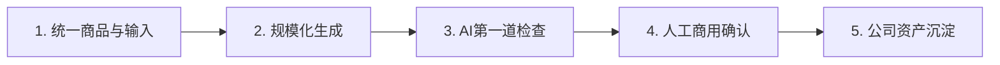
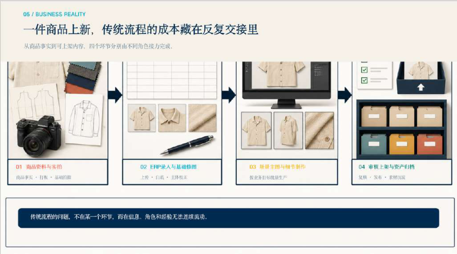
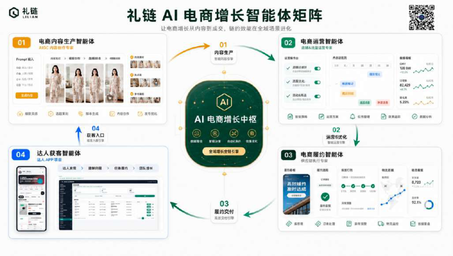

# CASE 12｜从个人生图到公司级素材生产

**行业**：鞋服帽电商　 **学习主题**：知识与专业工作台　 **共学时间**：约10分钟

## 一句话简介

FDE团队帮一家鞋服帽电商企业解决设计师各自用AI出图、反复调提示词、商品细节容易变样和素材散在个人电脑的问题，把商品、图片视频生成、质量检查和素材管理连成公司共用的流程，开始让内容能统一保存和复用，不过当时仍在内部试用，尚未给出稳定的产能或成本改善数字。

[返回目录](../README.md) · [本例JSON](case.json) · [完整访谈](#full-interview) · [原PDF](../../sources/original-interviews.pdf#page=121)

原题：从人工盯图到公司级生产：FDE用AI重塑鞋服电商素材工作流

来源范围：PDF物理页 121–130；书内页码 120–129。

**本例值得讨论的判断（编辑提炼）**：商品一致性，比单张图片好看更接近交付标准。

> 阅读提示：标为“访谈概括”的内容来自受访者陈述；“补充分析”是编辑解释；“迁移演练”是迁移假设。效果数字保留原文的试点、目标、估算和脱敏条件。前半部用于备课和学习，后半部完整保留原访谈。

## 1. 业务现场与行业特点

### 发生了什么｜访谈概括

客户有工厂和设计师，主要在淘宝、天猫销售，年流水约十亿元。SKU多、上新快，每款商品需要主图、详情素材和挂车视频，内容供给会随着商品规模持续增加，传统方式需要较大的设计与运营团队。

企业已经让员工使用AI，但每个人自己开账号、写提示词、盯生成结果，操作负担和水平差异依然存在。素材还散落在个人电脑，离职或换岗可能造成资料和经验断裂，因此问题同时涉及产能、品控和资产归属。

关键现场事实：

- 头部鞋服帽电商，有工厂与设计师，年流水约10亿元
- SKU多、上新快，主图、详情与视频需求持续增加
- 个人AI账号与个人素材目录造成能力分散

**原工作路径**：设计师各自用AI → 反复写提示词 → 手工修图审核 → 素材分散保存

**重新定义的问题**：从“人做图”变成“人盯AI做图”，没有消除操作负担、质量差异和资产流失。

依据：[原PDF物理页 122、123、124](../../sources/original-interviews.pdf#page=122)；需要核实具体说法请查看[完整访谈](#full-interview)。

扩充段落主要参照：[Q1](#q1)、[Q2](#q2)；原PDF物理页 121–130。

### 为什么需要FDE｜补充分析

电商素材不仅要吸引人，还必须与实际出售的商品一致。颜色、版型和细节变化可能让漂亮图片无法商用；因此生产能力不能只按生成数量衡量，需要把商品身份、品牌要求、审核和素材复用纳入同一流程。

内容产能、商品真实性和资产归属同时重要；高手能出好图不代表企业能稳定批量生产。

需要让商品管理、生成、品控、归档和反馈形成公司流程，并获得基层设计师参与。

## 2. 解决思路怎样形成

### 从调研到方案的过程｜访谈概括

FDE识别老板、管理者、设计师与运营各自的关注点，再观察资料流转与重复动作。进入现场先解决长提示词、后续处理等小麻烦，让员工立即感到工作变轻，为获取真实需求和后续试用建立配合。

团队在调研阶段就做Demo，拿给客户使用，再把意见持续写进文档，形成调研、演示、使用、反馈、迭代的节奏。随着问题变清楚，交付目标从加快某个人出图，转为公司级的商品与内容生产流程。

工作流连接统一商品信息、图片与视频生成、检查、人工确认和素材沉淀。人物、服饰、场景一致性进入验收要求，AI先做一轮检查，实际使用者再判断品牌审美与可用性，随后进入POC和内部试用。

| 现场信号 | 形成的决定 |
|---|---|
| 只听老板，容易漏掉员工负担 | 先解决提示词等小麻烦，再建立合作 |
| 快速Demo暴露真实使用问题 | 调研—使用—反馈持续循环，并把意见文档化 |
| 漂亮图可能改变商品细节 | 把人物、服饰、场景一致性写入验收 |

依据：[原PDF物理页 125、126](../../sources/original-interviews.pdf#page=125)；需要核实具体说法请查看[完整访谈](#full-interview)。

扩充段落主要参照：[Q3](#q3)、[Q5](#q5)、[Q6](#q6)；原PDF物理页 121–130。

### 这些取舍为什么重要｜补充分析

生成速度与商品还原度可能冲突，越好看的错误图片越可能被误用。保留人工审核意味着产能不会等于模型裸生成速度，但能让最终可用素材成为验收对象，避免用无法商用的数量制造提效假象。

员工是否愿意参与也是关键约束。只与老板讨论战略，可能听不到一线的真实阻塞和担心；先解决重复工作，再说明新的职责与价值，更容易得到可用于迭代的反馈。

## 3. 工作流程与人机分工

以下流程图和职责划分是依据访谈所作的业务抽象，不补造未披露的技术架构。



| 步骤 | 实际作用 |
|---|---|
| 1. 统一商品与输入 | 商品特征、模板与素材 |
| 2. 规模化生成 | 图片/视频生产流程 |
| 3. AI第一道检查 | 还原度、质量与一致性 |
| 4. 人工商用确认 | 设计师判断品牌与商品真实性 |
| 5. 公司资产沉淀 | 统一生成、管理与后续复用 |

| 角色 | 负责什么 |
|---|---|
| AI | 规模化生成与第一轮检查 |
| 系统 | 商品、素材与反馈的统一管理 |
| 人 | 最终视觉、品牌与商用判断 |

依据：[原PDF物理页 125、126、127](../../sources/original-interviews.pdf#page=125)；需要核实具体说法请查看[完整访谈](#full-interview)。

## 4. 交付物、实际使用与组织采用

### 交付后怎样工作｜访谈概括

设计人员围绕明确商品和要求生成、修改并审核内容，生成记录与通过的素材逐步进入统一管理。下次使用同一商品或相近场景时，可以利用已有资料和经验，而不是每位员工从空白对话重新开始。

交付物包含内容生产流程、统一商品与素材管理方向、质量检查要求以及持续试用反馈。既要让素材能被产出，也要让它能被找到、确认归属、再次使用；这些组织层面的能力才使单次创作逐步形成可重复生产。

| 交付物 | 交付内容 |
|---|---|
| 公司级素材流程 | 生成成果进入统一资产，而非个人文件夹 |
| 明确质量边界 | 人物、服饰、场景一致性及商用要求 |
| POC与反馈机制 | 真实员工试用，改动持续记录和迭代 |

### 实施与推广｜访谈概括

仍处POC、内部试用与迭代阶段；从员工即时减负切入，逐步验证企业级价值。

核心功能完成后仍需要设计师和运营真实使用，收集操作与效果问题继续修改。访谈明确项目处在POC测试、内部试用和持续迭代阶段，所以企业级稳定产能和跨客户规模化是后续需要验证的方向。

依据：[原PDF物理页 126、127](../../sources/original-interviews.pdf#page=126)；需要核实具体说法请查看[完整访谈](#full-interview)。

扩充段落主要参照：[Q3](#q3)、[Q4](#q4)、[Q5](#q5)；原PDF物理页 121–130。

## 5. 实际成效与证据边界

### 原文报告的变化

| 指标 | 原来或参照 | 后来或状态 | 必须保留的限定 |
|---|---|---|---|
| 项目阶段 | 核心功能完成 | POC与内部试用 | 未披露规模化生产收益 |
| 资产形态 | 个人产出 | 逐步公司化管理 | 属于进行中的组织变化 |
| 质量标准 | 看起来好看 | 一致性＋可商用 | 不虚构合格率或生成速度 |

### 如何理解效果｜补充分析

当前变化主要是员工开始使用、生成与管理逐渐进入统一流程、商用品质有明确边界。原文没有给出每小时产图量、人力节省比例或财务ROI；也不能把“素材成为公司资产”的方向写成所有历史素材都已完成治理。

**证据边界**：原文没有效率提升百分比与最终ROI；行业产品化仍需后续跨客户验证。

依据：[原PDF物理页 127、128、129](../../sources/original-interviews.pdf#page=127)；需要核实具体说法请查看[完整访谈](#full-interview)。

## 6. 难点、应对与可复用经验

| 难点 | 原文中的应对 |
|---|---|
| AI预期过高或过低 | 用真实流程与POC校准价值 |
| 员工担心被替代 | 先减负，让核心使用者参与 |
| 生成漂亮但商品不对 | 硬性一致性标准＋人工最终审核 |

依据：[原PDF物理页 127、128、129](../../sources/original-interviews.pdf#page=127)；需要核实具体说法请查看[完整访谈](#full-interview)。

**可复用的方法（编辑归纳）**：结合第2节的关键取舍，关注真实任务如何被重新定义、可交付结果由谁确认，以及组织如何继续使用和修改。原受访者的全部经验保留在[Q6](#q6)。

## 7. 迁移到其他工作场景的讨论｜4分钟

以下是通用研发场景中的假设练习，不代表案例客户或任何学习者所在组织已经开展或验证了这些项目。

某研发团队希望规模化生成研究报告、分子或材料可视化与交付图，但结果散在个人目录。

**讨论问题**：一张更好看的科研图，如果改变了结构细节，是否还算有效交付？

**本组应交出的产物**：为一种科学交付物写3项不可放宽的一致性标准。

个人思考40秒 → 小组讨论100秒 → 共识与质疑70秒 → 主持人收束30秒。

<details>
<summary>展开：迁移试点、验收与主持人参考</summary>

可将这一思路迁移到科研图表、结构示意、报告或对外技术材料的制作流程。先绑定原始结果与对象身份，再生成表达形式，区分可以调整的呈现细节与不可改变的科学内容，把通过确认的产物与生成依据一起保存。

试点可以选一个材料项目的一组标准报告图，列出绝不能修改的参数、结构和数值，检查版本与来源是否可追踪。验收以可复用、可复核、能进入实际工作为准；图形美观不能弥补科学含义被改写。

**建议切口**：把科研对象、源数据、图表参数、版本与审核一起纳入统一资产和生成流程。

**建议验收**：建议验收：数据与图像一致、单位标签正确、可复现、专家认可且能复用。

**适用限制**：科学图不能为视觉美化改变结果；涉及数据的图表必须由确定性绘图与原始结果支撑。

**主持人参考**：参考：对象/结构对应、数据数值与单位一致、来源和版本可追溯；审美不能覆盖真实性。

</details>

可以直接对Codex说：

```text
请带我学习案例12。先讲清项目做了什么，再用一个关键问题让我做判断。
讲事实时引用原PDF页码；讨论迁移方案时明确标为假设。
```

## 8. 原图与受访者介绍

[查看原案例封面与受访者介绍](../../assets/cover_121.png)。人物姓名、职位及图片内文字以原PDF为准。

### 原图 1｜原PDF第122页



[回到原PDF第122页](../../sources/original-interviews.pdf#page=122)

### 原图 2｜原PDF第127页



[回到原PDF第127页](../../sources/original-interviews.pdf#page=127)

<a id="full-interview"></a>

## 9. 完整原始访谈

以下6组问答逐段保留原PDF文字层的原始提取内容。原有换行、术语或转义保留，不以编辑详解替代原文。文字层未包含的图片信息，请查看上方原图及[完整PDF第121–130页](../../sources/original-interviews.pdf#page=121)。

<details>
<summary>展开全部访谈：Q1–Q6</summary>

<a id="q1"></a>

### Q1

Q1：作为FDE，你应用AI的具体场景是什么？在这个场景下遇到
的具体问题长什么样？
我这次进入的场景，是电商商品的内容生产。
我的客户是一家传统鞋服帽电商企业，有自己的工厂和设计师，主要在淘宝、天猫等平
台销售产品，在行业里已经属于头部企业，年流水大概10亿元。
这种公司的一个特点是SKU非常多，而且新品上得很快。
一件商品上架，拍照、上传只是开始。每上一个新品，都要有商品主图、详情素材；现
在视频电商起来以后，还要配套挂车视频。SKU一多，后面的内容生产量就会跟着成倍
增长。客户每天都有大量出图、出视频的需求，所以背后长期养着一支规模不小的设计
和运营团队。
图1：传统服装电商业务流程
面对这么大的需求，我一开始也很容易把问题想简单：设计师出图太慢，那就用AI帮他
出图。但我真正进到现场以后，发现事情没这么简单。
首先是成本问题。传统模式下，企业需要大量设计和运营人员持续处理素材，人力成本
本身就很高。
其次，即便企业已经开始用AI，也不意味着效率问题自然解决了。
他们原来的使用方式比较分散，每个人自己开AI账号，自己写提示词。看起来大家都
“用上AI了”，实际上只是把一个新工具塞进了旧流程里。操作成本没有真正消失，效率
也没有出现质的变化。
第三个问题是品控。
设计师的审美、经验和AI使用能力不一样，最后生成的东西自然也不一样。能力强的设
计师可能很快就能得到不错的结果，但这样的人在任何公司都是少数。企业不可能把整
个内容生产体系建立在几个高手身上。
除了成本、效率和品控，还有一个当时客户非常关心的问题：这些内容到底是谁的资
产？
以前设计师做出来的图片、视频，很可能就散落在个人电脑里。一个人离职、换岗，素
材也可能跟着断掉。对这样体量的企业来说，这意味着大量已经投入成本生产出来的内
容，并没有真正变成公司的资产。
所以后来我们重新定义了这个问题。我们要做的，是帮企业解决一个更根本的问题：怎
么利用AI，把原来依赖个人能力、分散运行的内容生产过程，变成一套公司级、可复
用、可管理的生产能力。
我做FDE时，一直比较看重这一点。我通常站在业务负责人、实际使用者和AI技术之
间。我要负责的，是先判断客户真正的价值主张是什么，再考虑AI怎么进去，怎么重塑
流程、整合原有资源。

<a id="q2"></a>

### Q2

Q2：在你参与之前，这个问题过去是怎么解决的？
在业务规模还没这么大、AI能力也没有发展到今天这个阶段的时候，用设计师和运营团
队支撑内容生产，是非常自然的一种方式。
设计师理解商品，也理解品牌审美。企业需要什么图，他们就做什么图。这套模式已经
支撑客户把业务做到很大的规模，本身证明它是有效的。
问题出现在业务复杂度越来越高以后。SKU越来越多，图片越来越多，视频越来越多。
业务量增长以后，企业想继续扩大内容供给，最直接的方法就是增加人。于是内容产能
和人力数量开始越来越强地绑定。
后来AI出来以后，客户其实也很积极，并没有完全不用AI。他们开始让员工自己使用各
种AI产品，希望借此提高效率。
但这又进入了第二个阶段：以前是“人做图”，后来变成了“人盯着AI做图”，人还得自
己反复调整。更麻烦的是，这种方式会把人的差异继续放大。
同样一套工具，不同的人用出来，结果完全不同。所以从企业角度看，这依然谈不上稳
定的生产能力。
后来我据此判断，单纯给企业采购几个AI工具，或者教员工怎么写Prompt，都解决不了
根本问题。AI真正要改造的，是整条工作流本身。

<a id="q3"></a>

### Q3

Q3：后来你使用AI解决这个问题的整体思路和关键步骤是什
么？
这个项目里，我花时间最多的事情，是真需求的挖掘，以及价值主张到底成不成立。写
代码反而排在后面，AI辅助以后尤其如此。
第一步，先到现场，不急着做产品。
项目早期，我会花比较多时间待在客户现场。
因为FDE要解决的问题，本质上是怎么把AI技术和行业Know\-how结合起来。只听老板
讲需求是不够的，我必须看到员工实际上怎么工作。
我会先识别整个项目里的关键干系人。老板关注的是企业战略转型，这件事情到底有没
有长期价值；管理者关注的是成本、效率和管理；基层员工想的则完全不同，这东西会
不会给我增加工作量，做完以后是不是要把我裁掉。这些问题如果不处理好，技术做得
再漂亮，也很难真正推下去。
所以我会去观察员工每天到底在干什么，上下游怎么协作，资料怎么流转，大量时间耗
在哪里。比如员工会跟我抱怨，每次生图都要写很长的提示词，生成完还有水印，还得
再处理。
这些问题对他们来说很麻烦，但对我们来说可能只是一个很小的工具或者流程调整就能
解决。我通常会先把这种小问题解决掉。因为员工马上就能感觉到，你来这里，是真的
能帮他少干一些重复工作的。这其实是一个非常重要的破冰过程。
第二步，把“想要AI”变成一个可以验证的价值主张。
我们会通过数据采集、工作流梳理、访谈等方式，把真实需求一点点挖出来。不会花几
个月先做一个“大而全”的产品。
需求确认阶段，我们就会借助AI快速做Demo，马上拿给客户看。客户说这里不对，我
们就改；员工用了以后发现操作不顺，我们继续调。
所以整个过程的节奏是，调研 → Demo → 使用 → 反馈 → 再迭代。而且反馈也不会聊
完就放下，我们会把这些意见沉淀进文档，让客户在指定的位置持续填写。
第三步，重新搭工作流。
做到这里以后，问题已经越过“选哪个生图模型”这个层面。我们开始考虑AI生成怎么跟
商品、素材和企业原来的生产流程连接起来。
一个很重要的方向，就是把生成出来的图片、视频直接沉淀下来，逐渐形成公司级素材
资产；商品本身也要进入统一的商品管理逻辑。这一步在我看来非常关键。
如果AI只是帮员工今天多做了十张图，明天还要重新开始，那它只是工具。如果每一次
使用都在给企业留下数据、素材、流程和经验，AI才开始真正进入企业的能力体系。
第四步，把“好看”变成“能商用”。
电商生图跟普通AI生图有一个非常大的区别：图好看只是基础，真正要紧的是，卖出去
的东西必须就是图上的那件商品。比如一件衣服，AI可以给你生成一张非常漂亮的模特
图，但如果衣服的版型、颜色或者细节变了，这张图越漂亮，商业风险反而越大。
所以我们把“一致性”直接放进验收标准。三个层面分别是人物一致性、服饰一致性和
场景一致性，只有这些达到要求，才算通过。
审核我们仍然保留了人工环节。我们的做法是AI先做第一道检查，再交给人工确认，因
为最终这个素材是否符合品牌审美、能不能真正使用，还是要尊重实际使用者的视觉判
断。
这也成了项目里的一条原则：AI负责规模化，人负责最后的业务判断。
第五步，用POC来证明价值。
项目核心功能完成以后，我们进入了POC阶段。
这时候要做的，是推动企业内部员工真正使用，光自己坐在那里测不算数。他们试用以
后，把优化和改动意见反馈回来，我们再继续迭代。
对我来说，只有到了这个阶段，才开始真正回答“这套东西能不能进入企业日常工
作”，Demo看起来再好看，也回答不了这一点。
图2：通过FDE实现行业级解决方案产品化

<a id="q4"></a>

### Q4

Q4：相比传统方式，使用AI后的实际效果如何？
这个项目目前仍处于POC测试、内部试用和持续迭代阶段。我们现在关注几个实际变
化。
第一个变化，是员工开始真正使用。验收的标准，从项目团队自己的感觉，变成了设计
师到底有没有把这套能力用起来、它和原来的工作流契不契合。
第二个变化，是内容开始从个人产出变成企业资产。
生成、管理和后续使用逐渐进入统一流程。这个变化短期不一定能直接折算成多少钱，
但对企业来说，它解决的是组织能力能不能留下来的问题。
第三个变化，是AI生产开始有了明确的质量边界。
现在验收会覆盖还原度、图片质量、视频能否商用，以及前面说的一致性，效果不再高
度依赖某一个人的水平。所以我理解的“效果”，已经超出了“以前一小时做几张、现在
一小时做几张”。
更重要的是，企业有没有开始形成一套稳定、可控、可以沉淀、可以继续扩大的内容生
产方式。这才是我们真正想验证的价值主张。

<a id="q5"></a>

### Q5

Q5：在部署AI过程中，是否遇到了新问题或挑战？你是怎么解
决的？
我觉得最大的挑战，其实不在模型本身。
第一个挑战，客户对AI的认知。
企业里经常会出现两个极端。一种人觉得，“我们现在挺好的，为什么要折腾AI？它到
底对我有什么价值？”另一种恰恰相反，觉得AI无所不能，甚至会期待“花10万元，就
应该给我做出100万元的效果”。
这两种认知都会给项目带来问题。
所以后来我反复强调一件事：AI一定要放进真实产业场景里跑。与其讨论AI理论上能做
什么，不如回到这家企业今天的业务流程，看哪个环节值得改、能不能改、改完以后价
值怎么验证。
第二个挑战，基层员工。
这是很多AI项目特别容易忽略的一层。
老板可能非常积极，但真正每天使用产品的是设计师、运营。他们很自然会担心，你做
这个是不是准备取代我。如果这种情绪没有解决，你拿到的需求可能都是假的，最后产
品上线以后也没人愿意真正使用。
所以我们一进去，没有跟员工讲“AI转型”这种大词，先把他们眼前的小麻烦解决掉，把
关系建立起来。然后再跟核心人员把目标说清楚，AI是来帮大家从低价值重复劳动里脱
身的，让他们把时间用在更有价值的事上。
第三个挑战，AI本身的不确定性。
生成内容最怕的是“看起来很好，但商品不对”。所以原来如果只是追求“生成效果好
看”，这个标准就不够用了。
我们后来把验收标准重新拉回业务本身，前面定下的那几项硬性要求，一项都不能松。
而且不能因为用了AI，就把审核也完全自动化，最终的业务责任，仍然要交给人。
AI可以提高效率，但最终的业务责任，不能交给模型。

<a id="q6"></a>

### Q6

Q6：根据你的经验，我们怎么才能更好地把AI部署到实际业务
中？
做完这些项目以后，我愈发确信，FDE的核心竞争力，早就超过了“会多少AI工具”这个
层面。真正难的，是找对问题，再让AI真正进入业务。
我现在比较看重几个原则。
第一，先判断价值，再决定做不做。
FDE和传统外包一个很大的区别就在这里。外包接到任务就去把它完成，FDE会在开始
之前先判断，这件事值不值得做，未来有没有拓展性。因为FDE最终要为结果负责，
“功能有没有按时交付”只是其中一环。
第二，一定要进现场。
很多需求在会议室里是问不出来的。要真正进到现场，看员工每天的时间到底花在哪
里，真正的痛点经常藏在这些细节里。
第三，先快速做出东西来验证，不要追求一步到位。
调研之后，尽快做出一个能用的东西，让客户用起来，反馈之后再改。AI时代给了我们
快速试错的能力，应该把这种能力用在产品验证上，让客户早一点看到东西。
第四，把AI嵌进流程里。
如果原来的工作方式完全没变，只是每个人多了一个AI账号，那谈不上真正的AI改造。
真正的改变是，原来的哪一步可以取消，哪一步可以自动完成，哪些信息可以沉淀，谁
负责最后判断，新的上下游关系应该怎么连接。
第五，每做完一个项目，都要问自己能不能产生复利。
比如这次做鞋服电商，我们会继续问，只有这家公司需要吗，换一家鞋服企业是不是也
有类似问题。如果答案是肯定的，那它就从“一个客户的定制需求”变成了“一个行业级
问题”。
既然已经用一个客户完成了0到1的价值验证，下一步就应该考虑怎么从1做到100，把经
验复用出去。所以我们也会有意识地沉淀自己的“家底”。
如果决定深耕电商，就要思考这个行业最基础、最通用的能力是什么。商品中心、订单
中心、用户中心这些能力，未来都可能成为下一次交付时可以直接复用的基石。
我理解的FDE，最终其实有两条飞轮。
一条在客户外部，项目做得越来越多，对产业和客户的理解越来越成熟。另一条在组织
内部，每做一个项目，就把方法、组件和经验留下来，再复用到下一个项目。
如果每做完一个AI项目，只有客户拿到了一个系统，而FDE自己什么都没有沉淀下来，
那这个项目其实还没有真正结束。
真正有价值的AI落地，既让客户的业务能力沉淀下来，也让FDE下一次解决同类问题
时，站在一个更高的起点上。

</details>

[返回案例目录](../README.md) · [本例结构化数据](case.json)
