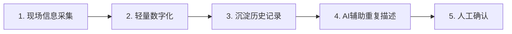

# CASE 13｜先避免重复建设，再谈AI

**行业**：消防维保　 **学习主题**：流程执行与采用　 **共学时间**：约10分钟

## 一句话简介

FDE团队帮一家消防维保公司梳理师傅现场检查后还要写表、打印、发微信，老板却看不清进度的问题，发现新建大系统会和监管软件重复录入，就改用现有飞书从小表单和流程做起，先把工作记录留住、让进度可见，也让公司放弃了原计划约10万元但不适合实际流程的系统采购；项目仍在推进。

[返回目录](../README.md) · [本例JSON](case.json) · [完整访谈](#full-interview) · [原PDF](../../sources/original-interviews.pdf#page=131)

原题：从纸质流程到数据驱动：FDE用AI推动传统消防维保企业数字化转型

来源范围：PDF物理页 131–137；书内页码 130–136。

**本例值得讨论的判断（编辑提炼）**：识别一笔不该花的钱，也是FDE的交付。

> 阅读提示：标为“访谈概括”的内容来自受访者陈述；“补充分析”是编辑解释；“迁移演练”是迁移假设。效果数字保留原文的试点、目标、估算和脱敏条件。前半部用于备课和学习，后半部完整保留原访谈。

## 1. 业务现场与行业特点

### 发生了什么｜访谈概括

客户为物业等单位提供消防设备检查、维护与维修，服务长期发生在现场。老板关心人员去了哪里、问题是否解决、风险是否遗漏，以及记录能否支撑客户确认和回款；现场师傅则要先完成专业工作，再应付纸表、Excel、打印和传递。

不少客户信息、设备情况和处理记录留在微信或个人手里，人员离开后难以延续。填写和整理表格有时要花半天，但公司并非完全没有系统：已有外部监测平台，还必须使用监管要求的软件，任何新方案都要进入这套现实条件。

关键现场事实：

- 传统消防维保企业，主要服务物业等客户
- 老板看不见项目状态；一线被纸表与Excel占用
- 监管要求的软件已存在，但流程无法开放接口

**原工作路径**：现场维保 → 填写纸表 → Excel整理归档 → 周期性向老板汇报

**重新定义的问题**：管理者缺透明，一线缺时间；最初想建完整平台，却可能增加双重填报。

依据：[原PDF物理页 132、133、134](../../sources/original-interviews.pdf#page=132)；需要核实具体说法请查看[完整访谈](#full-interview)。

扩充段落主要参照：[Q1](#q1)、[Q2](#q2)；原PDF物理页 131–137。

### 为什么需要FDE｜补充分析

现场服务的管理价值依赖真实、连续的工作记录。业务系统既要让负责人看见进度，也要让执行人员少重复劳动；如果把数字化变成再填一遍表，数据质量和使用意愿都会受影响。消防专业判断还涉及现场事实，历史记录只能提供线索，不能替代本次检查。

线下执行、资料留存与管理需求相互交织；自建完整平台可能使员工在两套流程中重复工作。

要同时看到监管流程、外勤实际工作与管理诉求，判断哪些建设应该停下。

## 2. 解决思路怎样形成

### 从调研到方案的过程｜访谈概括

最初设想是建设覆盖业务的平台。FDE与维保人员、人事行政和财务交流，并观察真实工作后发现，监管软件无法开放接口，新平台会造成双重录入，原本准备采购的完整系统也难以适配，因此调整了整体方向。

第一阶段先用企业已有的飞书等工具，把现有表格和小流程做成便于记录、查看和接续的模块。目标是让信息留下来，让管理者能够看到实际工作，同时减少现场人员的额外操作，而不是一次性重做所有业务。

之后再判断哪里值得加入AI，例如维保记录里反复出现的设备异常描述，可以利用历史内容辅助整理或生成。此类能力必须建立在基础资料和流程已经可用的前提下，并保留现场人员对真实情况和处理结果的判断。

| 现场信号 | 形成的决定 |
|---|---|
| 会议室需求与现场不同 | 跟着外勤填表和交接，反推真实痛点 |
| 监管系统无法对外接入 | 放弃完整重建，改做既有流程上的轻量模块 |
| 没有统一业务数据 | 先数字化沉淀，再找有真实成本的AI节点 |

依据：[原PDF物理页 133、134、135、136](../../sources/original-interviews.pdf#page=133)；需要核实具体说法请查看[完整访谈](#full-interview)。

扩充段落主要参照：[Q3](#q3)、[Q5](#q5)、[Q6](#q6)；原PDF物理页 131–137。

### 这些取舍为什么重要｜补充分析

该项目最关键的取舍是对现有强制系统的适配。接口不可用时，功能最完整的新平台也可能使工作更重；FDE需要先算清每类用户新增和减少了哪些动作，再决定范围。

调研方式会影响答案。老板在场时，员工可能表达得更符合管理期待；观察现场如何填表、交接和追问题，更容易发现真实负担。设计时也要回应员工对监督和额外工作的担心，不能只把可视化当作单方面的管理收益。

## 3. 工作流程与人机分工

以下流程图和职责划分是依据访谈所作的业务抽象，不补造未披露的技术架构。



| 步骤 | 实际作用 |
|---|---|
| 1. 现场信息采集 | 维保、设备、客户与维修记录 |
| 2. 轻量数字化 | 复用飞书等已有基础工具 |
| 3. 沉淀历史记录 | 让项目状态和资料可查询 |
| 4. AI辅助重复描述 | 调用历史与辅助生成月检内容 |
| 5. 人工确认 | 消防专业判断与真实检查归人 |

| 角色 | 负责什么 |
|---|---|
| AI | 非结构化信息处理、生成与减重复 |
| 系统 | 流程记录、数据完整性和状态管理 |
| 人 | 现场真实检查、专业判断和管理决策 |

依据：[原PDF物理页 134、136](../../sources/original-interviews.pdf#page=134)；需要核实具体说法请查看[完整访谈](#full-interview)。

## 4. 交付物、实际使用与组织采用

### 交付后怎样工作｜访谈概括

现场人员逐步通过轻量表单或流程留下检查、问题和处理记录，负责人围绕这些记录查看进度、跟进未解决事项。交付的价值同时面向管理者和执行者：信息更容易接续，填写过程也应更贴近原来的工作。

系统承担记录、流转和展示，AI适合处理复杂文字信息和重复性整理，人继续负责消防专业判断。当前交付以小模块和基础流程推进，不能把所有设想中的智能生成功能都描述成已经稳定上线。

| 交付物 | 交付内容 |
|---|---|
| 轻量流程与数据 | 纸表、Excel资料逐步线上记录和管理 |
| 重复劳动辅助模块 | 从月检描述等高频节点考虑AI介入 |
| 投资纠偏 | 叫停未适配监管与实际流程的外部方案 |

### 实施与推广｜访谈概括

项目持续推进，尚无大规模业务指标；兼顾老板的透明与员工的减负，控制复杂度。

项目采用逐步推进的节奏，先数字化已有表格与记录，再选择能够明显减轻负担的AI节点。团队还在实施中，当前主要建立工作可见性和数据基础，没有披露完整上线后的效率统计。

依据：[原PDF物理页 134、135、136](../../sources/original-interviews.pdf#page=134)；需要核实具体说法请查看[完整访谈](#full-interview)。

扩充段落主要参照：[Q3](#q3)、[Q4](#q4)、[Q5](#q5)；原PDF物理页 131–137。

## 5. 实际成效与证据边界

### 原文报告的变化

| 指标 | 原来或参照 | 后来或状态 | 必须保留的限定 |
|---|---|---|---|
| 原表单负担 | 个别表可占半天 | 新耗时未披露 | 不能推导全员节省工时 |
| 拟外部采购 | 约10万元 | 调研后叫停 | 避免计划投入，非AI运营增收 |
| 业务状态 | 依赖经验汇报 | 逐步拥有流程数据 | 定性与阶段性变化 |

### 如何理解效果｜补充分析

约10万元对应客户原计划购买、后来决定放弃的不适配系统，说明需求判断避免了一次可能无效的投入；它不是经过审计的AI年度节省。表单曾耗时半天是原有负担描述，原文没有提供改造后的对照时长，不宜自行计算效率倍数。

**证据边界**：AI月检辅助是介入方向举例；未明确全量上线范围，不能写为无人化维保。

依据：[原PDF物理页 135、136](../../sources/original-interviews.pdf#page=135)；需要核实具体说法请查看[完整访谈](#full-interview)。

## 6. 难点、应对与可复用经验

| 难点 | 原文中的应对 |
|---|---|
| 员工在正式访谈中被动 | 进入真实工作现场观察 |
| 一线担心管控加重 | 让管理透明和减负同时发生 |
| 过度建设 | 小模块迭代，复用基础工具 |

依据：[原PDF物理页 135、136](../../sources/original-interviews.pdf#page=135)；需要核实具体说法请查看[完整访谈](#full-interview)。

**可复用的方法（编辑归纳）**：结合第2节的关键取舍，关注真实任务如何被重新定义、可交付结果由谁确认，以及组织如何继续使用和修改。原受访者的全部经验保留在[Q6](#q6)。

## 7. 迁移到其他工作场景的讨论｜4分钟

以下是通用研发场景中的假设练习，不代表案例客户或任何学习者所在组织已经开展或验证了这些项目。

一个实验室已有LIMS、ELN或机构指定系统，负责人仍想再建一套AI平台。

**讨论问题**：客户要完整新平台，但现有强制流程无法打通，应该如何交付？

**本组应交出的产物**：画出两套流程的重复点，提出一个能直接减负的小模块。

个人思考40秒 → 小组讨论100秒 → 共识与质疑70秒 → 主持人收束30秒。

<details>
<summary>展开：迁移试点、验收与主持人参考</summary>

可将这一经验用于实验现场、仪器维护和合作方项目记录。先检查现有LIMS、ELN或其他必须使用的系统能否接入，再选一个真实交接点，例如设备异常的发现、处理和复核，减少信息散落和重复录入。

试点让一线人员实际完成几轮记录，观察输入耗时、遗漏和返工；如用历史记录辅助生成，必须明确这是参考内容，并由执行者确认本次事实。验收应同时看信息能否追踪和一线负担是否下降。

**建议切口**：先核对既有必填流程和接口，优先消除重复录入，为一个高频环节补数据或助手。

**建议验收**：建议验收：总填报次数下降、记录可追溯、现场人员净操作时间减少。

**适用限制**：历史相似记录不能替代本次实际实验或检查；避免自动生成未发生的事实。

**主持人参考**：参考：先确认系统边界、角色和数据源；宁可缩范围也不要把重复劳动转移给一线。

</details>

可以直接对Codex说：

```text
请带我学习案例13。先讲清项目做了什么，再用一个关键问题让我做判断。
讲事实时引用原PDF页码；讨论迁移方案时明确标为假设。
```

## 8. 原图与受访者介绍

[查看原案例封面与受访者介绍](../../assets/cover_131.png)。人物姓名、职位及图片内文字以原PDF为准。

本例没有单独提取出的正文图片；封面、图内文字与全部页面仍保存在原PDF。上方流程图是编辑抽象。

<a id="full-interview"></a>

## 9. 完整原始访谈

以下6组问答逐段保留原PDF文字层的原始提取内容。原有换行、术语或转义保留，不以编辑详解替代原文。文字层未包含的图片信息，请查看上方原图及[完整PDF第131–137页](../../sources/original-interviews.pdf#page=131)。

<details>
<summary>展开全部访谈：Q1–Q6</summary>

<a id="q1"></a>

### Q1

Q1：作为FDE，你应用AI的具体场景是什么？在这个场景下遇到
的具体问题长什么样？
我进入这家企业时，他们主营消防维保业务，主要承接物业等客户的消防检查、维护和
维修工作。企业规模不算特别大，但业务稳定，属于典型的传统行业，有大量线下执行
环节。
这个行业不缺业务，问题在于业务增长过程中，原有的管理模式越来越难支撑企业发
展。
我进入现场后，从两个完全不同的视角看到了问题的全貌。
从老板的角度看，最大的痛点是“看不见”。他知道企业每天在做业务，但无法实时掌
握一线情况：哪些项目的维保执行到位了？哪些客户存在消防风险还没有处置？甚至一
些影响回款的重要维保记录，也可能因为人员变动、资料遗失而无法及时找到。他只能
通过周期性的汇报了解业务状态，而汇报和现场之间，永远隔着一层信息差。
从一线维保人员的角度看，问题又完全不同。他们的核心工作是检查消防设备、完成维
修，但大量时间消耗在业务之外：填写纸质表格、整理Excel数据、打印传递归档、反复
和各方沟通确认。有些时候，一个表格的填写和整理就能占用半天时间。这些工作对他
们来说是纯消耗，不产生任何直接业务价值。
更深层的问题是数据割裂。检查记录在纸质表格里，维修记录在Excel里，客户信息在某
个人的微信聊天记录里，设备档案可能散落在不同文件夹中。这些数据按照监管要求做
了保存，但没有形成统一体系，查找困难，也无法支持管理决策。
从FDE视角看，这个问题的本质超越了技术层面。消防维保业务中，真正棘手的是业务
现场、管理需求和执行流程之间的断层。企业真正缺失的，是一套能够同时连接管理
者、一线员工和业务流程的解决方式。

<a id="q2"></a>

### Q2

Q2：在你参与之前，这个问题过去是怎么解决的？
在我进入企业之前，他们基本没有完整的软件基础设施。
去年企业曾尝试和外部团队合作，引入过一个监控平台，希望迈出数字化第一步。但除
此之外，企业内部没有形成完整的数据体系和流程系统，日常运转主要依赖经验驱动。
在业务规模较小的时候，这种方式勉强可以维持。老板靠多年行业经验判断业务状况，
员工靠熟悉流程完成工作。但当行业利润空间持续下降、企业希望拓展新业务机会时，
经验驱动的模式开始暴露出明显短板。老板意识到需要借助数字化和AI提升效率，但并
不清楚从哪里入手。
不过，对于传统企业来说，直接购买一个大型系统的成本往往难以负担。很多外部方案
功能列表看起来很完善，但没有真正理解企业现场的监管流程和实际执行方式。最坏的
情况是，系统上线后变成员工额外增加的一套操作流程，不仅没有减负，反而加重负
担。
这家企业也面临同样的困境。他们看到AI和数字化的价值，但缺乏一个既懂业务现场、
又能翻译技术方案的角色来帮助判断：到底从哪里开始？什么值得做？什么不需要做？

<a id="q3"></a>

### Q3

Q3：后来你使用AI解决这个问题的整体思路和关键步骤是什
么？
我做FDE的第一步，是进入现场理解业务。
很多时候，老板自己也不清楚真正的问题在哪里。老板看到的是经营结果，员工面对的
是每天具体的流程。如果只通过管理层访谈拿需求，很容易拿到“看起来正确”但实际
上偏离核心问题的需求。
所以我直接和维保人员、人事、行政、财务等角色逐一沟通，观察他们真实工作的过
程。维保人员怎么填写检查表？资料怎么流转？哪些环节需要反复确认？哪些步骤让他
们最头疼？
正是在这个过程中，我发现此前设计的方案存在方向性问题。一开始我们计划建设一个
完整的业务平台，但走到现场后发现，企业已经部署了政府监管要求的软件流程，这套
流程无法开放接口。如果再增加一个完整系统，意味着员工需要在两套系统之间重复操
作。
这意味着原来的方案必须调整。
调整后的思路很明确：在已有流程基础上做最轻量的改造，重新建设一套完整流程既不
现实，也会增加员工负担。
整个推进分为两个阶段。第一阶段，先帮助企业完成流程数字化，把原本在纸质表单和
Excel中流转的数据迁移到线上，让信息能够被记录、沉淀和管理。这一步的目的是先让
企业拥有自己的数据基础，为后续AI介入创造条件。
第二阶段，在数字化流程中寻找AI真正适合介入的环节。判断标准很明确：找到业务流
程中真实存在成本的环节，再判断这个环节是否适合AI介入。先问“哪里存在真实的业
务成本”，再考虑“这里是否需要用AI”。
举个例子，维保人员填写月检表时，经常需要重复输入类似的问题描述。某些设备长期
存在相同异常，每个月都需要复制粘贴几乎一样的内容。这类场景中，AI可以辅助生成
和调用历史记录，减少重复劳动。
在技术方案设计上，我们采用的是分工协作模式：系统负责流程记录和数据沉淀，AI负
责处理复杂信息、辅助生成和降低重复工作，人负责最终判断和业务决策。大模型擅长
从非结构化信息中提取和生成内容，但业务流程的完整性和数据准确性必须由专业系统
保障，最终的消防专业判断必须由人来做。

<a id="q4"></a>

### Q4

Q4：相比传统方式，使用AI后的实际效果如何？
目前项目仍处于持续推进阶段，尚未形成大规模的业务指标变化，但已经可以看到几个
层面的实际价值。
首先，企业管理方式发生了变化。过去企业运转高度依赖老板个人的行业直觉，现在通
过数字化流程，企业开始逐步拥有自己的数据资产。管理者可以更清楚地了解业务状
态，知道哪些项目在执行、哪些环节存在风险，降低了信息不对称带来的管理盲区。
其次，员工工作方式发生了变化。数字化的目标很明确：减少员工在重复填表、整理资
料上的低价值消耗。维保人员如果能把省下的时间投入真正的检查和维修工作，交付质
量和客户满意度都会随之提升。
第三，企业能力在长期沉淀。传统企业最大的短板是经验掌握在个人手里，人员变动就
可能导致能力流失。通过数据沉淀和流程标准化，企业可以逐步把依赖个人经验的能力
转化为组织能力。
此外，我还帮助企业避免了一次无效投入。此前企业曾考虑花费约10万元采购一套外部
业务系统，但经过现场调研发现，对方方案没有充分考虑行业监管流程和实际执行方
式，真正上线后无法使用。经过重新梳理，这笔采购被及时叫停。

<a id="q5"></a>

### Q5

Q5：在部署AI过程中，是否遇到了新问题或挑战？你是怎么解
决的？
第一个挑战：需求真实性。
在最初沟通阶段，一线员工提出了一些需求，但走进现场深入观察后发现，很多需求偏
离了核心问题。原因是员工在正式访谈环境中，很难完全表达真实的工作状态。特别是
外勤维保人员，平时很少回公司，如果坐在会议室里面对老板和管理人员，容易产生压
力，只会被动回答被问到的问题。
我的做法是调整调研方式。不依赖会议室访谈，走进他们的日常工作场景。看他们怎么
填表、怎么交接资料、哪个步骤反复出错、哪些信息需要反复问别人。通过现场流程反
推真实痛点，从实际工作中把真正影响效率的问题找出来。
第二个挑战：基层接受问题。
员工最初对数字化心存顾虑。他们担心这意味着更严格的管控，担心自己的工作过程被
完全记录，也担心需要学习一套全新的系统。如果只考虑老板需要的数据透明和风险管
理，忽略员工的感受，系统做出来也不会有人愿意用。
所以在设计流程时，我们同时兼顾两方诉求。对老板，解决数据透明和风险管理；对员
工，解决工作效率和流程负担。让一线人员感受到数字化是在帮他们减负，把时间还给
真正的专业工作。只有同时满足双方需求，系统才可能真正落地使用。
第三个挑战：避免过度建设。
在推进过程中，始终面临一个选择：做完整方案还是做最小可用功能？完整方案看起来
更专业、覆盖更广，但对传统企业来说，每增加一个功能就意味着员工需要额外学习和
适应。最终我们选择了更务实的路径：拥抱飞书等企业已有的基础工具能力，通过小模
块、小功能逐步推进迭代。简单方案往往更容易落地，也更容易根据反馈快速调整。

<a id="q6"></a>

### Q6

Q6：根据你的经验，我们怎么才能更好地把AI部署到实际业务
中？
第一，从业务问题出发，把AI放在解决真实问题的位置上。
很多企业看到AI后会先问：“我们哪里可以用AI？”但正确的问题应该是：“我们的业务
流程里，哪里存在真实的成本和效率问题？”AI只是解决问题的手段之一。如果一个问
题通过简单流程优化就能解决，就不一定需要AI。只有当数字化之后发现某些环节仍然
存在大量低效劳动，再考虑用AI降低成本。
第二，FDE必须具备业务理解能力，必须进入现场。
FDE区别于传统技术岗位的关键，在于不能只接受需求文档。很多时候，真正的问题不
会被准确描述出来。老板不知道具体需求细节，员工在正式场合未必敢表达真实想法。
只有深入一线，观察真实工作流程，才能把业务语言和技术语言连接起来。在这个项目
中，正是现场观察让我发现原方案的方向性错误，及时调整了方向。
第三，AI项目成功取决于落地细节。
一个Demo很容易做出来，但从Demo到真正融入日常使用，中间有大量需要验证和调
整的环节。需要找真实用户测试，根据反馈快速调整，控制系统复杂度，保证成本可接
受。FDE的核心价值在于连接业务、技术和用户，让AI真正进入企业流程并产生价值。
开发工具只是起点，推动工作方式的实际改变才是目标。
未来真正有生命力的AI应用，必然深入企业真实业务流程，超越停留在演示阶段的浅层
应用。这也是FDE存在的意义：让AI从实验室走向真实世界。

</details>

[返回案例目录](../README.md) · [本例结构化数据](case.json)
