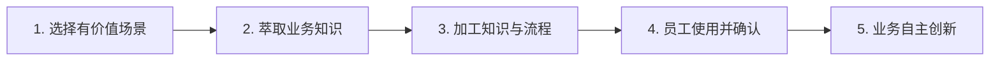

# CASE 14｜系统做出来之后，组织要接得住

**行业**：省属国企电商业务　 **学习主题**：流程执行与采用　 **共学时间**：约10分钟

## 一句话简介

FDE团队帮一家做多品类电商的国企解决业务越来越多、专家经验留不下来、建了AI平台大家却不常用的问题，改成和业务、人力部门一起拆具体岗位流程，先让AI辅助审合同、再带员工自己做小工具，让原本两人的法务团队承接了原计划还需招人的工作，也开始出现员工主动开发应用的变化。

[返回目录](../README.md) · [本例JSON](case.json) · [完整访谈](#full-interview) · [原PDF](../../sources/original-interviews.pdf#page=138)

原题：从技术交付到业务自驱：FDE用AI推动国企工作流程真正落地

来源范围：PDF物理页 138–147；书内页码 137–146。

**本例值得讨论的判断（编辑提炼）**：从IT交付转向业务与人事共同推动采用。

> 阅读提示：标为“访谈概括”的内容来自受访者陈述；“补充分析”是编辑解释；“迁移演练”是迁移假设。效果数字保留原文的试点、目标、估算和脱敏条件。前半部用于备课和学习，后半部完整保留原访谈。

## 1. 业务现场与行业特点

### 发生了什么｜访谈概括

客户是省属国企的一级子公司，经营服装、美妆、3C等十多条电商业务线，已有OA、ERP和数据中台，IT基础较好。业务增长但编制受约束，法务只有两人，需要持续处理越来越多合同，因此问题不是有没有软件，而是现有人员如何承接变化。

公司留存了不少最终文件，却不一定保存专家为什么这样修改、什么情形需要例外处理、如何判断风险。这些隐性知识缺失，使通用知识库和Agent难以自然接住实际工作；某些业务数据也并未因为有中台就自动具备。

关键现场事实：

- 省属国企一级子公司，十多个电商业务线
- 已有OA、ERP、数据中台与信息化部门
- 编制约束下业务增长，2名法务承接大量合同

**原工作路径**：专业人员凭经验 → 传统系统记录结果 → IT搭AI技术底座 → 员工并未真正采用

**重新定义的问题**：最初技术方案能做，却未改变工作；关键经验、流程例外与参与动力没有进入系统。

依据：[原PDF物理页 139、140、141](../../sources/original-interviews.pdf#page=139)；需要核实具体说法请查看[完整访谈](#full-interview)。

扩充段落主要参照：[Q1](#q1)、[Q2](#q2)；原PDF物理页 138–147。

### 为什么需要FDE｜补充分析

综合电商组织横跨多个专业岗位，技术能力与日常流程之间常隔着知识表达、岗位责任和使用习惯。FDE既要把业务判断提取出来，也要让人员学会使用并愿意参与；采购平台或培训一次，都不能单独解决组织采用的问题。

数字底座完整不等于经验已结构化；知识贡献、岗位责任和激励决定系统是否被使用。

FDE需补知识萃取、培训、组织协调，并让业务自己获得使用与改造AI的能力。

## 2. 解决思路怎样形成

### 从调研到方案的过程｜访谈概括

项目早期由IT推动模型、知识库和Agent等技术基础，但实际使用不足。团队随后把重心转向具体业务价值与实现条件，逐项选择值得做且资料、人员配合能够支撑的场景，避免仅从工具能力出发罗列应用。

知识萃取成为重要工作：通过访谈和流程梳理，追问人员怎样处理、为什么这样处理、哪些情况例外、哪里必须人工确认。法务场景利用历史合同和业务上下文提示条款与风险，再由法务完成专业确认。

服务持续约两年，组织推进逐渐让人力部门参与并在第二年牵头，结合培训、角色和激励推动使用。培训后，一位行政员工还自行开发了办公用品库存查询与通知工具，通过IM和MCP连接数据中台，体现员工开始主动把AI用于自己的工作。

| 现场信号 | 形成的决定 |
|---|---|
| 技术底座搭好，员工没用 | 改为价值/可行性筛选，回到真实岗位 |
| 合同只留修改结果，不留理由 | 引入知识萃取师，把判断、例外和步骤说清 |
| 业务骨干缺AI基础和参与动力 | 增加通识培训与人事参与，让员工成为共建者 |

依据：[原PDF物理页 141、142、145](../../sources/original-interviews.pdf#page=141)；需要核实具体说法请查看[完整访谈](#full-interview)。

扩充段落主要参照：[Q3](#q3)、[Q5](#q5)、[Q6](#q6)；原PDF物理页 138–147。

### 这些取舍为什么重要｜补充分析

岗位赋能与人员替代的表述会影响协作。该项目强调AI辅助人员，使业务愿意提供经验并继续确认结果；若员工只看到岗位威胁，最有价值的例外知识和真实反馈反而可能拿不到。

技术基础、知识萃取与组织机制要相互配合。数据中台能提供接口，却不会自动补齐尚未记录的业务信息；人力部门能推动培训和激励，也不能替代具体工具的可用性。FDE需要让每一环都有明确的责任人和产出。

## 3. 工作流程与人机分工

以下流程图和职责划分是依据访谈所作的业务抽象，不补造未披露的技术架构。



| 步骤 | 实际作用 |
|---|---|
| 1. 选择有价值场景 | 兼顾可行性和资源 |
| 2. 萃取业务知识 | 做法、原因、例外、人工边界 |
| 3. 加工知识与流程 | 知识库、RAG、Agent工作流 |
| 4. 员工使用并确认 | AI做初筛，人确认与签字 |
| 5. 业务自主创新 | 培训后员工利用平台自行搭应用 |

| 角色 | 负责什么 |
|---|---|
| AI | 合同筛查与岗位重复性辅助 |
| 系统 | 既有数据中台、MCP与工作流平台 |
| 人 | 业务确认责任；人事/管理者推动参与 |

依据：[原PDF物理页 141、142、143、144](../../sources/original-interviews.pdf#page=141)；需要核实具体说法请查看[完整访谈](#full-interview)。

## 4. 交付物、实际使用与组织采用

### 交付后怎样工作｜访谈概括

法务先查看AI辅助识别的合同问题，再结合实际业务决定如何修改和确认。交付围绕公司的真实合同和处理流程展开，保留专业责任，不把模型建议当作自动生效的法律决定。

行政小工具让员工查询电池等办公用品库存，缺货时通知行政、补货后再通知需要的人。这个例子的金额价值未必大，但它展示了另一类交付成果：内部人员获得识别需求、连接数据和制作小应用的能力。

| 交付物 | 交付内容 |
|---|---|
| 法务助手 | 结合历史合同和业务信息标记关键条款与风险 |
| 知识萃取与培训 | 技术建设与组织能力建设共同推进 |
| 自主应用样例 | 行政员工自行做库存查询与补货提醒Agent |

### 实施与推广｜访谈概括

受访者总结两年服务：第一年IT牵头，后续增加人事牵头培训；团队分工覆盖咨询、萃取、培训和开发。

推进过程包含持续业务服务、员工培训与组织协作，部分人员最初甚至不熟悉如何写提示词。团队通过具体场景引导，逐步从外部帮助开发走向内部员工主动尝试，而非假定培训结束后大家就能自行做好全部应用。

依据：[原PDF物理页 143、144、145、146](../../sources/original-interviews.pdf#page=143)；需要核实具体说法请查看[完整访谈](#full-interview)。

扩充段落主要参照：[Q3](#q3)、[Q4](#q4)、[Q5](#q5)；原PDF物理页 138–147。

## 5. 实际成效与证据边界

### 原文报告的变化

| 指标 | 原来或参照 | 后来或状态 | 必须保留的限定 |
|---|---|---|---|
| 法务承载 | 原拟再招至少1人 | 2人继续支撑业务 | 受访者称避免新增编制；金额未披露 |
| 自主解决问题 | 提IT需求等排期 | 行政员工自建小工具 | 体现能力采用，不代表人人可独立开发 |
| 落地关键变化 | 技术项目 | 组织共同推动 | 未披露整体ROI或使用率 |

### 如何理解效果｜补充分析

访谈称原来至少打算再招一位法务，使用AI后现有两人能够承接工作。这是避免新增用工的业务描述，缺少工时、业务难度和审计成本数据，不能直接推算精确年度节省。行政工具是内部自主开发的实例，也不代表所有员工都已具备同等能力。

**证据边界**：避免招聘是访谈估算，不能当作已审计现金节约；行政工具与法务是不同子场景。

依据：[原PDF物理页 143、144、145](../../sources/original-interviews.pdf#page=143)；需要核实具体说法请查看[完整访谈](#full-interview)。

## 6. 难点、应对与可复用经验

| 难点 | 原文中的应对 |
|---|---|
| 员工不愿交出经验 | 助手定位，配合岗位发展与激励 |
| IT无法独自推动变革 | 让人事和业务负责人共同参与 |
| 有中台但知识仍缺失 | 评估流程可萃取性与数据成熟度 |

依据：[原PDF物理页 143、144、145](../../sources/original-interviews.pdf#page=143)；需要核实具体说法请查看[完整访谈](#full-interview)。

**可复用的方法（编辑归纳）**：结合第2节的关键取舍，关注真实任务如何被重新定义、可交付结果由谁确认，以及组织如何继续使用和修改。原受访者的全部经验保留在[Q6](#q6)。

## 7. 迁移到其他工作场景的讨论｜4分钟

以下是通用研发场景中的假设练习，不代表案例客户或任何学习者所在组织已经开展或验证了这些项目。

某机构买了科研平台却使用不足，专家不愿整理流程，IT也难推动科研团队。

**讨论问题**：平台上线后无人使用，应该继续加功能，还是调整组织推进方式？

**本组应交出的产物**：列出科学家、业务负责人、IT与人事各自的一个责任和可见收益。

个人思考40秒 → 小组讨论100秒 → 共识与质疑70秒 → 主持人收束30秒。

<details>
<summary>展开：迁移试点、验收与主持人参考</summary>

研发团队可把专家经验萃取用于科研项目评审、实验方案检查或交付审核，重点记录为什么接受某个结果、什么条件下必须复核、哪些例外曾改变结论；先由专家确认这些判断，再让工具承担资料整理和初步检查。

内部学习可以设置一个岗位小应用作业，让研究员、项目经理或行政人员挑选自己的真实重复工作，明确输入、工具权限和验收人。评价既看应用是否被持续使用，也看成员是否学会从业务问题形成可执行方案。

**建议切口**：选业务带头人共同设计任务；以培训和知识贡献机制把专家、使用者与IT接起来。

**建议验收**：建议验收：持续使用、专家参与、业务自建/维护流程的数量与质量。

**适用限制**：自主搭建仍需要科学与工程评审；提升参与意愿不能代替质量和权限治理。

**主持人参考**：参考：先检查真实任务、使用门槛与参与动力；让业务承担结果，技术承担可靠能力。

</details>

可以直接对Codex说：

```text
请带我学习案例14。先讲清项目做了什么，再用一个关键问题让我做判断。
讲事实时引用原PDF页码；讨论迁移方案时明确标为假设。
```

## 8. 原图与受访者介绍

[查看原案例封面与受访者介绍](../../assets/cover_138.png)。人物姓名、职位及图片内文字以原PDF为准。

本例没有单独提取出的正文图片；封面、图内文字与全部页面仍保存在原PDF。上方流程图是编辑抽象。

<a id="full-interview"></a>

## 9. 完整原始访谈

以下6组问答逐段保留原PDF文字层的原始提取内容。原有换行、术语或转义保留，不以编辑详解替代原文。文字层未包含的图片信息，请查看上方原图及[完整PDF第138–147页](../../sources/original-interviews.pdf#page=138)。

<details>
<summary>展开全部访谈：Q1–Q6</summary>

<a id="q1"></a>

### Q1

Q1：作为FDE，你应用AI的具体场景是什么？在这个场景下遇到
的具体问题长什么样？
我这个案例的客户，是一家省属国企一级子公司，业务覆盖服装、美妆、3C等十多个电
商业务线，已经完成了比较扎实的数字化建设，有OA、ERP、数据中台，也有自己的信
息化部门。
管理层在GPT等大模型出现之后提出了一个很模糊的要求：既然公司的数字化建设在国
企中已经领先，能不能再往AI走一步？
如果只听这句话，你可能会觉得这不过是一次常见的“企业上AI”项目。但我们真正进入
现场以后，发现这其实不是一个技术问题。
业务在增长，但国企有编制限制，人员并不能跟着业务无限增加。真正懂电商、懂业务
的人才也不一定愿意进入国企来从事这方面的工作。所以第一个真实问题其实是：业务
要扩张，团队能力却很难同步扩张，怎么办？
第二个问题来自内部管理。国企的合规要求严格，业务越多，法务、财务、纪检等内控
岗位的压力就越大。比如法务团队只有两个人，却要面对不同业务线、不同合作伙伴的
大量合同。很多事情不能简单靠增加人手解决，因为真正懂业务的外部律师也不好找。
所以我们后来复盘的时候发现，客户说的“AI化”，背后至少有几个真实需求：业务增长
之后如何提效，专业岗位如何承接更多工作，以及企业里大量依赖个人经验的工作，能
不能变成一种可复用的能力。
这里面最重要的一步，是把表层需求和真实需求区分开。
高层不会直接告诉你：“我希望法务少招一个人”，“我希望员工的重复劳动减少”。他
只会说：“我们要拥抱AI。”FDE真正要做的，是进入业务现场以后继续往下问：做什
么？为什么现在要做？哪个环节最痛？这个痛点究竟是人不够、流程不清、数据没有沉
淀，还是组织机制的问题？
我后来逐渐明确的一点是：先把客户真正的问题找出来，再决定做什么。

<a id="q2"></a>

### Q2

Q2：在你参与之前，这个问题过去是怎么解决的？
传统企业的软件交付是这么做的：企业有一套相对成熟的软件和流程，技术团队根据客
户的实际情况做配置、开发和定制。简单的就配置一下，复杂一点就开发模块。再复杂
一点的就要先做咨询，把企业的业务流程梳理清楚以后再交付系统。
这套方式过去完全能跑通，但它的前提是软件行业几十年的最佳实践，能被信息化覆盖
的业务部分，是能被讲清楚、流程相对固定。而企业落地AI的真正难点，恰恰藏在“几
十年的最佳实践”这里。
很多企业知识根本没有被沉淀，被结构化。比如法务以前审核过很多合同，但最终只留
下了一份修改后的合同，中间为什么修改、哪些条款是关键、哪些地方不能省，可能都
在法务脑子里。客服也是一样，员工可能已经在脑子里形成了一套知识体系，但这些知
识并没有真正沉淀到AI可以使用的数据系统中。
流程也是同样的问题。一个人把一件事情做了几年之后，会觉得很多步骤“理所当
然”，甚至意识不到自己其实是在执行一套复杂流程。可对于AI来说，这些步骤如果不
被明确梳理出来，大模型就只能自己“生成”。
所以传统方式的真正问题，到业务规模变大、流程越来越复杂以后才暴露出来：靠人、
靠经验、靠传统软件定制的方式，开始越来越难继续扩张。

<a id="q3"></a>

### Q3

Q3：后来你使用AI解决这个问题的整体思路和关键步骤是什
么？
我们其实是边做边调整的。
最开始进入这家企业，我们也先按传统思路来：以技术人员为主，把技术底座搭起来。
当时我们认为，只要把知识库、模型能力、Agent这些东西搭起来，再接到客户已有的
信息化系统里，AI就能够逐渐进入业务。
技术上确实能做出东西，但做到一定程度以后，我们发现不对。系统有了，客户的员工
没有用起来，业务并没有真的发生变化。真正难的其实是业务知识、数据、流程和人的
问题，技术只是其中一部分。
所以我们的做法后来逐渐变成了几个层次。
第一步，先判断这个场景到底值不值得做。
我们不会再看到一个问题就马上做Agent。而是逐渐形成了一个基本判断：一个场景首
先要看价值和可行性。有些事情技术上目前做不好，就不要硬做；还有一些事情虽然技
术上能做，但实际价值太低，也没有必要做。
这个判断帮我们避免了很多“做出来没人用”的玩具。随着这套框架逐渐形成，团队现
在会先判断场景有没有真正的价值，再决定是不是投入。
第二步，把业务知识真正“挖”出来。
我们发现，单靠技术人员不够。
因为我们虽然懂AI，但不一定懂客户的美妆批发业务，也不一定知道这个企业具体怎么
做合同、怎么审批、怎么管理业务的。所以我们引入了“知识萃取师”这个角色。
知识萃取师和传统咨询不太一样。传统咨询往往有行业案例和成熟模板，可以拿一套方
法去判断客户应该在哪个环节提效。但我们需要的是把客户自己脑子里的知识和经验真
正萃取出来。
因为企业最了解自己的业务。外部的人即使懂这个行业，也未必知道这家公司为什么这
么做。
所以我们开始要求业务人员把原来的工作过程讲出来，到底怎么做、为什么这么做、哪
些情况例外、什么情况下必须人工判断。
这个过程本质上是在给AI准备“业务世界”。
第三步，把隐性的知识和流程变成AI能够理解的东西。
有了知识以后，才谈得上知识库、RAG、Agent和工作流。
我们会去做知识加工、知识库管理，把原本散落在文档和人员经验里的内容沉淀下来；
同时把一个岗位原来依赖经验完成的工作拆成明确流程。
因为通用LLM模型的本质是概率生成（这也是幻觉的来源），它对A公司的电商流程理解
正确，并不意味着对B公司的流程也正确。所以真正进入企业以后，我们不能简单地告
诉模型：“你自己理解一下这个业务然后去做。”
流程必须来自企业自己。后来我们会特别强调“先梳理流程，再做Agent”。
第四步，让员工真正学会用AI。
这是我们最大的一个转变。
最开始我们以为，董事长要求业务骨干来配合项目，找几个人就可以开始做。结果员工
来了以后，我们发现他们可能连提示词是什么都不知道。你让他配合知识萃取，他甚至
不知道应该提供什么。
所以我们又增加了培训。与其项目组每个人一点点教，不如直接给相关部门做AI通识培
训，让业务人员具备基本的AI认知，具备组织向AI协同转型的认知。
正是这个原因，我们一方面是“IT部门牵头的技术项目”，另一方面是“人事部门牵头的
组织转型项目”。
第五步，让AI成为员工的助手。
这是进入大企业以后非常重要的一件事。我们在员工面前从来不强调“AI替代人”。
一方面，有些业务涉及法务、财务等责任问题，AI最终不能承担责任，所以真正进入工
作流的Agent，大部分最终都需要人确认。
另一方面，这也是一个组织问题。如果员工觉得：“你让我把我的知识全部交出来，然
后AI把我的工作替代掉，那我为什么要配合？”那整个项目从一开始就会产生阻力。
所以我们设计的时候，会让AI负责大量重复工作，但最终仍然由人确认、签字和承担责
任。这样既保证了业务安全，也让员工清楚地知道，AI是帮自己分担重复工作的助手。

<a id="q4"></a>

### Q4

Q4：相比传统方式，使用AI后的实际效果如何？
这个项目让我比较深的一个感受是，AI落地的效果，不一定都应该用“节省了多少人”来
衡量。
当然，有些场景可以量化。比如在法务场景里，我们帮助企业根据历史合同和业务信息
去识别关键条款、发现风险，再交给法务最终确认。
原来法务需要从头到尾自己看，现在AI可以先帮他做一轮筛查，把需要重点关注的内容
挑出来。
客户原本至少还还要招一个法务，因为有了AI法务助手，这个招聘的编制就节省下来
了。并且目前两个法务工作状态也比较正常。如果一定要用人数去折算，那就是一人年
的综合成本。
但我觉得更有价值的，其实是另一种变化。
我们做过一个很小的行政场景。企业里有办公用品自助柜，员工可以刷工牌领取电池、
笔、本子等办公用品。自助柜方便了员工，却给行政人员增加了补货管理的工作。
员工到了柜子前发现电池没了，只能发消息给行政人员。行政人员什么时候看到、什么
时候补货，也不确定。
这个事情当然可以用传统软件解决。我们完全可以在OA里做一个页面或者弹窗。但真正
有意思的事情是，这个小工具是负责行政物品的同事自己通过AI提示词做的。
在我们全员培训以后，他发现了自己工作中的这个需求，然后通过AI平台，基于数据中
台的MCP能力，用提示词做一个简单的Agent。员工可以在IM上直接问机器人：“我今
天要领两节电池，还有没有？”系统去查库存；库存不足时，就提醒行政人员补货。补
货完成后发送信息给需要电池的员工。
这个工具本身的业务价值并不大，但它让我们觉得特别重要，有一种特别的含义。
以前这位同事遇到这个问题，需要要找IT部门提需求、排期、开发、内部结算工时。现
在，他自己已经可以想“这个问题我能不能用AI解决？”
这时候，FDE交付的就多了一层意义：它在企业内部培养出了新的AI使用者，新的
FDE。
这可能比我们这些外部团队替他做一个Agent更重要。

<a id="q5"></a>

### Q5

Q5：在部署AI过程中，是否遇到了新问题或挑战？你是怎么解
决的？
我们踩过最大的坑，其实不在技术。
如果让我给企业AI落地的难度排个序，我现在的排序是：人最难，其次是组织，再是数
据，最后才是技术。以前总说万事俱备差个技术。现在技术反而是现在没有那么难的部
分。
第一个挑战，是业务人员不一定愿意把自己的知识变成组织资产。
尤其当员工觉得组织使用AI最终是为了替代自己时，他自然不会主动把自己的经验、流
程和知识全部告诉你。
所以我们必须从“替代”切换到“助手”，同时让企业的人事制度、激励机制跟上。
正因如此，我们后来一定要让人事部门参与进来。AI本身就是一个组织工程，需要企业
去思考：员工为什么愿意参与？AI帮员工完成重复工作之后，他接下来做什么？有没有
业务增长？有没有晋升路径？有没有新的激励？
第二个挑战，是技术部门牵头并不一定是最好的组织方式。
我们第一年就是IT部门牵头，技术底座也做出来了，但后来遇到了瓶颈。
因为AI真正深入业务以后，问题的重心从“系统怎么做”，转到了“员工怎么用”“流程
怎么改”“组织怎么配合”。
所以今年我们让人事部门牵头，从培训开始重新推进。
这个转变看起来有点反直觉，但恰恰是我们服务两年以后踩坑踩出来的经验。
第三个挑战，是数据并没有我们想象中那么完整。
这家企业是数字化基础很不错的代表，但仍然有大量业务没有结构化沉淀。很多新业
务、内控业务和人工操作环节，数据可能根本不存在；即使存在，也未必按照AI需要的
方式总结归纳。
所以不能因为客户有ERP、有数据中台，就默认它已经做好了AI的准备。
我们后来甚至开始尝试建立自己的企业AI成熟度模型，从流程能不能被萃取、数字化程
度怎么样、AI到底能实现到什么程度等维度，去判断一个场景适不适合做AI。
所以如今再去看一个AI项目，我会特别警惕两种极端：一种是客户觉得“AI什么都不能
干”；另一种是客户觉得“既然AI什么都能干”。
实际上，很多时候问题出在企业自己的流程没有梳理清楚、数据没有沉淀、组织机制也
没有准备好，AI能力本身反而是次要的。

<a id="q6"></a>

### Q6

Q6：根据你的经验，我们怎么才能更好地把AI部署到实际业务
中？
如果让我把这两年的经验压缩成几句话，我现在最看重的，其实是怎么把下面这几件事
做好，Agent本身反而排在后面。
第一，先判断问题，再选择AI。
不要为了AI而找场景。一个问题值不值得做，要同时看价值和可行性。技术做不到的不
要硬做，做出来没有价值的也不要做。
第二，先把业务流程讲清楚，再谈Agent。
很多人一上来就问：“这个场景能不能做个Agent？”我的答案通常是：先别急。
先问这个岗位到底是怎么工作的。把隐性的经验、判断和流程拆出来。因为企业里的很
多流程，业务人员自己已经习惯到感觉不到它存在了，但AI必须知道这些东西。
第三，不要把FDE简单理解成一个“产品经理\+全栈工程师”。
现在回头看，FDE真正的价值，是打通业务和技术之间的鸿沟。FDE可以是业务人员往
技术方向发展了一点，也可以是技术人员往业务方向走了一点。但这个岗位对于人的要
求其实很高。
以目前的现实来看，当前一个成熟的FDE交付团队，仍然需要分工。有人负责业务咨
询，有人负责知识萃取，有人负责培训，有人负责技术开发，各司其职。
第四，中大型企业的AI落地一定是一号位工程。
如果老板只是说一句“我们要AI化”，然后把事情扔给IT部门，最后很容易变成一个技术
项目，最后大概率面临失败。
但真正进入业务以后，人事、业务负责人、团队负责人甚至一号位都需要参与进来。因
为AI最终改变的，是组织的协作和工作方式。
第五，最终目标是让企业自己长出AI能力。
这是我现在觉得最有意思的变化。
我们做那个行政小工具的时候，真正产生价值的，是那个原本不懂技术的行政人员开始
意识到，我工作里遇到的问题，也可以自己用AI解决。
当企业员工开始主动发现问题、主动拆流程、主动用AI解决问题的时候，FDE才真正完
成了从“交付工具”到“改变组织能力”的转变。
所以如果让我重新定义FDE，我可能不会把它理解成“去客户现场帮他做AI的人”。
我更愿意把它理解成：进入业务现场，把企业真正的问题找出来，把AI嵌进真实工作
流，同时帮助客户逐渐获得自己解决问题的能力。
因为AI的技术门槛一定会越来越低。今天我们会写提示词、会搭Agent，可能是一种能
力优势；但过几年，AI会更成熟，企业员工自己都会用AI工具。
到那个时候，FDE真正留下来的竞争力，就是我比别人更懂你的业务，积累了更多真实
场景、流程、知识和交付经验，知道什么值得做、什么不值得做，以及怎么让一个AI能
力真正进入组织。
这也是我现在做企业AI落地时越来越看重的事情：技术会越来越普及，但对业务的理
解、长期的客户积累，以及把AI真正落到组织里的能力，反而会越来越重要。

</details>

[返回案例目录](../README.md) · [本例结构化数据](case.json)
