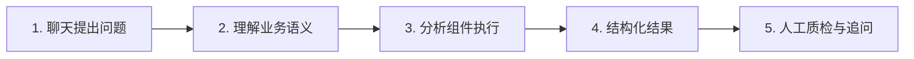

# CASE 16｜把会回答的Agent做成可靠系统

**行业**：电信网络分析　 **学习主题**：专业工具与计算　 **共学时间**：约10分钟

## 一句话简介

FDE团队帮一家美国大型电信运营商解决分析师查基站故障、反复写SQL和改报表很耗时的问题，把数据获取、分析和结果检查做成可反复使用的Agent系统，让员工继续通过聊天追问网络情况，很多原来按天做的分析可以先在几分钟到几小时内得到结果，再由分析师做最后确认。

[返回目录](../README.md) · [本例JSON](case.json) · [完整访谈](#full-interview) · [原PDF](../../sources/original-interviews.pdf#page=160)

原题：从人工分析到分钟级洞察：FDE用AI重构电信网络数据分析

来源范围：PDF物理页 160–168；书内页码 159–167。

**本例值得讨论的判断（编辑提炼）**：模型有随机性，业务结果仍需要可重复。

> 阅读提示：标为“访谈概括”的内容来自受访者陈述；“补充分析”是编辑解释；“迁移演练”是迁移假设。效果数字保留原文的试点、目标、估算和脱敏条件。前半部用于备课和学习，后半部完整保留原访谈。

## 1. 业务现场与行业特点

### 发生了什么｜访谈概括

客户需要持续回答哪个基站出了问题、原因和影响是什么等网络问题，手里已有大量网络数据与专业分析师。新的分析需求常要一到三人讨论、编写SQL，必要时建模，最后把结果整理给管理层，过程依赖人工并可能取错数据。

固定仪表盘能回答事先定义的问题，却难以承接管理者随时改变筛选条件和继续追问。客户也试过自行搭建Agent，但简单给模型一个数据分析师角色，并不能保证输出符合业务要求、重复运行时结果可靠。

关键现场事实：

- 受访者称客户为美国前三大电信运营商之一
- 分析基站故障、原因与影响，数据问题不断变化
- 原本由分析师写SQL、建模、整理管理报告

**原工作路径**：管理者提问题 → 分析师写SQL → 分析与建模 → 整理报告再追问

**重新定义的问题**：客户已有Agent，但一句“你是数据分析师”不足以保证正确、稳定且可规模运行。

依据：[原PDF物理页 161、162](../../sources/original-interviews.pdf#page=161)；需要核实具体说法请查看[完整访谈](#full-interview)。

扩充段落主要参照：[Q1](#q1)、[Q2](#q2)；原PDF物理页 160–168。

### 为什么需要FDE｜补充分析

网络分析的困难既来自数据规模，也来自问题不断变化和业务口径要求。交互式分析只有在数据对象、计算过程与输出含义可确认时才有价值；自然语言入口提升了便利性，同时要求后台更清楚地管理数据和分析责任。

仪表盘只覆盖预定义问题，现场分析需要追问；长SQL、语义歧义和并发成本影响可靠性。

要把输入、过程和输出拆成可检验组件，并同时处理语义、云端治理、成本与用户习惯。

## 2. 解决思路怎样形成

### 从调研到方案的过程｜访谈概括

FDE先明确输入、输出和中间处理，把原分析流程拆成组件，再为每一步选择合适的方法和结构。问题理解、网络数据处理、分析和结果组织需要共同满足客户要求，不能仅靠一次大模型调用承担全部过程。

系统按可重复运行的业务流程设计，逐步检查数据是否正确、分析是否可靠、输出结构是否合用，并关注同一数据下重复提问的稳定性。从用户角度是一位可对话的Agent，从交付角度则是可持续运行和监督的系统。

团队同时考虑几十到上百名分析师的使用条件，包括云端统一控制、监督、运行成本以及语义层和记忆等扩展能力。入口尽量适应既有习惯，最终让客户继续通过聊天使用，而不是要求每个人自行安装维护一套Agent。

| 现场信号 | 形成的决定 |
|---|---|
| 已有Agent能跑但答案不稳 | 按业务系统设计重复性与质量标准 |
| 分析师任务有连续组件 | 逐环节重组：输入数据、分析过程、结构化输出 |
| 每人装一个Agent难管理 | 考虑云端统一控制、监督、记忆与语义层 |

依据：[原PDF物理页 163、164](../../sources/original-interviews.pdf#page=163)；需要核实具体说法请查看[完整访谈](#full-interview)。

扩充段落主要参照：[Q3](#q3)、[Q5](#q5)、[Q6](#q6)；原PDF物理页 160–168。

### 这些取舍为什么重要｜补充分析

模型输出存在随机性，并不意味着相同业务数据可以任意给出不同结论。FDE需要让可确定的计算、数据选择和检查承担稳定性责任，把模型擅长的理解与组织能力放在可控制的流程里。

试用人数增加后，单次演示成功不再足够。每次分析的资源消耗、共享知识如何更新、异常怎样监督都影响长期采用；架构需要跟随真实使用规模设计，而不是让每个用户维护互不关联的工具。

## 3. 工作流程与人机分工

以下流程图和职责划分是依据访谈所作的业务抽象，不补造未披露的技术架构。



| 步骤 | 实际作用 |
|---|---|
| 1. 聊天提出问题 | 沿既有使用习惯继续追问 |
| 2. 理解业务语义 | 明确输入、数据范围和任务 |
| 3. 分析组件执行 | 数据处理、查询与分析 |
| 4. 结构化结果 | 符合客户约定的格式与质量 |
| 5. 人工质检与追问 | 确认结果；经验反哺系统 |

| 角色 | 负责什么 |
|---|---|
| AI | 理解问题、组织分析并支持连续追问 |
| 系统 | 组件、数据语义、统一管理与运行控制 |
| 人 | 分析师做最终质量确认和业务判断 |

依据：[原PDF物理页 163、164、165](../../sources/original-interviews.pdf#page=163)；需要核实具体说法请查看[完整访谈](#full-interview)。

## 4. 交付物、实际使用与组织采用

### 交付后怎样工作｜访谈概括

员工提出网络问题后，系统先组织一份较完整的分析结果，员工可改变条件继续追问，分析师再做质量确认和更需要经验的判断。交付关注持续分析过程，减少从零取数、整理和编写报告的重复工作。

可学习的交付要素包括组件化分析流程、结构化输出、统一运行与监督、成本控制和原有入口适配。访谈提到网页、Teams和Slack等可用接入方式，但没有证明本项目把所有这些渠道都实际部署了。

| 交付物 | 交付内容 |
|---|---|
| 可反复运行的Agent系统 | 客户看到聊天入口，背后是有结构的分析流程 |
| 统一治理架构 | 针对多用户的控制、监督与扩展考虑 |
| 结构化分析结果 | 让分析师从已有结果继续工作 |

### 实施与推广｜访谈概括

最终延续聊天交互；网页、Teams、Slack等为可能接入方式，原文未明确实际使用哪个。

原文把稳定性、准确性、成本和规模化列为主要挑战，并强调AI、数据、云与软件工程的综合能力。关于不同开发者调试花费几千美元或十几二十美元的说法是经验举例，不能列为该运营商项目已经测量的成本下降。

依据：[原PDF物理页 163、164、165](../../sources/original-interviews.pdf#page=163)；需要核实具体说法请查看[完整访谈](#full-interview)。

扩充段落主要参照：[Q3](#q3)、[Q4](#q4)、[Q5](#q5)；原PDF物理页 160–168。

## 5. 实际成效与证据边界

### 原文报告的变化

| 指标 | 原来或参照 | 后来或状态 | 必须保留的限定 |
|---|---|---|---|
| 新分析任务 | 按天、1–3人参与 | 很多任务分钟至小时级 | 任务范围不同，需人工最后确认 |
| 交互能力 | 静态报表 | 围绕数据持续追问 | 未披露错误率与一致性实测值 |
| 规模与成本 | 个人Agent难扩展 | 统一系统管理 | 几十/上百用户为架构考虑，非实际采用人数 |

### 如何理解效果｜补充分析

受访者称很多分析从按天缩短到分钟至小时，人工仍做最终质量确认，也减少了一些人工分析错误。原文没有统一任务集、错误率或覆盖率，不能把区间换算成精确倍数，更不能声称分析师被全部替代或所有问题都能分钟完成。

**证据边界**：调试“几千美元对十几美元”为经验举例；不是本项目成本或ROI测算。

依据：[原PDF物理页 164、165、166](../../sources/original-interviews.pdf#page=164)；需要核实具体说法请查看[完整访谈](#full-interview)。

## 6. 难点、应对与可复用经验

| 难点 | 原文中的应对 |
|---|---|
| 重复提问结果不一致 | 把随机性约束在系统流程里 |
| 调试与运行成本不可控 | 重视架构和工程能力，避免持续浪费 |
| 工具熟悉但业务不懂 | 从输入、输出和过程重新定义问题 |

依据：[原PDF物理页 164、165、166](../../sources/original-interviews.pdf#page=164)；需要核实具体说法请查看[完整访谈](#full-interview)。

**可复用的方法（编辑归纳）**：结合第2节的关键取舍，关注真实任务如何被重新定义、可交付结果由谁确认，以及组织如何继续使用和修改。原受访者的全部经验保留在[Q6](#q6)。

## 7. 迁移到其他工作场景的讨论｜4分钟

以下是通用研发场景中的假设练习，不代表案例客户或任何学习者所在组织已经开展或验证了这些项目。

某研发分析Agent对同一组计算结果，多次总结给出不同排名或解释。

**讨论问题**：同一数据重复问两遍得出不同结论，应先换模型还是查系统？

**本组应交出的产物**：设计一个包含固定输入、预期结果、过程记录和人工检查的回归样例。

个人思考40秒 → 小组讨论100秒 → 共识与质疑70秒 → 主持人收束30秒。

<details>
<summary>展开：迁移试点、验收与主持人参考</summary>

可将这一方法用于仿真运行、实验批次和计算资源的交互式分析。先选一个已有明确数据口径的问题，例如某类任务为何失败，再将取数、单位与计算检查、结果解释分工，让科研人员沿着证据继续追问。

试点准备固定问题与数据快照，检验重复运行是否得到一致数值、筛选条件是否正确、异常是否可定位，并记录人工复核时间与运行成本。只有结论可复核，聊天式体验才值得扩展到更多团队。

**建议切口**：固定数据快照与语义，数值计算交给确定性程序，输出结论连接证据与运行记录。

**建议验收**：建议验收：固定输入的数值一致性、查询正确率、成本/任务与并发稳定性。

**适用限制**：可重复不等于科学正确；还要检验数据质量、统计假设、模型适用范围与专家解释。

**主持人参考**：参考：依次定位语义、数据快照、查询、计算和生成差异；稳定数值与允许变化的表达分开。

</details>

可以直接对Codex说：

```text
请带我学习案例16。先讲清项目做了什么，再用一个关键问题让我做判断。
讲事实时引用原PDF页码；讨论迁移方案时明确标为假设。
```

## 8. 原图与受访者介绍

[查看原案例封面与受访者介绍](../../assets/cover_160.png)。人物姓名、职位及图片内文字以原PDF为准。

本例没有单独提取出的正文图片；封面、图内文字与全部页面仍保存在原PDF。上方流程图是编辑抽象。

<a id="full-interview"></a>

## 9. 完整原始访谈

以下6组问答逐段保留原PDF文字层的原始提取内容。原有换行、术语或转义保留，不以编辑详解替代原文。文字层未包含的图片信息，请查看上方原图及[完整PDF第160–168页](../../sources/original-interviews.pdf#page=160)。

<details>
<summary>展开全部访谈：Q1–Q6</summary>

<a id="q1"></a>

### Q1

Q1：作为FDE，你应用AI的具体场景是什么？在这个场景下遇到
的具体问题长什么样？
我做的这个案例，客户是一家美国前三大的电信运营商。我们面对的是他们非常日常的
一类工作：分析网络数据，回答网络到底发生了什么。
比如，一个很典型的问题就是：现在到底哪个基站坏了？为什么会坏？它的影响有多
大？
客户手里有大量网络数据，包括基站、网络等基础数据。过去，这些数据主要还是由数
据分析师、数据科学家人工处理。他们可能需要自己写SQL，甚至进一步建立机器学习
模型，从数据里寻找问题，再把分析结果整理出来，给经理或者管理层看。
这件事情真正麻烦的地方，在于分析这件事本身太依赖人工，而且问题永远在变化。
一方面，它非常耗时间。一个新的分析需求出来之后，可能需要一两个人，甚至两三个
人一起讨论、写SQL、分析数据，最后才能得到结果。
另一方面，它也存在人为错误。SQL一旦写到上百行甚至几百行，中间就可能出现问
题。我们在后来的项目中，就发现过一些看起来正确、实际上取错了数据的情况。
还有一个很重要的问题，是传统仪表盘很难真正满足这种需求。
因为领导或者分析师拿到一组数据之后，很自然会继续问：“那如果我把这批人筛出来
呢？”“如果换一个条件呢？”“这组数据到底意味着什么？”
仪表盘更适合回答预先定义好的问题，但现实中的数据分析往往是不断追问的。客户真
正需要的，其实是一种可以围绕数据持续追问的交互式分析方式，一个静态报表远远不
够。
所以从FDE的角度来看，我看到的问题在于：客户已经有数据、有分析师，也有很多AI
工具，但这些东西还没有真正组合成一个可靠的业务流程。
这也是为什么我会认为，Agent好不好做不是关键。真正难的是，你能不能把它做成一
个业务真正敢用、愿意持续用的东西。

<a id="q2"></a>

### Q2

Q2：在你参与之前，这个问题过去是怎么解决的？
平心而论，过去这套人工分析的办法是走得通的，也不能简单说传统方法“不好”。
最核心的方式就是人工分析。
分析师拿到数据以后，自己写SQL、跑模型、出报告。对于相对固定的问题，这种方式
其实很有效，而且分析师能够结合自己的业务经验判断结果。
后来客户也尝试过一些自动化方式。
比如，他们尝试通过仪表盘自动生成报告，希望减少人工工作；也尝试过直接用一些
Agent框架去解决问题。甚至在我们介入之前，他们自己已经搭过一个Agent。
但问题很快就暴露出来了。“能跑起来”和“可以生产使用”，是完全两回事。
客户自己做的Agent，可能就是给模型一个提示词：“你现在是一个数据分析师，我给
你这些数据，请帮我分析。”
看起来非常合理，但真正跑起来以后，结果往往并不令人满意。即使底层用的是很好的
模型，也不能保证最终输出符合业务要求。
更麻烦的是，有些方案把问题归结成“大模型本来就是不确定性的，所以答案不一样很
正常”。
我并不认同这种说法。
如果我是一个企业老板，我问一个Agent两遍“我们公司哪个班的成绩最好”，我希望它
在数据没有变化的情况下告诉我同一个人。模型本身具有随机性，不代表我们做出来的
业务系统就必须是不稳定的。
所以我们真正需要解决的，是怎么设计一个系统，让模型能够在业务流程里被可靠地使
用。

<a id="q3"></a>

### Q3

Q3：后来你使用AI解决这个问题的整体思路和关键步骤是什
么？
我做这个项目时，先做的第一件事是搞清楚三个问题：客户到底要什么输入？最后需要
什么输出？中间到底发生了什么？
因为如果这三个东西没有搞清楚，Agent写得再漂亮也没有意义。
第一步，重新梳理原来的分析流程。
我们把原来的数据分析过程拆成比较细的不同组件，再重新考虑每一个环节应该使用什
么方法、什么结构，最后再把这些组件重新组合起来，让整个Agent的输出尽可能达到
客户要求的结构和质量。
第二步，把Agent定位成一个可以反复运行的业务系统。
我们没有把它做成一个“会聊天的分析师”，而是把它当作一套业务系统来设计。
比如说，客户问一个网络问题，系统需要能够理解问题，然后处理对应的网络数据，再
进行分析，最后给出结构化结果。
这中间每一步都需要考虑：数据是不是对的？分析过程是不是可靠？输出格式是不是符
合要求？如果同一个问题重复执行，结果是不是稳定？
所以我们最终交付的，从客户角度看可以理解成“一个Agent”；但从我们的角度，它实
际上是一个可以被反复使用的Agent系统。
第三步，考虑如何让它可扩展。
客户往往有几十甚至上百个分析师。如果每个人都单独装一个Agent、单独维护一套东
西，这个方案很快就会失控。
所以我们还需要考虑如何把Agent放到云端，让它能够被统一控制、监督和使用，同时
让不同用户共同产生的数据和经验能够反过来提升系统，包括记忆、语义层等能力。
第四步，尽量不改变客户原来的工作习惯。
我并不认为AI落地一定意味着员工必须重新学习一套复杂的系统。
如果架构做得好，它完全可以嵌入原来的使用方式。客户原来怎么使用，就继续怎么使
用。可以通过网页应用，也可以通过Teams、Slack，或者其他已有的框架去调用。
在这个案例里，我们最后让客户继续以聊天的方式使用它。
这其实是我理解的FDE很重要的一点：想办法让AI进入客户已经存在的工作流。

<a id="q4"></a>

### Q4

Q4：相比传统方式，使用AI后的实际效果如何？
变化首先体现在时间尺度上。
以前一个新的数据分析问题出来以后，可能需要一个人甚至两三个人一起工作，而且是
按天计算。
现在很多分析可以在分钟到小时级别内跑完，先得到一份比较完整的数据分析结果，再
由人工做最后的质量确认。
我觉得这里不能简单理解成“AI替代了几个分析师”。
真正的价值在于，原来大量时间被消耗在重复的数据处理和分析过程中，现在这些工作
可以先由Agent完成。分析师不需要从零开始，可以站在AI已经完成的结果上继续判
断。
同时，AI系统还可以减少人工分析中一些容易出现的错误。
当然，我们并没有把人工审核彻底拿掉。因为企业真正需要的，是把人的时间从大量重
复劳动中释放出来，集中到更需要判断的地方。
另外一个效果，是交互方式发生了变化。
过去仪表盘更像是“我提前把问题定义好，然后给你看答案”；现在则可以围绕数据继
续追问。
这对于电信网络这种数据量大、问题变化快的业务来说，其实比单纯生成一张报表更有
价值。
而且从架构角度，我们交付的是一个可以长期运转的Agent系统，所以它的价值在于逐
渐进入客户日常的数据分析工作。

<a id="q5"></a>

### Q5

Q5：在部署AI过程中，是否遇到了新问题或挑战？你是怎么解
决的？
这个项目里最大的挑战，恰恰是很多AI演示不会暴露出来的东西：稳定性、准确性、成
本，以及规模化。
很多人做Agent，第一阶段很容易成功。你给它一个问题，它能回答；换一个问题，它
也能回答。于是大家会觉得这个东西已经做好了。
但一旦进入生产环境，问题就来了。比如，同一个问题反复问，答案是不是一致？数据
分析过程有没有出现错误？SQL有没有写错？如果用户数量从一个人变成几十上百个
人，成本还能不能接受？
这些问题，才是真正决定一个Agent能不能落地的地方。
第一个挑战，是稳定性与准确性。
稳定性尤其明显。前面说过，很多人把模型随机性当成“结果不稳定很正常”的借口。
但我们的做法，是通过系统设计，把这种随机性放进一个相对可控的业务流程里。就像
汽油本身不稳定，但汽车工程的意义，就是让汽油可以安全、稳定地驱动车辆。
第二个挑战，是成本。
成本是一个很现实的问题，包含多个层面，“调用模型多少钱”只是其中之一。
如果一个团队不知道怎么做Agent，可能为了调试一个东西花几千美元；但一个真正有
经验的人，可能用十几、二十美元级别的成本就能完成同样的调试。
而进入实际使用以后，还有长期运行成本。如果架构设计得不好，就像一辆漏油的车，
你根本不用谈省油，因为油一直在往下掉。
第三个挑战，是对客户业务的理解。
如果没有真正理解客户的业务问题，你可能一开始方向就错了。再加上如果对整个AI生
态、数据能力、云能力以及软件工程缺乏理解，就很容易出现“手里只有一把锤子，所
以什么问题都拿锤子解决”的情况。
所以我一直认为，真正能够做好这类工作的FDE，不应该只是懂某一个模型或者某一个
工具的人。

<a id="q6"></a>

### Q6

Q6：根据你的经验，我们怎么才能更好地把AI部署到实际业务
中？
关于怎么把AI部署到实际业务中，结合这次项目，我想强调几点。
第一，理解客户。
客户到底在解决什么问题？真正的痛点是什么？哪些东西值得自动化？哪些东西不应该
自动化？
如果这些问题没有搞清楚，后面的技术选择都没有意义。
第二，不能只懂一个AI工具。
我经常会说，如果你只知道自行车，那么你看到一个很远的地方，就只能想办法骑自行
车过去。
但如果你同时了解汽车、飞机以及其他交通工具，你才能真正判断什么场景应该用什么
工具。
对于企业AI也是一样。
你需要同时理解AI、数据、云，以及基本的软件工程能力。尤其是当你面对的是一个具
体业务问题时，你不能因为“我最熟悉这个工具”，就强行把问题往这个工具上套。
第三，不要把“能跑”当成“能落地”。
现在做一个Agent并不难，难的是把它做成生产就绪。
它要稳定，要可重复，要控制成本，还要能够进入客户原来的工作流。如果客户有几
十、上百个用户，还要考虑怎么统一管理、监督和迭代。
所以FDE的价值，在“把工具部署进去”之外。
如果是比较严格意义上的FDE，它既需要有扎实的技术能力，也需要对客户那些没有被
明确表达出来的需求保持敏感。技术能力和软能力，两方面缺一不可。
最后，不要迷信FDE这个名词。
现在国内把FDE这个概念讲得很宽，从AI咨询到方案设计，再到真正的部署，都有人称
自己为FDE。但无论叫什么，最终还是要回到一件事情：你有没有真正用过这些工具，
有没有在自己的场景里解决过问题。
以前Excel也有类似的“客户成功”或者技术支持角色，有人教你怎么用VBA、怎么把复
杂功能用起来。今天换成了Claude Code、Codex、Agent等新工具，本质上并没有发
生特别神秘的变化。
真正的区别，只是工具越来越复杂，而一个普通用户往往只会使用它最表层的功能。
一个真正懂这些工具的人，价值就在于把那些普通用户不知道的“下一层、再下一层”
能力带进实际工作里。
所以，用一句话来概括这次经验，我会说：FDE的使命，是把AI真正变成企业正在使用
的工作方式。

</details>

[返回案例目录](../README.md) · [本例结构化数据](case.json)
