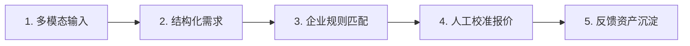
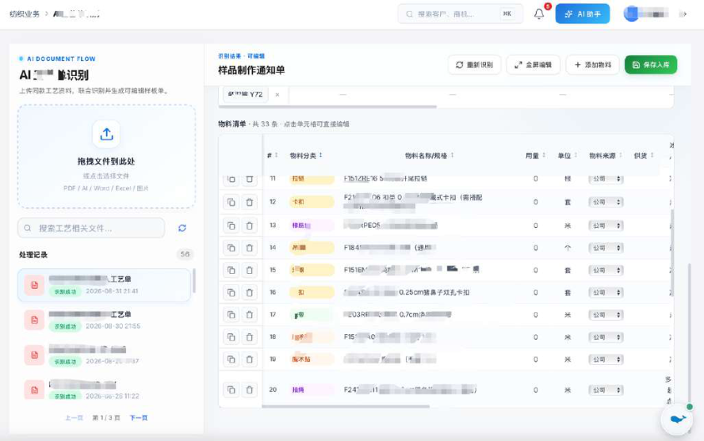
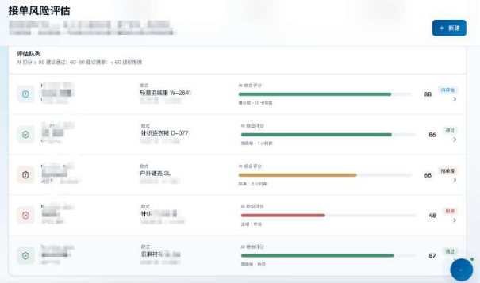
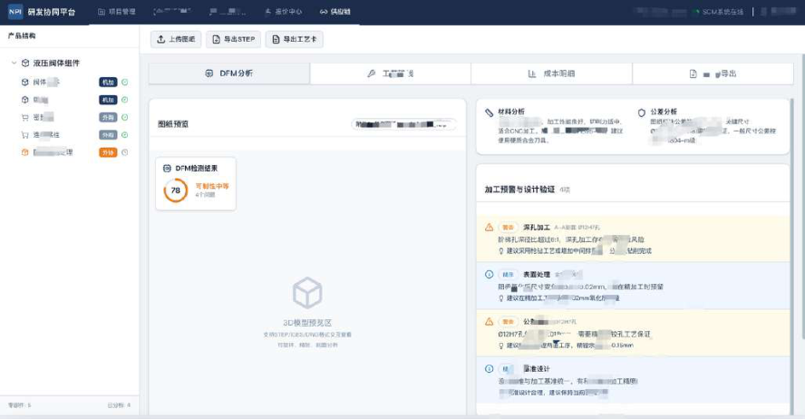
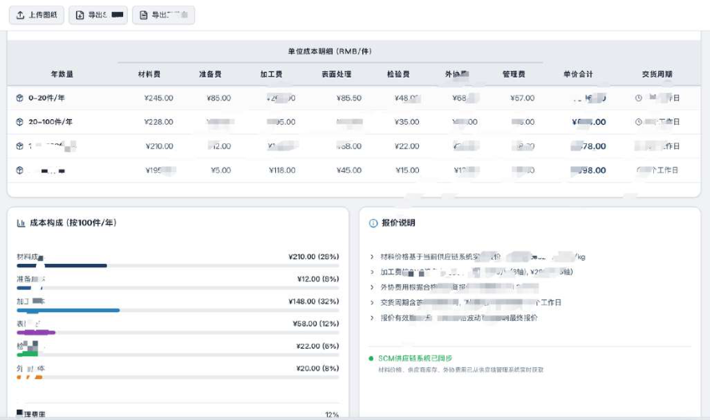
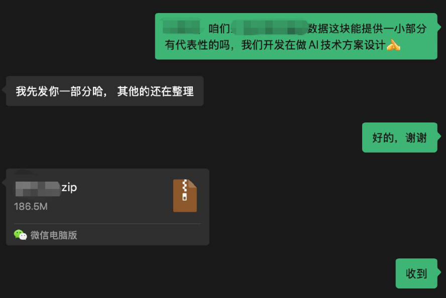

# CASE 17｜让非标报价回到企业真实成本

**行业**：非标柔性制造　 **学习主题**：专业工具与计算　 **共学时间**：约10分钟

## 一句话简介

FDE团队帮一家做非标制造的企业解决客户图纸一来就要等老师傅看需求、选工艺、算成本，报价慢又容易算偏的问题，让AI先把图纸信息整理出来，再按企业自己的物料、供应商和报价规则匹配，交给人校准后再对外报价；受访者称相关工作量减少了50%以上，员工腾出时间去跟客户和项目。

[返回目录](../README.md) · [本例JSON](case.json) · [完整访谈](#full-interview) · [原PDF](../../sources/original-interviews.pdf#page=169)

原题：从老师傅报价到AI深度协同：FDE用AI重构非标制造售前链路

来源范围：PDF物理页 169–180；书内页码 168–179。

**本例值得讨论的判断（编辑提炼）**：看懂图纸只是入口，可用报价来自企业自己的规则。

> 阅读提示：标为“访谈概括”的内容来自受访者陈述；“补充分析”是编辑解释；“迁移演练”是迁移假设。效果数字保留原文的试点、目标、估算和脱敏条件。前半部用于备课和学习，后半部完整保留原访谈。

## 1. 业务现场与行业特点

### 发生了什么｜访谈概括

客户约有两三百人，营业规模约一二十亿元，属于多品种、小批量的柔性制造。客户可能发来PDF、CAD或扫描件，企业要理解材料、尺寸、结构与性能要求，判断能否生产、选择工艺并估成本，才能给出报价。

报价链路占用稀缺的技术骨干：价格高可能丢单，价格低可能覆盖不了真实成本，等待过久同样可能错失订单。原有ERP和模板能处理标准字段，却无法完成把各类图纸转成内部生产语言的第一步，非标需求仍回到人工。

关键现场事实：

- 约200–300人，业务规模约10–20亿元
- 多品种、小批量，PDF/CAD等非标询价进入售前
- 图纸—研发—工艺—物料—成本—报价跨多角色

**原工作路径**：老师傅读图 → 拆需求定工艺 → 查物料和历史价 → 多人核对后报价

**重新定义的问题**：模板与ERP擅长已有字段，却解决不了非标输入；端到端直接出价容易偏离真实成本。

依据：[原PDF物理页 170、171、173](../../sources/original-interviews.pdf#page=170)；需要核实具体说法请查看[完整访谈](#full-interview)。

扩充段落主要参照：[Q1](#q1)、[Q2](#q2)；原PDF物理页 169–180。

### 为什么需要FDE｜补充分析

非标售前本身包含技术方案设计，价格只是末端输出。通用模型知道某种材料或工艺，并不代表知道这家企业的供应来源、成本结构和加工条件；FDE必须把客户输入连回企业实际可执行的生产与核价规则。

关键技术骨干既稀缺又被重复售前占用；报价太慢会丢单，太低会侵蚀利润。

需要还原车间与报价SOP、治理企业数据，并将人的校准变成后续可复用经验。

## 2. 解决思路怎样形成

### 从调研到方案的过程｜访谈概括

FDE到车间观察订单流转，翻历史报价单，分别询问业务人员与老师傅如何看图、拆需求、定物料、判工艺和交接。场景判断从知识工作密度、历史数据与明确瓶颈出发，再考虑AI能力能覆盖哪些环节。

起初尝试理解图纸后直接出价，但现场结果常与真实成本不符，因而调整为先抽取并结构化图纸信息，再匹配企业物料、供应商、历史数据和报价规则，每单经人工校准后才对外输出。

项目采用阶段性Demo澄清需求，先让关键人员用真实订单测试，再由业务小组试运行约一到两个月，边用边改，随后做部署、数据集成和培训。人工修改通过回填机制逐步沉淀到数据及相关知识设施中，使经验可以继续复用。

| 现场信号 | 形成的决定 |
|---|---|
| 车间走流程、翻历史报价、分别访谈 | 把“报价”重写为完整售前业务链 |
| 模型直接读图出价对不上真实成本 | 模型只先结构化，再匹配企业物料与报价规则 |
| 真实订单存在特殊标注与低清图纸 | 人工校准不确定字段，修改回填，再小范围推广 |

依据：[原PDF物理页 173、174、175、176](../../sources/original-interviews.pdf#page=173)；需要核实具体说法请查看[完整访谈](#full-interview)。

扩充段落主要参照：[Q3](#q3)、[Q5](#q5)、[Q6](#q6)；原PDF物理页 169–180。

### 这些取舍为什么重要｜补充分析

真实图纸中的手写标注、特殊符号和不清晰扫描会使字段识别出错，而尺寸错误可能直接影响成本。选择让人集中审核高不确定字段，是效率与准确性的实际取舍；不能用干净样例上的识别表现替代真实订单验收。

释放人力需要企业管理层参与。外部FDE无法独立决定岗位安排，项目在立项时就讨论节省时间的去向，企业后续调整职责与KPI，使人员更偏向客户和业务工作，这也是员工愿意参与校准与知识沉淀的条件。

## 3. 工作流程与人机分工

以下流程图和职责划分是依据访谈所作的业务抽象，不补造未披露的技术架构。



| 步骤 | 实际作用 |
|---|---|
| 1. 多模态输入 | PDF、CAD、扫描图及客户要求 |
| 2. 结构化需求 | 材料、尺寸、结构与性能字段 |
| 3. 企业规则匹配 | 物料、供应商、工艺与历史报价 |
| 4. 人工校准报价 | 每单校准后再对外输出 |
| 5. 反馈资产沉淀 | 修正回填；从关键人扩大到小组 |

| 角色 | 负责什么 |
|---|---|
| AI | 图纸信息抽取、匹配辅助和流程串联 |
| 系统 | 企业物料/供应商/成本规则与数据回填 |
| 人 | 确认尺寸、工艺与报价；安排岗位与KPI |

依据：[原PDF物理页 174、175、176](../../sources/original-interviews.pdf#page=174)；需要核实具体说法请查看[完整访谈](#full-interview)。

## 4. 交付物、实际使用与组织采用

### 交付后怎样工作｜访谈概括

业务人员拿到整理后的需求与报价依据，优先检查模型把握不足的图纸字段、物料匹配和成本判断，再形成可用报价。系统把重复识别、查找和整理向前承担，老师傅继续负责高价值的工艺、可行性和边界判断。

交付包括图纸信息结构化、企业规则与资料匹配、工艺及报价流程、人工校准和修正回填机制。原访谈还展示纺织与机加工等图例，它们有助于理解能力形态，但不能仅凭图例认定所有行业界面都部署在同一家客户。

| 交付物 | 交付内容 |
|---|---|
| 结构化图纸与工艺数据 | 为后续BOM、工艺与报价提供统一入口 |
| 研发协同与报价流程 | 结合企业自身规则形成可用的售前产物 |
| 校准与推广机制 | 真实订单试跑，修正沉淀为组织数据 |

### 实施与推广｜访谈概括

关键人→小组→真实订单→部门；试运行约1–2个月，初上线前两个月持续磨合。

上线初期约两个月仍在磨合和微调，数据清洗、结构化和还原老师傅判断依据占据大量工作。项目采用关键人、小组、部门逐步扩大的推广路径，是否能真正用于报价是阶段判断的重要依据。

依据：[原PDF物理页 171、172、175、176](../../sources/original-interviews.pdf#page=171)；需要核实具体说法请查看[完整访谈](#full-interview)。

扩充段落主要参照：[Q3](#q3)、[Q4](#q4)、[Q5](#q5)；原PDF物理页 169–180。

## 5. 实际成效与证据边界

### 原文报告的变化

| 指标 | 原来或参照 | 后来或状态 | 必须保留的限定 |
|---|---|---|---|
| 相关工作量 | 大量人工整理核对 | 受访者称减少50%以上 | 未披露任务样本与测量区间 |
| 参与人力 | 原需3–5人参与 | 重复劳动投入减少 | 不等于裁减人数；释放时间转向业务 |
| 方案质量 | 直接出价不可靠 | 回到企业规则＋人工校准 | 没有公开报价准确率或利润提升 |

### 如何理解效果｜补充分析

受访者称相关工作量至少减少50%，同时关注响应速度、报价可用性、图纸解析和经营价值。原文没有给出统一样本、报价误差或利润对照，因此这应标为访谈口径的工作量改善，不能改写为成本或利润改善50%，也不能把岗位举例当作已裁员人数。

**证据边界**：原图同时展示纺织与机加工应用示例；不把所有图片当作同一客户实绩。

依据：[原PDF物理页 176、177、178](../../sources/original-interviews.pdf#page=176)；需要核实具体说法请查看[完整访谈](#full-interview)。

## 6. 难点、应对与可复用经验

| 难点 | 原文中的应对 |
|---|---|
| 图纸识别达不到报价要求 | 只把握不足字段交人，修正回填 |
| 物料与历史价格不标准 | 数据清洗并还原老师傅的业务规则 |
| 岗位变化引发抵触 | 立项前对齐释放时间用途，管理者调整职责/KPI |

依据：[原PDF物理页 176、177、178](../../sources/original-interviews.pdf#page=176)；需要核实具体说法请查看[完整访谈](#full-interview)。

**可复用的方法（编辑归纳）**：结合第2节的关键取舍，关注真实任务如何被重新定义、可交付结果由谁确认，以及组织如何继续使用和修改。原受访者的全部经验保留在[Q6](#q6)。

## 7. 迁移到其他工作场景的讨论｜4分钟

以下是通用研发场景中的假设练习，不代表案例客户或任何学习者所在组织已经开展或验证了这些项目。

一个研发服务团队收到非标准材料研究需求，需要判断体系、目标性质、计算可行性、实验条件与报价。

**讨论问题**：客户要求自动报价，哪些信息足够清楚才可以对外给方案？

**本组应交出的产物**：写出研发售前必须确认的5个字段，以及一个必须转专家的条件。

个人思考40秒 → 小组讨论100秒 → 共识与质疑70秒 → 主持人收束30秒。

<details>
<summary>展开：迁移试点、验收与主持人参考</summary>

可将这一思路迁移到研发服务的售前方案与资源估算：先把客户研究目标、输入数据、验证要求和交付限制结构化，再匹配内部可用方法、算力、实验资源和历史项目，由专家确认技术可行性与承诺范围。

试点选择一组已完成项目回放，比较系统建议与当时的真实投入，记录偏差来自需求理解、方法选择还是资源估算。每次修正留下理由，让经验进入可复用规则，同时保留对新科学问题的人工判断。

**建议切口**：先把模糊需求结构化，再用自己的计算能力、实验资源、成本与交付规则生成方案草稿。

**建议验收**：建议验收：关键信息完整、工艺/方法可行、成本可解释、专家校准负担。

**适用限制**：模型不能凭通用知识承诺科学成功或价格；计算与实验资源、适用域必须逐项确认。

**主持人参考**：参考：体系、目标、输入数据、验证方式、交付边界/资源；超出方法适用域或实验条件不明时转人。

</details>

可以直接对Codex说：

```text
请带我学习案例17。先讲清项目做了什么，再用一个关键问题让我做判断。
讲事实时引用原PDF页码；讨论迁移方案时明确标为假设。
```

## 8. 原图与受访者介绍

[查看原案例封面与受访者介绍](../../assets/cover_169.png)。人物姓名、职位及图片内文字以原PDF为准。

### 原图 1｜原PDF第171页



[回到原PDF第171页](../../sources/original-interviews.pdf#page=171)

### 原图 2｜原PDF第171页



[回到原PDF第171页](../../sources/original-interviews.pdf#page=171)

### 原图 3｜原PDF第172页



[回到原PDF第172页](../../sources/original-interviews.pdf#page=172)

### 原图 4｜原PDF第172页



[回到原PDF第172页](../../sources/original-interviews.pdf#page=172)

### 原图 5｜原PDF第174页



[回到原PDF第174页](../../sources/original-interviews.pdf#page=174)

<a id="full-interview"></a>

## 9. 完整原始访谈

以下6组问答逐段保留原PDF文字层的原始提取内容。原有换行、术语或转义保留，不以编辑详解替代原文。文字层未包含的图片信息，请查看上方原图及[完整PDF第169–180页](../../sources/original-interviews.pdf#page=169)。

<details>
<summary>展开全部访谈：Q1–Q6</summary>

<a id="q1"></a>

### Q1

Q1：作为FDE，你应用AI的具体场景是什么？在这个场景下遇到
的具体问题长什么样？
我们这次选的是制造业里一个常见、却经常被低估的场景，非标产品的售前方案和报
价。
这家企业大概有两三百人，营业规模在一二十亿元左右，业务属于典型的柔性制造，多
品种、小批量，大量订单都是非标需求。它和标准品企业不一样，标准品有固定SKU和
价格，客户选完产品基本就知道多少钱；非标制造往往需要客户先发一张图纸，企业内
部再去判断这个东西要做成什么样、用什么材料、关键尺寸是多少、结构和性能有什么
要求、能不能生产、该用什么工艺、成本大概多少。
所以我一直觉得，这个场景只叫“报价”其实并不准确。更准确地说，它是一条完整的
链路，图纸解析、需求拆解、研发协同、生产方案、成本核算、报价。
举个具体的例子。客户可能要加工一个轴承零部件，发来的不一定是一份标准数据，可
能是PDF、CAD文件，也可能是其他不同形式的资料，里面写着材料、尺寸、关键部位
要求、结构要求等信息。过去企业需要有人把这些东西打开一项项看，再依靠专业经
验，把客户的语言转成企业内部能够生产的语言。
单独看，任何一个动作都不算复杂，真正麻烦的是整条链路非常依赖人。
首先，它占用核心技术骨干。真正懂工艺、懂材料、懂制造可行性的人，在制造企业里
通常比较稀缺，但大量非标订单进来以后，他们不得不花很多时间做售前方案、看图
纸、拆需求、估成本。
其次，报价准确率直接影响利润。价格报高了，订单可能丢掉；价格报低了，单子虽然
拿到，生产时才发现成本覆盖不住，利润空间被挤掉。
第三，还有一个经常被忽略的问题是响应速度。客户的询价不会一直等你，如果某个技
术骨干正好在忙，报价卡在那里几天，这个售前节点就可能直接卡死，最后订单流失。
我们选这个场景，并没有从“AI现在能识别图纸”出发。判断顺序正好反过来，一个场景
值不值得做AI改造，我通常先看三件事：有没有大量知识型工作，比如分析、判断、设
计和经验复用；有没有一定规模的历史数据可以使用；现有流程里有没有非常明确的效
率瓶颈。
如果只是简单的自动化流程或者需求价值不高的场景，我觉得根本没必要上AI。
图1：工单识别
图2：AI工艺单智能解析与BOM生成、接单风险预估（纺织行业）
图3：研发协同平台
图4：AI图纸智能解析与工艺路线生成、阶梯报价（机加工行业）

<a id="q2"></a>

### Q2

Q2：在你参与之前，这个问题过去是怎么解决的？
在AI介入之前，客户图纸过来以后，业务人员、技术人员或者企业里的老师傅打开文
件，根据自己的经验理解客户要求，再把信息整理出来，然后去查企业自己的物料、供
应商和历史价格。本质上，这是一个纯人工的信息理解、结构化和匹配过程。
之前没有成熟的多模态能力，很难让系统直接理解不同格式的图纸，也很难把大量非结
构化资料自动转成结构化信息。企业自己的知识同样不够标准，一个零部件为什么这样
报价，很多时候都写在老师傅脑子里，他清楚某个材料应该找哪个供应商，某种工艺大
概需要多少成本，什么情况下该给客户留一点余量。
企业过去也试过用系统把这件事接起来，早期上过ERP和报价模板，想用固定字段把报
价流程管起来。这类系统擅长的是“你把字段填进去，我按规则往下跑”，最难的第一
步，也就是把客户五花八门的输入理解成标准数据，始终没人解决。所以系统最后只能
覆盖标准件和固定SKU，非标部分照样回到人，模板反而多填一遍表。
问题真正爆发，是在业务规模和复杂度上升以后。订单越来越多，非标需求越来越多，
人的处理能力却不会同比增长。一个关键技术员一天能看的图纸、能处理的询价是有限
的，需求一来多，整个售前链路就开始排队。经验长期握在少数人手里，也意味着企业
很难把这种能力复制出去。
所以我们真正想解决的，是一个新问题：当业务规模继续扩大时，能不能不再靠增加更
多人、更多老师傅来撑住报价能力。报价能力，是影响一个制造业供应链企业生死存亡
的核心能力，关系到这个企业的响应速度、服务能力以及利润空间。

<a id="q3"></a>

### Q3

Q3：后来你使用AI解决这个问题的整体思路和关键步骤是什
么？
做这个项目，我没有拿着一个模型去问客户“这个模型能帮你干什么”，工作顺序一直
是反过来的，先理解业务，再拆流程，再判断哪些环节该用AI。
我们先去复现传统人工操作的业务流和数据流，通过还原实际SOP，结合AI大模型与
Agent编排能力，去梳理输出企业AI再造后的新业务流程。
FDE在这里更像一个连接器，一头听懂企业在说什么，一头清楚当前大模型、Agent和
各种AI工具能做到什么，再把两边拼成一个能落地的方案。
图5：客户沟通记录
第一步，是把“报价”重新拆成一条业务链路。
前期我们深入做了需求调研和业务调研。进场之后我先去了车间，看一个订单从图纸到
交付到底经过哪些环节，又翻了一批历史报价单，找业务人员和老师傅分别聊，问他们
拿到一张图纸后第一件事做什么，谁看图纸，谁做需求拆解，谁定物料，谁判工艺，谁
核成本，谁最后报价，不同角色之间怎么交接。只有把这些都搞清楚，才能知道AI应该
放在哪个位置。
第二步，是先解决非结构化信息的入口。
客户发来的图纸格式不统一，有的PDF、有的CAD，所以第一步要利用多模态能力，把
图纸里的材料、尺寸、结构要求等关键信息抽取出来。但我们的目标不止于“识别图
纸”，识别之后必须结构化，因为只有结构化以后，这些数据才能继续进入后面的业务
流程。
第三步，是让AI进入企业自己的业务规则。
这一步很关键。AI提取出客户需求之后，不能直接凭模型自己的知识报价格，企业内部
有自己的物料库、供应商体系和长期形成的报价逻辑，所以报价必须基于这家企业自己
的条件。我们会把结构化后的客户需求，与企业自己的物料、供应商、历史数据和报价
规则做匹配，再通过垂类Agent把这些环节串起来。这样出来的结果，才是企业真正可
以拿去用的报价。
这个设计也是调整出来的。一开始我们想得比较直接，觉得模型看懂图纸、抽取字段，
后面按规则一算就能出价。真正到现场跑起来才发现，端到端直接出价，出来的数字经
常对不上真实成本。所以我们改了方案，让模型先只负责把图纸信息结构化，报价环节
再回到企业自己的物料和规则库里做匹配，每一单都经过人工校准才对外输出。
第四步，是把老师傅的经验变成企业的数据资产。
企业原来的很多工艺知识都存在人脑里。AI介入之后，我们开始把这些知识逐步标准
化、流程化，哪些物料怎么映射，某类需求通常走什么工艺路线，报价时有哪些判断逻
辑，都可以逐步沉淀下来。同时我们设计了人工校准和回填机制，AI第一次给出的结果
不一定完全正确，业务人员会修改，修改完之后就把这次修改重新沉淀到数据、向量数
据库或者相关模型里。
这样就形成一个数据飞轮，AI生成、人工校准、数据回填、下一次结果更好。
第五步，是不等所有需求都搞清楚再开发。
前期调研不可避免，我们也会深入现场、开很多次会，但我一般不会等所有信息都完全
掌握之后，再关起门来做几个月。我的方式是边干边改，客户给我一部分输入，我就先
给他阶段性产出，可能是Demo、一个流程，也可能是某个功能，让他先看是不是这个
意思、这个东西到底能不能解决他的问题，客户反馈之后我们继续调整。整个过程中可
能来回几次，甚至十几次。
B端项目有一个很现实的问题，有时客户自己都不知道自己真正需要什么，FDE不能只记
录需求，还要不断拿阶段性结果去帮客户澄清需求。
第六步，是先让关键人试用，再逐步推广。
产品做到可以运行之后，我们不会马上让所有人用，先找关键人试，让最懂业务的人拿
真实订单跑，发现问题再修改；接下来再让一个业务小组试运行，这个阶段仍然不断收
集问题。这个项目里试运行周期大概是1到2个月，我们围绕几个真实订单不断验证，同
时继续调整需求。等到结果基本可用，再做部署、数据集成、启动会和全员培训，最后
逐步扩大到整个部门。
整个推广路径就是关键人试用、业务小组试点、真实订单验证、反馈调整、部门推广。
我认为这种方式比一次性开发完成再宣布上线可靠得多。

<a id="q4"></a>

### Q4

Q4：相比传统方式，使用AI后的实际效果如何？
这个项目刚上线的时候，并没有立刻达到理想状态，前两个月一直处在磨合和微调阶
段。因为我们最终看的，是这个结果能不能真正被企业拿去报价，模型能不能输出一个
结果反而是次要的。
目前来看，整体效果已经比较明显，至少能减少50%以上的相关工作量。但如果只把
“节省50%工作量”当成全部价值，还是低估了这个项目。
我们内部评估效果，会看几个层面。第一是响应速度，原来人工完成一套报价要多久，
现在通过这套流程要多久；第二是报价结果本身的可用性和准确率；第三是前面图纸解
析的准确率；最后还是要回到第四层，它到底给企业运营带来了多少价值。
这里发生了一个很有意思的变化。原来这项工作可能需要3到5个人参与，AI介入以后，
一部分重复劳动可以由系统完成，实际需要投入的人力明显减少。企业并没有简单地把
剩下的人裁掉，这家企业本身处在上升阶段，老板希望做的是把人的生产力释放出来。
原来业务人员很大一部分时间耗在看资料、整理需求、反复核对这些事情上，这部分时
间省下来之后，他们可以回到本来的业务工作，去联系更多客户、谈更多项目、接更多
订单。企业随后也会相应调整这些岗位的KPI和职责，让考核更偏向真正的业务价值。
所以我理解的降本增效，核心是原来5个人的大量时间被低价值重复劳动占用，现在把
其中一部分生产力释放出来，让人去做更需要判断、沟通和创造价值的事情。这才是AI
真正进入业务流程之后应该产生的变化。

<a id="q5"></a>

### Q5

Q5：在部署AI过程中，是否遇到了新问题或挑战？你是怎么解
决的？
这个项目真正困难的地方，我觉得不完全是技术。立项之前，能不能做、当前模型能力
到什么程度、有什么风险，我们一般会先判断。真正进入项目以后，遇到的坎主要有三
个，图纸识别能不能达到报价要求、企业的数据质量、以及组织里人的接受度。
第一个挑战，是图纸识别在真实场景里达不到报价的要求。
客户图纸远比想象中杂，有PDF、CAD，还有各种扫描件，清晰度参差不齐。模型在干
净样例上效果不错，一旦碰到手写标注、特殊符号、非标准图框，抽取字段就经常出
错。报价是要对外的，一个尺寸抽错会直接影响成本。我们的办法是给识别加一道人工
校准兜底，业务人员只审那些模型把握不大的字段，审完再把修正结果回填到模型和数
据里，识别准确率随着真实数据越滚越高，人工要审的部分越来越少。
第二个挑战，是企业的数据远没有想象中标准。
很多中小制造企业的数据基础比较薄弱，进去以后你会发现，各种资料、历史报价、物
料信息、供应商信息，很少能天然直接给AI使用，所以我们花了大量时间做数据清洗和
结构化。更麻烦的是，要从这些数据里重新还原企业真实的业务逻辑，这个物料为什么
这样映射，这种情况为什么这样报价，老师傅做这个判断到底依据什么。这些东西不解
决，模型再强也没用。
所以FDE在这里做的事情，其实很像经验复盘，要从企业现有的数据和人的经验里，把
那套真正运行多年的业务规则挖出来，再把它重新变成AI能用的东西。
第三个挑战，比数据更难，是人。
这是我现在做企业AI项目感受最深的一点。技术是相对静态的，人的反应是动态的。比
如一个岗位原来要3到5个人完成，现在老板说上AI以后可能只要1到2个人，员工第一反
应常常是担心自己是不是要被优化、系统上线以后还有没有位置、是不是要被调去不想
去的岗位，很少会先想到“这个系统真先进”。这种抵触非常真实。
而作为乙方，我们其实没有权力去安排甲方员工，甚至从员工视角看，我们做的事情本
身就威胁到他的岗位，他天然会对我们有抵触。所以这个问题靠FDE自己解决不了，企
业AI转型必须是一把手工程，老板必须真正认可，并且愿意自上而下推动。
这个项目里，我们会在立项前就和老板、项目相关方讨论生产力释放之后怎么办，方向
是让省下来的时间转向更有价值的业务，简单裁人从来不是选项。最终这家企业确实重
新调整了相关人员的工作安排和KPI。这件事让我更加确信，AI落地的最后一道关，往往
是组织架构的调整和转型。

<a id="q6"></a>

### Q6

Q6：根据你的经验，我们怎么才能更好地把AI部署到实际业务
中？
做了几个项目之后，我的一个坚定判断是，FDE真正的功课，是让AI变成企业业务的一
部分，把它装进企业只是开始。这里面有几条经验对我比较重要。
第一，判断场景，先看它卡住的是不是企业最稀缺的人。
选场景的起点应该是业务瓶颈，模型能力排在后面。报价这个场景之所以值得做，正因
为看图纸、拆需求这些重复劳动占满了老师傅和技术骨干的时间，而他们对工艺、材料
和可行性的判断，恰恰是企业最难复制的能力。
至于怎么筛，前面提过的三个条件，知识密集、有历史数据、瓶颈明确，缺一不可；用
普通自动化就能解决的事，也不必硬套AI。
第二，别只盯着一个AI功能，要看完整业务链路。
如果我们只做图纸识别，这个项目的价值其实很有限。识别只是入口，价值来自识别之
后那条已经拆开的链路能不能整体跑通。所以FDE要看的是端到端的业务流程，一个孤
立的模型节点撑不起业务价值。
第三，数据治理本身就是项目的一部分。
很多人觉得企业把数据准备好之后，我们再来做AI，现实里往往相反，尤其是中小企
业，进去之后很可能会发现数据本身就是乱的。所以数据清洗、结构化、业务规则还
原、经验沉淀，本身就是FDE必须参与的工作，把它当成前置准备工作会低估它的分
量。
第四，拿阶段性结果跟客户对话，小范围验证之后再推广。
B端客户很多时候并不知道自己到底需要什么，所以我习惯边干边改，快速做出一个阶
段性成果让客户看到，再通过真实反馈不断修正。这种方式看起来不够完美，其实更符
合真实业务。
落地上也一样，先找关键人和业务骨干用真实订单试，再让一个小组试，等结果稳定以
后再扩大到部门，这样既降低技术风险，也降低组织层面的阻力。
第五，AI转型必须是一把手工程。
企业AI落地不是交付一个软件就结束了，当AI真正开始改变业务流程，它一定会继续影
响岗位职责、KPI、部门协作甚至组织架构，这些事情不是一个乙方FDE能独立推动的，
老板必须站出来。
所以我理想中的FDE合作模式，是成为企业长期的转型合作伙伴，做完一个版本、上线
一个系统只是起点。今天解决报价，下一步可能解决生产，再下一步可能进入供应链、
销售或其他业务环节，一个场景一个场景地往前走，最后把整个业务闭环逐步重新设
计。
最终我们要实现的，是一种新的组织状态，AI去承担那些可以标准化、可以重复、可以
被数据化的工作，人重新回到判断、沟通、创造和业务增长上，这套系统只是载体。
我觉得这才是FDE真正应该推动的事情，把AI交付给企业只是过程，帮助企业重新设计
人与AI一起工作的方式才是目的。

</details>

[返回案例目录](../README.md) · [本例结构化数据](case.json)
