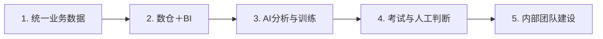

# CASE 18｜AI转型先补数据与团队基础

**行业**：生物科技销售经营　 **学习主题**：经营协同与价值　 **共学时间**：约10分钟

## 一句话简介

FDE团队帮一家生物科技公司的两百多人销售团队解决客户资料散在人手里、经营数据总是慢一拍、新人培训拖得久的问题，先补CRM和数据汇总，再做经营分析、AI陪练与考试，把新人培训从接近两个月缩到约三周，也减少了老销售筛简历和面试准备的重复工作；这次改造主要发生在销售管理环节。

[返回目录](../README.md) · [本例JSON](case.json) · [完整访谈](#full-interview) · [原PDF](../../sources/original-interviews.pdf#page=181)

原题：从纸质台账到AI经营：一家生物科技上市公司的0帧起手数智化

来源范围：PDF物理页 181–188；书内页码 180–187。

**本例值得讨论的判断（编辑提炼）**：公司是科研型，不代表每条业务线都已准备好AI。

> 阅读提示：标为“访谈概括”的内容来自受访者陈述；“补充分析”是编辑解释；“迁移演练”是迁移假设。效果数字保留原文的试点、目标、估算和脱敏条件。前半部用于备课和学习，后半部完整保留原访谈。

## 1. 业务现场与行业特点

### 发生了什么｜访谈概括

客户直销和渠道团队合计两百多人，销售要掌握行业规则、法律法规与大量专业话术，一线人员流动较高。客户关系散在个人手里，订单、绩效和提成靠Excel汇总，管理层看到销售大盘延迟一个月以上是常态。

公司有ERP和OA，但系统老旧、数据不通，不少关键资料仍在纸面或个人手中。新人培训接近两个月，招聘也需要老销售与HR投入；业务发展已经超过原有信息化和团队支持能力，单独增加一个聊天工具无法接住这些问题。

关键现场事实：

- 生物科技上市公司，直销＋渠道销售200多人
- 客户、订单、绩效分散；大盘延迟1个月以上常见
- 新人培训近2个月，老销售同时参与招聘

**原工作路径**：客户在个人手里 → Excel算业绩提成 → 人工整理经营报表 → 老带新与人工面试

**重新定义的问题**：销售离收入最近，但数据、系统与内部人员不足；直接上模型会缺少可用输入。

依据：[原PDF物理页 182、183](../../sources/original-interviews.pdf#page=182)；需要核实具体说法请查看[完整访谈](#full-interview)。

扩充段落主要参照：[Q1](#q1)、[Q2](#q2)；原PDF物理页 181–188。

### 为什么需要FDE｜补充分析

专业型销售既需要可信的经营数据，也需要人员掌握复杂业务知识。销售额与提成等确定性统计应有统一规则和系统基础，AI更适合在此之上整理沟通记录、辅助解释变化和陪练；这与直接让模型替代账目计算是不同的职责分配。

业务领先和数字化成熟不是一回事；经营分析依赖统一数据，培训效果依赖上岗标准与组织闭环。

FDE需要判断成熟度、选择CRM与数仓、重做培训闭环，并协助客户建立持续能力。

## 2. 解决思路怎样形成

### 从调研到方案的过程｜访谈概括

FDE逐部门访谈并观察现场台账和人工操作，从痛点、频次、人数、收入或成本影响及AI适配条件筛选场景。销售离收入近、问题集中，因此先做销售，同时接受其基础数据尚未准备好的现实。

团队先协助选购CRM，将客户、订单和绩效逐步汇入系统，再结合数仓与BI形成经营大盘。之后把销售日报、周报和拜访记录作为补充上下文，让AI帮助分析区域趋势和月度、季度变化原因。

培训最初仅考虑知识库，试用后发现还需连接考试、上岗标准和组织方式，于是改成AI陪练与电子化考试的学习流程。招聘端加入简历筛选、打分并试点自动化一面，同时建议企业建立内部AI团队，参与岗位招聘和框架建设。

| 现场信号 | 形成的决定 |
|---|---|
| 跨部门诊断，用模型筛优先场景 | 先从痛点集中且贴近收入的销售切入 |
| 提成本质是信息化和数据问题 | 先上CRM与数仓，BI算数，AI辅助解释 |
| 只有知识库不足以带新人上岗 | 改为AI陪练＋电子考试，并据通过情况优化 |

依据：[原PDF物理页 183、184、185](../../sources/original-interviews.pdf#page=183)；需要核实具体说法请查看[完整访谈](#full-interview)。

扩充段落主要参照：[Q3](#q3)、[Q5](#q5)、[Q6](#q6)；原PDF物理页 181–188。

### 这些取舍为什么重要｜补充分析

数据治理需要分阶段推进，不能等全部历史数据完美再开始，也不能忽略口径问题就直接展示AI分析。先让关键客户、订单和绩效数据可获取、可汇总，再逐步接入其他来源，是该案例的重要实施顺序。

经营归因与人员评价都要保留人的判断。过程记录可能帮助解释趋势，但模型给出的原因仍需业务核对；招聘筛选和打分是原项目做法，迁移时应额外明确岗位相关标准、人工复核与异议处理，不能将AI评分视为人员价值的最终结论。

## 3. 工作流程与人机分工

以下流程图和职责划分是依据访谈所作的业务抽象，不补造未披露的技术架构。



| 步骤 | 实际作用 |
|---|---|
| 1. 统一业务数据 | CRM沉淀客户、订单、绩效 |
| 2. 数仓＋BI | 汇总、统一口径与经营大盘 |
| 3. AI分析与训练 | 趋势解释，结合日报/拜访；陪练 |
| 4. 考试与人工判断 | 电子考试、上岗标准与专业确认 |
| 5. 内部团队建设 | 支持招聘和团队框架，持续推进 |

| 角色 | 负责什么 |
|---|---|
| AI | 非结构化记录分析、销售陪练与筛选辅助 |
| 系统 | CRM/BI确定性计算、数仓、学习考试 |
| 人 | 经营决策、上岗与招聘最终判断、组织建设 |

依据：[原PDF物理页 184、185、187](../../sources/original-interviews.pdf#page=184)；需要核实具体说法请查看[完整访谈](#full-interview)。

## 4. 交付物、实际使用与组织采用

### 交付后怎样工作｜访谈概括

管理者可结合销售数据与过程记录理解经营变化，新人通过练习和考试掌握业务，老销售减少一部分重复培训与招聘工作。CRM、数仓、BI与AI各自承担适合的任务，系统逐步形成支撑经营和人员成长的工作方式。

交付还包含内部能力建设：企业拿出20个编制，FDE参与招聘和团队搭建，让后续应用与维护逐渐有内部承担者。访谈没有确认20人均已到岗，也没有证明行业小模型等后续设想全部完成。

| 交付物 | 交付内容 |
|---|---|
| CRM＋数仓＋BI基础 | 销售数据先可获取、汇总和使用 |
| 销售训练与招聘应用 | AI陪练、电子考试；简历筛选及一面试点 |
| 内部能力建设 | 企业提出20个编制，FDE参与招聘与框架搭建 |

### 实施与推广｜访谈概括

分阶段接入最关键数据，再扩展；同时对齐高层目标、中层岗位安排与一线参与动力。

项目同时推进数据清理、业务流程、组织认知与职责调整。高层先说明转型目的，中层解释岗位将如何变化，员工才能看到工具帮助自己减少低价值工作；工具上线而职责、考核不变，会影响持续使用。

依据：[原PDF物理页 184、185、187](../../sources/original-interviews.pdf#page=184)；需要核实具体说法请查看[完整访谈](#full-interview)。

扩充段落主要参照：[Q3](#q3)、[Q4](#q4)、[Q5](#q5)；原PDF物理页 181–188。

## 5. 实际成效与证据边界

### 原文报告的变化

| 指标 | 原来或参照 | 后来或状态 | 必须保留的限定 |
|---|---|---|---|
| 新人培训 | 接近2个月 | 约3周 | 访谈陈述；需结合上岗合格标准理解 |
| 老销售招聘投入 | 每月约3–4个人天 | 受访者称基本可省 | 测算值；多访1–2客户为机会描述 |
| 内部组织支持 | IT人力不足 | 提出20个岗位 | 协助招聘/搭团队，不等于已全员到岗 |

### 如何理解效果｜补充分析

访谈给出新人培训由接近两个月缩短到约三周，老销售原每月约三至四个人天的招聘相关投入得到明显减少。多拜访一至两个客户是释放时间后的机会描述，不能直接等同新增订单；该项目也没有提供药物研发效率、研发成功率或科研成果改善数据。

**证据边界**：该例主要改造销售、培训与经营，不能因客户是生物公司就视为科学研发自动化。

依据：[原PDF物理页 182、185、186、187](../../sources/original-interviews.pdf#page=182)；需要核实具体说法请查看[完整访谈](#full-interview)。

## 6. 难点、应对与可复用经验

| 难点 | 原文中的应对 |
|---|---|
| 数据散，模型没有可分析基础 | 接受现实，先补CRM、数仓和口径 |
| 治理与新流程相互依赖 | 先关键数据，边接入边治理 |
| AI与裁员被绑定 | 重设职责与产出，让释放时间回到业务 |

依据：[原PDF物理页 182、185、186、187](../../sources/original-interviews.pdf#page=182)；需要核实具体说法请查看[完整访谈](#full-interview)。

**可复用的方法（编辑归纳）**：结合第2节的关键取舍，关注真实任务如何被重新定义、可交付结果由谁确认，以及组织如何继续使用和修改。原受访者的全部经验保留在[Q6](#q6)。

## 7. 迁移到其他工作场景的讨论｜4分钟

以下是通用研发场景中的假设练习，不代表案例客户或任何学习者所在组织已经开展或验证了这些项目。

一个交付团队服务不同成熟度的研发客户：有的已有统一数据平台，有的实验记录仍分散在个人文件中。

**讨论问题**：客户希望AI先上线，但基础记录不全，第一阶段应该承诺什么？

**本组应交出的产物**：为数据基础、一个业务试点、内部责任团队分别定义可验收产物。

个人思考40秒 → 小组讨论100秒 → 共识与质疑70秒 → 主持人收束30秒。

<details>
<summary>展开：迁移试点、验收与主持人参考</summary>

研发团队可借鉴专业岗位入门训练：把学习资料与典型任务、模拟交流、测试及上岗标准连接起来，让新人练习如何解释方法适用条件、确认客户问题和识别需要请教专家的情形，避免只有知识库没有能力检验。

团队试点应追踪达到明确能力标准所需时间、真实任务错误和专家辅导投入，确认缩短培训后质量没有下降。同时培养内部课程维护者和应用负责人，使经验学习逐渐形成公司自己的持续能力。

**建议切口**：先判断数据能否获取与汇总；基础薄弱时，优先统一实验/计算记录，再引入分析与陪练。

**建议验收**：建议验收：关键记录覆盖、统一标识、研究人员上手合格时间、客户自主维护能力。

**适用限制**：科研训练要验证真实任务能力，不能只看知识问答得分或培训周期。

**主持人参考**：参考：先形成可用的最小数据链；试点展示端到端价值；客户指定能持续维护的数据与业务负责人。

</details>

可以直接对Codex说：

```text
请带我学习案例18。先讲清项目做了什么，再用一个关键问题让我做判断。
讲事实时引用原PDF页码；讨论迁移方案时明确标为假设。
```

## 8. 原图与受访者介绍

[查看原案例封面与受访者介绍](../../assets/cover_181.png)。人物姓名、职位及图片内文字以原PDF为准。

本例没有单独提取出的正文图片；封面、图内文字与全部页面仍保存在原PDF。上方流程图是编辑抽象。

<a id="full-interview"></a>

## 9. 完整原始访谈

以下6组问答逐段保留原PDF文字层的原始提取内容。原有换行、术语或转义保留，不以编辑详解替代原文。文字层未包含的图片信息，请查看上方原图及[完整PDF第181–188页](../../sources/original-interviews.pdf#page=181)。

<details>
<summary>展开全部访谈：Q1–Q6</summary>

<a id="q1"></a>

### Q1

Q1：作为FDE，你应用AI的具体场景是什么？在这个场景下遇到
的具体问题长什么样？
这家生物公司可以应用的场景很多，但我们通过4维模型帮他们筛选出了价值最高的几
个场景做先行试点，销售部门是第一个选中的，团队直销+渠道有200多人，专业门槛
高，新人要懂行业法律法规、行业规则和大量销售话术，而且一线人员流动不低；销售
缺乏信息化支持，不管是个人的工作效率还是中高层的经营分析、团队管理，痛点都很
突出，通过信息化增强、数据的统一与智能体的协助，销售团队无论是个人人效还是组
织管理都可以得到切实的改善。
这个问题表面上看是“要不要上AI”，实际卡住的，是销售这条线最基础的数据和系统。
管理层想看清销售大盘，但当时客户、订单、绩效这些数据，并没有形成一个统一的基
础。
具体痛点集中在几个地方。
首先，客户关系散落在销售个人手里。谁手里有哪些客户、进展到哪一步，公司层面很
难掌握，人一走，客户线索就跟着流失。
其次，销售大盘数据、部门业绩、个人提成等靠Excel人工统计。提成计算量大、环节
多，效率低，准确率也有限，管理层想实时看销售大盘，数据延迟1个月以上是常态，
想动态分析基本做不到。
第三，销售培训和招聘面试都在消耗老销售。新人培训周期接近两个月，招聘还要占用
老销售的时间，这些事本不该压在业务人员身上。
其他部门也存在类似问题，比如HR的人事资料还停在纸质文件柜里。但销售离收入最
近、痛点也最集中，所以我们先把切口放在销售上。
这个项目最核心的问题，是企业已经产生了AI转型的需求，但销售的数据、系统、人才
和认知还没有准备好。这也决定了它不可能是一个接上模型就能上线的单点应用。

<a id="q2"></a>

### Q2

Q2：在你参与之前，这个问题过去是怎么解决的？
在AI介入之前，销售这条线是能跑起来的，只是靠人硬撑。客户关系由销售自己维护，
订单、提成、绩效通过Excel统计；新人培训靠线下培训会、老带新手把手教，周期性考
试；招聘靠HR和老销售一起筛简历、面试。过去业务规模没那么大的时候，这些方式都
能把事做完。
企业有ERP有OA，但系统老旧，数据不通，大量关键数据不在系统里，很多环节还是退
回Excel和个人手里，系统并没有解决数据汇总这个根本问题。
这种方式的局限很清楚。
一方面，管理层看不清经营。Excel算提成，只要业务流程相对稳定还能应付，一旦要实
时看不同区域趋势、分析涨跌原因，再把各种销售过程信息结合进来，原来的方式就撑
不住了。
另一方面，高价值的人被低价值的事占用。
这个问题的根本，在于企业发展到了新阶段之后，原来的信息化能力已经承接不了新的
战略目标。以前Excel能算清提成就够了，现在管理层要的是实时经营判断，中间缺的，
是一个能把技术和销售现场真正连起来的角色。

<a id="q3"></a>

### Q3

Q3：后来你使用AI解决这个问题的整体思路和关键步骤是什
么？
做这个项目，先帮企业看清现状，数据做到什么程度了、哪些环节最痛、哪些真正值得
用AI，然后再决定AI从哪里进去。
第一步，是进现场做诊断。
我们逐个部门访谈，看他们的业务流程、系统、数据和真实痛点。销售部门纸面台账和
人工计算随处可见，这些现场看到的东西，比任何汇报都更直接。
诊断过程中有一个原则，不要看到一个问题就马上判断它应该用AI，销售提成就是一个
例子。它本质上是信息化和数据问题，我们就先帮企业选购CRM，把散落在销售个人手
里的客户、订单、绩效数据统一进系统，等数据沉淀下来，再交给后面的数据分析和AI
使用。
第二步，是补数据基础。
企业想做智能化，信息化和数据化是基础，数据必须先能被获取、被汇总、被使用。所
以我们在销售端先把CRM跑起来，再结合数仓把数据逐步汇总。这一步看起来不像AI，
但它决定了后面的AI能不能真正进入业务。AI有很多上下游依赖，数据都没有，模型再
聪明也没有东西可以分析。
第三步，是AI+BI做经营分析。
CRM和数仓搭好之后，我们先通过BI把经营数据转化成销售大盘，再让AI参与分析，比
如不同大区销售趋势怎么样、为什么这个月上涨或下降。除了结构化数据，我们还会把
销售日报、周报和客户拜访记录结合进来，让AI帮助分析月度、季度销售变化背后的根
因。分管销售的管理层因此除了看到结果数字，还能更快理解销售大盘发生了什么，从
而辅助下一步经营调整。
第四步，是把人效提起来。
培训和招聘是两块持续在消耗人的环节。过去培训周期很长，招聘也慢，后来我们把这
些内容逐步搬进AI应用，通过AI陪练和电子化考试帮助新人练习；招聘端也做了AI简历
筛选、打分，并试点自动化一面。
这里有一个调整的过程。一开始我们想得比较直接，先把知识库建起来，新人就能用。
真正跑起来才发现，光有这些还不够，还要和考试、上岗标准、组织方式结合，于是改
成把AI陪练和电子化考试串成一套完整的闭环，边用边根据新人通过率优化。
第五步，是把企业自己的AI团队搭起来。
这是大型企业项目跟很多小项目最不一样的地方。外部FDE不应该永远作为企业外部的
拐杖，企业要长期转型，一定要具备自己的内部能力。所以第一阶段之后，我们建议董
事长扩充内部团队，企业拿出20个编制，我们参与人员招聘和团队框架建设。这样一
来，项目就从帮企业做几个AI应用，进一步变成帮企业逐渐建立继续往前走的能力。

<a id="q4"></a>

### Q4

Q4：相比传统方式，使用AI后的实际效果如何？
这个项目本身是一个覆盖面比较广的转型项目，所以我们会从多个角度来看效果。
第一个明确的结果是销售人效。新人原来的培训周期接近两个月，把知识内容转化为AI
陪练、电子化学习和考试之后，培训周期缩短到大约3周。对一个200多人、流动大的销
售团队来说，这意味着新人可以更早进入有效销售状态。
第二个结果是招聘效率。因为销售招聘量大，以前老销售也要和HR一起筛简历、参与面
试。我们当时测算，一个老销售每个月大概要在这些工作里投入3-4个人天。引入AI进
行简历筛选和打分之后，这部分工作基本能省下来，一个销售把这些时间拿回来，至少
可以多去拜访1-2个客户。
第三个变化体现在经营分析。管理层除了看到销售结果，还能更快看清各区域趋势以及
增长、下降背后的原因，从而更快做经营调整。
所以我评价AI项目，习惯先问一句，被AI释放出来的时间，有没有重新变成企业的生产
力。在这个案例里，答案是有的。

<a id="q5"></a>

### Q5

Q5：在部署AI过程中，是否遇到了新问题或挑战？你是怎么解
决的？
这个项目真正难的地方，大多不在技术。回头看，主要有三个挑战。
第一个挑战，是销售数据散，直接上大模型会做成演示项目。
很多人觉得一家上市公司，还是生物科技企业，数字化程度应该已经比较高。真正走进
去才发现，业务领先和数字化领先完全是两回事，销售数据散落在不同系统和个人手
里，IT团队也没有足够的人力承接AI转型。这种情况下直接上大模型，很容易变成一次
性的演示。
所以我们的做法是接受现实，不跳过信息化和数据化，该补CRM就补CRM，该把销售数
据先汇总就先汇总，该建数仓就建数仓。AI转型的第一步，往往发生在AI之前。
第二个挑战，是数据治理难，需要分阶段补底子。
销售数据来源杂，口径不一致，历史数据质量参差，要真正汇总成数仓并不轻松，等于
要一边清理历史数据，一边重建业务流程。我们的办法是分阶段推进，先把最关键的数
据跑通，再逐步把其他数据接进来，边接入边治理。
第三个挑战，是销售团队对AI的恐惧。
这是后来我在企业AI项目里特别看重的问题。把一个AI工具直接扔给业务人员，他们第
一反应往往是这东西是不是要替代我、公司是不是准备裁员。
所以后来做项目，尤其是高层认知对齐时，我第一个建议就是不要一上来把AI和裁员绑
在一起，高层先明确为什么做AI，再跟中层讲清楚AI上线以后给部门带来什么收益、岗
位怎么调整、职责怎么变。如果只是工具变了，绩效考核、岗位职责和产出要求完全没
变，很容易出现工具做出来了却没人愿意用。
我们的解决方式，是把AI放回整个工作流程里，讨论哪些工作交给AI以后，人可以做更
高价值的事。这时候员工对AI的理解就完全不同了，它从“可能抢我工作的东西”，变成
了“帮我减少低价值工作的工具”。FDE和单纯技术实施的区别就在这里，我们除了让技
术上线，还要让新的工作方式成立。

<a id="q6"></a>

### Q6

Q6：根据你的经验，我们怎么才能更好地把AI部署到实际业务
中？
这个项目让我更加确信一件事，企业AI转型，光靠买几个AI工具很难完成。
第一，先判断企业处在哪个阶段。
有的企业信息化、数字化基础已经很完善，数据都在统一数仓里，AI很快就能往上走；
有些企业连信息化时代的课都没补完，这种时候不能因为自己是做AI的，就假装那些问
题不存在，应该补CRM就补CRM，应该做数据治理就先做数据治理。AI只是整个企业生
产力体系的一部分。
第二，从业务最痛的地方筛选场景。
我们进每一个部门调研之后，重点看几个问题，这个问题到底有多痛、一年发生多少
次、占用多少人、影响多少收入或成本、AI是不是已经足够擅长解决。只有这些条件都
比较合适的场景，才值得优先投入。这个案例里销售这条线之所以优先，正因为离收入
近、痛点集中。
第三，不要什么问题都硬套AI。
比如销售业绩，我们选择交给CRM和BI系统去算，把AI留给趋势归因、日报周报分析、
销售陪练、简历筛选这些它真正擅长的地方。FDE真正重要的能力，是知道哪里不应该
使用AI。
第四，大企业的AI转型，本质上一定包含组织建设。
外部FDE可以帮助企业启动、诊断、搭框架、做第一批场景，但长期来看企业不能永远
依赖外部团队。所以我们后来非常明确地建议董事长建立或者内部培养自己的AI+团队，
这个案例里企业后续要自持算力和行业小模型，我们就协助企业主导了20个岗位的招聘
和团队搭建。轻度使用的企业，也至少要协助企业在每个业务部门树立一些AI提效标兵
等方式，培养企业原生AI+的能力。一个好的FDE项目，除了留下几个应用，还应该帮助
企业留下继续进化的能力。
第五，一定要重新设计人和AI的生产关系。
AI上线以后，人的职责是什么、绩效怎么变、原来的流程哪里该取消、哪里需要新增人
工判断、什么事情让AI做、什么事情必须由人负责，这些问题如果没回答清楚，企业买
再多工具，也很难真正变成生产力。
所以如果让我总结这个项目，我更愿意说，我们陪着这家生物科技上市公司把销售这条
线，从散乱的数据一点点做成可以支撑经营的智能分析，再让AI进入培训和招聘，把销
售的时间重新还给销售。真正的FDE价值，在于站在企业真实能力和真实问题上，判断
它今天能迈哪一步，然后让这一步真正走通。

</details>

[返回案例目录](../README.md) · [本例结构化数据](case.json)
