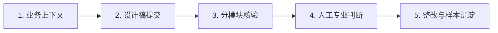
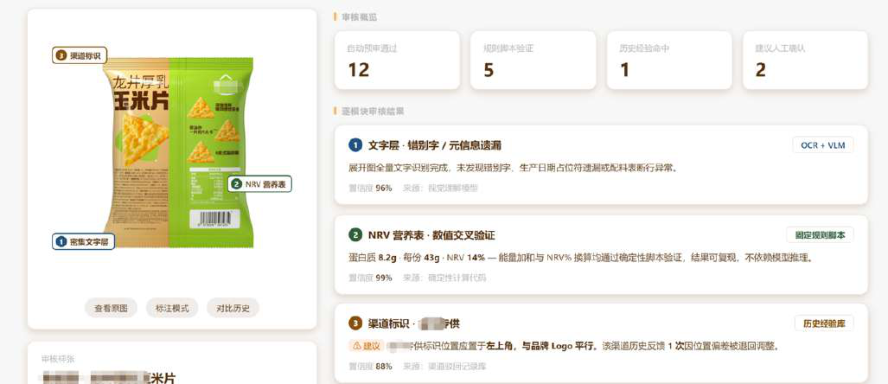
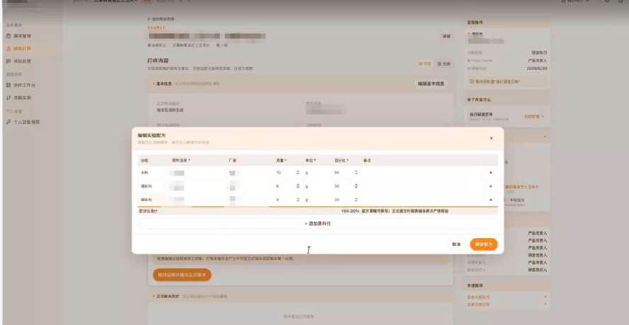

# CASE 19｜把审核前置到研发协作中

**行业**：消费品研发与包装　 **学习主题**：专业工具与计算　 **共学时间**：约10分钟

## 一句话简介

FDE团队帮消费品企业解决新产品包装排队审核、研发和渠道经验散在人脑里的问题，先观察真实协作，再和审核人员一起把检查事项拆清楚，用识别工具读取包装、用固定程序算营养数值，设计稿提交后先做预审、疑难处交给人，让专家少查低级错误，也把每次驳回和修改的经验留下来。

[返回目录](../README.md) · [本例JSON](case.json) · [完整访谈](#full-interview) · [原PDF](../../sources/original-interviews.pdf#page=189)

原题：从人工排队到审核前置：FDE用AI重构消费品研发协同与包装审核

来源范围：PDF物理页 189–199；书内页码 188–198。

**本例值得讨论的判断（编辑提炼）**：审核不只挑错，还应让每次决策留下上下文。

> 阅读提示：标为“访谈概括”的内容来自受访者陈述；“补充分析”是编辑解释；“迁移演练”是迁移假设。效果数字保留原文的试点、目标、估算和脱敏条件。前半部用于备课和学习，后半部完整保留原访谈。

## 1. 业务现场与行业特点

### 发生了什么｜访谈概括

消费品从需求、口味和配方研发，到包装、合规、中试及渠道上线，需要多个角色接续。一年上百个SKU使链路更忙，但需求为何提出、配方为何选择、渠道为什么退回等关键上下文，常没有完整进入现有SaaS。

包装审核同时包含错字检查、法规要求、渠道规范和产品表达判断。原流程把多类问题集中交给审核人员，SKU增加后形成排队；系统只保存最终结果，也难以让一次审核经验帮助下一次设计。

关键现场事实：

- 消费品牌与上下游工厂、渠道，产品全生命周期协作
- 需求—配方—包装—合规—中试—上线链条长
- 包装审核涉及设计、法规、渠道与产品4种视角

**原工作路径**：需求口头转译 → 研发形成方案 → 包装集中等审核 → 下游退回再修改

**重新定义的问题**：“做一个包装审核Skill”不足以解决上下文断层；外部团队不能代替业务定义工作。

依据：[原PDF物理页 190、191、192](../../sources/original-interviews.pdf#page=190)；需要核实具体说法请查看[完整访谈](#full-interview)。

扩充段落主要参照：[Q1](#q1)、[Q2](#q2)；原PDF物理页 189–199。

### 为什么需要FDE｜补充分析

研发协作中的信息不仅是最终参数，还包括选择依据、失败经历和外部反馈。把检查按确定性规则、可沉淀经验和专业判断分开，才能使自动化减轻负担而不抹去责任；不同组织的决策方式仍需重新理解。

SaaS多记录结果，少记录“为什么”；渠道反馈、打样失败和经验缺失会造成排队与返工。

需要业务共同写AI岗位说明书，拆分确定性规则与判断，并把预审嵌入上下游。

## 2. 解决思路怎样形成

### 从调研到方案的过程｜访谈概括

团队曾带着既有方案进入客户，发现容易与真实组织不匹配，因而改为先观察。访谈描述将Agent放入业务群持续两三周收集上下文，发现包装审核这一机会，再结合人员判断选定场景；原文未详述该采集过程的授权配置。

确定场景后，FDE借用岗位说明书的方法，请实际审核人员定义输入、输出、检查内容和例外。AI的工作由业务参与者共同拆解，明确哪些可以执行规则、哪些需要历史上下文、哪些仍由专业人员作决定。

工程化时将包装拆成视觉模块，选择适合的OCR和视觉模型；热量与NRV等计算固化为确定性代码，模型承担解释和补录建议。结果附来源与置信信息，并加入降级和审计，再接入包装开发流程及管理系统，使设计稿提交后可提前预检。

| 现场信号 | 形成的决定 |
|---|---|
| 参加会议仍会给业务造成压力 | 原文采用群内Agent观察2–3周，发现审核瓶颈 |
| 外部定义Skill仍可能偏离业务 | 让实际审核者定义输入、输出、规则与例外 |
| VLM无法可靠处理全部包装模块 | 拆图选OCR/VLM；营养表计算等固化为代码 |

依据：[原PDF物理页 192、193、194](../../sources/original-interviews.pdf#page=192)；需要核实具体说法请查看[完整访谈](#full-interview)。

扩充段落主要参照：[Q3](#q3)、[Q5](#q5)、[Q6](#q6)；原PDF物理页 189–199。

### 这些取舍为什么重要｜补充分析

图片理解与数值验证应采用不同方法。模型可以读取和解释内容，明确的计算则交给可复现代码；来源或识别结果不可靠时，应让人知道需要检查哪里，而不是输出一个看似完整却无法核对的结论。

从观察沟通获取业务上下文，有助于发现未被正式提需求的问题，但不应把访谈中的做法直接复制为无边界收集。迁移到其他场景时需明确参与者知情、授权资料范围和保存方式；这些是课程提出的实施设计，不能反写成原项目已证明具备的措施。

## 3. 工作流程与人机分工

以下流程图和职责划分是依据访谈所作的业务抽象，不补造未披露的技术架构。



| 步骤 | 实际作用 |
|---|---|
| 1. 业务上下文 | 需求、物料、打样、渠道与历史反馈 |
| 2. 设计稿提交 | 提交即触发前置预检 |
| 3. 分模块核验 | OCR/VLM提取；规则和计算脚本执行 |
| 4. 人工专业判断 | 产品表达、审美、复杂例外 |
| 5. 整改与样本沉淀 | 驳回、修改、上线经验回流 |

| 角色 | 负责什么 |
|---|---|
| AI | 信息提取、解释、补录建议与经验检索 |
| 系统 | 确定性计算、规则、溯源与包装管理 |
| 人 | 业务定义岗位；专业审核和最终判断 |

依据：[原PDF物理页 194、195、196](../../sources/original-interviews.pdf#page=194)；需要核实具体说法请查看[完整访谈](#full-interview)。

## 4. 交付物、实际使用与组织采用

### 交付后怎样工作｜访谈概括

设计师在交给下游前先收到基础检查结果，专业审核者集中处理真正需要判断的问题。系统积累历史包装、驳回记录、整改过程与渠道反馈，以便后续检查能利用同类问题的经验，而不是每张图重新从零开始。

包装预审是产品生命周期中的一个节点，团队还把需求讨论、历史打样、物料上下文等协作方向连起来，并通过培训和内部黑客松让业务人员参与制作工具。交付既有软件功能，也包括成员理解自身输入输出并参与改造流程的能力。

| 交付物 | 交付内容 |
|---|---|
| 包装审核系统 | 来源置信度、降级与审计，结果可回查原数据 |
| 产研协同系统 | 连接产品概念、研发打样与历史上下文 |
| 业务Builder培养 | 共同搭雏形、内部黑客松，再由FDE工程化 |

### 实施与推广｜访谈概括

用组织目标→价值链→岗位→输入输出定位AI；原文群内观察的告知与权限细节未展开。

团队与客户共同从组织目标拆到价值链、岗位和输入输出，业务人员参与雏形，FDE再做稳定性、系统对接和工程实现。底层工具可以复用，人的角色、判断与协作方式则需按客户情况重新梳理。

依据：[原PDF物理页 193、194、195、196、197](../../sources/original-interviews.pdf#page=193)；需要核实具体说法请查看[完整访谈](#full-interview)。

扩充段落主要参照：[Q3](#q3)、[Q4](#q4)、[Q5](#q5)；原PDF物理页 189–199。

## 5. 实际成效与证据边界

### 原文报告的变化

| 指标 | 原来或参照 | 后来或状态 | 必须保留的限定 |
|---|---|---|---|
| 工作分配 | 低级错与复杂判断混排 | 基础问题前置筛出 | 未给审核周期/准确率前后数字 |
| 经验沉淀 | 个体判断 | 历史反馈与整改可复用 | 决策质量改善属定性反馈 |
| 组织参与 | 外部承接需求 | 业务人员共同Build | 培训、展会与黑客松为采用方式 |

### 如何理解效果｜补充分析

原文报告低级错误和重复检查得到前置处理，专业人员时间重新分配，个人经验开始沉淀为组织经验，并出现业务人员自主构建应用。没有提供统一的审核准确率、返工下降比例或研发周期统计，不能将这些组织变化换算成未经测量的数字收益。

**证据边界**：本例技术示例不等于现行法规说明；学习提炼不把模型置信度视为合规保证。

依据：[原PDF物理页 196、197、198](../../sources/original-interviews.pdf#page=196)；需要核实具体说法请查看[完整访谈](#full-interview)。

## 6. 难点、应对与可复用经验

| 难点 | 原文中的应对 |
|---|---|
| 问题能做却不一定值钱 | 同时核实真实需求、价值与衡量指标 |
| 没有边界导致需求无限扩展 | 用岗位说明书明确输入输出与责任 |
| 单次执行不稳或难集成 | 分模块、确定性计算、溯源和降级 |

依据：[原PDF物理页 196、197、198](../../sources/original-interviews.pdf#page=196)；需要核实具体说法请查看[完整访谈](#full-interview)。

**可复用的方法（编辑归纳）**：结合第2节的关键取舍，关注真实任务如何被重新定义、可交付结果由谁确认，以及组织如何继续使用和修改。原受访者的全部经验保留在[Q6](#q6)。

## 7. 迁移到其他工作场景的讨论｜4分钟

以下是通用研发场景中的假设练习，不代表案例客户或任何学习者所在组织已经开展或验证了这些项目。

某研发项目提交计算或实验前，材料、单位、方法适用性和样本状态经常到专家审核才发现问题。

**讨论问题**：给科研预审助手写岗位说明书，哪些事可以自动拦截？

**本组应交出的产物**：写出输入、输出、3条确定性检查与1条必须转专家的规则。

个人思考40秒 → 小组讨论100秒 → 共识与质疑70秒 → 主持人收束30秒。

<details>
<summary>展开：迁移试点、验收与主持人参考</summary>

研发团队可将预审放在实验方案、仿真结果或客户交付材料进入专家评审之前。单位、参数范围和明确计算先由规则与程序检查；方法适用性、异常结果解释和科学结论仍由对应专家判断，系统同时展示原始依据。

练习可选一份真实但获授权的研发交付清单，把检查事项分成可计算规则、历史经验和专家决策三组，再指定每项的输入、复核人及失败处理。验收看专家是否少查低级问题，以及保留下来的理由能否帮助下一次工作。

**建议切口**：给“科研预审助手”写岗位说明书；提交即核验字段、单位、重复项与前置条件，复杂判断交专家。

**建议验收**：建议验收：前置拦截真实问题、误报/漏报、返工次数、结论到数据的追溯。

**适用限制**：业务沟通和数据采集须有明确授权；科学可行性与实验安全不能由模型置信度替代。

**主持人参考**：参考：字段/单位/版本/重复任务可核验；方法适用域、实验风险与科学解释需专家复核。

</details>

可以直接对Codex说：

```text
请带我学习案例19。先讲清项目做了什么，再用一个关键问题让我做判断。
讲事实时引用原PDF页码；讨论迁移方案时明确标为假设。
```

## 8. 原图与受访者介绍

[查看原案例封面与受访者介绍](../../assets/cover_189.png)。人物姓名、职位及图片内文字以原PDF为准。

### 原图 1｜原PDF第195页



[回到原PDF第195页](../../sources/original-interviews.pdf#page=195)

### 原图 2｜原PDF第195页



[回到原PDF第195页](../../sources/original-interviews.pdf#page=195)

<a id="full-interview"></a>

## 9. 完整原始访谈

以下6组问答逐段保留原PDF文字层的原始提取内容。原有换行、术语或转义保留，不以编辑详解替代原文。文字层未包含的图片信息，请查看上方原图及[完整PDF第189–199页](../../sources/original-interviews.pdf#page=189)。

<details>
<summary>展开全部访谈：Q1–Q6</summary>

<a id="q1"></a>

### Q1

Q1：作为FDE，你应用AI的具体场景是什么？在这个场景下遇到
的具体问题长什么样？
我现在做的是消费品产品生命周期里的AI应用，落地在消费品牌和上游工厂下游渠道。
锚定这个行业，是因为我自己真正做过一个消费品牌的产品，从0到1经历过产品和增
长，也在这个过程中尝试用AI和Workflow提高自己的效率。但真正进入客户现场以后，
我才发现，问题比最开始想象的复杂得多——在消费品这类长链条行业，在跨品类跨组织
场景下，也有差异化的。
一个消费品企业一年可能要做100多个SKU。一个产品从需求开始，到口味、配方研
发，再到包装、合规、中试、渠道上线，中间会经过很多角色。它是一条很长的业务
链，中间环环相扣。
更关键的是，这条链路里最重要的东西，很多并不在系统里。
比如，消费者或者渠道提出一个需求，产品经理可能会把它理解成“我要做一个更脆的
产品”。但为什么是“脆”？可能来自前面的消费者调研，也可能来自和渠道客户的一次
沟通。到了研发环节，研发人员又要把“脆”翻译成具体的配方和工艺。可为什么选择
这种配方？可能是过去做了很多次实验之后积累下来的经验。
这些东西如果没有被记录下来，到了SaaS系统里，最终留下的往往只是一个结果，缺少
“为什么这么做”的过程。
我看到的核心问题，其实有两个。
第一个，是核心资源依赖人。产品经理的判断、研发的经验、渠道的反馈，很多都存在
个人脑子里。
第二个，是数据和信息高度分散。过去的SaaS更多是在记录结果，但真正影响决策的上
下文，大量是非结构化信息，很难被完整沉淀下来。
这时候，我觉得AI真正有价值的地方就出现了。
我把问题拆成两个方向：流程自动化和决策高质量化。
比如一个需求提交给研发之前，有些东西其实不需要人来判断。原料有没有、成本有没
有可能达到、一些基础规则是否满足，这些都可以提前检查。另一方面，真正需要产品
经理、研发人员做判断的地方，则应该让AI把历史成功或失败的经验找回来，帮助他们
做更充分的决策，把最终判断交给人。
我理解的FDE视角，是先看业务到底在哪里损耗了信息、经验和人的判断力，再决定AI
能做什么。

<a id="q2"></a>

### Q2

Q2：在你参与之前，这个问题过去是怎么解决的？
过去的方式有它的合理性。
消费品企业已经有很多SaaS系统，也有很多成熟的业务流程。企业会购买不同的
SaaS，分别服务研发、生产、渠道等单点环节。
这种方式在过去是有效的，因为它至少解决了“信息有没有记录”的问题。但它有一个
天然的限制：系统记录的是结果，人负责输入信息。
只要信息需要人主动输入，就一定会发生损耗。而消费品业务偏偏有大量非结构化的信
息，是表单很难承载的。单点SaaS产生数据孤岛，要再花大精力去建设数据中台；所以
过去的SaaS解决的是上一阶段的问题。
当业务规模变大、SKU不断增加之后，真正的问题从“有没有系统”变成了“整个链路上
的上下文能不能流动起来”。
以包装开发流程为例，这个问题特别典型。
一个产品研发出来之后，包装还需要经过审核。随着SKU增加，待审核包装不断堆积，
排队等审核。
但我们真正把这个流程拆开之后发现，所谓“包装审核”至少涉及四种不同视角：
设计师检查错别字等基础问题；
法律法规人员检查食品法、广告法等硬性要求；
渠道检查自己的规范，比如渠道Logo和品牌Logo的大小关系；
产品经理判断包装有没有正确表达产品本身。
这时候问题就变得很清楚了。
如果SaaS系统只存结果数据，效率和效果依然没有提高，但当AI介入链路，这里面错别
字、法规等基础问题高度标准化，可以直接交由AI执行；有些事情可以随着历史反馈逐
渐标准化，比如不同渠道每一次的反馈积累下来，沉淀成标准后交由AI完成预审；还有
一些事情必须保留人的判断，比如产品经理和设计师对于审美表达的判断，但AI可以给
人的判断提供更多上下文支持，比如在渠道产品上线后的销售表现，反向指导对包装的
迭代。
所以我们重新问了一遍：这个流程里面，到底哪些工作应该由机器做，哪些工作必须留
给人？

<a id="q3"></a>

### Q3

Q3：后来你使用AI解决这个问题的整体思路和关键步骤是什
么？
我后来确信了一件事，不能带着一个已经做好的方案去客户现场。
这个坑我们自己踩过。最开始，我们也会拿着自己以前验证过的方案去找客户。结果很
容易变成一种状态：你是外部的人，却试图告诉内部的人应该怎么做；你觉得方案已经
验证过了，但对方的组织、老板、业务模式、决策方式都可能完全不同。
后来我们的方式发生了变化。
第一步，先观察，再解决。
我会尽可能进入客户真实的业务环境。最开始我甚至会直接参加他们的会议、进入飞书
群。但后来发现，一个外部的人一直待在里面，其实还是会让业务同学产生压力。
所以我们做了一件很有意思的事情，把一个Agent放进业务群里。
它在那里待了两三周，持续收集业务上下文，不急着解决问题。过一段时间，我们再让
它总结：最近业务里有哪些问题？哪些东西值得沉淀成经验？哪些地方可能存在可以被
AI解决的机会？
最后，Agent自己从真实业务沟通中定位到了包装审核这个问题。
这件事情对我启发很大。Agent在这里承担了两重角色：既执行任务，也观察业务。它
可以相对隐形地获取业务上下文，然后我们再结合人的判断去确定哪些问题真的值得
做。
第二步，先定义问题，再定义AI。
还是拿包装审核这个单点场景为例，我们确定包装审核确实是一个高频、真实存在的问
题之后，并没有马上开始写一个“包装审核Skill”。
因为我们很快又发现，如果完全由我们这些外部的人去定义Skill，依然容易变成“外行
指导内行”。
所以我们换了一个思路。如果过去公司要招一个人来做包装审核，HR会给他一份岗位说
明书。那么现在我们希望AI承担这部分工作，AI同样应该拥有一份“岗位说明书”。
于是，我们借用了HRBP的思路，把真正做审核的人找出来，让业务人员自己拆解：他
平时到底审核什么？输入是什么？输出是什么？什么情况下需要判断？什么规则可以直
接执行？什么事情需要上下文？
这一步非常重要，因为真正懂业务的人开始参与进来，AI该怎么工作，由他们来定义。
第三步，把业务工作拆成“可以自动化”和“需要决策”两类。
拆完之后，我们就能看到哪些事情可以直接交给AI。比如错别字、一些法规标准、能量
计算等相对确定的问题，可以提前自动检查。
而渠道要求这种东西，虽然最初可能需要人工判断，但每一次渠道反馈都可以被记录下
来。下一次遇到类似包装，就不需要重新从零开始。
再往上，产品经理真正需要做的，是判断包装到底有没有把产品表达清楚。
于是，一个原本“所有东西都堆给审核人员”的流程，被拆成了不同层级：确定性问题
→ AI自动处理；历史经验 → 持续沉淀；复杂判断 → 留给人。
第四步，工程化，让AI进入整条业务链。
首先，提升单次执行审核的准确率。
包装图上有密集文字段落，有NRV能量计算表格，也有艺术字变体设计，单靠模型的视
觉理解不够。我们先把包装拆成不同的视觉模块，分别选择更合适的OCR和VLM方案，
再把固定规则脚本化，把热量表和NRV的计算逻辑固化成确定性代码，让模型只做解释
和补录建议。蛋白质2.9g、每份40g、NRV5%对不对这类问题，从此实现可复现地验
证。
再补上降级和审计策略。每个模块的审核结果都带来源置信度，每个结论都能追溯到原
始数据，人类员工接手时，清楚该信什么、该查什么。
单次审核做准之后，再把它放进包装开发的完整工作流。包装审核的上游是产品需求和
包装设计，下游是包材采购和物料生产。接入整个产品生命周期管理的基础设施和上下
文之后，审核这个单点Skill开始从“看一张图、挑一堆错”，变成常态化的自动预审。
设计稿一提交，Skill就按规则跑一轮预检，把合规问题、NRV计算、数字矛盾，在设计
师交给下游之前就拦下来。
我们还搭建了包装管理系统，把历史上线经验沉淀下来。每一个最终上线、被市场或监
管验证过的包装，都是一份高质量样本。把这些样本的标准、驳回记录、整改闭环放进
上下文，就能基于“过去哪些设计最容易踩坑”去评估当前方案，提前告诉设计师，这
个渠道的标识位置历史上被退过三次，建议你这么放。
图1：包装审核系统
包装开发和审核只是产品生命周期的一个单点，我们后来不太愿意把自己的东西简单叫
成“一个AI系统”或者“一个中台”。我们真正想做的是先把业务流和信息流梳理出来，
然后让不同的Agent和应用自然长在产品生命周期业务链上。
图2：产研协同系统
比如产品经理接到来自老板或销售渠道的模糊需求，和Agent一起讨论，将模糊需求转
化为产品概念需求，研发接到产品概念需求之后，调用历史打样版本、当前物料等上下
文，和自己的Agent讨论怎么把需求转化成可打样的方案。
这样一来，AI嵌进了流程本身，成为其中的一部分。

<a id="q4"></a>

### Q4

Q4：相比传统方式，使用AI后的实际效果如何？
这件事的第一个变化，是人的时间开始被重新分配。
以包装审核为例，原来法律法规人员会被大量低级错误和重复检查占用。现在可以先让
AI把这两类问题筛掉，把真正需要专业判断的问题留给人。
这样，法律法规人员可以减少处理低级错误和返工的时间；产品经理可以把更多时间放
到“这个包装到底应该怎么表达产品”这样的判断上。
但我认为更重要的变化，其实发生在“经验”这件事情上。
过去，一个产品经理的判断就是这个产品经理自己的经验，一个研发的判断也是这个研
发自己的经验。现在，我们开始把每一次决策、每一次渠道反馈、每一次审核经验沉淀
下来。
这意味着，AI带来的价值，是让个人经验有机会变成组织经验，让一个人的经验开始服
务于整个组织。
此外，更有价值其实是这个组织的变化，业务人员自己成为Builder，学习和参与重新搭
建自己和AI协作的工作流。
我们和客户一起参加食品展会、带客户的高管一起参加了Datawhale举办的黑客松还拿
了冠军，回来之后又在客户公司内部组织了一场黑客松。我们没有停留在“AI工具怎么
用”的讲解上，直接从组织战略开始，一层层拆到业务流程，再拆到每个人具体的输
入、输出和处理方式。引导大家做出自己自己可以真正使用，又能够为组织整体价值链
条提效提质的东西，比如电商视频编导、考勤自动清洗等等工具。
我把这次的效果理解成三层：第一层是降本增效，第二层是提高决策质量，第三层是把
个人Know-how变成组织能力。

<a id="q5"></a>

### Q5

Q5：在部署AI过程中，是否遇到了新问题或挑战？你是怎么解
决的？
其实非常多，而且很多都是我们必须踩的坑。
第一个挑战，是从承接问题，到定义问题。
能交给AI解决的问题，未必都值得做。一个适合FDE落地的问题，至少要同时满足几个
条件：它必须是业务同学真实存在的问题，必须有业务价值，而且解决之后最好能够找
到可以衡量的指标。这几个条件同时成立，其实非常难。
第二个挑战，是从构建软件系统，到定义组织系统。
最开始我们是承接需求的人，对方提出需求，我们负责解决。但做着做着就发现，这个
逻辑会让项目没完没了。因为业务方不可能把一个需求完整、准确地定义出来，更不可
能期待AI稳定地100%满足一个没有边界的需求。
因此，我们认为FDE本质上是在和老板、中层、业务同学，一起共同搭建一个AI和人协
作的组织系统，并被套一个软件系统，又拆成了三步：
第一，共同梳理业务流，从组织目标，到价值链，到岗位，再到输入输出，最后找到这
个岗位可以由AI帮助完成什么。可能给老板相对完整的问题和解决方案，然后再一起为
这些问题进行价值排序。
第二，共同搭建系统的雏形，我们通过工具和认知的培训，让业务同学一起参与Build，
业务方自己知道哪些知识是重要的，哪些上下游需要调用他的知识库，什么样的Skill才
能真正符合他的工作方式。
第三，才是FDE介入工程化，去让单次执行更稳定，或是和现有软件系统对接起来，再
或是在此之上快速搭建新的软件系统，流程SaaS、插件甚至多维表都只是这些能力的表
现形式。

<a id="q6"></a>

### Q6

Q6：根据你的经验，我们怎么才能更好地把AI部署到实际业务
中？
第一，先解决人的问题，再解决技术问题。
现在大模型、Skill、知识库、Workflow这些东西越来越容易获得，真正难的是一个组织
到底应该怎么用它们。
我把FDE的工作理解成“AI HRBP + AI架构师”。AI架构师负责底层系统怎么搭，知识
库、Skill、Workflow以及各种Agent怎么连接，怎样让它们最终进入真实业务流程；AI
HRBP负责搞清楚这个组织到底有什么问题，不同角色在做什么，他们为什么这么做，
哪些经验应该被沉淀，哪些事情应该交给AI，哪些事情必须留给人。
第二，用“点—线—面”把组织梳理清楚。
我们和甲方一起迭代出了一套“点—线—面”的方法。
面，是组织最终创造什么价值。先看公司的战略目标，以及它最终到底靠什么创造价
值。
线，是组织内部的一条条价值链。把战略目标拆成具体的业务流程，看看价值是怎么一
步步产生的。
点，是每一个岗位。一个人在这条价值链上到底承担什么角色？输入是什么？输出是什
么？哪些事情是他的Know-how？
当这三层梳理清楚以后，AI应该放在哪里，反而会变得比较清楚。
第三，技术复用，人的部分个性化。
我现在不太相信“一个FDE拿着一套方案，到客户现场部署一下”这种模式。真正的
FDE，应该有自己的技术基础设施和通用架构能力，但到了具体业务里，要做的是技术
复用，人的部分个性化。
底层的模型、架构、知识库、Skill这些能力可以复用；但每一家企业的人、流程、组
织、经验和决策方式，都需要重新理解。
FDE这个职业，未来可能也不会一直独立存在。现在需要FDE，是因为业务角色还没有
普遍具备AI能力，需要有人站在业务和技术中间，把两边连接起来。
如果未来AI能力像今天的互联网一样，成为每个人的基础能力，那么消费品产品经理、
研发、设计师、销售，可能都会变成某种意义上的“AI增强角色”。
到那时，真正留下来的，可能从职位名称变成一种能力：既懂业务，又懂AI，既能发现
问题，又能把问题真正落到业务流程里。

</details>

[返回案例目录](../README.md) · [本例结构化数据](case.json)
