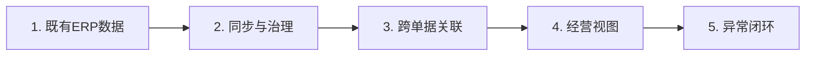
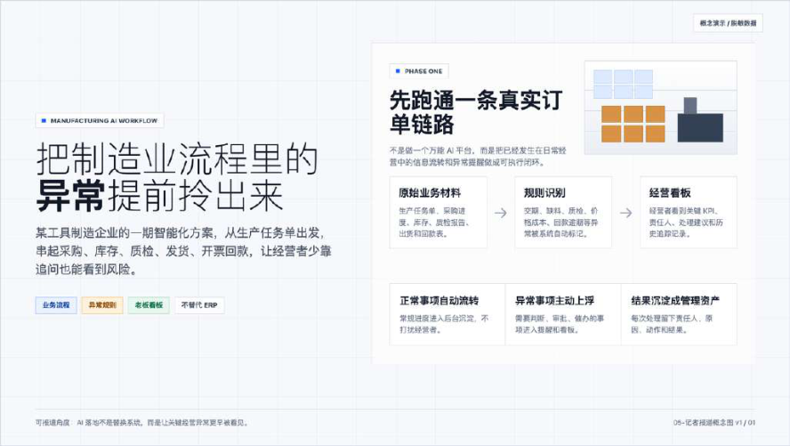
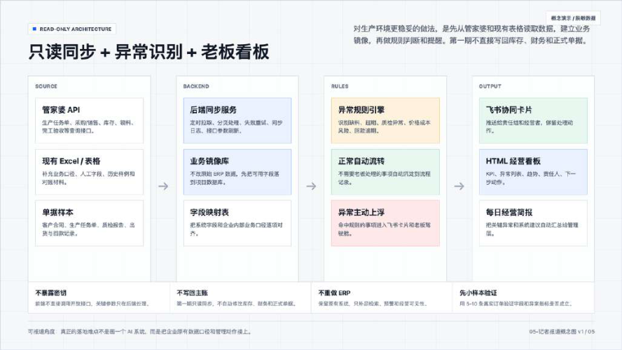
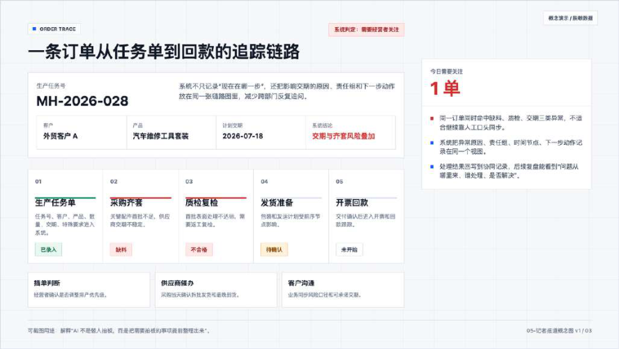

# CASE 20｜把ERP数据变成可解释的经营状态

**行业**：汽车零部件供应链　 **学习主题**：经营协同与价值　 **共学时间**：约10分钟

## 一句话简介

FDE团队帮一家汽车维修零部件供应商解决ERP里有订单、采购和库存，老板却仍要到处问进度、查付款缘由的问题，在原ERP上把这些记录重新关联，做成经营看板和飞书异常提醒，让未收齐的货和应付款对应的业务更容易追踪；系统刚上线，尚不能证明利润或成本已经改善。

[返回目录](../README.md) · [本例JSON](case.json) · [完整访谈](#full-interview) · [原PDF](../../sources/original-interviews.pdf#page=200)

原题：从看不清订单到看清经营：FDE用AI让制造企业的经营流程更透明

来源范围：PDF物理页 200–209；书内页码 199–208。

**本例值得讨论的判断（编辑提炼）**：数据都在系统里，老板仍可能不知道真实发生了什么。

> 阅读提示：标为“访谈概括”的内容来自受访者陈述；“补充分析”是编辑解释；“迁移演练”是迁移假设。效果数字保留原文的试点、目标、估算和脱敏条件。前半部用于备课和学习，后半部完整保留原访谈。

## 1. 业务现场与行业特点

### 发生了什么｜访谈概括

客户主要采购汽车维修零部件，再做简单加工、组合和组装后交付，下游订单会牵动生产任务、上游采购、库存、发货和回款。老板希望正常事项按流程推进，只在出现异常时介入，但原来需要频繁向员工询问。

公司已有管家婆等标准ERP，问题在于数据没有按自身经营视角串起来。例如订单要求5000个扳手、实际到货4980个，流程未完全结束但实物已经进入仓库；标准状态难以直接表达老板关心的真实情况。

关键现场事实：

- 轻加工、组合装配的汽车维修零部件企业
- 已有ERP，覆盖订单、采购、生产、库存与发货
- 老板希望少问人，能追订单与应付款并看异常

**原工作路径**：业务在ERP记录 → 状态按标准单据走 → 老板逐项问人 → 人工解释库存和付款

**重新定义的问题**：订5000、实到4980的例子说明：流程没完整结束，不代表现实库存没有变化。

依据：[原PDF物理页 201、202、203](../../sources/original-interviews.pdf#page=201)；需要核实具体说法请查看[完整访谈](#full-interview)。

扩充段落主要参照：[Q1](#q1)、[Q2](#q2)；原PDF物理页 200–209。

### 为什么需要FDE｜补充分析

轻加工供应链的经营可见性依赖单据之间的关系以及业务实际状态。存在订单不等于完成交付，采购记录也不自动解释一笔付款；FDE需要明确哪些对象应当对应、什么差异值得提醒，以及由谁核实和处理。

标准单据状态与现实业务不总一致；局部到货、数量差异和跨单据关系影响经营判断。

需要理解经营视角、重组业务对象关系，并在保留原ERP的前提下暴露异常和依据。

## 2. 解决思路怎样形成

### 从调研到方案的过程｜访谈概括

FDE先询问老板每天担心什么、必须盯哪些事项、希望第一时间知道哪些异常，把泛化的AI需求收敛为订单透明、业务关联和主动提醒，再确定需要的系统能力。

原有ERP继续承担基础业务，新方案取出必要数据做整理和二次加工，匹配客户订单、供应商订单、库存签收及付款等关系。财务提出一笔应付款时，系统能够进一步解释它对应哪些采购和下游业务。

团队在价格、库存与应付款关联等关键节点设置判断标准，发现异常后通过飞书卡片提醒相关人员，形成持续核对、主动提示、人工处理的流程。建设中投入大量工作清理数据、统一口径和还原实际业务关系。

| 现场信号 | 形成的决定 |
|---|---|
| 问老板每天担心什么、必须盯什么 | 把诉求收敛到订单透明、数据关联与异常 |
| 已有ERP不能表达全部经营语义 | 保留ERP，拿必要数据做二次组织 |
| 付款金额缺少对应业务解释 | 匹配客户订单、采购、签收，异常飞书提醒 |

依据：[原PDF物理页 203、204](../../sources/original-interviews.pdf#page=203)；需要核实具体说法请查看[完整访谈](#full-interview)。

扩充段落主要参照：[Q3](#q3)、[Q5](#q5)、[Q6](#q6)；原PDF物理页 200–209。

### 这些取舍为什么重要｜补充分析

复用方法与复制项目数据是两件事。即使行业和规模相近，客户的数据口径、系统基础和流程也可能不同，因此匹配规则与业务关系仍需重新确认，不能把当前实现直接包装为无需适配的标准产品。

FDE也要评估自己的交付与维护成本。数据治理和定制工作如果持续增加，即使客户认可价值，项目也未必具有合理的服务收益；学习时应同时讨论客户价值与团队投入，明确哪些部分能复用、哪些需要持续维护。

## 3. 工作流程与人机分工

以下流程图和职责划分是依据访谈所作的业务抽象，不补造未披露的技术架构。



| 步骤 | 实际作用 |
|---|---|
| 1. 既有ERP数据 | 原系统继续承担业务功能 |
| 2. 同步与治理 | 整理订单、采购、库存与口径 |
| 3. 跨单据关联 | 匹配核对应付、签收与客户订单 |
| 4. 经营视图 | 呈现实际状态及关联证据 |
| 5. 异常闭环 | 飞书卡片送达责任人处理 |

| 角色 | 负责什么 |
|---|---|
| AI | 辅助数据匹配、核对与关系判断 |
| 系统 | 只读同步、经营看板和规则提醒 |
| 人 | 处理异常，确认实际业务与管理决策 |

依据：[原PDF物理页 203、204、206](../../sources/original-interviews.pdf#page=203)；需要核实具体说法请查看[完整访谈](#full-interview)。

## 4. 交付物、实际使用与组织采用

### 交付后怎样工作｜访谈概括

老板通过经营视角查看订单推进和异常，员工围绕具体差异进行解释与处理。原文用4980个实际收货与5000个订单数量说明，补充呈现能让系统更贴近真实库存，但这并不等于修改或绕过原ERP的入库规则。

交付形式包括基于原系统数据的经营看板、业务追踪关系、匹配核对与飞书提醒。基础正常流程继续运转，需要人处理的事项被推送出来，下一步经营效果仍需依靠运行和实际处理验证。

| 交付物 | 交付内容 |
|---|---|
| 订单全链路视图 | 从任务单、采购、签收到回款可追踪 |
| 异常识别与飞书卡片 | 价格、库存、应付对应问题主动提醒 |
| 应付款追溯 | 解释付款为何产生、对应哪些上下游业务 |

### 实施与推广｜访谈概括

刚上线不久；原ERP保留。数据治理与企业口径差异是定制和维护成本的主要来源。

项目上线时间较短，基础自动运行和异常通知功能已实现，减少重复订货等进一步经营目标尚待验证。受访者还分享过金融机构图片生成项目的失败经验，那是另一段经历，不能混为本项目的技术路线或实施结果。

依据：[原PDF物理页 201、204、205、206](../../sources/original-interviews.pdf#page=201)；需要核实具体说法请查看[完整访谈](#full-interview)。

扩充段落主要参照：[Q3](#q3)、[Q4](#q4)、[Q5](#q5)；原PDF物理页 200–209。

## 5. 实际成效与证据边界

### 原文报告的变化

| 指标 | 原来或参照 | 后来或状态 | 必须保留的限定 |
|---|---|---|---|
| 到货示例 | 订5000、实到4980 | 可显示真实增加4980 | 说明处理能力，不是绩效指标 |
| 付款透明 | 只看到金额 | 追到对应订单与采购 | 定性功能变化 |
| 经营收益 | 需要持续运行 | 尚不能证明量化提升 | 利润、成本与重复订货改善未确认 |

### 如何理解效果｜补充分析

现阶段可确认的是经营信息更容易查看、实际收货与付款关系更可追溯，尚无利润、成本或效率的明确量化提升。5000与4980个扳手、10万元应付款均用于解释场景，不能当成已追回金额、实际节省或整体异常率。

**证据边界**：本例明确尚无量化经营收益；另举金融生图失败是旁例，不能并入本客户。

依据：[原PDF物理页 205、207、208](../../sources/original-interviews.pdf#page=205)；需要核实具体说法请查看[完整访谈](#full-interview)。

## 6. 难点、应对与可复用经验

| 难点 | 原文中的应对 |
|---|---|
| 老板与技术视角不同 | 先理解经营逻辑与能力边界 |
| 同行数据也不一样 | 方法复用，口径和数据另行治理 |
| 好用但交付不赚钱 | 核算人力、长期维护和定制成本 |

依据：[原PDF物理页 205、207、208](../../sources/original-interviews.pdf#page=205)；需要核实具体说法请查看[完整访谈](#full-interview)。

**可复用的方法（编辑归纳）**：结合第2节的关键取舍，关注真实任务如何被重新定义、可交付结果由谁确认，以及组织如何继续使用和修改。原受访者的全部经验保留在[Q6](#q6)。

## 7. 迁移到其他工作场景的讨论｜4分钟

以下是通用研发场景中的假设练习，不代表案例客户或任何学习者所在组织已经开展或验证了这些项目。

某研发负责人想看一项研究从样本、计算任务到结果、实验验证和预算的真实状态。

**讨论问题**：一批计算已结束，但只有部分结果合格，项目看板应显示什么？

**本组应交出的产物**：设计“运行状态”和“科学验证状态”两个独立字段及升级条件。

个人思考40秒 → 小组讨论100秒 → 共识与质疑70秒 → 主持人收束30秒。

<details>
<summary>展开：迁移试点、验收与主持人参考</summary>

可将这一思路迁移到研发项目的任务、计算作业、实验委托、数据交付和费用之间的关联。先明确项目经理真正需要知道的状态，例如哪些结果已经返回但尚未验收、哪些费用无法对应任务，再从现有系统读取必要信息。

试点不必一开始自动改写业务系统，可以先做状态核对与异常提示，记录提示是否正确、责任人是否处理和处理耗时。只有追踪闭环实际成立，再评估是否减少延误、重复计算或资源浪费。

**建议切口**：复用现有系统，建立项目、样本、任务、版本、费用之间的关系和异常提醒。

**建议验收**：建议验收：状态与实际一致、结果和费用可追溯、异常被及时处理。

**适用限制**：计算任务完成不等于科研目标达成；需区分任务、结果、验证和业务决策状态。

**主持人参考**：参考：不要用单一完成率覆盖质量；分别显示完成、失败、未验证、已验证和决策待定。

</details>

可以直接对Codex说：

```text
请带我学习案例20。先讲清项目做了什么，再用一个关键问题让我做判断。
讲事实时引用原PDF页码；讨论迁移方案时明确标为假设。
```

## 8. 原图与受访者介绍

[查看原案例封面与受访者介绍](../../assets/cover_200.png)。人物姓名、职位及图片内文字以原PDF为准。

### 原图 1｜原PDF第201页



[回到原PDF第201页](../../sources/original-interviews.pdf#page=201)

### 原图 2｜原PDF第204页



[回到原PDF第204页](../../sources/original-interviews.pdf#page=204)

### 原图 3｜原PDF第206页



[回到原PDF第206页](../../sources/original-interviews.pdf#page=206)

<a id="full-interview"></a>

## 9. 完整原始访谈

以下6组问答逐段保留原PDF文字层的原始提取内容。原有换行、术语或转义保留，不以编辑详解替代原文。文字层未包含的图片信息，请查看上方原图及[完整PDF第200–209页](../../sources/original-interviews.pdf#page=200)。

<details>
<summary>展开全部访谈：Q1–Q6</summary>

<a id="q1"></a>

### Q1

Q1：作为FDE，你应用AI的具体场景是什么？在这个场景下遇到
的具体问题长什么样？
我做的这个案例，最开始先跟老板聊他到底想解决什么问题。
这是一家汽车供应链企业，主要向下游销售汽车维修零部件。它的生产形态偏轻，主要
从上游采购零部件，再做一些简单加工、组合和组装，最后形成产品交付给客户，跟传
统意义上那种重生产线的制造企业很不一样。
表面上看，这家企业其实已经有ERP系统，订单、生产任务、采购、库存、发货等数据
都有。问题是，这些数据虽然存在，但并没有真正形成老板需要的“经营视角”。
老板真正关心的是：客户下了一个订单之后，企业内部到底怎么往下走？生产任务有没
有正常推进？采购有没有多订？库存到底有多少？什么时候能发货？财务现在要付给供
应商的钱，到底对应哪些客户订单？
老板每天有大量事情要处理，不可能自己逐条核对，所以很多时候只能问下面的人。
图1：订单全链路异常提前呈现
这也是我理解FDE和普通软件外包最重要的区别：我先站在老板经营的角度，找到真正
影响经营的问题，再据此开始开发。
比如这个企业老板，他真正想要的，是企业能够尽量自动化地运行。他希望自己不用每
天盯着工厂，也能知道现在有多少订单进来了、多少正在生产、多少已经收货、多少已
经发货、多少已经回款；如果中间出现异常，再主动告诉他。
所以最后我们把问题收敛成了几个很具体的事情：让订单流转变得透明，让不同业务数
据能够对应起来，让异常能够被发现，让老板不用再依赖人工询问。

<a id="q2"></a>

### Q2

Q2：在你参与之前，这个问题过去是怎么解决的？
过去他们其实有自己的解决办法。
企业使用的是管家婆这样的标准化ERP，里面已经能够看到客户订单、生产任务单、供
应商采购订单、库存以及发货等信息。对于标准化的企业管理来说，这套系统本身是能
够工作的。
所以我不会说原来的方式“不好”。
问题在于，ERP解决的是一个标准化的信息管理问题，而老板需要的是一个更加贴近企
业经营的判断视角。SaaS产品为了保持标准化和商业ROI，本身不会针对每一家企业的
经营方式做大量深度定制。
于是就出现了一个很典型的情况：数据都有，但老板还是看不清。
举个很简单的例子。
供应商给企业发来5000个扳手，但实际只发了4980个，少了20个。按照原来的ERP逻
辑，因为数量没有完全达到5000个，这笔订单可能就无法正常入库。
但现实业务不会因为少了20个，就把4980个扳手退回去。仓库里实际上已经多了4980
个，只是系统的标准逻辑没有办法很好地表达这种“实际发生了，但标准流程没有完整
结束”的情况。
这类问题如果靠人工处理，就意味着员工需要额外记录、解释和沟通；如果老板想知道
真实情况，又得再去问人。

<a id="q3"></a>

### Q3

Q3：后来你使用AI解决这个问题的整体思路和关键步骤是什
么？
我当时做的第一件事，是先把老板的经营诉求拆出来，没有急着写代码。
因为如果直接问老板“你想要什么AI功能”，最后很容易得到一堆功能需求。但如果问的
是“你每天最担心企业发生什么”“哪些事情你必须亲自盯”“哪些异常一旦发生你希望
第一时间知道”，得到的东西就完全不一样。
这个项目最后形成了一个比较清晰的思路：
第一步，先明确老板要看什么。
老板真正要看的，是企业现在经营到什么状态。所以我们围绕订单、生产、采购、库
存、发货、回款这些关键环节，把老板真正关心的信息梳理出来。
第二步，保留原来的ERP，把必要的数据拿出来重新组织。
我没有去重新开发一套ERP。原有系统继续承担原来的业务功能，我们在它的数据基础
上做二次加工。因为真正的问题在于，“系统里的数据没有按照老板的经营逻辑串起
来”。
第三步，让AI去做过去大量依靠人工完成的数据匹配和核对。
比如财务要支付供应商10万元，过去要回答“为什么要付这10万元”，可能需要人工去
对应供应商订单、客户订单、库存签收等信息。
这时候AI发挥作用的地方，在于做数据之间的匹配、核对和关联。
也就是说，我更愿意把这里的AI理解成一个“数据关系处理器”：它帮助系统判断不同业
务环节之间到底是什么关系，有没有对得上。
第四步，把异常从“人去发现”变成“系统主动提醒”。
企业正常运行的时候，我希望它自己往下走；只有出现问题的时候，才需要人介入。
所以我们给一些关键业务节点设置判断标准，例如价格是否合理、库存数据是否异常、
应付款能不能和相关业务数据对应起来。一旦出现异常，就通过飞书卡片提醒相关人
员。
这实际上形成了一个很简单的闭环：正常情况自动运行 → 数据持续匹配核对 → 发现异
常 → 主动提醒 → 人处理异常。
对我来说，这比单纯做一个“AI助手”更有价值，因为它真正嵌进了原来的业务流程。
图2：只读同步、异常识别与老板看板

<a id="q4"></a>

### Q4

Q4：相比传统方式，使用AI后的实际效果如何？
这个项目目前上线时间还比较短，所以我会比较谨慎地说：现在还不能证明企业的利
润、成本或者其他经营指标已经发生了明确的量化提升。
但有一些变化是已经能够直接感知到的。
以前ERP里存在一些“有数据但看不清”的情况，现在已经可以把它重新呈现出来。
还是刚才那个4980个扳手的例子。原来的ERP可能因为没有达到5000个的标准数量，所
以没有办法很好地反映真实库存；现在我们可以告诉老板，实际库存里已经增加了4980
个。
这看起来只是一个很小的变化，但对于老板来说，区别在于：系统开始更接近真实业务
了。
另外一个比较明显的变化，是财务应付款的可追溯性。
还是前面财务应付款那个例子。以前老板看到“今天要付给某个供应商多少钱”，可能
只能看到一个结果；现在可以进一步追溯，这笔钱对应了哪些客户订单、哪些上游采
购，以及为什么形成这笔应付款。
所以目前这个项目更像是完成了从“有没有这个功能”到“经营信息能不能被看清楚”的
第一步。
老板最初想要的三件事情里，“企业能够尽量自动运行”和“出现异常能够通知他”，目
前基础功能已经实现；至于减少重复订货等更进一步的经营效果，还需要继续运行一段
时间才能验证。
我觉得这一点也很重要。做FDE不能为了证明AI有效，就把刚上线的项目包装成已经产
生巨大经营收益。业务价值需要时间验证，能明确解决什么、还不能证明什么，都应该
讲清楚。
图3：订单从任务单到回款的追踪链路

<a id="q5"></a>

### Q5

Q5：在部署AI过程中，是否遇到了新问题或挑战？你是怎么解
决的？
这个项目让我比较深地意识到，FDE真正难的地方，很多时候在AI技术之外。我自己总
结下来，至少有四个挑战。
第一个挑战，是老板的认知。
我原来是互联网大厂产品经理出身，和制造业老板看问题的方式并不一样。
所以第一步，我先理解他的经营逻辑，同时让他知道AI到底能做到什么、不能做到什
么。
如果这一步没有对齐，后面的方案很容易跑偏。
第二个挑战，是行业Know-how。
我现在接触的客户不只有制造业，还有医疗、贸易、物业、集采等，不同行业的业务规
律差别很大。
FDE不一定要成为这个行业最资深的专家，但至少要知道这个行业基本是怎么运转的。
否则你连客户真正的问题是什么都判断不了，更不用说设计方案。
所以我现在越来越觉得，行业理解，是FDE进入业务现场的门票。
第三个挑战，是数据。
这也是这个制造业案例目前没有办法直接标准化复制的主要原因。
最开始我也想过，既然这套方案做出来了，是不是可以直接复制给其他制造业企业。
但真正做下去之后发现，即便是同一个行业、规模差不多的企业，底层的数据基础、数
据口径、业务流程都可能差很多。我们在这个项目上花了大量时间做数据清理、数据治
理和口径整理。
所以最后我反而没有急着把它包装成一个标准化产品。
方法论可以复用，但底层的数据和业务逻辑，未必能直接复制。
第四个挑战，是ROI。
这是我自己做FDE之后越来越在意的一件事情。
以前做大厂产品，我们会习惯把事情做到80分、90分。但到了真实企业场景里，你还得
问一句：做到80分到底划不划算？
因为FDE的核心成本就是人的时间。如果一个项目需要投入大量人力做数据治理、长期
维护和定制开发，那么即使客户觉得项目很好，对FDE团队来说也不一定是一门好生
意。
所以我现在不会只看“这个需求能不能做”，还会看“这个需求值不值得做”“长期维护
的成本是什么”“这个项目的ROI是不是合理”。
这也是我后来开始主动寻找更加标准化场景的原因。

<a id="q6"></a>

### Q6

Q6：根据你的经验，我们怎么才能更好地把AI部署到实际业务
中？
我现在越来越觉得，企业做AI，最容易犯的错误就是为了AI而做AI。
我以前所在的金融机构就发生过类似的事情。
当时业务部门觉得找设计师做营销图片很慢，希望用AI提高效率。从业务逻辑上看，这
个需求完全合理。但因为金融机构有数据合规要求，不能直接使用外部模型，最后只能
做本地部署。
结果就是花了不少钱搭了一套AI图片生成系统，但生成出来的图片实际不能用。最后IT
部门完成了“AI转型”，合规部门完成了数据安全要求，领导也可以说企业完成了AI转
型，但业务部门还是回去找设计师做图。
从企业经营的角度看，什么都没有改变。
所以如果让我总结现在做FDE的一些经验，我会特别强调几个事情。
首先，AI转型最好从老板真正关心的经营问题出发。
老板要解决的是降本增效、安全、效率、经营透明度等问题。先把这些问题找出来，再
判断AI能不能介入。
其次，业务部门必须有动力、有资源。
IT当然要参与，但不能变成“IT部门为了完成AI转型而推动AI转型”。真正每天承受业务
问题的人，才最清楚什么地方值得改。
所以最好由老板主导，或者由真正承担业务指标的负责人推动，并且给业务团队足够的
资源和权限。
第三，FDE要同时具备三种能力：懂业务、懂AI、能落地。
只懂技术，很容易变成技术外包；只懂咨询，又可能停留在方案层面；只懂业务，也很
难真正把AI落到系统里。
FDE真正有价值的地方，就是把“经营问题”一路往下拆成“业务流程”，再拆成“数据
和系统”，最后才落到具体的AI能力。
最后还有一点，是我自己现在特别有感触的：不要一开始就执着于做一个完美的标准化
产品。
真实企业的业务往往很复杂，同样一个问题，在不同企业里可能有完全不同的数据基础
和处理方式。先进入真实场景，把一个问题真正解决掉，再从多个项目里找到共通的方
法，最后再判断哪些部分值得标准化。
我理解的FDE，本质上就是这么一个过程：从老板的经营问题出发，进入真实业务现
场，找到AI真正能够创造价值的节点，再把技术变成业务流程的一部分。
AI降低了过去很多项目的开发和交付成本，让一些以前因为成本太高而被搁置的问题重
新变得可行。但企业真正的诉求并没有因为AI出现而改变。改变的是，我们现在有机会
用更低的成本、更高的效率，把过去那些长期存在的问题真正解决掉。
对我来说，这可能就是FDE最核心的价值：帮企业找到“什么问题值得用AI解决”，并且
一直跟着这个问题走到真正落地。

</details>

[返回案例目录](../README.md) · [本例结构化数据](case.json)
