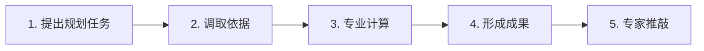
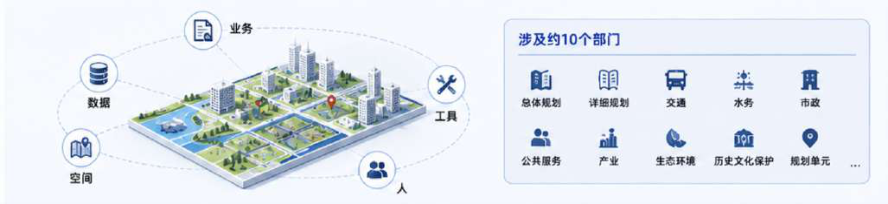
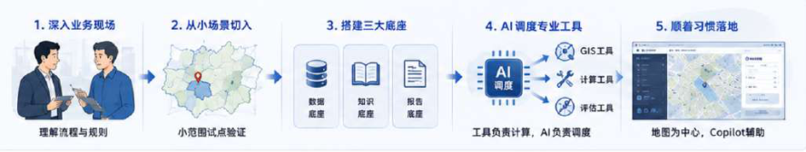
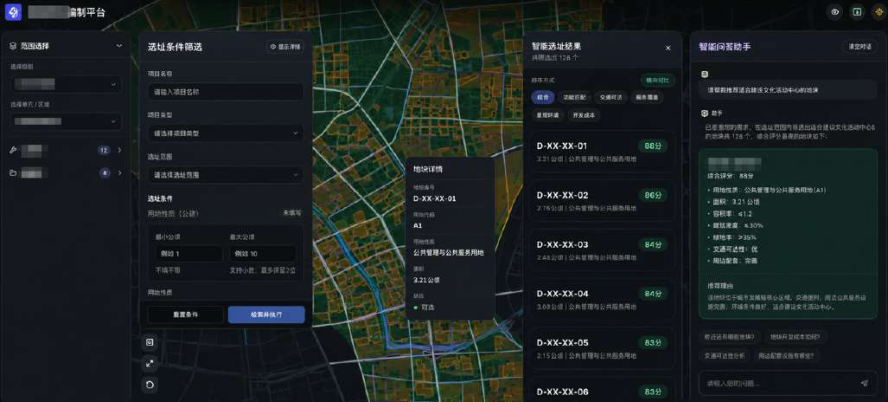
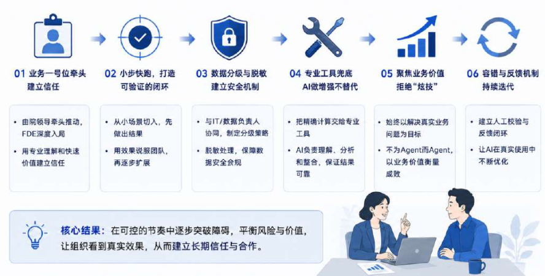
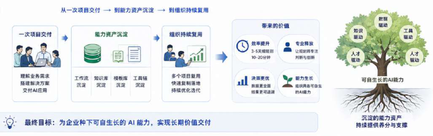

# CASE 04｜让AI调度专业工具

**行业**：城市规划　 **学习主题**：专业工具与计算　 **共学时间**：约10分钟

## 一句话简介

FDE团队帮城市规划院解决跨部门查规则、调地图数据、跑计算和拼报告太费时的问题，先选一个小片区，把真实数据、规划规定和GIS工具接到地图工作台里，让AI替规划师组织这些步骤，已跑通的试点把原本3—5天的综合报告整理压到约10—20分钟，最后仍由规划师推敲和决定。

[案例主页](../README.md) · [返回目录](../../README.md) · [本例JSON](case.json) · [完整访谈](#full-interview) · [原PDF](../../../sources/original-interviews.pdf#page=34)

原题：从人工研判到智能调度：FDE用AI重构城市规划研判流程

来源范围：PDF物理页 34–46；书内页码 33–45。

**本例值得讨论的判断（编辑提炼）**：专业计算交给工具，规划判断回到人。

> 阅读提示：标为“访谈概括”的内容来自受访者陈述；“补充分析”是编辑解释；“迁移演练”是迁移假设。效果数字保留原文的试点、目标、估算和脱敏条件。前半部用于备课和学习，后半部完整保留原访谈。

## 1. 业务现场与行业特点

### 发生了什么｜访谈概括

城市规划涉及总体规划、道路、水务、市政、产业和公共服务等约十个部门，既有业务指标，也有坐标、图层和空间关系。同一个选址任务要同时考虑不同约束，专业人员还必须解释一块地为什么可选、另一块地为什么不合适。

规划院本来就有GIS和其他专业软件，员工的数字素养也不低。问题出在跨工具、跨部门的串联：一个任务要找数据、翻规定、运行空间计算、标注地图，再把各部门结果汇总成报告，专业计算本身的精度要求又使核对不可省略。

关键现场事实：

- 规划设计院，约10个部门参与一期
- 业务属性、空间数据、规则与GIS工具相互耦合
- 试点约20–30名专员使用

**原工作路径**：查资料与规则 → GIS叠图计算 → 跨部门讨论 → 汇总规划报告

**重新定义的问题**：完整报告常需3–5天；“一句话出报告”背后有复杂空间约束与专业语义。

依据：[原PDF物理页 35、36、37](../../../sources/original-interviews.pdf#page=35)；需要核实具体说法请查看[完整访谈](#full-interview)。

扩充段落主要参照：[Q1](#q1)、[Q2](#q2)；原PDF物理页 34–46。

### 为什么需要FDE｜补充分析

在存量空间里找方案时，约束之间经常互相影响。保护线、道路关系或承载能力不是模型可以凭常识补齐的信息。因此这类FDE项目更适合把“理解任务”与“专业事实、计算和决策”分开，让真实数据和工具形成可追溯的依据。

结果影响真实建设，需精度和可追溯性；专业软件齐全，但跨部门流程仍靠人串联。

要学懂部门语义、缩小数据范围、封装专业工具，并找到能协调部门的执行负责人。

## 2. 解决思路怎样形成

### 从调研到方案的过程｜访谈概括

FDE先学习行业术语和各部门工作方式，弄懂指标含义、空间计算和交付习惯，形成能与规划师讨论问题的基础。随后主动缩小范围，从全市缩到一个区、再到具体单元，只选择两条明确业务流，并让试点部门准备这些流程真正需要的数据。

团队把底层工作分成数据、知识和报告三部分：关键数值来自真实数据与专业计算，规划规定通过检索找到，输出结构则根据各部门和行业模板归纳。这样，报告生成被约束在已有证据与交付结构之内。

模型负责理解任务、组织分析和调用工具，GIS等工具负责精确计算。高频且规则固定的任务固化为工作流，开放性较强的任务再交给Agent。交互仍以地图为中心，左侧条件和工具、中间地图、右侧助手，分析结果直接回到规划师熟悉的工作台。

| 现场信号 | 形成的决定 |
|---|---|
| 全市、全数据接入容易失控 | 缩到具体单元，只验证两条业务流 |
| 规划师需要准确事实和计算 | 建设数据、知识、报告模板三个底座 |
| 地图才是真正工作中心 | 保留工具＋地图＋Copilot，结果回显地图 |

依据：[原PDF物理页 38、39、40](../../../sources/original-interviews.pdf#page=38)；需要核实具体说法请查看[完整访谈](#full-interview)。

扩充段落主要参照：[Q3](#q3)、[Q5](#q5)、[Q6](#q6)；原PDF物理页 34–46。

### 这些取舍为什么重要｜补充分析

范围取舍比功能数量更关键。若把所有部门和系统设成启动前提，任何一方缺数据都会拖住项目。这里选择在资料暂缺时减少场景或计算项，仍保住核心交付；相应地，报告必须让使用者知道覆盖范围，不能把局部试点包装成全市完整分析。

技术先进性也让位于任务结构。不同专业视角不必都实现成互相对话的多个Agent；能够封装为工具或用传统优化算法解决的部分，可以由一个核心Agent调度，减少上下文传递歧义，使结果更易收敛。

## 3. 工作流程与人机分工

以下流程图和职责划分是依据访谈所作的业务抽象，不补造未披露的技术架构。



| 步骤 | 实际作用 |
|---|---|
| 1. 提出规划任务 | 范围、目标与指标澄清 |
| 2. 调取依据 | 真实空间数据＋规则检索 |
| 3. 专业计算 | 调用GIS/算法，固定任务用工作流 |
| 4. 形成成果 | 一文、一图、一表 |
| 5. 专家推敲 | 人决策；可复用流程沉淀为Skill |

| 角色 | 负责什么 |
|---|---|
| AI | 理解任务、组织分析、调度工具 |
| 系统 | GIS精确计算、数据与规则、报告模板 |
| 人 | 规划判断、最终选址、协调数据责任 |

依据：[原PDF物理页 39、40、43、44](../../../sources/original-interviews.pdf#page=39)；需要核实具体说法请查看[完整访谈](#full-interview)。

## 4. 交付物、实际使用与组织采用

### 交付后怎样工作｜访谈概括

面向用户的核心交付是“一文、一图、一表”：有依据的说明、可核对的地图结果与分析表。规划师能够沿着结果继续讨论和修改，而不仅得到一个聊天回答。地图上的空间对象与报告中的结论之间需要保持联系。

面向后续复用的资产包括整理过的数据、规划知识、报告结构与专业工具封装。随着项目推进，部分部门开始自己把识别、计算、处理和输出候选地块的流程整理成Skill，FDE的工作也逐渐从替客户做功能转向指导下一步架构和应用选择。

| 交付物 | 交付内容 |
|---|---|
| 地图工作台 | 左侧条件与工具、中间地图、右侧Copilot |
| 一文一图一表 | 即使部分部门缺数据也保住核心交付 |
| 工具与Skill资产 | 不同专业能力工具化，客户逐步自行搭工作流 |

### 实施与推广｜访谈概括

先治理试点必要数据；找到“执行一号位”。原文混合部署描述有含混，具体合规边界未展开。

跨部门推动依赖真正能协调资源的执行负责人，不一定只靠项目发起领导。部署方面，访谈提到数据安全要求、本地模型能力限制、提示与工程规则补偿，以及含混的混合部署描述；应保留这些约束，不据此推断某类数据已获准向外部模型发送。

依据：[原PDF物理页 40、41、42、43](../../../sources/original-interviews.pdf#page=40)；需要核实具体说法请查看[完整访谈](#full-interview)。

扩充段落主要参照：[Q3](#q3)、[Q4](#q4)、[Q5](#q5)；原PDF物理页 34–46。

## 5. 实际成效与证据边界

### 原文报告的变化

| 指标 | 原来或参照 | 后来或状态 | 必须保留的限定 |
|---|---|---|---|
| 跨部门完整报告 | 约3–5天 | 试点约10–20分钟 | 可继续推敲的报告，非最终审批耗时 |
| 部分单项分析 | 约1小时 | 约5–10分钟 | 限已跑通流程与任务 |
| 组织采用 | 一期约10部门 | 约20–30名专员 | 部分部门开始自行沉淀Skill |

### 如何理解效果｜补充分析

原文的10—20分钟针对已经跑通的试点流程中可继续推敲的综合报告，单部门部分分析和表格约从一小时变为5—10分钟，一期约20—30名专员使用。它不能被解释为任何规划任务都能在20分钟完成，也不能替代正式规划决策及后续专业责任。

**证据边界**：效果限试点；不把缺数据当作满足全部规划约束，实际部署仍需明确数据流。

依据：[原PDF物理页 40、41、42、43、44](../../../sources/original-interviews.pdf#page=40)；需要核实具体说法请查看[完整访谈](#full-interview)。

## 6. 难点、应对与可复用经验

| 难点 | 原文中的应对 |
|---|---|
| 部门不愿给规则和数据 | 执行负责人协调；缺项时缩范围 |
| 模型能力与环境约束 | 用工具封装、提示与工程规则补足 |
| 期待复杂多Agent形态 | 按任务选单Agent调工具或传统算法 |

依据：[原PDF物理页 40、41、42、43、44](../../../sources/original-interviews.pdf#page=40)；需要核实具体说法请查看[完整访谈](#full-interview)。

**可复用的方法（编辑归纳）**：结合第2节的关键取舍，关注真实任务如何被重新定义、可交付结果由谁确认，以及组织如何继续使用和修改。原受访者的全部经验保留在[Q6](#q6)。

## 7. 迁移到其他工作场景的讨论｜4分钟

以下是通用研发场景中的假设练习，不代表案例客户或任何学习者所在组织已经开展或验证了这些项目。

一位研发客户希望“一句话做完材料筛选”，任务涉及文献、结构、模拟与实验多个团队。

**讨论问题**：客户要求多智能体讨论，但专业任务已有明确算法，应如何设计？

**本组应交出的产物**：画出模型、计算工具与专家的三条责任边界，并指定一个最小试点。

个人思考40秒 → 小组讨论100秒 → 共识与质疑70秒 → 主持人收束30秒。

<details>
<summary>展开：迁移试点、验收与主持人参考</summary>

研发团队可以把这一模式用在“用自然语言提出计算或筛选任务，调用专业工具，形成可复核结果”的科研工作台。先限定一个材料体系、两类任务和一组可靠数据，把模型、模拟软件、数据库与专家分别负责什么画清楚。

试点交付可以对应一份分析说明、一张结构或结果图、一张可追溯结果表。验收时从报告结论逆向找到输入、工具版本、参数和执行记录，并检查异常计算是否被识别；开放式科学解释交给专家，不用漂亮报告替代有效性判断。

**建议切口**：收敛到一个材料体系、两条流程；让Agent调用专业计算，统一输出报告、结构图与结果表。

**建议验收**：建议验收：计算可复现、输入与工具版本可追溯、专家复核通过率。

**适用限制**：不能用语言模型代替数值求解；缺少关键科学约束时必须停止或标记未完成。

**主持人参考**：参考：按任务分工而非按“专家人设”堆Agent；不把多Agent数量作为交付指标。

</details>

可以直接对Codex说：

```text
请带我学习案例04。先讲清项目做了什么，再用一个关键问题让我做判断。
讲事实时引用原PDF页码；讨论迁移方案时明确标为假设。
```

## 8. 原图与受访者介绍

[查看原案例封面与受访者介绍](../../../assets/cover_34.png)。人物姓名、职位及图片内文字以原PDF为准。

### 原图 1｜原PDF第35页



[回到原PDF第35页](../../../sources/original-interviews.pdf#page=35)

### 原图 2｜原PDF第37页


[回到原PDF第37页](../../../sources/original-interviews.pdf#page=37)

### 原图 3｜原PDF第38页



[回到原PDF第38页](../../../sources/original-interviews.pdf#page=38)

### 原图 4｜原PDF第40页


[回到原PDF第40页](../../../sources/original-interviews.pdf#page=40)

### 原图 5｜原PDF第41页



[回到原PDF第41页](../../../sources/original-interviews.pdf#page=41)

### 原图 6｜原PDF第42页



[回到原PDF第42页](../../../sources/original-interviews.pdf#page=42)

### 原图 7｜原PDF第44页



[回到原PDF第44页](../../../sources/original-interviews.pdf#page=44)

<a id="full-interview"></a>

## 9. 完整原始访谈

以下6组问答逐段保留原PDF文字层的原始提取内容。原有换行、术语或转义保留，不以编辑详解替代原文。文字层未包含的图片信息，请查看上方原图及[完整PDF第34–46页](../../../sources/original-interviews.pdf#page=34)。

<details>
<summary>展开全部访谈：Q1–Q6</summary>

<a id="q1"></a>

### Q1

Q1：作为FDE，你应用AI的具体场景是什么？在这个场景下遇到
的具体问题长什么样？
图1：项目背景
城市规划这个行业本身比较特殊。规划设计不是拿到一张表、做几个分析、生成一份报
告这么简单，它背后有非常复杂的专业分工。
比如要规划一个方舱医院，首先是总体规划部门判断大概应该落在哪个片区；再往下，
要看这个地方有哪些规划约束和规则；真正落到具体地块时，还要进一步考虑道路、水
务、市政、公共服务、产业等一系列因素。
所以我们真正要打交道的，有大约10个部门。
更复杂的是，这个项目里不仅有普通的业务数据，还有空间数据。
以前我们做很多政务、电商或者其他企业项目，主要处理的是二维业务数据，也就是这
个东西叫什么、属性是什么、参数是多少。但城市规划多了一层空间关系。一块工业用
地，不仅要知道它的业务属性，还要知道它具体落在地图上的哪个坐标、和周围哪些道
路或设施发生关系。
除此之外，每个部门还有自己的专业工具、业务语义、数据规则和工作流。
所以我后来总结，这个场景真正的难点，是把业务、数据、空间、工具这四件事情连起
来。
而且最后还有第五件事，就是人。
因为10个部门的人工作方式不一样，对同一个指标的理解也可能不一样。你必须把他们
真正使用的业务语言、计算规则和工作流程理解清楚，否则AI生成出来的东西看起来很
专业，真正的规划师一看就知道不对。
为什么这个问题值得做？
因为城市规划本身正在发生变化。过去城市快速扩张的时候，很多规划是在增量空间里
做选择；现在更多是在已有城市空间和存量地块里找最优解。规划做得越来越精细，决
策涉及的约束也在变多。
而规划师原来的工作流程又非常重。
领导可能只说一句：“帮我看看识别下xx区域的潜力用地有哪些？”下面的人就要开始
查资料、调数据、做空间分析、跑工具、讨论，最后才能形成报告。
所以我们最开始看到的机会，是能不能先把规划师每天反复做、规则相对明确、数据能
够追溯的那部分工作接下来，让人把时间留给真正需要判断和创新的事情。
这也是我后来判断一个场景值不值得用AI的一个基本标准：它是不是重复发生？重复成
本是不是足够高？工作流能不能定义？背后的事实和数据能不能追溯？涉及的专业工具
能不能被调用？
如果这些条件都不存在，只是为了“AI First”硬找一个场景，我觉得没有必要。

<a id="q2"></a>

### Q2

Q2：在你参与之前，这个问题过去是怎么解决的？
其实规划设计院原来的数字化程度并不低。他们不缺软件，使用的专业软件反而非常复
杂。规划师本身也是典型的高数字素养人群。
过去接到一个规划任务后，规划师通常先查大量资料，再进入GIS类专业工具，叠加不同
图层、运行脚本、做空间计算和标注，然后根据结果形成自己部门的判断。
如果最后是一份综合规划报告，还需要把多个部门的分析再汇总起来。
一个人的单项分析，过去可能需要一个小时左右；一份跨部门的完整报告，专业人员通
常也需要3—5天，有时候接近一周。
图2：项目痛点
这个时间不能说明他们效率低，真正的原因是城市规划对精度要求非常高。
一条道路画在哪里、一个地块碰没碰到历史文化保护线、一个区域的污水承载能力够不
够，这些都不能随便回答。规划一旦出错，后续可能影响真实建设，所以很多结果必须
反复核对、修改和讨论。
比如做选址。系统可能先筛出20块候选地块，但最后从20块里面挑出真正适合的10块，
过去往往还需要不同部门开几轮会，结合各种专业指标继续判断。
所以传统方式其实有它存在的合理性：专业人员掌握规则，专业工具保证计算精度，人
的经验负责最终判断。
问题是随着需要考虑的数据、规则和部门不断增多，这套流程也越发沉重。大量专业人
员的时间被消耗在查资料、找规则、切换工具、重复计算、整理报告这些事情上。
这也说明，规划院的数字化工具其实一直在，只是它们解决的是单个环节的计算精度，
没有一个角色把业务、数据、空间和工具真正连接起来，于是跨部门、跨工具的流程依
旧靠人来串联。
因此我们做AI改造的时候，没打算把传统流程推翻。我的思路反而是，原来正确的东西
尽量留下，把机器更擅长的部分接过去。

<a id="q3"></a>

### Q3

Q3：后来你使用AI解决这个问题的整体思路和关键步骤是什
么？
图3：实施路径
这个项目对我影响比较大的一个地方，是让我慢慢想清楚了一件事，FDE要先进入现
场，再决定到底应该用什么。
第一步，先把自己逼成“半个规划师”。
城市规划这个行业很专业。刚进去的时候，他们有很多专业册子，非常厚。很多术语如
果你不知道，根本没办法跟业务人员继续聊。
比如对方问你“候选地块是什么意思”“潜力用地分析是什么意思”，如果连这些基础业
务概念都答不上来，后面其实很难建立信任。
所以我当时给自己的要求是，先把自己变成他们中的一员。我不需要真的达到规划师的
专业水平，但至少要知道他们每天在干什么，为什么这么做，一个指标到底代表什么，
一种空间计算为什么这么算。
我们会到不同部门去聊，把他们数值的意义、空间计算方式、业务指标、工作流程一点
点搞清楚。
这一步看起来不像“做AI”，但我觉得恰恰是FDE最核心的工作。因为只有理解业务，你
才知道什么应该交给模型，什么应该交给专业工具，什么必须留给人。
第二步，先不做本市，先把问题缩到足够小。
如果一开始就把全市的数据、所有部门、所有第三方系统、所有业务规则全部接进来，
项目很容易陷入一个永远做不完的数据工程。
所以我们后来主动收敛。从整个市，缩到一个区，再缩到类似米市巷这样的具体单元，
然后只挑两条明确的业务流验证。
这个决策后来我觉得非常重要，场景足够小，数据才有可能搞干净；数据搞干净，结果
才可能足够精准；结果足够精准，业务人员才愿意相信。
所以一期我们没有把所有第三方系统和数据中台全部接进来，只让参与试点的部门先筛
选真正需要的数据，把这一小块场景的数据治理好。
第三步，把“数据、知识、报告”三个底座先做扎实。
我们当时为什么敢说20分钟生成的报告是“可推敲”的？主要靠的是底下三件事。
第一是数据。报告里的关键数据尽量来自规划院提供的真实数据，并通过专业计算得
到，不让模型自己猜。
第二是知识。我们把相关规划规则、专业文档等知识整理出来，通过检索增强的方式让
AI能够找到依据。比如一个写字楼为什么不能建在某个位置，可能是碰到了历史文化保
护线。过去规划师要去大量PDF里找相关规定，现在可以更快定位到对应规则。
第三是报告模板。不同部门原来都有自己的报告习惯，我们把各部门模板以及行业里的
模板拿过来，最后归纳出一个相对通用的输出结构。
所以最后AI是在真实数据、专业规则和固定报告结构里工作，不再凭空写作。
第四步，让AI调度专业工具，把计算留给工具。
这个也是我们后面非常重要的一个判断。很多规划计算其实有明确规则。既然有专业GIS
工具能够精准计算，就没有必要让大模型自己算。
所以我们的分工慢慢清晰起来：模型负责理解和分析，专业工具负责事实和计算，人负
责最终决策。
AI更像一个调度者。比如规划师提出一个选址任务后，AI理解他的意图，再调用对应的
数据和专业工具完成分析，把计算结果返回出来。
对于高频、规则明确的任务，我们更倾向于把它固化成工作流；对于城市研判、潜力用
地分析这种长尾、开放性更强的问题，再交给Agent处理。
第五步，产品要顺着原来的工作习惯长出来。
我们没有把所有东西都变成一个聊天框。因为规划师真正工作的中心是地图。
所以最后的交互仍然保留了他们熟悉的方式。左边是筛选条件和专业工具，中间是地
图，右边才是Copilot。AI调用工具或者完成分析后，结果会直接回显到地图上。
这件事情我后来觉得很重要。做AI产品很容易陷入一个误区：既然有Agent，就把所有
功能都塞进一个输入框。但FDE要考虑的是用户原来怎么工作。
地图才是规划师真正的工作台，AI就应该围绕地图服务，让规划师继续按原来的方式工
作，不必为了AI重新学一套工作方式。

<a id="q4"></a>

### Q4

Q4：相比传统方式，使用AI后的实际效果如何？
图4：Before/After
变化最先反映在时间上。
过去一份跨多个部门的完整规划报告，通常需要3—5天，有时接近一周。现在在已经跑
通的试点流程里，大约10—20分钟就可以形成一份能够继续推敲和交付的报告。
如果只看单个部门，过去一个小时左右才能完成的一些分析和表格，现在大约5—10分钟
就可以完成。
一期涉及大约10个部门，目前大概有20—30名专员在使用。
图5：用户动线
但我后来慢慢意识到，这个项目真正的价值远不止“3—5天变成20分钟”。还有两个变
化更重要。
第一个是，规划师开始从大量重复操作里脱离出来。以前很多时间花在查资料、找规
则、操作工具和整理结果上。现在这些工作被压缩以后，人可以把更多精力放在真正需
要专业判断的事情上。
而且AI有时候会给出一些原来工作流之外的潜在分析因子。比如判断一个区域经济活跃
度，过去可能看交易、车流等传统指标，但AI可能提示还可以观察停车场闸机频率、房
屋空置率、人口画像等其他信号。这些建议未必直接就是答案，但它能给规划师提供新
的研究视角。
第二个变化，是组织本身开始发生变化。第一期我们陪着不同部门一起梳理工作流。后
来有些部门已经开始自己把“识别、计算、处理、输出候选地块”这样的流程沉淀成
Skill。
也就是说，他们已经在学习怎么自己搭AI工作流。
对我来说，这才是FDE和传统外包很不一样的地方。好的FDE项目，是交付结束以后客
户自己开始长出AI能力。

<a id="q5"></a>

### Q5

Q5：在部署AI过程中，是否遇到了新问题或挑战？你是怎么解
决的？
图6：FED的六个核心
当然有，而且真正难的问题很多都不在模型。
第一个挑战，是部门不一定愿意给你数据和规则。
10个部门里，有人天然支持AI，也有人心存顾虑，担心这套东西上线以后会影响自己的
岗位和价值。所以我们去问业务规则、要数据的时候，有的人回复会很慢，甚至直接
说：“这些网上都有，你们自己查。”
但实际上很多规则只有真正做业务的人才知道。这个时候，FDE不能只靠技术解决。
我慢慢摸清了一个规律，在这种复杂组织里，找到真正能推动项目的“执行一号位”非
常关键。项目发起人可能是副院长，但真正能协调10个部门、知道谁最难推动、谁掌握
什么数据的人，往往是下面那个负责总调度的人。我们必须先跟这个人聊透。
与此同时，我也给方案留了容错空间。如果某个部门暂时不给数据，我不会让整个项目
因此停下来。少一个部门，就先少做一个场景；少一类数据，就先让这一部分不参与计
算。但是最后整体链路必须能够跑通。
我当时给自己定了一个很简单的交付原则：“一文、一图、一表”必须出来。即使少一
个节点，核心交付形态仍然成立。这让我意识到，FDE做方案不能把每个环节都设计成
“缺一不可”，否则一个部门不配合，整个项目就会被拖死。
第二个挑战，是模型能力和数据安全之间的矛盾。
当时因为数据安全要求，生产环境不能随便使用国外模型。但那个阶段可选的本地模
型，在一些复杂任务上的效果又没有达到我们想要的状态。偏偏领导还会随时要求演
示。
这时候你会发现，做真实项目和做Demo完全不一样。Demo只需要“这一次跑得漂
亮”；生产系统则必须考虑安全、稳定、准确、可追溯。
所以我们后来会通过更明确的系统提示、工具封装和工程规则去弥补模型能力，同时把
真正需要精准计算的东西尽量交给专业工具，减少对模型自由生成的依赖。技术上，我
们选用混合部署，比如推理复杂场景的我们选用运模型，跑固定流程的我们走本地部署
模型，比如Qwen7b。
这也是我后来特别深的一个体会：模型能力只是整个系统的一部分，真正决定能不能上
线的，还有数据、工具、评估和兜底。
第三个挑战，是客户想要的“AI效果”不一定真的是最好的解法。
一开始客户希望做到“一句话出报告”。听起来很自然，但真正深入之后我们发现，如
果把它简单理解成意图澄清后，再把问题转成SQL去数据库查询，其实很难满足规划业
务的复杂性。所以我们建议把“万能问数”先放一放，让AI理解任务以后调用真正的专业
工具完成处理。
到了后续阶段，又出现过类似的问题。比如大家会期待“多智能体博弈”：法律专家、
经济专家、民生专家坐在一起讨论一个规划议题。听起来很先进。
但我们真正分析业务后发现，有些选址问题最终还是依赖明确的规则和指标计算。这种
情况下，强行做多智能体，不但架构更复杂，上下文在多个智能体之间传递还可能带来
歧义、丢失和污染，结果反而不够收敛。
所以我们的思路慢慢变成，表面上可以体现不同专业视角，但底层未必真的需要多个
Agent互相聊天，可以把不同专业能力封装成工具，由一个核心Agent统一调度。甚至
某些寻找最优解的问题，本身就不一定应该用大模型，传统优化算法可能更加精准。
这个过程让我越发笃定，FDE的职责是帮客户判断，什么地方真的应该用AI，什么地方
不应该。

<a id="q6"></a>

### Q6

Q6：根据你的经验，我们怎么才能更好地把AI部署到实际业务
中？
图7：FDE的价值
做完这个项目以后，我对FDE最大的理解变化，是不再觉得FDE首先是一个“懂模型的
人”。
第一，先进入业务。
如果做律师业务，就真的跟着律师跑一遍；如果做城市规划，就想办法让自己成为“半
个规划师”。很多企业表面上说出来的问题其实不是真问题。只有真正跟着他们把工作
流跑一遍，你才会发现，哪些事情每天都在重复，真正贵的成本在哪里，哪些步骤看起
来不起眼却决定最后结果。
第二，不要一上来做大。
我们这个项目一开始也可以讲一个很大的故事：整个市、所有数据、所有规划场景全部
智能化。但真正让项目跑起来的，是不断收敛。从一个城市缩到一个区域，再缩到一个
具体单元，再挑两条工作流。先找到一个足够小、足够真实、能够形成闭环的场景，跑
通之后，再扩。
第三，不要迷信技术先进性。
客户要的是解决问题，不是技术框架。硬编码能解决，就可以硬编码；若当前任务固定
工作流合适，就用工作流；若当前任务较灵活，Agent适合开放任务，就用Agent；若
当前任务需颗粒度小，传统算法比大模型精准，就用传统算法。
我现在更看重的是，模型、数据、工具、人和评估怎么组合起来，形成一个真正可交付
的系统。尤其是评估和兜底。Demo很好做，真正难的是，数据错了谁发现？模型给错
建议怎么办？计算结果能不能追溯？最后谁对决策负责？这些问题解决不了，再酷的
Demo也进不了真实业务。
第四，理解FDE自己的角色也会变化。
我在这个项目里其实经历了三个阶段。最开始，我像一个新人和助理，先进去学习他们
的行业，把自己变成他们中的一员。等我理解业务以后，我开始帮助他们重新定义问
题、设计流程、判断哪些地方适合用AI。再往后，当他们自己已经会做Skill、会Vibe
Coding、会尝试搭自己的AI应用时，我的角色又变了。这时候我不一定还要替他们写每
一个功能，可以站到更高一点的位置，告诉他们下一步有哪些坑，架构怎么选，哪些方
向值得投入。
所以我现在更确定，FDE最终做的，是陪企业重新审视一遍自己的业务，找到真正的问
题，把业务知识变成可执行的流程，再把AI放到最适合它的位置上。我们要像“竹子”一
样扎进去，当有一天，客户自己开始理解AI、改造工作流，甚至能够自己做新的Skill
时，这个项目才真正从一次技术交付，变成了企业内部持续生长的AI能力。

</details>

[返回案例目录](../../README.md) · [本例结构化数据](case.json)
