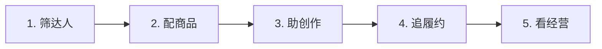

# CASE 05｜把达人运营串成业务链

**行业**：跨境达人电商　 **学习主题**：经营协同与价值　 **共学时间**：约10分钟

## 一句话简介

FDE团队帮一家做海外TikTok电商的企业，把人工找达人、从上万件商品里配货、催拍视频和翻表格看进度这些工作串起来，用AI先筛人配商品、给拍摄脚本，再由系统提醒履约和转交异常任务，试运行中合作达人的平均履约时间从约一个月缩短到18天，运营能把更多时间用来谈合作。

[案例主页](../README.md) · [返回目录](../../README.md) · [本例JSON](case.json) · [完整访谈](#full-interview) · [原PDF](../../../sources/original-interviews.pdf#page=47)

原题：从大海捞针到全链路提效：FDE用AI重构TikTok达人建联与履约

来源范围：PDF物理页 47–56；书内页码 46–55。

**本例值得讨论的判断（编辑提炼）**：运营人员不再翻表找工作，系统把异常送到人面前。

> 阅读提示：标为“访谈概括”的内容来自受访者陈述；“补充分析”是编辑解释；“迁移演练”是迁移假设。效果数字保留原文的试点、目标、估算和脱敏条件。前半部用于备课和学习，后半部完整保留原访谈。

## 1. 业务现场与行业特点

### 发生了什么｜访谈概括

客户承担类似带货团长的角色：商家需要达人推广商品，客户从达人资源中筛选人选，推进接品、寄样、创作和提交。真正的业务结果出现在后端商品交易，而前端找人、匹配和催履约分散在不同岗位。

小规模时，运营能凭记忆维护几十个达人，再用飞书和Excel补充记录。商品池增加到上万件、达人数量变多后，人工记忆和翻表格难以维持。TikTok、运营表格和财务系统中的记录分开，管理者也难以判断一个达人究竟产生了多少价值。

关键现场事实：

- 国内头部电商的海外TikTok达人建联业务
- TAP连接商家与达人；选品池上万个商品
- BD、履约、财务和管理者原先各自维护数据

**原工作路径**：人工找达人 → 按经验配商品 → 寄样并反复催 → 拼接各系统数据

**重新定义的问题**：客户只说“AI赋能”；实际瓶颈贯穿找人、匹配、创作动力、履约与GMV追踪。

依据：[原PDF物理页 48、49、50](../../../sources/original-interviews.pdf#page=48)；需要核实具体说法请查看[完整访谈](#full-interview)。

扩充段落主要参照：[Q1](#q1)、[Q2](#q2)；原PDF物理页 47–56。

### 为什么需要FDE｜补充分析

达人合作同时包含可标准化的信息处理和难以标准化的人际关系。标签匹配、截止日期和样品状态适合系统处理；重要达人的合作意愿、表达方式与商务关系则需要判断。因此改善整条业务链，需要分清每个环节的错误代价和人所提供的价值。

规模扩大后，人选商品、催履约和跨表追踪成为瓶颈；高价值达人关系仍依赖人的信任。

需要同时理解全链路、海外数据权限和高价值商务关系的风险，重新划分人机职责。

## 2. 解决思路怎样形成

### 从调研到方案的过程｜访谈概括

客户最早只说希望AI赋能团队。FDE从老板、部门负责人到小组负责人逐层访谈，把达人进入、建联、选品、拿样、创作、履约和复盘画成流程，逐项确认操作者、输入、输出和必须由人完成的判断。

在前端，AI协助筛选达人并匹配商品，让人从逐项寻找转向复核候选。在内容创作环节，团队发现部分达人不是不想交视频，而是不知道怎么拍，于是把达人特点、商品卖点和内容参考组合起来，提供可选择的脚本，直接帮助合作方推进创作。

履约环节根据收样、完成情况和截止时间生成提醒，仍无进展的任务再交给运营。随后把建联、商品、履约、样品投入与GMV放到统一视角中，让管理者看到从合作到交易的过程，而不只是几个孤立总数。

| 现场信号 | 形成的决定 |
|---|---|
| 从老板到一线逐层访谈 | 画出建联—选品—拿样—创作—复盘链路 |
| 达人拿样后常卡在不会拍 | 提供结合人设、卖点与参考内容的脚本 |
| 自动联系可能伤害核心资产 | AI做初筛；重要达人沟通仍由BD完成 |

依据：[原PDF物理页 50、51、53、54](../../../sources/original-interviews.pdf#page=50)；需要核实具体说法请查看[完整访谈](#full-interview)。

扩充段落主要参照：[Q3](#q3)、[Q5](#q5)、[Q6](#q6)；原PDF物理页 47–56。

### 这些取舍为什么重要｜补充分析

方案没有走向完全自动的达人建联。重要合作关系中，一句话说错可能损失长期信任；因此筛选和提醒适合自动化，高价值商务沟通仍由人承担。边界取决于错误的业务后果，而非功能在技术上能否自动执行。

履约改进也不仅是增加催促频率。给达人脚本是在帮助对方把任务做完，系统提醒则帮助运营发现需要介入的节点。两者对应不同阻塞原因，单纯更勤地发消息未必能得到同样的改善。

## 3. 工作流程与人机分工

以下流程图和职责划分是依据访谈所作的业务抽象，不补造未披露的技术架构。



| 步骤 | 实际作用 |
|---|---|
| 1. 筛达人 | 商品信息与内容标签匹配 |
| 2. 配商品 | 卖点提取＋人工确认 |
| 3. 助创作 | 提供多个脚本选项 |
| 4. 追履约 | 按状态提醒，超时升级人工 |
| 5. 看经营 | 串起达人、履约、GMV与样品成本 |

| 角色 | 负责什么 |
|---|---|
| AI | 初筛、商品匹配与脚本辅助 |
| 系统 | 履约状态、自动提醒与统一业务视角 |
| 人 | BD维护关系，处理商务和异常履约 |

依据：[原PDF物理页 50、51、52](../../../sources/original-interviews.pdf#page=50)；需要核实具体说法请查看[完整访谈](#full-interview)。

## 4. 交付物、实际使用与组织采用

### 交付后怎样工作｜访谈概括

运营人员得到的日常入口是待处理的候选人与任务：先查看AI筛选和匹配结果，处理系统筛出的异常，再负责真正需要沟通的合作。达人得到的是拍摄思路与脚本选择，这部分能力减少了对方创作上的卡点，也为更快履约提供了条件。

管理者看到的是按达人串联的业务记录，可以追踪进入了哪一步、样品花费和后续交易表现。该视角使客户有条件讨论哪些合作值得继续；访谈没有披露统一归因模型，因此不能把看板中的交易额都当作AI带来的新增收入。

| 交付物 | 交付内容 |
|---|---|
| 推荐名单与商品匹配 | BD从寻找目标转为和目标沟通 |
| 脚本与履约任务 | 帮助达人开拍，并把待办主动分配给运营 |
| 贯通业务的数据视图 | 将达人投入、样品、履约与GMV关联 |

### 实施与推广｜访谈概括

数据权限与部署确认耗时接近1个月；兼顾上层目标与基层负担。AI视频生成属未来探索。

跨境数据申请、权限账号和服务器部署确认用了接近一个月，数据流向与留存要求直接影响可做范围。组织推进同时面向管理层和一线人员，强调工具怎样帮助处理现有工作，避免只依据老板的一句提效要求设计系统。

依据：[原PDF物理页 50、51、52、53](../../../sources/original-interviews.pdf#page=50)；需要核实具体说法请查看[完整访谈](#full-interview)。

扩充段落主要参照：[Q3](#q3)、[Q4](#q4)、[Q5](#q5)；原PDF物理页 47–56。

## 5. 实际成效与证据边界

### 原文报告的变化

| 指标 | 原来或参照 | 后来或状态 | 必须保留的限定 |
|---|---|---|---|
| 平均达人履约 | 约1个月 | 试运行约18天 | 限当时配合达人；未披露样本与时段 |
| 运营方式 | 人工找人/找任务 | 推荐＋异常待办 | BD更集中于沟通与关系 |
| 管理视角 | 分散表格 | 达人—履约—GMV | 未披露收入或ROI净增量 |

### 如何理解效果｜补充分析

约一个月到18天是试运行期间配合达人的平均履约反馈，包含寄样、创作和提交等环节。原文没有给出样本规模、完整观察期或对照组，所以适合说明当前试点变化，不能写成全平台长期保证，更不能直接推导GMV增长幅度。

**证据边界**：18天是试运行反馈；推荐、脚本、提醒等共同作用，不能单独归因于某个模型。

依据：[原PDF物理页 52、53](../../../sources/original-interviews.pdf#page=52)；需要核实具体说法请查看[完整访谈](#full-interview)。

## 6. 难点、应对与可复用经验

| 难点 | 原文中的应对 |
|---|---|
| 跨境数据权限和留存 | 先确认数据申请、账号和服务器要求 |
| 重要关系的错误代价高 | 不做全自动重要达人建联 |
| 员工担心被替代 | 从减轻真实负担切入，贯通多层沟通 |

依据：[原PDF物理页 52、53](../../../sources/original-interviews.pdf#page=52)；需要核实具体说法请查看[完整访谈](#full-interview)。

**可复用的方法（编辑归纳）**：结合第2节的关键取舍，关注真实任务如何被重新定义、可交付结果由谁确认，以及组织如何继续使用和修改。原受访者的全部经验保留在[Q6](#q6)。

## 7. 迁移到其他工作场景的讨论｜4分钟

以下是通用研发场景中的假设练习，不代表案例客户或任何学习者所在组织已经开展或验证了这些项目。

某企业的研发合作涉及线索筛选、样本交接、计算执行、报告交付与回访。

**讨论问题**：研发合作中，哪一类等待适合自动推进，哪一类必须交给人？

**本组应交出的产物**：选一条交付链，标注等待点、责任人和升级条件。

个人思考40秒 → 小组讨论100秒 → 共识与质疑70秒 → 主持人收束30秒。

<details>
<summary>展开：迁移试点、验收与主持人参考</summary>

跨组织的合作研发可能经历找合作方、匹配任务、交样、执行、交结果和复盘。可以先让系统整理匹配信息、交付状态和异常，帮助合作方理解数据模板或实验要求，把关键科学沟通留给负责人。

最小试验选一类合作任务，区分“对方还没收到输入”“不知道怎样交付”“执行有问题”“沟通承诺未兑现”几种状态。分别设计资料辅助、提醒和人工升级，观察从输入齐全到结果被接受的时间，而不只统计提醒次数。

**建议切口**：用任务状态串联合作过程；AI辅助匹配需求与能力，系统主动指出等待和异常。

**建议验收**：建议验收：样本到报告的周期、逾期任务比例、交付反馈回收率。

**适用限制**：关键客户关系与科学承诺由人负责；任务提醒不等于科学难题已经解决。

**主持人参考**：参考：资料缺项、样本到达、计算状态可系统触发；合作承诺和解释异常由人处理。

</details>

可以直接对Codex说：

```text
请带我学习案例05。先讲清项目做了什么，再用一个关键问题让我做判断。
讲事实时引用原PDF页码；讨论迁移方案时明确标为假设。
```

## 8. 原图与受访者介绍

[查看原案例封面与受访者介绍](../../../assets/cover_47.png)。人物姓名、职位及图片内文字以原PDF为准。

本例没有单独提取出的正文图片；封面、图内文字与全部页面仍保存在原PDF。上方流程图是编辑抽象。

<a id="full-interview"></a>

## 9. 完整原始访谈

以下6组问答逐段保留原PDF文字层的原始提取内容。原有换行、术语或转义保留，不以编辑详解替代原文。文字层未包含的图片信息，请查看上方原图及[完整PDF第47–56页](../../../sources/original-interviews.pdf#page=47)。

<details>
<summary>展开全部访谈：Q1–Q6</summary>

<a id="q1"></a>

### Q1

Q1：作为FDE，你应用AI的具体场景是什么？在这个场景下遇到
的具体问题长什么样？
这个项目的业务场景，是一家国内头部电商企业在海外TikTok生态里的达人建联业务。
如果用国内电商的经验来理解，TAP有点像“团长”。
商家有新品或者营销节点，希望在短时间内找到大量达人帮自己带货，就会先找到
TAP；TAP再从自己的达人资源里筛选合适的人，推动他们接品、拿样、创作内容，最
终把商品挂到达人账号上。这个角色本身解决的是一个很现实的问题：TikTok上商品太
多，达人不可能一个个去翻商品市场，也很难仅凭商品信息判断什么值得带，所以TAP
需要把商家和达人组织起来。
我们接触这个客户的时候，对方其实没有一开始就把问题定义得特别清楚。最开始他们
找到我时，问的是一个很宽泛的问题：“我们团队怎么用AI赋能？”所以我没有直接回
答，而是先反过来问他们：你们现在的业务到底怎么跑？哪个环节最慢？谁每天最累？
哪里最容易出错？
后来我们去了企业现场，从老板到部门负责人，再到各个小组负责人，基本都访谈了一
遍。访谈下来，我发现他们其实已经意识到自己效率不高，但之前所谓的数字化，更多
只是“先进团队先用飞书”，真正到了业务层面，依然有大量工作靠人工完成。我把整
个业务放在一起看，发现这个问题贯穿了好几个环节。
第一是达人建联，找人难。
运营人员需要在TikTok上寻找、筛选达人，然后主动发消息沟通。以前很像“大海捞
针”，运营需要自己找人、看达人信息、判断是不是适合合作，再进行沟通。
第二是商品匹配，匹配难。
客户自己的选品池里就有上万个商品，而达人又有不同的内容标签。有的是运动达人，
有的是生活方式达人，有的是历史、哲学类内容创作者。到底什么商品应该推给什么达
人，本质上是一个匹配问题。
第三是履约，周期长。
达人确定合作之后，还要经历寄样、收样、沟通拍摄、创作视频、提交TikTok等环节。
原来的平均履约周期大概在一个月左右。运营人员大量时间花在“催”上：你的样品到
了没有？什么时候拍？什么时候提交？是不是快到截止时间了？
第四是数据管理，太分散。
这其实是一个更底层的问题。TikTok上有一部分数据，Excel里有一部分，财务系统里还
有一部分。达人BD（Business Development，商务拓展）、履约人员和财务各自维护
自己的数据，老板想知道一个达人从建联到最终产生GMV（Gross Merchandise
Volume，商品交易总额）到底经历了什么，并不容易。
所以我最后判断，整个业务链路已经到了需要重新梳理的阶段。

<a id="q2"></a>

### Q2

Q2：在你参与之前，这个问题过去是怎么解决的？
业务规模还不大的时候，这套流程主要靠人。一个运营每天维护几十个达人，自己记得
住谁聊到哪一步、谁收了样品、谁还没有拍视频，再配合飞书和Excel，业务就能够正常
运转。
达人建联本身还高度依赖人与人之间的沟通，特别是一些粉丝量很大的达人，甚至接近
明星级别的达人，商务沟通里有很多微妙的东西，过去主要靠经验丰富的BD去判断、沟
通。
真正的问题，是业务复杂度上来以后，这套方式开始出现瓶颈。比如选品池从几百个商
品变成上万个商品，运营就不可能再靠经验一个个匹配；达人越来越多以后，也不可能
每天靠人工翻Excel找哪些人要催；数据分散在不同系统里以后，管理者也很难及时看到
整个业务漏斗。
我的理解是，过去这套方式解决的是“业务能不能跑”的问题，而AI要解决的是“业务规
模起来以后还能不能高效地跑”的问题。

<a id="q3"></a>

### Q3

Q3：后来你使用AI解决这个问题的整体思路和关键步骤是什
么？
我当时做的第一件事情，是把业务流程画出来。从达人进入，到达人建联，到选品匹
配，再到拿样、创作、履约，最后到数据复盘，我把整个链路拆开来看：每一步是谁在
做？输入是什么？输出是什么？需要什么判断？哪些工作必须由人完成？哪些工作其实
可以交给机器？
拆完以后，我发现并不是所有环节都适合AI，所以我们的思路是AI和人重新分工。
第一步：让AI先做“找对人”
达人建联是一个很典型的例子。我们可以利用商品信息、达人标签、内容属性等数据，
先筛出一批更值得运营人员关注的达人。
例如，一个商品的主要卖点是什么，它适合什么样的人群；一个达人是什么内容类型，
他的受众是什么。系统先把匹配度高的人筛出来，给BD一份更精准的名单，这样运营人
员就不用从整个TikTok里“大海捞针”。
但最终发消息、沟通、建立关系，我们仍然保留人工，因为达人是客户最核心的资产。
所以这里AI的角色，是让BD从寻找目标，变成直接和目标沟通。
第二步：用AI解决“什么商品给什么达人”的匹配问题
以前运营需要根据达人标签和自己的经验判断应该推什么商品，现在我们把商品本身的
卖点提取出来，再和达人的内容属性进行匹配。
比如一个咖啡产品，它的卖点可能包括口味、气泡、品牌、联名等；如果一个达人本身
就是职场、生活方式方向，那么这个商品和他的内容属性可能比较匹配。AI可以先完成
这层筛选，再由人工确认，这就把原本大量依靠人的经验进行的初筛，变成了“AI先
筛、人再判断”。
第三步：用AI帮助达人完成内容创作，解决履约动力问题
这个环节是我觉得比较有意思的地方。很多时候，达人并不是不愿意带货，他们真正的
卡点是拿到商品以后不知道“怎么拍”。因为一个带货视频不是简单地把商品介绍一下
就结束了，它需要考虑达人自己的表达方式、商品卖点，以及当前什么样的视频内容更
容易获得关注。
所以我们把这几个因素结合起来：达人特点 \+ 商品卖点 \+ 爆款内容参考，系统分析之
后，给达人提供几个可选的拍摄脚本。这实际上是在帮助达人完成一部分创作工作，对
达人来说是一个“利他”的能力，而不仅仅是TAP自己提高效率。访谈中客户反馈，目前
达人对这部分能力的接受度比较高。
在这个基础上，未来还可以进一步探索AI视频生成，让达人在真实出镜之外，多一种内
容生产方式。不过对于个人IP型达人，我们仍然认为真实的人和内容是核心。
第四步：把“每天人工催人”变成系统主动提醒
这是整个项目里比较容易看到效率变化的一块。过去运营人员需要每天打开Excel，看哪
些达人到了截止时间，再一个个去催。
现在系统会根据履约状态自动判断：哪些达人已经收样，哪些人还没有完成，哪些任务
快到截止时间，哪些已经超过系统提醒仍然没有动作。
系统先自动提醒，如果达人还是没有履约，再把任务交给人工运营处理。这样一来，人
不需要每天从几张表里找工作，系统会直接告诉你：“今天你真正需要处理的事情是什
么”，这也是我理解的AI落地和普通自动化之间很重要的区别：AI落地在做的是重新组
织人的工作方式。
第五步：把分散的数据重新串起来
我们还把达人建联、履约、商品、GMV等数据逐渐放到统一的业务视角里。
管理者真正需要看的，是今天新增了多少达人、建联了多少、有多少进入履约、带来了
多少GMV、一个达人投入了多少样品成本，以及最后给企业带来了多少价值，这样才能
真正判断一个达人到底值不值得长期合作。
所以从头到尾，我更愿意把这个项目理解成：AI嵌进了整个业务流程。

<a id="q4"></a>

### Q4

Q4：相比传统方式，使用AI后的实际效果如何？
最直接的变化，是履约周期缩短了。过去，从确定合作到达人收到样品、完成创作并提
交视频，平均大约需要一个月；项目试运行之后，目前配合的达人平均履约时间已经到
了约18天。但对我来说，这个数字并不是这个项目最大的价值。
更重要的是，整个团队的工作方式发生了变化。以前运营人员大量时间花在找人、找商
品、找任务上，现在变成了AI先帮他们筛达人，系统先帮他们匹配商品，AI辅助达人完
成创作，系统自动提醒履约，系统主动把需要人工介入的任务拉出来。
于是运营人员可以把更多时间放在真正需要人的地方：和达人沟通、建立关系、处理复
杂商务问题。尤其是高价值达人，这种变化更明显，过去运营人员可能把大量精力耗在
寻找和筛选上，现在可以把精力集中到真正重要的商务关系上。
另外一个变化，是管理者开始真正看到业务。以前老板很难看清一个达人从建联到GMV
中间每一步发生了什么；现在至少可以围绕“达人—履约—GMV”形成更完整的业务视
角。
所以如果一定要总结这个项目的价值，我会说：以前团队是在管理一堆表格，现在是在
管理一条业务链路。

<a id="q5"></a>

### Q5

Q5：在部署AI过程中，是否遇到了新问题或挑战？你是怎么解
决的？
当然有，而且我觉得这些问题恰恰是FDE案例最值得分享的部分。
第一个挑战，是数据权限。
这个项目的数据大量来自TikTok，而且涉及跨境业务，所以数据权限、用户隐私、数据
留存和服务器部署都有比较严格的要求。
我们光数据这一块就花了接近一个月，数据申请会被打回来再重新申请，权限账号要重
新确认，服务器怎么部署也需要确认，甚至数据能不能离开所在国家、应该留在哪里，
都需要提前搞清楚。
所以如果要做境外业务，我会特别建议FDE提前把数据合规和数据流向研究清楚。不要
等系统都做完了才发现数据拿不到。
第二个挑战，是哪些事情应该交给AI，哪些事情不能交。
这是这个项目里我们反复讨论的问题。比如达人匹配可以交给AI，建联名单可以交给AI
初筛，履约提醒可以自动化；但真正和重要达人沟通，我们还是保留人工。
原因很简单：AI现在仍然可能犯一些很低级的错误，在普通工作里，一个小错误可能只
是改一下内容，但在商务关系里，如果对象是一个拥有几百万粉丝的达人，一句话说错
了，损失可能远远超过自动化节省的人力成本。这也是为什么最终没有做“全自动达人
建联”。
第三个挑战，是企业内部的人。
很多企业一听到AI，第一反应就是“是不是要替代人”，这个项目里我们其实非常注意这
一点。我在推进的时候，会把AI的定位明确成“帮助大家解决问题、提高效率”，让大家
理解这套系统是要帮忙，不是要替掉谁。同时我们在访谈时也不会只找老板，因为老板
决定战略，但真正使用系统的是一线员工。
所以我会同时和上层、中层、基层沟通：老板告诉我们业务目标，一线员工告诉我们每
天到底卡在哪里，两边的信息拼起来，系统才有可能真正落地。这也是为什么我一直强
调FDE的一个核心能力：让这个系统真正进入企业的工作方式。

<a id="q6"></a>

### Q6

Q6：根据你的经验，我们怎么才能更好地把AI部署到实际业务
中？
我做这个项目之后，一个非常明显的感受是：FDE真正难的地方，往往不是模型。现在
很多AI能力其实已经非常成熟了，对于中小规模企业来说，技术选型本身反而没有以前
那么难，我们更关注的是成本、稳定性和ROI（Return on Investment，投资回报
率），尽量用成熟的框架和合适的模型解决问题，避免为了技术先进而技术先进。
真正难的是下面几件事。
第一，先理解业务，再谈AI。
不要一上来问客户“你想做一个什么AI产品”，应该问：你的业务怎么跑？谁在跑？哪里
最浪费时间？哪里最容易出错？哪个指标最影响业务结果？只有把这些问题问清楚，才
能知道AI应该放在哪里。
这个项目最开始客户只是说“希望AI赋能团队”，但如果我们停在这个层面，最后可能只
能给他做一个聊天机器人。真正走进企业之后，我们才发现，最值得解决的是业务链路
里的几个具体环节。所以FDE的第一项能力，其实是价值识别能力。
第二，重新分配人和AI的工作。
我现在越来越倾向于把AI理解成一种新的生产力。它适合接手高频、重复、有明确规则
的事情，但高度依赖信任、关系和判断的工作仍要留给人。这个项目最后，是让BD不再
把时间浪费在找人和翻表格上，AI把人从低价值工作里释放出来，人再去做真正高价值
的事情。
第三，FDE必须同时懂技术和业务语言。
我自己是技术出身，做了十年代码，后来经历了项目、产品等不同岗位。以前我也会犯
一个问题，觉得只要把技术讲清楚，客户就应该能理解，但后来发现不是。
很多老板没有时间理解模型、Agent（智能体）、RAG（Retrieval\-Augmented
Generation，检索增强生成）这些东西，他真正关心的是：“你能不能帮我把这个问题
解决掉”。所以FDE要做的是把技术语言翻译成业务语言，把业务问题再翻译成可以落
地的技术方案。
这也是为什么我觉得，技术同学如果想做FDE，除了技术能力之外，还必须补商业沟
通、场景识别和价值表达的能力。
第四，真正的FDE要对业务结果持续负责。
我认为FDE和传统软件外包最大的区别之一，就是是否对业务结果持续负责。传统项目
可能是：需求来了 → 做系统 → 验收 → 交付；但FDE更像：进入业务 → 理解问题 → 做
第一版 → 让业务使用 → 根据反馈继续改 → 找到新的业务问题 → 再迭代。
这个项目就是这样，一期做完以后，客户自然会出现二期需求，因为当第一个问题解决
以后，企业会发现下一层问题。所以FDE要做的，是持续陪着企业把AI能力往业务里推
进。
最后，我觉得FDE一定要做深垂直场景。
未来AI的技术门槛会越来越低，很多基础能力都会变成标准能力，真正有价值的是，我
是不是足够懂某个行业，知道这个行业的问题在哪里，知道AI应该怎么进入它的业务流
程。
所以我们团队自己也在考虑，未来不再什么项目都接，会进一步深耕一两个垂直场景，
因为当你足够懂一个行业之后，第一次做这个场景可能需要100%的成本，第二次可能
变成80%，第三次可能变成60%，你不断把经验、工作流、技能和业务理解沉淀下来，
才能真正形成自己的壁垒。
我理解的FDE，最终是站到业务现场，找到AI真正能创造价值的位置，然后一直把它推
进下去的人。这也是我觉得这个项目最有价值的地方：我们没有试图证明AI什么都能
做，我们做的，是通过一次真实业务落地，把“哪些事情交给AI、哪些事情留给人”这件
事重新划分了一遍。当这个边界划对了，AI才真正开始变成业务生产力。

</details>

[返回案例目录](../../README.md) · [本例结构化数据](case.json)
