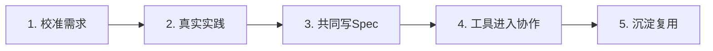

# CASE 07｜把个人AI能力变成团队方法

**行业**：基金公司内部研发　 **学习主题**：流程执行与采用　 **共学时间**：约10分钟

## 一句话简介

FDE团队帮一家基金公司的研发团队解决了大家各用各的AI、文档和分工跟不上新工具的问题，通过五天半的现场培训和后续迭代，和产品、开发等角色一起做出可共用的需求说明文档与协作方法，让个人用AI逐步变成团队一起用AI，不过这家基金公司没有公开完整的提效或收益数字。

[案例主页](../README.md) · [返回目录](../../README.md) · [本例JSON](case.json) · [完整访谈](#full-interview) · [原PDF](../../../sources/original-interviews.pdf#page=69)

原题：从个人提效到组织能力：FDE用AI推动企业研发转型

来源范围：PDF物理页 69–77；书内页码 68–76。

**本例值得讨论的判断（编辑提炼）**：每个人都会用AI，团队仍可能不会协作。

> 阅读提示：标为“访谈概括”的内容来自受访者陈述；“补充分析”是编辑解释；“迁移演练”是迁移假设。效果数字保留原文的试点、目标、估算和脱敏条件。前半部用于备课和学习，后半部完整保留原访谈。

## 1. 业务现场与行业特点

### 发生了什么｜访谈概括

这家基金公司的内部需求变化快，一天可能出现多个零散功能请求，研发人员已经尝试Codex、Claude Code等工具。管理层希望形成组织能力，但个人工具使用越熟练，统一方法时反而越容易遇到习惯阻力。

过去流程围绕产品经理写PRD、开发按文档实现展开。转向多份Markdown或TXT说明之后，谁写什么、哪些信息共用、同时修改如何避免冲突等问题浮现，AI工具本身不会自动重建团队分工。

关键现场事实：

- 基金投研企业的内部研发团队，需求零散且变化快
- 开发者已各自使用AI Coding工具
- 管理者、研发、产品经理与HR关注点不同

**原工作路径**：产品写PRD → 各人自选AI工具 → 按原分工开发 → 跨角色人工协调

**重新定义的问题**：客户要的不是再学一款工具，而是把分散的个人提效变成共同的研发方式。

依据：[原PDF物理页 70、71](../../../sources/original-interviews.pdf#page=70)；需要核实具体说法请查看[完整访谈](#full-interview)。

扩充段落主要参照：[Q1](#q1)、[Q2](#q2)；原PDF物理页 69–77。

### 为什么需要FDE｜补充分析

内部研发的价值通常通过业务响应和整体交付体现。一个开发者生成代码更快，并不意味着团队需求更清楚、测试更充分或维护更容易；当节奏加快，上下游共享的需求定义与责任分配反而更加重要。

个人工具成熟会形成路径依赖；协作需要共同的文档结构、角色边界与变更方法。

需要通过真实操作校准能力，重构Spec与角色分工，并把培训、咨询和实践连起来。

## 2. 解决思路怎样形成

### 从调研到方案的过程｜访谈概括

客户已经确定采用相关工具能力，但购买之后如何改变工作方式并不明确。FDE分别理解老板、研发人员、产品经理和HR的关注点，把五天半培训设计成从认知、操作、真实流程到组织方法的完整实践，而非工具功能串讲。

现场真实能力与前期描述可能不一致，因此课程不是一次写死。FDE根据实际操作降低或提高难度，一边讲解，一边观察协作障碍，把新发现继续放进后面的练习与讨论。

围绕客户真实研发过程，FDE从零组织Spec文档，逐步提出、共同确认，再按反馈修改角色职责和文档边界。项目共做三期，后续业务人员和产品经理进一步参与，实践范围由研发培训扩展到团队协作。

| 现场信号 | 形成的决定 |
|---|---|
| 前期自报能力不等于现场能力 | 用真实操作验证，现场调整课程难度 |
| 一份PRD变成多份文档协作 | 共同设计Spec的拆分、角色职责与协作 |
| 第一次没有成熟标准答案 | 逐步抛出模板、共同确认，三期迭代 |

依据：[原PDF物理页 72、73、75](../../../sources/original-interviews.pdf#page=72)；需要核实具体说法请查看[完整访谈](#full-interview)。

扩充段落主要参照：[Q3](#q3)、[Q5](#q5)、[Q6](#q6)；原PDF物理页 69–77。

### 这些取舍为什么重要｜补充分析

统一工具与统一工作方法需要区分。强迫所有人立即换工具，可能先损失熟练度；围绕真实任务统一必要的输入、文档和责任，更容易让团队理解改变的价值。最终工具选择应服务于协作目标。

Spec在当时并没有可直接套用的成熟统一标准，FDE没有把现场形成的方法冒充固定标准，而是小步试验。这说明经验可复用的部分往往是共同定义、实际操作、反馈修订的过程，而非某一套永远不变的文件名。

## 3. 工作流程与人机分工

以下流程图和职责划分是依据访谈所作的业务抽象，不补造未披露的技术架构。



| 步骤 | 实际作用 |
|---|---|
| 1. 校准需求 | 分别理解管理、开发、产品和HR |
| 2. 真实实践 | 培训中跑完整研发故事线 |
| 3. 共同写Spec | 明确多文档结构和角色责任 |
| 4. 工具进入协作 | 统一共同方法，处理协作问题 |
| 5. 沉淀复用 | 模板与经验进入后续团队 |

| 角色 | 负责什么 |
|---|---|
| AI | 辅助编码与文档等研发执行 |
| 系统 | 工具环境、Spec文件和协作载体 |
| 人 | 需求与角色设计、质量判断、现场反馈 |

依据：[原PDF物理页 72、73、74](../../../sources/original-interviews.pdf#page=72)；需要核实具体说法请查看[完整访谈](#full-interview)。

## 4. 交付物、实际使用与组织采用

### 交付后怎样工作｜访谈概括

客户带走的是一套可以继续使用的需求说明文档和协作方式。它帮助产品、前后端、测试和运维讨论同一个任务，明确哪些信息需要先说明、哪些角色需要补充，减少每个人只在自己的AI会话里推进。

现场培训也是交付的一部分：真实练习暴露能力和流程问题，FDE用这些结果调整方法。只有课程录像而没有共同完成的文档与工作过程，难以复制这里的组织变化。

| 交付物 | 交付内容 |
|---|---|
| 5天半线下实践 | 以完整业务故事贯穿培训、咨询与观察 |
| 从0到1的Spec文档 | 按客户真实研发协作持续修订 |
| 三期迭代的方法 | 业务与产品逐步加入，形成团队资产 |

### 实施与推广｜访谈概括

客户原已选定相关工具能力；从轻量验证开始，按真实熟练度动态调整内容。

项目采用多期迭代，第一期用于认识现场，后续据此调整内容与参与角色。访谈还提醒，模型一体机、微调或全面推翻工作流等较重投入，应该由真实需要决定；先验证业务和协作价值，才更容易判断下一步值得投在哪里。

依据：[原PDF物理页 72、73、74](../../../sources/original-interviews.pdf#page=72)；需要核实具体说法请查看[完整访谈](#full-interview)。

扩充段落主要参照：[Q3](#q3)、[Q4](#q4)、[Q5](#q5)；原PDF物理页 69–77。

## 5. 实际成效与证据边界

### 原文报告的变化

| 指标 | 原来或参照 | 后来或状态 | 必须保留的限定 |
|---|---|---|---|
| 本基金公司 | 个人自用AI | 共同工具与方法 | 未开放完整可披露ROI |
| 另一制造客户编码 | 原方式 | 短期节省约1/3 | 其他客户，3个小组、短期几天统计 |
| 另一客户文档/测试 | 原方式 | 文档省一半多；测试持平 | 不可移植为本基金公司成果 |

### 如何理解效果｜补充分析

基金公司没有公开完整ROI，能确认的是工具与协作方法趋于共同化，以及Spec资产得以沉淀。写代码节省约三分之一、文档节省一半多、测试持平，来自另一个制造业客户三个小组的几天统计，不能写进本项目的效果简介，也不能视为长期团队收益。

**证据边界**：“每天3到10个功能点”是价值说明，不是已验证结果；其他客户统计须单独标注。

依据：[原PDF物理页 70、74、75](../../../sources/original-interviews.pdf#page=70)；需要核实具体说法请查看[完整访谈](#full-interview)。

## 6. 难点、应对与可复用经验

| 难点 | 原文中的应对 |
|---|---|
| 标准不成熟 | 暴露不确定性，小步共同验证 |
| 调研失真 | 现场升降课程难度 |
| 一开始就重投入 | 先验证业务价值，再逐步加深投入 |

依据：[原PDF物理页 70、74、75](../../../sources/original-interviews.pdf#page=70)；需要核实具体说法请查看[完整访谈](#full-interview)。

**可复用的方法（编辑归纳）**：结合第2节的关键取舍，关注真实任务如何被重新定义、可交付结果由谁确认，以及组织如何继续使用和修改。原受访者的全部经验保留在[Q6](#q6)。

## 7. 迁移到其他工作场景的讨论｜4分钟

以下是通用研发场景中的假设练习，不代表案例客户或任何学习者所在组织已经开展或验证了这些项目。

某组织的各研发小组已有自己的AI编码习惯，但项目交接、规格文档与质量控制不一致。

**讨论问题**：团队转型应先统一工具，还是先统一任务规格和验收？

**本组应交出的产物**：写出一个跨角色Spec最少需要的字段，并选择一个质量指标。

个人思考40秒 → 小组讨论100秒 → 共识与质疑70秒 → 主持人收束30秒。

<details>
<summary>展开：迁移试点、验收与主持人参考</summary>

研发团队可先围绕一个需要研发、产品和科学人员协作的功能建立共同说明，例如一项计算工具的新能力。文档明确科学问题、输入输出、适用范围、失败情况、验收证据和角色责任，让AI有共同任务依据。

试学时让一个小组完成同一需求，观察需求澄清、实现、测试和返工时间分别怎样变化。将文档冲突和科学假设误读也记下来；不要只拿代码生成速度作为团队采用AI的结论。

**建议切口**：挑一项跨产品、算法、工程的真实需求，共同设计可执行Spec和评审责任。

**建议验收**：建议验收：需求到合格发布的周期、返工、缺陷和测试成本；连续观察。

**适用限制**：科研代码还需数值正确性与复现验证；不能只用代码生成速度判断团队效率。

**主持人参考**：参考：需求目标、输入输出、约束、科学/工程验收、责任与版本；工具选择服从协作目标。

</details>

可以直接对Codex说：

```text
请带我学习案例07。先讲清项目做了什么，再用一个关键问题让我做判断。
讲事实时引用原PDF页码；讨论迁移方案时明确标为假设。
```

## 8. 原图与受访者介绍

[查看原案例封面与受访者介绍](../../../assets/cover_69.png)。人物姓名、职位及图片内文字以原PDF为准。

本例没有单独提取出的正文图片；封面、图内文字与全部页面仍保存在原PDF。上方流程图是编辑抽象。

<a id="full-interview"></a>

## 9. 完整原始访谈

以下6组问答逐段保留原PDF文字层的原始提取内容。原有换行、术语或转义保留，不以编辑详解替代原文。文字层未包含的图片信息，请查看上方原图及[完整PDF第69–77页](../../../sources/original-interviews.pdf#page=69)。

<details>
<summary>展开全部访谈：Q1–Q6</summary>

<a id="q1"></a>

### Q1

Q1：作为FDE，你应用AI的具体场景是什么？在这个场景下遇到
的具体问题长什么样？
这个案例发生在一家基金公司。它本身是偏基金投研类的企业，会围绕股票、汽车等不
同领域开展基金管理业务。我们面对的是一支需求变化非常快的内部研发团队，和传统
意义上几个月做一个大型软件项目的团队很不一样。
他们的一个特点是，需求非常零散，也非常快。内部产品经理或者业务部门一天可能就
会提出好几个需求。对他们来说，AI带来的价值，是把研发人员每天能够完成的功能点
从三个提高到十个，和“原来一年做完的项目，现在半年做完”的传统想象并不相同。
所以，在我接触这个项目之前，他们其实已经在用AI了，而且有些人用得还挺深。有人
用Codex，有人用Claude Code，也有人使用其他AI Coding工具。问题恰恰出在这
里：大家都会用，但企业很难让大家一起用。
每个人都觉得自己的工具最好。“我用这个工具效率高，你让我换另一个，我反而不会
干活。”当个人习惯越来越成熟以后，企业如果想统一工具，反而会遇到新的阻力。
而从管理层的角度看，企业需要的显然不只是几个员工个人效率提升。老板希望看到的
是整个研发团队的转型，希望AI能够成为一种组织能力，而不再只是散落在员工电脑里
的个人工具。
所以我当时面对的核心问题，已经超出“怎么教大家使用AI Coding”这一层，具体是三
个层次的问题。
第一，是认知没有统一。大家都在使用AI，但对AI Coding到底能做到什么程度、自己
的能力处于什么水平，并没有统一标准。
第二，是工具和方法没有统一。不同的人使用不同的工具，有不同的工作习惯，原来的
研发协作方式也没有随着AI Coding的出现发生变化。
第三，是组织方式开始出现新的变化。企业管理层看到一些新的研发理念后，希望进一
步调整研发角色和流程，但这些理念到底怎么落到自己的团队里，并没有现成答案。
这也是我理解FDE和普通技术培训最大的区别：面对这种问题，不能只回答“这个工具
怎么用”，而要先判断企业真正要解决的是什么。

<a id="q2"></a>

### Q2

Q2：在你参与之前，这个问题过去是怎么解决的？
之前就是产品经理按照原来的方式写PRD，开发人员根据文档进行开发，不同角色按照
原来的分工推进。后来AI Coding工具出现了，研发人员开始自己尝试各种工具，于是
最早出现的是一种非常自然的“个人提效”。
有人发现某个工具好用，就自己用；有人掌握了新的方法，就自己实践。这个阶段其实
没有什么问题，因为个人只需要对自己的效率负责。
但当企业希望从“个人提效”进一步走向“团队提效”时，原来的方式就开始出现限制
了。
比如，原来大家习惯使用飞书文档写PRD。后来AI Coding的工作方式发生变化，很多
内容开始转向Markdown、TXT等文件。原来一个人维护一份文档没有太大问题，但当
整个团队开始围绕这些文件协作时，新的问题马上出现了：十几份文档到底应该怎么
拆？
产品经理写什么？前端写什么？后端写什么？测试和运维又分别负责什么？如果大家同
时修改Markdown，怎么避免冲突？原来的角色边界还能不能继续沿用？
这些都不是单纯学会一个AI工具之后自然就会解决的问题。
所以，我没有把过去的方法定义成“错误”。恰恰相反，它是适应原来研发模式的一套
成熟方法。只是当AI Coding改变了研发方式之后，原来的流程、文档和角色分工也需
要重新调整。
这也是我后来越来越明显的一个感受：AI真正进入企业之后，很多时候改变的不只是工
具，还有工具背后的工作方式。

<a id="q3"></a>

### Q3

Q3：后来你使用AI解决这个问题的整体思路和关键步骤是什
么？
这个项目最开始，客户已经确定采用阿里的相关能力，但“买了之后具体怎么做”其实
并没有特别清晰的答案。
所以我的第一步，是先重新摸需求，再考虑准备课程。
我先把不同角色的需求拆开来看。老板关注的是企业整体转型到底能不能发生，研发人
员关注的是这个工具到底能不能真正提高自己的效率，产品经理关注的是原来的研发流
程怎么变化，HR又需要关注培训过程中每一天能够获得什么。
所以虽然最终交付形式是一次五天半的线下培训，我在设计时始终把它当成一次完整的
企业AI转型实践来做。
我当时做了几件事情。
第一件事，是先把问题边界摸清楚。
在正式开始之前，我准备了大量素材，因为当时并不确定大家到底处于什么水平。
但这里有一个非常现实的问题：企业自己描述的能力水平，经常不等于现场真实能力水
平。
所以我后来越来越重视一件事情：不要完全相信前期调研，一定要尽可能通过真实操
作、快速原型和现场交流去验证。
第二件事，是把培训变成一条完整的业务故事线。
五天和半天完全不是一个概念。
如果只是讲工具，可能一天就结束了。但如果希望企业真正发生变化，就需要从前到后
设计完整路径：为什么企业要转型、研发人员为什么要使用、工具应该怎么进入原有流
程、角色怎么变化、最终又怎么沉淀成企业自己的方法。
所以这五天半里，我既是在讲，也是在观察；既是在培训，也是在咨询。
现场发现的问题，我会继续往后调整。
第三件事，是针对真实研发流程做定制。
这是整个案例里我认为最有FDE特征的一部分。
比如，原来的研发协作围绕一份PRD展开，现在转向多份文档协作，角色分工就不一定
还能直接套用。
于是我们开始重新设计Spec文档。当时行业里其实没有一个特别成熟、统一的标准可以
照搬，我也不知道自己设计出来的东西是不是最优解。
所以我没有一开始就把它当成“标准答案”扔给客户，选择不断拆解、逐步抛出、跟客
户确认，再根据反馈继续调整。
最终，我从0到1整理出了一套Spec文档。客户一开始甚至以为这是阿里内部已经提炼好
的文档，但实际上，这套东西就是我在这个项目过程中结合客户实际情况逐步搭出来
的。
第四件事，是在现场不断调整，让方案跟随现场反馈走。
我们给这家基金公司一共做了三期。
第一期最重要的价值之一，是让我真正看到企业现场到底是什么样。第二期开始，就能
够根据第一期积累下来的经验继续调整。到了后续阶段，客户的业务人员、产品经理也
逐渐进入进来，整个项目从单纯研发培训变成了更完整的组织转型。
这也是我现在比较认可的一种FDE工作方式：先把整个链路跑起来，再根据真实反馈不
断迭代，第一次不必追求100分。

<a id="q4"></a>

### Q4

Q4：相比传统方式，使用AI后的实际效果如何？
这个项目的效果，不能简单理解成“用了AI之后公司多赚了多少钱”。
这家基金公司没有向我开放可以对外披露的完整ROI数据。但从组织变化来看，效果是
比较明确的。
过去，AI更多是一种个人能力，每个人都有自己的方法和工具。
后来企业开始统一工具，并进一步统一研发协作方式。AI不再只是“某个开发人员会不
会用”的问题，而开始进入团队共同的研发流程。
更重要的是，我们把过程中形成的Spec文档和相关方法沉淀了下来。它不再依赖某一个
人现场演示，能够在企业内部继续复用。
后续在另一个制造业客户的实践中，也出现了比较明确的短期数据：三个小组使用这套
Spec Coding方法和模板后，统计显示写代码的时间节省了约1/3，写文档的时间节省
了一半多，测试时间则基本持平。
这个数据是客户在短期几天内做的内部统计，因此我认为它可以作为真实反馈，但不应
该被理解成长期、完整的ROI结论。真正有价值的效果评估，还是需要持续两周、一个
月甚至更长时间。
所以对我来说，这类项目最重要的结果，是完成了一个变化：从“大家各自使用AI”，走
向“企业开始形成一套共同使用AI的方法”。

<a id="q5"></a>

### Q5

Q5：在部署AI过程中，是否遇到了新问题或挑战？你是怎么解
决的？
第一个挑战，是AI发展太快，而行业标准还没有跟上。
当时大家都在讨论Spec、AI Coding、研发组织转型，但很多方法还没有经过足够长时
间的大规模验证。
我自己也会担心：万一我整理出来的这一套方法不适合现场怎么办？会不会刚拿出来就
被客户否定？
我的解决办法，是把不确定性暴露出来，然后通过小步验证降低风险，不假装自己已经
知道答案。
我会先做一部分，再和客户确认；再结合外部信息和阿里内部能够获得的信息继续调
整。发现不对，就修改。
这其实也是我觉得FDE很重要的一种能力：在一个还没有标准答案的领域里，不能因为
没有标准就不做，也不能因为自己是技术人员，就假设自己一定是对的。
第二个挑战，是前期调研经常失真。
有一次，我们提前了解到客户团队使用AI Coding的能力比较深，所以准备了很多高阶
内容。结果真正到了现场，发现大家连一些基础问题都没有解决。
那怎么办？只能现场降级，从基础开始。
反过来也一样。如果提前判断团队能力一般，结果到了现场发现大家已经用得非常熟
练，我就会把原本准备的“压箱底”的内容拿出来。
所以现在回头看，我觉得现场能力本身就是FDE的重要组成部分。
第三个挑战，是企业一开始就想“大投入”。
比如一上来就买模型一体机、做模型微调，或者强行推翻原有全部工作流。我反而觉得
这些方式比较危险。
如果业务可以用轻量级方式快速验证，比如API、SaaS或者Agent等方式能够先跑起
来，我更倾向于先验证业务价值。除非企业有明确的合规、安全等要求，否则没有必要
一开始就把投入做得特别重。
投入应该由轻到重，先把业务价值验证出来，再逐步加深。

<a id="q6"></a>

### Q6

Q6：根据你的经验，我们怎么才能更好地把AI部署到实际业务
中？
我现在越来越觉得，企业部署AI最容易犯的错误，是把AI当成一个单独的技术项目。实
际上，真正落地的时候，技术只是其中一部分。
第一，先理解业务到底想解决什么问题。
很多企业会说：“我要做AI转型。”但这句话本身没有办法指导落地。到底是个人提效、
团队提效，还是研发流程重构？不同目标对应完全不同的方案。
第二，不要过度依赖前期调研，快速做原型、跑真实流程。
因为AI的使用水平很难通过问卷准确判断，所以我现在更倾向于快速做原型、快速跑一
遍真实流程。哪怕第一次只有七八十分，也比坐在那里把方案讨论到100分再开始更有
价值。
因为真正跑起来之后，背景、痛点、方案和限制条件都会变得更清楚。第二遍再优化，
就有机会从七八十分做到八九十分。
第三，接受AI落地是一个持续迭代的过程。
尤其是在AI发展特别快的领域，没有人能够保证自己第一次设计出来的就是最佳方案。
与其追求一次性解决所有问题，不如先把第一轮跑起来，然后不断修正。
最后，也是我认为FDE最重要的一点：不要只站在技术人员自己的视角看问题。FDE需
要同时理解技术、业务和客户。
跟老板沟通，老板关心的是组织效率和投入产出；跟研发人员沟通，他们关心的是工具
好不好用；跟产品经理沟通，他们关心的是研发流程怎么变；跟HR、采购、运维沟通，
又会是完全不同的话语体系。
所以我觉得FDE更像一个“翻译官”：把标准化的AI能力，转化成具体企业、具体团队能
够真正使用的东西。
我把FDE的价值归纳成一句话：把AI的能力翻译成企业真正能用、能跑、能沉淀的工作
方式，比单纯把一个AI工具带进企业更重要。

</details>

[返回案例目录](../../README.md) · [本例结构化数据](case.json)
