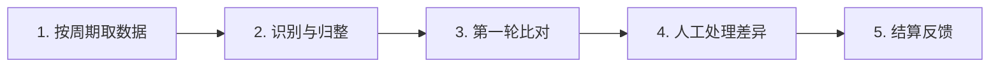
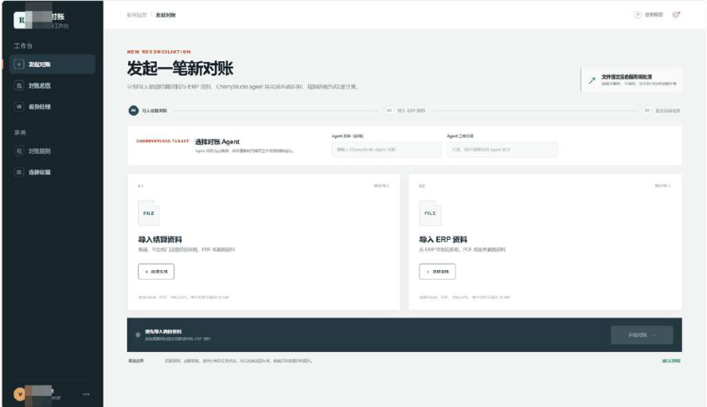

# CASE 10｜对账把被忽略的价值找回来

**行业**：线下零售　 **学习主题**：经营协同与价值　 **共学时间**：约10分钟

## 一句话简介

FDE团队帮一家在商场开店的消费品企业解决门店账和商场结算单要人工反复核对的问题，用图片识别和定时流程先做一轮对账，把差异交给店员确认，在上海部分门店把每个周期约一两个人天的核对压到几个小时，也找出了过去因核对太麻烦而被忽略的收款差异。

[案例主页](../README.md) · [返回目录](../../README.md) · [本例JSON](case.json) · [完整访谈](#full-interview) · [原PDF](../../../sources/original-interviews.pdf#page=97)

原题：从人工核对到智能对账：FDE用AI让线下零售对账又快又准

来源范围：PDF物理页 97–107；书内页码 96–106。

**本例值得讨论的判断（编辑提炼）**：核对成本下降后，过去放弃的差异值得再追。

> 阅读提示：标为“访谈概括”的内容来自受访者陈述；“补充分析”是编辑解释；“迁移演练”是迁移假设。效果数字保留原文的试点、目标、估算和脱敏条件。前半部用于备课和学习，后半部完整保留原访谈。

## 1. 业务现场与行业特点

### 发生了什么｜访谈概括

客户年营收为几十亿元，门店主要位于百货公司和商业综合体。门店收银数据与商场结算数据来自不同系统，资金还要经商场结算给企业，每个周期都需要把纸质、扫描或图片单据和系统数据重新对起来。

店长和店员同时承担销售任务，对账会挤占门店经营时间。过去发现差异后双方反复修改再核对，部分小差异可能落入总部容忍区间而不再追查，因此问题既是人工成本，也关系结算是否准确完整。

关键现场事实：

- 年营收几十亿元的消费品企业，门店位于商场
- 门店收银与商场结算形成两套数据
- 店员与店长既要对账，也承担销售任务

**原工作路径**：拉两边数据 → 看纸单与扫描件 → 逐项核对 → 差异反复沟通

**重新定义的问题**：对账耗费1–2个人天，挤占门店经营；容忍区间可能隐藏少收或多收。

依据：[原PDF物理页 98、99、100](../../../sources/original-interviews.pdf#page=98)；需要核实具体说法请查看[完整访谈](#full-interview)。

扩充段落主要参照：[Q1](#q1)、[Q2](#q2)；原PDF物理页 97–107。

### 为什么需要FDE｜补充分析

对账的关键是两套记录是否在同一口径下可比较，以及差异怎样被确认和处理。机器可以降低逐项核对的成本，让过去不值得人工追的差异变得值得检查；但发现差异只是第一步，净影响还取决于少收、多收和后续核实。

资金通过商场结算；人工核对成本高时，企业会容忍小差异，损失容易长期不可见。

FDE要从多个需求中挑可验证价值的首单，并在轻量试点时规划后续规模扩展。

## 2. 解决思路怎样形成

### 从调研到方案的过程｜访谈概括

客户同时提出客服、竞品分析和对账等需求。FDE比较正反馈速度与效果归因，发现对账流程相对明确、参与人较少，耗时和差异也更容易确认，因此把它选为第一步，而非先做最显眼的AI能力展示。

方案使用OCR与视觉能力识别和比对单据，并按结算周期定时运行。机器先处理重复的第一轮核对，将确定结果和需人工判断的差异分开，尽量嵌进原工作方式，使员工直接拿到已初步处理的结果。

试点落在上海个位数门店，采用轻量工具与本地电脑验证，并构建面向用户的交互和Agent连接层。与此同时，团队区分小范围验证与多门店同时运行的扩展阶段，后者需要更强的数据管理、稳定性与冗余能力。

| 现场信号 | 形成的决定 |
|---|---|
| 同时有客服、竞品与对账需求 | 先选人工和差异都较易核算的对账 |
| 多数工作是重复第一轮核对 | OCR/视觉＋定时流程，人处理真正差异 |
| 上海少量门店先试跑 | 设计轻量试点与大规模后端/冗余两阶段 |

依据：[原PDF物理页 100、101](../../../sources/original-interviews.pdf#page=100)；需要核实具体说法请查看[完整访谈](#full-interview)。

扩充段落主要参照：[Q3](#q3)、[Q5](#q5)、[Q6](#q6)；原PDF物理页 97–107。

### 这些取舍为什么重要｜补充分析

轻量试点与规模化设计可以同时成立：前期低成本验证一个清楚问题，设计时说明成功后要补哪些后台能力。把未来扩展条件提前讲明白，比中途突然要求客户加服务器、加人员或改流程更有利于建立信任。

这次访谈还谈到电商比价和学校批改的其他项目教训，分别涉及行业限制和需求未拆清。它们适合作为受访者的方法反思，但应与零售对账本项目已经发生的过程和结果分开。

## 3. 工作流程与人机分工

以下流程图和职责划分是依据访谈所作的业务抽象，不补造未披露的技术架构。



| 步骤 | 实际作用 |
|---|---|
| 1. 按周期取数据 | 门店、商场、纸单/图像 |
| 2. 识别与归整 | OCR＋视觉读取信息 |
| 3. 第一轮比对 | 自动核对总额与分项 |
| 4. 人工处理差异 | 复核少收、多收及业务原因 |
| 5. 结算反馈 | 确认净差异并推动后续扩面 |

| 角色 | 负责什么 |
|---|---|
| AI | 图像/单据信息识别与辅助比对 |
| 系统 | 定时运行、汇集结果与交互连接层 |
| 人 | 核实真实差异，确认应收与实际回款 |

依据：[原PDF物理页 100、101、102](../../../sources/original-interviews.pdf#page=100)；需要核实具体说法请查看[完整访谈](#full-interview)。

## 4. 交付物、实际使用与组织采用

### 交付后怎样工作｜访谈概括

门店人员收到第一轮对账结果后，重点核对真正有争议的项目、与对方确认并继续处理。理想的使用体验是原来的工作有人先做了一部分，而非新增一个要求员工维护和录入的AI系统。

可复用交付包括多来源账单进入方式、识别与匹配规则、定时工作流、差异呈现和人工确认流程。扩展到其他门店时，要重新确认账单格式和业务口径，不能仅复制一套界面就假定覆盖所有结算方式。

| 交付物 | 交付内容 |
|---|---|
| 自动核对流程 | 按结算周期输出第一轮核对结果 |
| 友好前端与Agent连接层 | 原图展示Cherry Studio相关能力 |
| 分阶段扩容方案 | 试点可本地轻量跑，扩面补后端与冗余 |

### 实施与推广｜访谈概括

实际落地上海个位数门店；尽量不给员工增加录入和学习步骤。

方案强调先让一线看见收益，并对齐老板、中层与使用者的目标、投入和责任。当前实施范围是上海部分门店，后续全量运行仍是扩展方向，不能把试点情况写成企业所有门店已完成上线。

依据：[原PDF物理页 101、102、103](../../../sources/original-interviews.pdf#page=101)；需要核实具体说法请查看[完整访谈](#full-interview)。

扩充段落主要参照：[Q3](#q3)、[Q4](#q4)、[Q5](#q5)；原PDF物理页 97–107。

## 5. 实际成效与证据边界

### 原文报告的变化

| 指标 | 原来或参照 | 后来或状态 | 必须保留的限定 |
|---|---|---|---|
| 一个对账周期 | 约1–2个人天 | 压缩至几个小时 | 人天是劳动量，小时为原文流程描述 |
| 部分门店差异 | 过去有容忍区间 | 约1%–3%差异被发现 | 既有少收又有多收，须看净差异 |
| 实施范围 | 企业整体规模大 | 上海少量门店 | 不能推算全公司收入或利润增幅 |

### 如何理解效果｜补充分析

每周期约一两个人天到几个小时是受访者给出的试点耗时变化。部分门店发现约1%—3%的差异，但其中既有少收也有多收，需要看净差异和后续追回或调整；不能直接写成收入增加1%—3%，更不能据此计算全公司利润提升。

**证据边界**：比价和教育是受访者另举的教训；发现差异不等于实现净增收。

依据：[原PDF物理页 102、103、104](../../../sources/original-interviews.pdf#page=102)；需要核实具体说法请查看[完整访谈](#full-interview)。

## 6. 难点、应对与可复用经验

| 难点 | 原文中的应对 |
|---|---|
| 能力与行业壁垒不匹配 | 其他电商比价项目受数据与平台限制 |
| 需求未定义清楚 | 其他教育案例暴露频率、规则与精度缺口 |
| 多层责任不一致 | 提前对齐投入、成功标准与异常责任 |

依据：[原PDF物理页 102、103、104](../../../sources/original-interviews.pdf#page=102)；需要核实具体说法请查看[完整访谈](#full-interview)。

**可复用的方法（编辑归纳）**：结合第2节的关键取舍，关注真实任务如何被重新定义、可交付结果由谁确认，以及组织如何继续使用和修改。原受访者的全部经验保留在[Q6](#q6)。

## 7. 迁移到其他工作场景的讨论｜4分钟

以下是通用研发场景中的假设练习，不代表案例客户或任何学习者所在组织已经开展或验证了这些项目。

某研发团队的计算作业、算力账单、采购与项目归属需要逐项核对。

**讨论问题**：系统发现2%的账单差异，能否宣布节省2%的成本？

**本组应交出的产物**：列出从差异发现到收益确认的3个证据节点。

个人思考40秒 → 小组讨论100秒 → 共识与质疑70秒 → 主持人收束30秒。

<details>
<summary>展开：迁移试点、验收与主持人参考</summary>

研发团队可以从计算用量、实验服务或合作项目的对账中学习这一方法。先找两套本来应该一致的记录，明确对象、单位、时间窗和计费规则，用系统完成第一轮比对，让项目或财务负责人确认异常。

验证时把发现差异、确认差异、完成处理和实际资源或费用变化分开记录。这样能回答“系统找出的2%是否真的形成节省”，也能避免把账面异常简单等同于研发成本浪费。

**建议切口**：从一个账期、一类资源开始自动比对，将异常单独送给项目/财务负责人。

**建议验收**：建议验收：核对人时、确认净差异、实际结算改正金额与误报成本。

**适用限制**：先统一计算单位、价格版本和任务归属；不能将差异总额视为节约额。

**主持人参考**：参考：核实差异方向和原因、确认合同/规则、记录实际回款或支出改正，再减实施和复核成本。

</details>

可以直接对Codex说：

```text
请带我学习案例10。先讲清项目做了什么，再用一个关键问题让我做判断。
讲事实时引用原PDF页码；讨论迁移方案时明确标为假设。
```

## 8. 原图与受访者介绍

[查看原案例封面与受访者介绍](../../../assets/cover_97.png)。人物姓名、职位及图片内文字以原PDF为准。

### 原图 1｜原PDF第102页



[回到原PDF第102页](../../../sources/original-interviews.pdf#page=102)

<a id="full-interview"></a>

## 9. 完整原始访谈

以下6组问答逐段保留原PDF文字层的原始提取内容。原有换行、术语或转义保留，不以编辑详解替代原文。文字层未包含的图片信息，请查看上方原图及[完整PDF第97–107页](../../../sources/original-interviews.pdf#page=97)。

<details>
<summary>展开全部访谈：Q1–Q6</summary>

<a id="q1"></a>

### Q1

Q1：作为FDE，你应用AI的具体场景是什么？在这个场景下遇到
的具体问题长什么样？
我一直觉得，FDE真正有价值的地方，在于找到一个和企业业务目标足够近的问题。能
不能用AI做出一个东西，反而是次要的。
这个案例就是这样。客户是一家以线下零售为主的消费品企业，年营收规模达到几十亿
元，门店主要开在百货公司和商业综合体里。它的资金结算链路比较特殊：门店自己的
收银系统会产生一套数据，商场也会有一套结算数据，最终资金经过商场结算给企业，
所以每个结算周期，都需要把两边的数据和单据重新核对一遍。
最开始客户找到我们的时候，提出的其实就是一个非常朴素的问题：对账太费人工了。
这件事情听起来很标准，甚至有点“不值得用AI”。但我后来发现，恰恰是这种事情值得
仔细看。
过去店员或者店长要拿着纸质单据或单据转成的扫描件/图片，从不同系统里把数据拉出
来逐项核对。整个过程基本是人工、肉眼完成。如果发现对不上，还要双方重新核对，
改完之后可能还会再出现新的差异，于是不断来回拉扯。一个周期下来，可能就要花掉
一两个人天。
这背后其实有三层问题。
第一层是业务问题。对账做得不够彻底，意味着有些本来应该收回来的钱可能被遗漏
了。
第二层是流程问题。真正承担这项工作的往往是店员或者店长，而他们同时还背着销售
指标。对账占用的时间越多，能够投入销售和门店经营的时间就越少。
第三层是信息问题。两边的数据并没有天然打通，纸质单据又增加了人工核对的成本，
所以人只能不断在不同信息之间做比对。
真正让我觉得这个问题值得做的，是我们后来发现：它除了省人工，还可能直接影响收
入。
过去总部甚至会给门店设一个“容忍区间”，因为大家都知道人工对账太麻烦，如果差
异在一定比例以内，就干脆不再追了。可是现在，如果机器能够把这些差异找出来，那
么原来被忽略的钱，就有机会重新被识别出来。这个价值就从“节省几个人天”，变成
了实实在在的收入增益。
所以从FDE的角度看，我最终优先选择的是业务价值最容易被验证的场景，把“AI最酷的
场景”往后放。

<a id="q2"></a>

### Q2

Q2：在你参与之前，这个问题过去是怎么解决的？
原来的解决方案逻辑非常直接：拉多个系统数据、看总额、看分项、针对差异找原因。
对于一个店或者少量门店来说，人完全可以完成。
但问题是，业务规模扩大以后，人工方式的边际成本越来越高。
一个门店可能还能接受一两个小时甚至一天的核对，但当门店数量增加以后，每个周期
都要重复做同样的事情。更麻烦的是，人工除了“慢”，还会产生连续的返工：发现差
异、重新确认、修改，再核对；如果员工觉得某些差异不值得继续追，就可能直接放弃
了。
所以，过去的方法本身并没有错，问题在于业务复杂度超过了人工方式的承载能力。
这也是为什么我后来越来越觉得，FDE做AI落地的时候，不能上来就说“原来的流程太落
后了，我们用AI替代”。真正应该问的是：原来的方式为什么能够运行？它在哪个节点
开始失去效率？AI究竟应该接管哪一部分？
在这个案例里，我们没有试图把整个对账流程全部AI化，而是先接管最标准、最重复、
最适合自动化的那一轮核对，把人从大量机械比对中释放出来。
这也是为什么员工最后对这个方案的接受度比较高。在他们看来，这更像是“有人已经
帮我做完第一轮对账了，我只需要看结果和处理真正的差异”，很少被当成“又一个需
要重新学习的系统”。

<a id="q3"></a>

### Q3

Q3：后来你使用AI解决这个问题的整体思路和关键步骤是什
么？
这个案例真正让我觉得有价值的，在于我们怎么选这个问题，以及怎么控制交付范围，
OCR或者视觉本身反而排在后面。
第一步，是从客户提出的多个需求里排优先级。
客户当时并不只有对账一个需求，还提出过自动化客服、竞品对比等方向。
如果单纯从“AI能做什么”来看，这些事情都可以做。但站在FDE角度，我会先问一个问
题：哪个事情能够最快形成业务上的正反馈？
客服可能同时涉及效率和新增商机，需要积累比较长的数据周期，才能证明商机到底增
加了多少；竞品分析则涉及后续多种运营策略，最终业务结果并不容易在短时间内验
证。
相比之下，对账的价值非常直接：少花多少人工，可以很快看到；少漏多少钱，也可以
直接计算。
所以第一个判断，重点是哪个任务最有可能最快得到正反馈，技术上是否最先进反而次
要。
第二步，是把AI放在真正适合它的位置。
我们最后采用的是OCR加视觉的方式，对纸质/图像单据和相关信息进行识别、比对，再
通过自动化工作流按照周期定时运行。简单说，就是让AI完成大量重复性的第一轮核
对，把已经能够确认的结果先筛出来，再让人处理真正需要判断的部分。
这个方案其实并没有什么特别“炫”的技术。
但我反而认为这很典型：FDE要做的，是找到一个足够简单、成本足够低、又能真正解
决业务问题的方案，而未必是最复杂的技术。
第三步，是从一开始就考虑规模化，不只停留在Demo。
当时我们只落了上海几个门店，数量还是个位数。但客户整体门店规模比较大，所以我
在方案设计时就已经考虑了后续扩展的问题。
几个门店每个周期跑一次，和几百、上千个门店在接近的时间窗口里同时运行，对系统
稳定性和AI出错后的冗余要求完全不一样。
所以我们一开始就把它拆成两个阶段。
第一阶段尽可能轻量，甚至在Cherry Studio加本地电脑的情况下就可以完成；第二阶段
如果真正扩展到更大规模，就需要在后端数据和冗余机制上增加更多能力。
我比较看重这一点：轻量化不等于没有规划。可以先用最小成本验证价值，但从Day
One开始，就应该知道如果验证成功，下一步怎么走。
第四步，是尽量不给一线员工增加额外负担。
这一点其实很容易被技术团队忽略。一个新的AI工具，如果需要员工额外录入数据、重
新学习流程、增加操作步骤，那么员工看到的首先是“我又多了一件事”。
所以我们尽量让AI出现在原有流程里面，不让员工重新建立一套流程。最终员工拿到的
是已经经过第一轮处理的结果，无需再维护一个自己的系统。
我觉得这也是AI真正落地时一个很重要的细节：不要让用户先看到自己的投入，再等待
未来的收益；尽量让他第一时间感受到收益。

<a id="q4"></a>

### Q4

Q4：相比传统方式，使用AI后的实际效果如何？
最直接的变化，是时间从“人天”变成了“小时”。
图1：Cherry Studio 在项目里提供 Agent 能力，我们也单独构建了一套用户友好的前端交互与 Agent
链接层
过去一个周期可能要花一两个人天，甚至因为反复核对而把周期拉得更长。现在整个过
程压缩到几个小时，员工只需要处理真正需要人工判断的部分。
但如果只把它总结成“省人工”，我觉得还是低估了这个项目。
真正让我觉得意外的是，AI把原来被人工流程掩盖的问题暴露了出来。在实际数据里，
有的门店差异在一两个百分点，有的能达到两三个百分点。这里面既有少收，也有多
收，最终需要看净差异。但对于一家线下零售企业来说，即使只有一两个百分点，如果
落到纯利层面，也已经是一个非常大的数字。
所以这个项目给我的一个很大启发是：AI的价值有时候在于，让企业终于有能力把过去
因为成本太高而放弃的事情重新做起来。现在核对成本降下来了，那部分被放弃的价值
就有机会重新捡回来。
目前我们落地的还是上海部分门店，未来还有进一步扩大范围的空间。

<a id="q5"></a>

### Q5

Q5：在部署AI过程中，是否遇到了新问题或挑战？你是怎么解
决的？
这个案例本身比较顺，但我们其实踩过不少坑。现在回头看，我觉得主要有三个挑战。
第一个挑战，是高估AI能力，低估真实行业的难度。
我们之前做过一个国内电商横向价格对比的案例。
当时我知道这件事情不容易，因为市场上已经有专门做电商比价的公司，人家背后有数
据、接口，还有各种数据来源和业务门道。但当时还是有一个判断：我们觉得AI应该能
够解决其中百分之七八十的问题。
真正开始做之后才发现，现实比想象复杂得多。
国内电商平台的风控和反风控一直在博弈，平台本身对快速价格查询、模拟人为操作等
行为有很强的限制。即使找到一个方案，也可能很快被平台策略堵掉。最后导致交付周
期拉长，能覆盖的场景也不断缩小。
这件事情让我意识到，AI能力和真实业务难关之间，必须做匹配。不能因为模型和
Agent 现在很强，就默认现实世界的问题都能解决。
本质上还是行业认知不够。
如果一个行业里已经有公司专门靠某个问题生存，那就应该先认真研究：它到底解决了
什么难点？它掌握了哪些信息差？为什么这个事情值得一家公司的长期投入？
第二个挑战，是需求调研不够深，导致后面不断返工。
另一个案例是学校批改作业和智能推题。
这个需求听起来非常顺：先批改，再给分，再分析，然后根据学生情况推题；题目还来
自学校自己的题库。
但真正拆开以后，问题非常复杂。
比如准确率到底要多少？批改时效要求是什么？哪些科目？批改频率多高？题库需要结
构化到什么程度？推题有什么规则？学生一道难题做错之后，是应该降低难度，还是继
续围绕同一个知识点给他更难的题？人工到底在哪个环节介入？
这些问题如果前期没有问清楚，后面就会不断出现需求变化。
以前软件工程时代，这叫产品经理需求没定义清楚，研发不断返工；到了AI时代，本质
没有变，只不过后面的“返工成本”还可能直接表现成大量Token消耗和交付成本。
所以现在我们做FDE，会比以前更谨慎。技术调研要认真做，方案调研要认真做，业务
调研也要认真做。
第三个挑战，是组织和责任边界没有提前对齐。
AI项目很容易被理解成“老板想要、FDE来做、一线员工来用”。但实际上老板、中层、
一线员工关注的东西完全不一样。如果前期没有把每个层级的目标、预期、能力边界和
责任讲清楚，最后很容易出现“做得不好就是FDE的问题”。
所以我现在越来越强调一件事情：不仅要和老板对齐，还要和涉及项目的不同层级分别
对齐。
谁负责什么，谁投入什么，做到什么程度算成功，AI出问题之后谁判断、谁处理，都应
该尽可能在前面讲清楚。

<a id="q6"></a>

### Q6

Q6：根据你的经验，我们怎么才能更好地把AI部署到实际业务
中？
如果让我把这次经历总结成几个最基本的原则，我反而不会先讲模型、Agent或者工作
流。我会先讲价值、优先级和信任。
第一，第一单一定要选对。
一个企业可能同时给你十个需求，但第一个项目不能只看哪个最有意思，需要综合判
断：业务价值是不是足够显性、正反馈是不是来得足够快、涉及的人是不是足够少、业
务流程是不是足够清晰、用户需要投入多少、技术成本是不是可控、最终价值能不能算
出来。
没有所谓的“六边形完美任务”，最终一定是权衡。
对账这个案例之所以适合作为第一步，就是因为它在这些维度上比较平衡：涉及的人
少，业务流程相对清晰，价值可以计算，AI成本也不高，而且员工容易接受。
第二，第一版不要追求完美，要先跑出一个正循环。
我比较建议FDE做项目的时候，第一版先解决一个边界清晰的问题。做到客户认可，做
到有人真正使用，做到价值能够被看见。
当第一个正循环跑起来之后，信任就建立了。第二个需求的容忍度会更高，再继续扩
大，再继续扩大，最后形成一个持续的正循环。
这比一开始就承诺一个“全自动、全覆盖、一次解决所有问题”的方案，要健康得多。
第三，Day One就要想清楚交付边界。
尤其面对中大型企业，不能做到一半才告诉客户：“这个还需要你买服务器”“这个还需
要增加人”“这个还要改一套流程”。
客户的资源和信任都是真实存在的。所以在第一天设计方案的时候，就应该尽可能把技
术路线、资源投入、后续扩展路径和可能的边界讲清楚。
第四，不要把AI落地简单理解成“替代人”
这是我自己比较坚持的一点。如果AI把一个岗位里百分之七八十的事情做掉，很容易让
企业产生一个冲动：既然效率提高了，那是不是可以直接裁人？
但我认为，这很容易把AI项目变成企业和员工之间的对抗。更好的方式，是把省下来的
人工带宽转移到更高价值的事情上。
比如客服人员不一定继续只做客服，可以去做用户研究、销售或者其他与客户交互相关
的工作；投流团队不只追求“少几个人”，更看重人均犯错率下降、人均ROI提升。
这样AI带来的，是组织的业务目标升级，降本反而退居其次。
第五，FDE最核心的能力，最后还是“懂业务”
AI真正能够被快速放大的，是后端交付能力；但最难复制的，还是前端的行业认知、需
求洞察和组织理解。
所以未来FDE可能会出现分层：有一小批人特别懂行业、懂组织、懂咨询，也懂AI交
付；更多的人则可以在标准化、Agent友好的任务上，通过成熟的工具完成稳定交付。
但不管是哪一层，最基本的问题都不会变。
我会要求团队一直回答这几个问题：客户真正关心什么？他以前是怎么做的？现在我们
做完之后，他是怎么做的？我们到底给他创造了什么价值？和原来的方案相比，我们有
什么优点，又有什么缺点？
我觉得这其实就是FDE最基本的“商业101”。
会做就是会做，不会做就是不会做；懂这个行业就是懂，不懂就是不懂。不要因为AI和F
DE现在很热，就把自己的能力边界包装得无限大。
真正好的FDE，在于知道什么值得做、什么现在能做，以及怎么把能做的事情做到让客
户真正看到价值。
当第一个小胜仗跑出来，客户看到了价值，员工愿意使用，业务愿意继续投入，AI才真
正从一个技术能力，变成了企业业务的一部分。

</details>

[返回案例目录](../../README.md) · [本例结构化数据](case.json)
