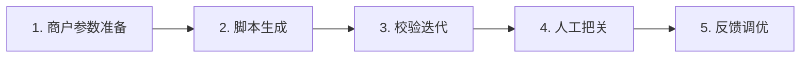
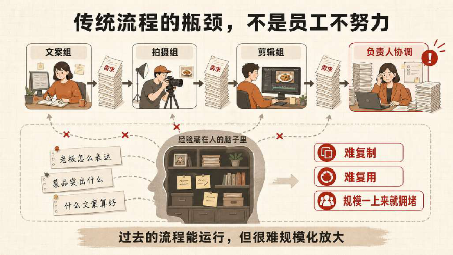
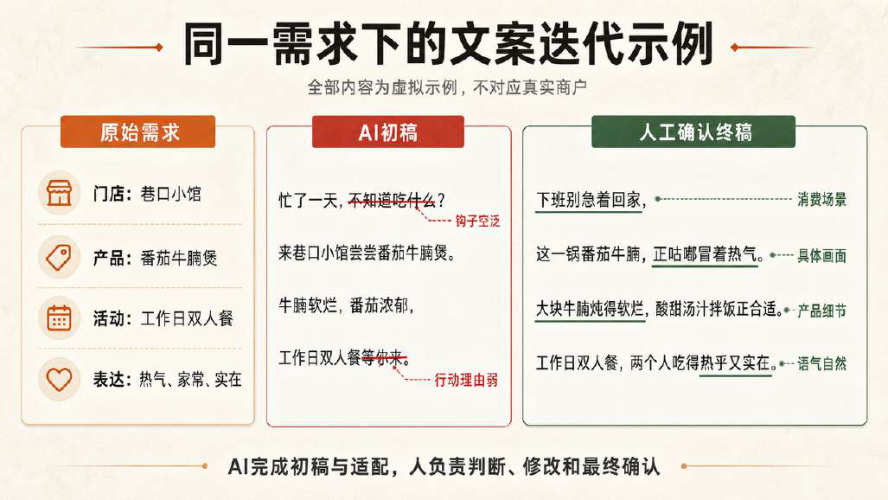
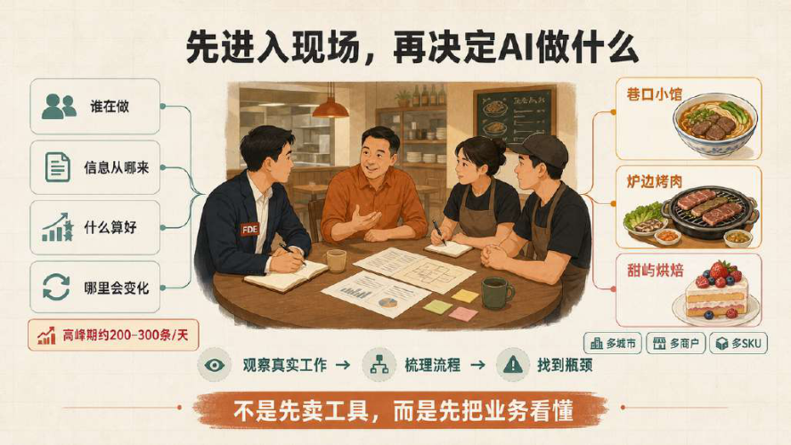
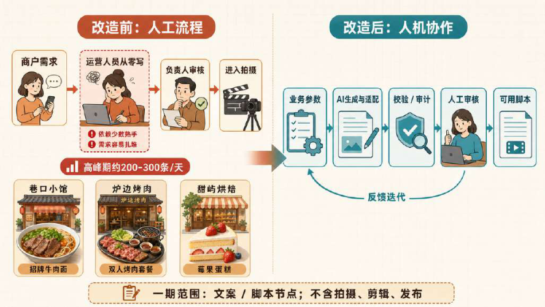
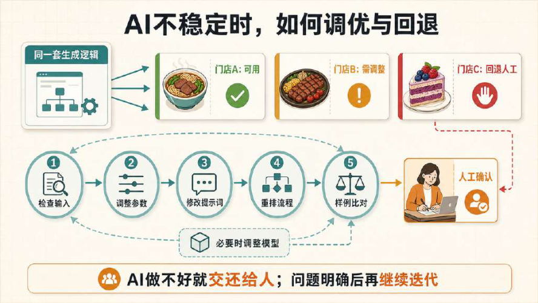
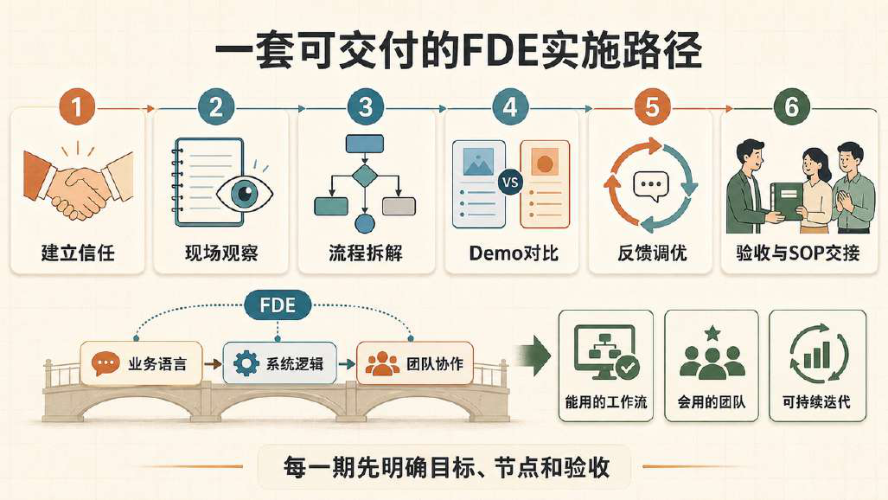

# CASE 15｜把“文案味道”变成可迭代流程

**行业**：本地生活短视频　 **学习主题**：知识与专业工作台　 **共学时间**：约10分钟

## 一句话简介

FDE团队帮一家给多地餐饮商家做抖音代运营的公司解决高峰每天要写两三百条文案、好写手忙不过来、AI套模板又太生硬的问题，把门店、菜品、活动和优秀运营的经验拆成输入与生成流程，再由人审核拍摄脚本，让内容有了更稳定的基础质量，也能提前生产来缓解每天的工作高峰。

[案例主页](../README.md) · [返回目录](../../README.md) · [本例JSON](case.json) · [完整访谈](#full-interview) · [原PDF](../../../sources/original-interviews.pdf#page=148)

原题：从经验写稿到稳定量产：FDE用AI重构本地生活短视频内容生产

来源范围：PDF物理页 148–159；书内页码 147–158。

**本例值得讨论的判断（编辑提炼）**：稳定生产来自业务参数、审核和反馈共同作用。

> 阅读提示：标为“访谈概括”的内容来自受访者陈述；“补充分析”是编辑解释；“迁移演练”是迁移假设。效果数字保留原文的试点、目标、估算和脱敏条件。前半部用于备课和学习，后半部完整保留原访谈。

## 1. 业务现场与行业特点

### 发生了什么｜访谈概括

客户服务多个城市的餐饮商户，既有酒店和连锁餐厅，也有独立小店。各店的菜品、活动、老板表达方式与目标客群不同，内容需求量大但难以用完全一致的模板解决，峰值每天约两三百条。

原来由文案、拍摄、剪辑和负责人协作，优秀运营凭经验判断卖点与表达。业务扩大后，这些人的能力无法随需求同步复制；团队也尝试过直接让AI写和本地部署DeepSeek，但历史文案与固定范式不能稳定适应不同商户。

关键现场事实：

- 抖音本地生活代运营，客户以多城市餐饮商户为主
- 高峰每天约200–300条文案需求
- 商户类型、菜品、活动、人设与客群差异大

**原工作路径**：运营接当天需求 → 按个人经验写 → 拍摄剪辑 → 负责人审核

**重新定义的问题**：少数高手的经验难复制；单纯给模型历史模板或本地部署未达到期望。

依据：[原PDF物理页 149、150、151](../../../sources/original-interviews.pdf#page=149)；需要核实具体说法请查看[完整访谈](#full-interview)。

扩充段落主要参照：[Q1](#q1)、[Q2](#q2)；原PDF物理页 148–159。

### 为什么需要FDE｜补充分析

本地生活脚本连接商品信息、人的表达和实际拍摄。文字通顺并不等于能用，还要考虑谁来说、画面如何配合、节奏和情绪是否合适。因此产能建设需要把业务条件与审美反馈变成可调整的流程，而非只统计模型生成了多少字。

文案还要进入拍摄，语气、节奏、声画配合影响可用性；固定范式容易机械重复。

要将主观的“感觉不对”转换为业务输入、流程调整与可验证反馈，并保留人工回退。

## 2. 解决思路怎样形成

### 从调研到方案的过程｜访谈概括

FDE从现场观察和核心成员交流入手，跟踪新客户如何进入、材料怎样准备、文案怎样评价与返工。先拿原有结果做参照，再用小Demo比较AI能做到什么，把不稳定的部分继续调整或交回人工。

团队将客户、门店类型、菜品、活动、卖点和内容方向拆成明确输入，同时提取优秀文案人员的技巧与案例。由此把原来藏在个人经验里的判断，转化成可在不同商户之间复用、又能通过参数改变取向的业务逻辑。

落地时把提示词、Skill、业务参数、校验与审计循环组合成脚本生产流程，并周期性交付版本。客户反馈文案感觉、平台留存和不同SKU的表现，FDE据此调整输入、提示词、节点顺序甚至模型，持续寻找稳定可用的组合。

| 现场信号 | 形成的决定 |
|---|---|
| AI替写不稳定，模板味明显 | 拿真实原稿与小Demo并排比较 |
| 优秀运营考虑商户与内容差异 | 拆成门店、菜品、活动、卖点等输入字段 |
| 一条Prompt不能稳定交付脚本 | 组合Skill、参数、校验和审计循环，节点失败回退给人 |

依据：[原PDF物理页 151、152、153、154](../../../sources/original-interviews.pdf#page=151)；需要核实具体说法请查看[完整访谈](#full-interview)。

扩充段落主要参照：[Q3](#q3)、[Q5](#q5)、[Q6](#q6)；原PDF物理页 148–159。

### 这些取舍为什么重要｜补充分析

标准化与商户差异需要同时保留。固定模板容易让内容机械重复，但完全依赖个人临场判断又难以规模化；更有用的做法是固定必要业务字段和检查步骤，让风格、卖点与情境保有可调空间。

“味道不对”是有效但尚未结构化的业务反馈。FDE需要追问它对应人物表达、节奏、卖点还是信息不足，并用版本比较检验修改是否有效；不能把所有负面反馈都简单归因于模型能力。

## 3. 工作流程与人机分工

以下流程图和职责划分是依据访谈所作的业务抽象，不补造未披露的技术架构。



| 步骤 | 实际作用 |
|---|---|
| 1. 商户参数准备 | 店型、菜品、活动、卖点与内容方向 |
| 2. 脚本生成 | 写作技巧、案例、Prompt与Skill |
| 3. 校验迭代 | 业务参数与审计循环 |
| 4. 人工把关 | 审核语感、表达与拍摄可用性 |
| 5. 反馈调优 | 平台留存、客户意见、SOP持续更新 |

| 角色 | 负责什么 |
|---|---|
| AI | 重复生成、适配与初步校验 |
| 系统 | 输入参数、校验循环、版本与反馈流程 |
| 人 | 审美与业务判断；接管不稳定节点 |

依据：[原PDF物理页 153、154、155](../../../sources/original-interviews.pdf#page=153)；需要核实具体说法请查看[完整访谈](#full-interview)。

## 4. 交付物、实际使用与组织采用

### 交付后怎样工作｜访谈概括

新客户进入时，团队可先整理门店、主打菜品和活动等参数，由系统提前生产内容，再由运营筛选和修改。交付节点主要覆盖文案与短视频脚本，脚本需要考虑声画配合和拍摄节奏，后续拍摄与最终内容决策仍由人员完成。

AI承担重复生成与适配，人负责审美、经验和最后判断；某个节点表现不好就回退给人工。交付还预留SOP与持续优化方式，使客户能自己修改一部分规则，项目结束后不必将每次调整都交还外部团队。

| 交付物 | 交付内容 |
|---|---|
| 可拍摄的脚本框架 | 覆盖节奏与声画配合，超出普通几百字文案 |
| 可复用业务字段 | 商户差异通过参数表达，核心逻辑复用 |
| 反馈与回退SOP | 客户持续反馈，并能自行继续优化 |

### 实施与推广｜访谈概括

一期主要落在文案和脚本节点；周期性交付版本，用真实平台与使用反馈调整提示、逻辑或模型。

前期需求确认与后期调优占据大量工作，中间开发并非最主要难点。团队通过演示、测试与反馈培养员工的新协作方式，使他们能够把需求变成可复用输入，并逐步给出系统可以吸收的修改意见。

依据：[原PDF物理页 153、154、157](../../../sources/original-interviews.pdf#page=153)；需要核实具体说法请查看[完整访谈](#full-interview)。

扩充段落主要参照：[Q3](#q3)、[Q4](#q4)、[Q5](#q5)；原PDF物理页 148–159。

## 5. 实际成效与证据边界

### 原文报告的变化

| 指标 | 原来或参照 | 后来或状态 | 必须保留的限定 |
|---|---|---|---|
| 高峰需求 | 每天约200–300条 | 新产能未披露 | 这是需求规模，不能写为AI实际日产量 |
| 生产方式 | 每次从零写 | AI先形成基础稿 | 效率与平均质量改善为定性反馈 |
| 排期方式 | 需求集中到当天 | 参数提前准备、持续生成 | 受访者称“削峰填谷” |

### 如何理解效果｜补充分析

受访者称生产效率和内容平均质量提高，团队也能提前安排生成以削峰填谷，但没有披露改造后的日均产量、转化率或统一质量评分。每天两三百条是原业务高峰需求，不能写成AI新增产量或效率提升幅度。

**证据边界**：未披露产能、合格率或营销收益的前后量化；不把内容生成等同于经营结果。

依据：[原PDF物理页 149、154、155、156](../../../sources/original-interviews.pdf#page=149)；需要核实具体说法请查看[完整访谈](#full-interview)。

## 6. 难点、应对与可复用经验

| 难点 | 原文中的应对 |
|---|---|
| “味道不对”说不清 | 用业务经验转成节奏、表达与流程反馈 |
| 换商户或SKU效果变 | 重新查输入、参数与逻辑 |
| 用户不会给结构化反馈 | Demo＋对比＋SOP，逐步教会协作 |

依据：[原PDF物理页 149、154、155、156](../../../sources/original-interviews.pdf#page=149)；需要核实具体说法请查看[完整访谈](#full-interview)。

**可复用的方法（编辑归纳）**：结合第2节的关键取舍，关注真实任务如何被重新定义、可交付结果由谁确认，以及组织如何继续使用和修改。原受访者的全部经验保留在[Q6](#q6)。

## 7. 迁移到其他工作场景的讨论｜4分钟

以下是通用研发场景中的假设练习，不代表案例客户或任何学习者所在组织已经开展或验证了这些项目。

某研发团队希望稳定生成项目汇报，科学家经常只说“讲得不对”却难给工程团队明确反馈。

**讨论问题**：专家评价“这份报告不对”，如何把反馈变成可执行改进？

**本组应交出的产物**：将一句主观意见拆成输入缺失、推理问题、表达问题三类，并各写一个检查动作。

个人思考40秒 → 小组讨论100秒 → 共识与质疑70秒 → 主持人收束30秒。

<details>
<summary>展开：迁移试点、验收与主持人参考</summary>

研发团队可将这一方法用于技术方案、项目报告和客户沟通材料的准备：提取客户对象、研发目标、已有证据、约束与表达重点，使经验丰富人员的组织方式能被复用，再由专业人员确认科学内容。

学习练习可让团队拿同一技术结果面对三类读者，设计共同输入字段和各自的表达参数，比较生成材料哪里需要人工判断。验收关注事实准确、读者能否理解和返工原因，避免把字数或报告数量作为唯一产出。

**建议切口**：把客户目标、证据层级、体系条件、图表要求与决策问题变成字段，再对照真实交付评审。

**建议验收**：建议验收：事实准确、证据匹配、结论层级清楚、专家修改成本。

**适用限制**：科研文风和科学正确性要分开评估；发现证据不足时回退给专家而非继续润色。

**主持人参考**：参考：先核查事实与证据，再看方法与结论，最后处理语言；不要用更顺的文案掩盖科学问题。

</details>

可以直接对Codex说：

```text
请带我学习案例15。先讲清项目做了什么，再用一个关键问题让我做判断。
讲事实时引用原PDF页码；讨论迁移方案时明确标为假设。
```

## 8. 原图与受访者介绍

[查看原案例封面与受访者介绍](../../../assets/cover_148.png)。人物姓名、职位及图片内文字以原PDF为准。

### 原图 1｜原PDF第149页



[回到原PDF第149页](../../../sources/original-interviews.pdf#page=149)

### 原图 2｜原PDF第151页



[回到原PDF第151页](../../../sources/original-interviews.pdf#page=151)

### 原图 3｜原PDF第152页



[回到原PDF第152页](../../../sources/original-interviews.pdf#page=152)

### 原图 4｜原PDF第155页



[回到原PDF第155页](../../../sources/original-interviews.pdf#page=155)

### 原图 5｜原PDF第156页



[回到原PDF第156页](../../../sources/original-interviews.pdf#page=156)

### 原图 6｜原PDF第157页



[回到原PDF第157页](../../../sources/original-interviews.pdf#page=157)

<a id="full-interview"></a>

## 9. 完整原始访谈

以下6组问答逐段保留原PDF文字层的原始提取内容。原有换行、术语或转义保留，不以编辑详解替代原文。文字层未包含的图片信息，请查看上方原图及[完整PDF第148–159页](../../../sources/original-interviews.pdf#page=148)。

<details>
<summary>展开全部访谈：Q1–Q6</summary>

<a id="q1"></a>

### Q1

Q1：作为FDE，你应用AI的具体场景是什么？在这个场景下遇到
的具体问题长什么样？
图1：本地生活内容生产的规模化困境
我接触到这家公司时，他们做的是抖音本地生活代运营，自己的客户以餐饮商户为主，
而且覆盖多个城市，所以内容需求的量非常大。
最直观的问题就是：每天要写很多文案，而且还不能写得太差。
他们内部其实不缺会写的人。有一些运营人员凭经验，确实能够写出质量不错的短视频
文案。但问题在于，这些人的能力很难被规模化复制。一个人可能写得很好，却不可能
一个人每天稳定处理几十甚至上百条内容。到了业务规模上来以后，就会变成一个很现
实的矛盾：好的内容靠人，规模化生产又离不开人，但人本身就是瓶颈。
当时他们最高峰的时候，一天需要产生两三百条文案。
所以他们最开始找我的时候，提出的问题其实很朴素：有没有可能用AI，把这件事情接
起来？
但我真正开始介入之后发现，问题并不只是“写不够快”。
本地生活内容有一个很特殊的地方：不同商户之间差异很大。可能都是餐饮，有的是高
端酒店，有的是连锁餐厅，有的是独立的小店；不同门店的主打菜品、活动、老板表达
方式、目标客群都不一样，通用模型按固定模板生成，很难照顾到这种差异。
我后来判断，与其把大量成本放在模型和本地部署上，不如先解决真正影响结果的事
情：业务流程到底怎么拆、哪些经验应该交给AI、哪些地方必须保留人的判断，以及如
何让AI的输出稳定地贴近这个团队自己的内容标准。
这也是我作为FDE最先关注的地方。
我会从客户每天真实发生的工作开始，看哪些事情适合让AI承担。

<a id="q2"></a>

### Q2

Q2：在你参与之前，这个问题过去是怎么解决的？
他们过去主要依靠运营人员的经验来完成内容生产。有人负责文案，有人负责拍摄，有
人负责剪辑，再由团队负责人进行协调和审核。对于客户数量还没有这么多的时候，这
种方式是完全能够运行的。
因为人有一个优势：遇到不同的商家、不同的菜品和不同的情况，人可以根据经验临时
判断。
比如一个运营人员长期服务餐饮客户，他可能知道什么样的老板适合什么表达方式，也
知道什么样的菜品应该突出什么卖点。这些东西很多时候就存在于人的脑子里，没有被
沉淀成标准化的文档。
所以过去的流程本身没有错，问题在于：规模一上来以后，过去依赖人的经验就很难继
续放大。
他们后来也尝试过直接让AI写，包括本地部署DeepSeek，但效果并没有达到预期。简
单地把历史文案、写作范式交给模型，并不能解决问题。
我后来在项目里发现，AI味其实很大程度上来自一种“固定范式”：给AI一套固定模板，
让它不断模仿。这样做在单个案例里可能有效，但当面对不同商户、不同题材、不同场
景时，就容易机械地重复。
所以我把“人工写 → AI写”这种简单替换放到一边，开始重新看整个内容生产流程。

<a id="q3"></a>

### Q3

Q3：后来你使用AI解决这个问题的整体思路和关键步骤是什
么？
图2：同一需求下的文档迭代示例
我做FDE规划的阶段有一个比较明确的习惯：先假设AI能做，再通过实际测试把它做不
到或者做不好的部分逐渐交还给人。
我会先把客户原来的结果拿出来，再用AI跑一个小Demo，把两个结果放在一起比较。
如果AI的结果已经可以达到一定水平，就继续往下走；如果某一个环节不稳定，再判断
这个环节应该怎么调整，或者最终保留人工。
这个项目大致经历了几个阶段。
第一阶段：先把业务真正看懂
图3：FDE深入现场调研
最开始，我和老板以及团队核心成员面对面沟通。
但真正重要的工作其实发生在后面。因为如果只听客户说“我们每天要写很多文案”，
你得到的信息远远不够。
我需要知道他们每天具体怎么工作：谁负责什么、一个新客户进来之后怎么开始、什么
信息需要提前准备、运营人员怎么判断一条文案好不好、什么情况下需要修改，以及遇
到不同商户时哪些地方会变化。
所以前期我会和他们进行现场沟通，观察他们实际的工作流程，把原来比较依赖人的工
作方式逐渐沉淀下来。
这一步对我来说特别重要。
因为很多中小企业的问题，归根结底是原本的业务流程本身就没有被很好地数字化和结
构化。如果这一步不解决，直接把历史资料扔给AI，其实并不能真正落地。
第二阶段：把人的经验拆成AI能理解的业务字段
接下来，我开始把他们原来的经验拆出来。
不同商户虽然文案风格不同，但底层需要关注的东西其实比较接近，比如客户是谁、门
店是什么类型、主推什么菜品、有什么活动、希望突出什么卖点，以及最终希望呈现什
么样的内容方向。
所以我们把这些信息变成相对明确的输入字段。
这一步实际上是在做一件事：把一个优秀运营人员脑子里的经验，变成可以被系统调用
的业务逻辑。
同时，我们也把客户团队里优秀文案人员的写作方式、技巧和参考案例融入工作流。
第三阶段：从“AI写手”到一条生产流程
真正落地的时候，我发现单纯一个Prompt或一个Skill是不够的。
因为“写出一篇文案”和“稳定地生产可以使用的短视频脚本”其实是两回事。
所以我们把提示词、Skill、业务参数以及校验、审计等Loop机制组合起来，让AI进入一
套更完整的内容生产流程。
我更愿意把它理解成：把AI放进员工原来的业务流程里。
最终这一期项目主要落在文案和脚本生产节点上。这里的“文案”还要考虑到后续真正
拍摄时的节奏、声画配合等因素，最终形成可以直接拿去使用的脚本框架。
第四阶段：让AI先跑，人负责判断
我不会追求整个流程百分之百自动化。
我的理解是，AI更像一个能力不同于人的同事。它特别擅长大规模处理、生成和适配，
但在一些需要判断、审美、经验和最终决策的地方，人仍然非常重要。
所以实际流程里，AI负责大部分标准化工作，人负责最后的审核和判断。
如果某一个节点AI做得不好，就把这个节点重新交还给人。这其实就是我所说的“回退
机制”。
第五阶段：持续用真实反馈调优
真正花时间的地方，其实是后面的调优。
我会周期性给客户提供不同版本，让他们结合平台的数据反馈查看。如果团队觉得“这
个味道不对”，平台数据显示某个时间段留存下滑，或者某些客户、某些SKU下效果不
稳定，就把这些反馈带回来继续调整。
这里面可能调整的是提示词，也可能是系统逻辑顺序、关注点，甚至模型选型。
因为文案这件事情很像“语感”，它很难一开始就被定义成一套绝对标准。所以真正的
效果往往来自大量的反馈、比较和迭代。

<a id="q4"></a>

### Q4

Q4：相比传统方式，使用AI后的实际效果如何？
从客户的使用反馈来看，效果非常明显。
首先是内容生产效率提高了。原来大量工作依赖少数经验丰富的员工，现在AI可以承接
其中相当一部分重复性的生成和适配工作，人不需要从零开始写每一条。
其次是整体内容质量的平均水平提高了。过去可能只有少部分内容能够达到客户比较满
意的水平，而现在AI把大量内容先做到一个相对稳定的基础水平，再由人进行筛选和优
化。
图4：AI介入后的人机协作流程
再一个很重要的变化，是客户的工作方式发生了变化。
以前是来了一个需求，就按当天的需求去处理；这套AI工作流上线之后，新客户进来时
就可以提前把门店、主打菜品、活动等参数规划好，再由系统持续生成内容，把原本容
易堆积在某一天的人力需求提前消化掉。
我会把它理解成“削峰填谷”：它真正解决的，是让内容生产不再那么容易卡在“一个人
每天能处理多少条内容”上。

<a id="q5"></a>

### Q5

Q5：在部署AI过程中，是否遇到了新问题或挑战？你是怎么解
决的？
这个项目最大的难点，其实不是开发。
第一个挑战，在文案之外。
因为文案看起来只是几百字，但真正拿去做短视频时，它背后还涉及人物怎么讲、情绪
怎么表达、画面怎么配、节奏怎么样。客户有时候会觉得“这个不对”，但又很难准确
告诉你到底哪里不对。
这时候就不能只靠技术解决。
我需要结合自己的业务经验，去理解客户说的“感觉不对”到底意味着什么，再把这种
比较模糊的反馈转成可以调整的提示词、流程或者判断标准。
图5：AI不稳定时的调优与回退机制
第二个挑战，是不同客户、不同SKU下的稳定性。
原本设计好的提示词，在一个案例里表现不错，换一个商户或者SKU，可能就会出现偏
差。这时候需要回到具体业务里去看，到底是输入信息不够，还是参数、提示词或者流
程逻辑需要调整。
第三个挑战，是如何让员工主动学习怎么和AI协作。
以前一个运营人员可以直接和同事沟通：“这个客户今天要做三条内容。”现在，他需
要把业务要求转成系统能够理解和复用的输入，还要能够把“这个结果味道不对”这样
的主观反馈，逐渐变成系统能够吸收的反馈。
这对团队来说其实是一种新的工作方式。
所以我会通过Demo、测试、反馈和不断迭代，让团队逐渐理解AI能做什么、不能做什
么。
同时，在项目交付时就提前预留持续迭代的空间，让客户按照SOP自己继续优化。这样
项目结束之后，所有事情就不会重新回到我这里。
我觉得这也是FDE和单纯“交付一个软件”很不一样的地方：交付的不只是一个能跑的东
西，还要让企业能够继续用、继续改。

<a id="q6"></a>

### Q6

Q6：根据你的经验，我们怎么才能更好地把AI部署到实际业务
中？
图6：可交付的FDE实施路径
如果让我总结这个项目，我觉得FDE最重要的能力并不是“会不会调用一个模型”，甚至
也不完全是开发能力。
第一件事，是从生意的角度先把业务看懂。
我现在做项目时，会默认电脑、手机上能够规模化完成的事情，都值得先尝试AI。然后
再通过实际测试，把做得不够好、不够稳定的节点逐渐交还给人。
所以要先让AI跑起来，再用业务结果判断它到底适合做到什么程度。
第二件事，是把AI放进业务流程。
企业员工自己用AI写一篇文案、做一个PPT，当然也有价值，但这种价值往往比较有
限。
真正能够形成企业级价值的，是让AI在流程里承担一个稳定的节点，甚至重新设计整个
流程。
这个项目就是一个很典型的例子：如果只是告诉运营人员“以后用AI写文案”，效果不会
特别明显；但当我们重新梳理客户、SKU、内容参数、生成、校验、人工审核这些环节
之后，AI才真正变成了业务流程的一部分。
第三件事，是把企业自己的Know-how留下来。
不同公司的文案看起来可能很像，但真正决定效果的，往往是这个公司自己的判断标
准。
所以FDE的价值之一，就是把老板、运营负责人、优秀员工身上的隐性经验提炼出来，
沉淀成可以复用的流程、参数和判断机制。
在这个案例里，不同餐饮客户最终的文案当然会不同，但背后的字段和基本Know-how
范式是相通的，而具体取向则可以通过参数调整。这就让一套业务逻辑具备了进一步复
用的可能。
第四件事，是一定要给反馈和迭代留位置。
我越来越觉得，AI项目不是“开发完成”的。
第一版Demo往往并不难，真正决定项目能不能落地的，是前期需求理解、后期打磨，
以及客户能不能持续参与迭代。
所以我现在做项目，前面会花很多时间做需求确认和业务对齐，中间开发反而没有那么
复杂，真正需要持续投入的是后面的测试、反馈和优化。
最后，还有一个我自己越来越强烈的感受：FDE本质上，是帮助企业找到AI和自己业务
之间的连接点。
我更愿意把自己的角色理解成一个“AI应用辅导师”：当客户知道AI很重要，却不知道它
究竟怎么进入自己的业务时，我需要做的是深入他的业务，理解他的工作方式，再把AI
真正植入进去。“用AI写文案、写汇报、生成海报”这类表层应用，远远不够。
技术能力当然重要，但随着AI辅助开发能力不断增强，技术门槛正在下降。反而是理解
业务、理解Know-how、建立客户和团队的信任，以及把人的经验转化成AI可以执行的
流程，越来越成为真正卡住FDE落地的地方。

</details>

[返回案例目录](../../README.md) · [本例结构化数据](case.json)
