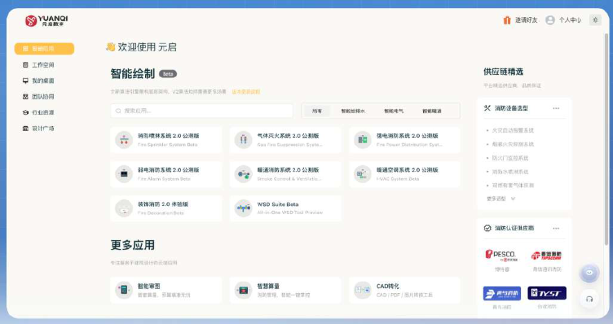
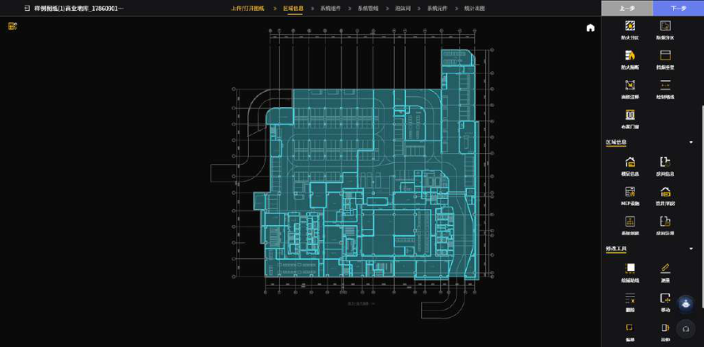
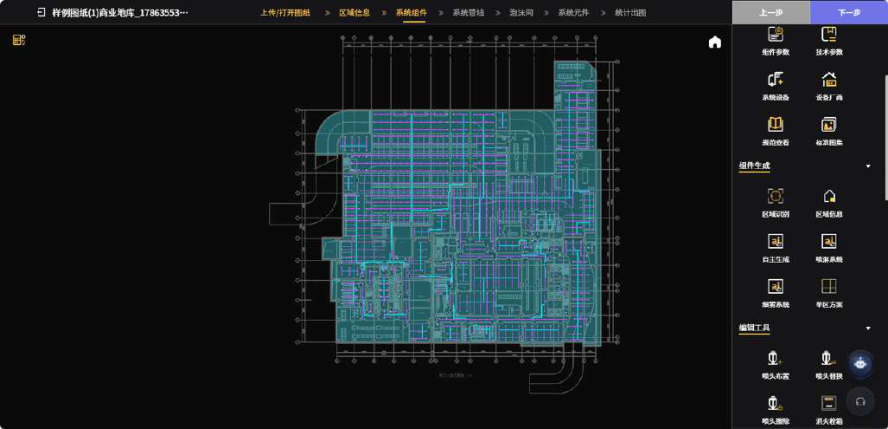
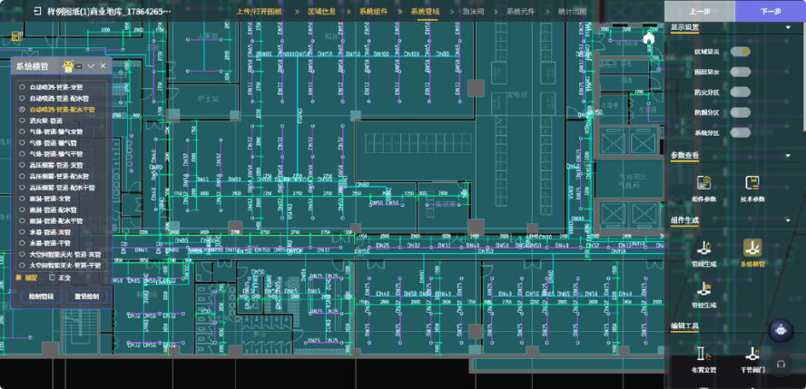

# CASE 21｜专业初稿要保留可控的调整空间

**行业**：建筑消防设计　 **学习主题**：专业工具与计算　 **共学时间**：约10分钟

## 一句话简介

FDE团队帮建筑设计人员解决消防施工图里要逐个房间布喷头、消火栓，还得反复查规范和随平面改图的问题，用专门的CAD解析模型和规则引擎先生成可调整的图纸初稿，让大型项目约30分钟就能先出一版，再由设计师改参数、审结果；这30分钟不包含最终专业审核和完整交付。

[案例主页](../README.md) · [返回目录](../../README.md) · [本例JSON](case.json) · [完整访谈](#full-interview) · [原PDF](../../../sources/original-interviews.pdf#page=210)

原题：从人工绘图到智能协作：FDE用AI重塑建筑图纸交付流程

来源范围：PDF物理页 210–218；书内页码 209–217。

**本例值得讨论的判断（编辑提炼）**：一键生成的价值，要用专业人员能否接手来判断。

> 阅读提示：标为“访谈概括”的内容来自受访者陈述；“补充分析”是编辑解释；“迁移演练”是迁移假设。效果数字保留原文的试点、目标、估算和脱敏条件。前半部用于备课和学习，后半部完整保留原访谈。

## 1. 业务现场与行业特点

### 发生了什么｜访谈概括

常规商业建筑的消防施工图可能涉及数百个空间，设计人员要完成喷淋、消火栓、灭火器及相关管线布置。位置、间距和参数需要对应空间情况和规范，类似房间反复执行相近规则，建筑方案一变还要同步修改。

过去依赖CAD、规范手册和个人经验，项目增多后绘制与检查工作形成瓶颈，合格人员培养也需要时间。已有插件和参数工具能解决局部计算，但设计人员仍要在理解图纸、规则判断和成果输出之间手动衔接。

关键现场事实：

- 建筑消防施工图，涉及喷淋、消火栓、灭火器与管线
- 大型项目可能包含数百个空间
- CAD图形、空间类型与消防规则共同决定布置

**原工作路径**：读CAD空间 → 查规范定参数 → 逐空间绘图 → 改图并人工核对

**重新定义的问题**：单点插件无法串起图纸理解、规则执行与成果输出；专业用户不接受黑箱一键交付。

依据：[原PDF物理页 211、212](../../../sources/original-interviews.pdf#page=211)；需要核实具体说法请查看[完整访谈](#full-interview)。

扩充段落主要参照：[Q1](#q1)、[Q2](#q2)；原PDF物理页 210–218。

### 为什么需要FDE｜补充分析

专业工程图不是一张视觉效果图，空间识别、规则适用、参数和输出格式共同决定它能否进入设计流程。生成能力必须与专业控制权相配合，让设计人员能够理解、修改和确认结果，才能处理标准空间之外的真实项目差异。

重复布置与规范核对繁重，方案变更又触发全图修改；专业人员必须对最终图纸负责。

FDE要把图形理解与行业规则工程化，并让默认自动化与专家控制兼容。

## 2. 解决思路怎样形成

### 从调研到方案的过程｜访谈概括

FDE先观察设计人员如何使用CAD、查规范和反复改图，确定最耗时的重复环节。团队自研专用模型解析CAD中的墙体、门窗、标注和空间信息，为后续布置提供基础，避免直接让通用模型自由理解并生成全部图纸。

消防知识被转化为可执行的规则引擎，将空间类型与危险等级、喷头参数及覆盖等判断连接起来。系统负责图纸理解、空间识别、规则匹配和初步方案生成，专业人员继续负责特殊情况和最终判断。

用户起初期待一键出完整图，实际使用中设计师要求更多控制，方案因此采用分层方式：常规空间可使用默认参数快速生成，专业用户可调整危险等级、K值、间距和布置方式，关键节点保留人工确认。

| 现场信号 | 形成的决定 |
|---|---|
| 通用模型难理解CAD专业结构 | 自研图形解析模型，提取建筑元素与空间 |
| 设施布置高度依赖明确规范 | 转为可执行规则引擎，限制自由生成 |
| 设计师要求对特殊项目保留控制 | 常规空间用默认参数，专业参数开放调整 |

依据：[原PDF物理页 213、214、216](../../../sources/original-interviews.pdf#page=213)；需要核实具体说法请查看[完整访谈](#full-interview)。

扩充段落主要参照：[Q3](#q3)、[Q5](#q5)、[Q6](#q6)；原PDF物理页 210–218。

### 这些取舍为什么重要｜补充分析

自动化程度越高，越需要让责任承担者看清和控制关键参数。保留调整入口会增加界面与流程设计工作，却能使专业人员处理例外并建立信任，是交付可用性的组成部分。

输入空间理解错误会传递到后续规则和生成结果，不能只检查图纸看上去是否完整。学习迁移时应把输入解析、规则版本、生成与专业确认分别作为可检查节点；本课程不提供可以直接用于工程设计的消防参数建议。

## 3. 工作流程与人机分工

以下流程图和职责划分是依据访谈所作的业务抽象，不补造未披露的技术架构。


| 步骤 | 实际作用 |
|---|---|
| 1. 输入CAD | 墙体、门窗、空间标注与面积 |
| 2. 专用模型解析 | 建立空间结构与建筑元素 |
| 3. 规则匹配 | 空间类型与设施参数 |
| 4. 生成专业初稿 | 布置与相关管线成果 |
| 5. 设计师审核 | 调整特殊空间，确认格式与最终方案 |

| 角色 | 负责什么 |
|---|---|
| AI | 图形解析、空间识别与初步生成 |
| 系统 | 规则引擎、参数控制、图纸输出 |
| 人 | 复核输入与方案，对最终设计负责 |

依据：[原PDF物理页 213、214、216](../../../sources/original-interviews.pdf#page=213)；需要核实具体说法请查看[完整访谈](#full-interview)。

## 4. 交付物、实际使用与组织采用

### 交付后怎样工作｜访谈概括

设计师从生成初稿开始检查、调整参数和优化特殊空间，减少逐个空间重复布置与核查的负担。结果定位为专业可用的初稿，需要符合行业及设计院使用格式，最终仍经设计人员审核确认。

交付组合包括CAD解析、行业规则、可调参数、初步图纸生成与人机协作流程。访谈展示喷淋系统和管径生成界面，也提到投标阶段能更快准备方案，但没有披露因此增加了多少中标或收入。

| 交付物 | 交付内容 |
|---|---|
| CAD解析与分区 | 把图纸转成后续可用的空间信息 |
| 可调参数的设计工具 | 兼顾一键默认和专业精细控制 |
| 行业可用图纸初稿 | 喷淋图与管径等成果，供设计师继续修改 |

### 实施与推广｜访谈概括

让设计人员用真实项目体验价值；关键环节人工确认，成果格式须满足实际交付标准。

团队通过实际试用，让设计人员看到初步工作时间缩短且结果可控制，从而逐步接受工作方式变化。工具能否进入原有流程、生成格式是否合用，与模型能力一样影响落地。

依据：[原PDF物理页 211、213、214、215、218](../../../sources/original-interviews.pdf#page=211)；需要核实具体说法请查看[完整访谈](#full-interview)。

扩充段落主要参照：[Q3](#q3)、[Q4](#q4)、[Q5](#q5)；原PDF物理页 210–218。

## 5. 实际成效与证据边界

### 原文报告的变化

| 指标 | 原来或参照 | 后来或状态 | 必须保留的限定 |
|---|---|---|---|
| 大型项目绘制 | 原完整绘制需数天 | 约30分钟出初步结果 | 不同交付成熟度：初稿仍需调整确认 |
| 原工作构成 | 约70%执行 / 30%判断 | 更多精力转向专业判断 | 原比例为受访者估计，无新比例 |
| 经验与业务 | 个体设计经验 | 规范沉淀，投标方案更完整 | 未披露审核通过率或中标收益 |

### 如何理解效果｜补充分析

原文称大型项目完整人工绘制需要数天，AI约30分钟可生成初步结果，这两个时间覆盖的工作范围不同，不能直接计算完整交付加速倍数。原先约70%执行、30%判断是工作构成描述，也不等于系统上线后已经节省70%全部工时。

**证据边界**：30分钟指初步结果，不是最终施工图验收；不提供或推断具体消防法规数值。

依据：[原PDF物理页 214、215、216、217](../../../sources/original-interviews.pdf#page=214)；需要核实具体说法请查看[完整访谈](#full-interview)。

## 6. 难点、应对与可复用经验

| 难点 | 原文中的应对 |
|---|---|
| 自动化与责任冲突 | 默认生成＋参数可调＋人工确认 |
| 错误会影响真实工程 | 输入校验、规则约束和质量控制 |
| 设计师质疑或担忧 | 真实体验节时价值，保留专业核心地位 |

依据：[原PDF物理页 214、215、216、217](../../../sources/original-interviews.pdf#page=214)；需要核实具体说法请查看[完整访谈](#full-interview)。

**可复用的方法（编辑归纳）**：结合第2节的关键取舍，关注真实任务如何被重新定义、可交付结果由谁确认，以及组织如何继续使用和修改。原受访者的全部经验保留在[Q6](#q6)。

## 7. 迁移到其他工作场景的讨论｜4分钟

以下是通用研发场景中的假设练习，不代表案例客户或任何学习者所在组织已经开展或验证了这些项目。

一个研发团队自动生成分子准备、计算配置或实验方案时，专家希望保留方法和关键参数控制。

**讨论问题**：一键生成与专家控制如何共存，又不让用户面对所有参数？

**本组应交出的产物**：将参数分成默认、需用户确认、必须专家决定3类。

个人思考40秒 → 小组讨论100秒 → 共识与质疑70秒 → 主持人收束30秒。

<details>
<summary>展开：迁移试点、验收与主持人参考</summary>

可将这一经验用于仿真配置、实验方案或研发报告的专业初稿生成。先识别输入对象，将确定性约束交给规则或计算工具，再开放影响专业结论的参数，让研究员在可复核初稿上调整，而非接受无法解释的最终答案。

试点验收应分开统计初稿生成、专家修改、复核和最终可用交付的时间，检查特殊案例和参数调整是否受控。讨论时特别关注：哪些内容可以快速默认生成，哪些必须由承担科学责任的人确认。

**建议切口**：常规场景提供可解释默认方案；复杂体系开放参数和依据，结果交给专家接续修改。

**建议验收**：建议验收：输入解析、规则检查、可编辑性、复现实验/计算与专家确认。

**适用限制**：不能把“生成配置成功”当作计算可靠或实验安全；专业边界与版本必须可见。

**主持人参考**：参考：按错误代价与适用域分层；可解释默认减少负担，关键假设和硬约束必须显式确认。

</details>

可以直接对Codex说：

```text
请带我学习案例21。先讲清项目做了什么，再用一个关键问题让我做判断。
讲事实时引用原PDF页码；讨论迁移方案时明确标为假设。
```

## 8. 原图与受访者介绍

[查看原案例封面与受访者介绍](../../../assets/cover_210.png)。人物姓名、职位及图片内文字以原PDF为准。

### 原图 1｜原PDF第211页



[回到原PDF第211页](../../../sources/original-interviews.pdf#page=211)

### 原图 2｜原PDF第213页



[回到原PDF第213页](../../../sources/original-interviews.pdf#page=213)

### 原图 3｜原PDF第215页



[回到原PDF第215页](../../../sources/original-interviews.pdf#page=215)

### 原图 4｜原PDF第215页



[回到原PDF第215页](../../../sources/original-interviews.pdf#page=215)

<a id="full-interview"></a>

## 9. 完整原始访谈

以下6组问答逐段保留原PDF文字层的原始提取内容。原有换行、术语或转义保留，不以编辑详解替代原文。文字层未包含的图片信息，请查看上方原图及[完整PDF第210–218页](../../../sources/original-interviews.pdf#page=210)。

<details>
<summary>展开全部访谈：Q1–Q6</summary>

<a id="q1"></a>

### Q1

Q1：作为FDE，你应用AI的具体场景是什么？在这个场景下遇到
的具体问题长什么样？
我们关注的业务场景，是建筑消防施工图的自动生成。
在建筑设计过程中，消防施工图是一类非常典型且高频的专业设计任务。一个常规商业
建筑项目，仅消防施工图就可能涉及数百个空间的设施布置。设计人员需要根据建筑
CAD图纸，逐一完成喷淋系统设计、消火栓布置、灭火器配置以及相关管线规划。
图1：机电消防产品总界面
这些工作并不是简单的“画图”。每一处设施的位置、间距、参数都需要对照消防规范
进行判断。比如：这个空间属于什么危险等级？应该选用什么K值的喷头？喷头之间的
间距是否在规范允许范围内？消火栓的覆盖半径是否满足要求？
在这个过程中，我们发现：
第一，大量时间消耗在重复性操作上。同一栋建筑可能有几十个功能相似的空间（如办
公室、走廊），每个空间都需要重复类似的消防设施布置流程。设计人员的大量精力消
耗在执行重复规则上，真正用于创造性设计的时间被严重挤压。
第二，规范检查占用大量精力。消防规范条目繁多，不同空间类型对应不同参数要求。
设计人员完成初步布置后，还需要逐项检查：间距是否合规、覆盖是否完整、参数是否
匹配。这个核对过程往往比绘制本身更耗时。
第三，修改迭代成本高。建筑方案调整是常态，每次平面布局变动，消防施工图都需要
同步修改。过去这种修改只能靠人工逐处调整，牵一发而动全身。
所以这个问题的本质在于：如何让AI理解建筑图纸这种专业图形信息，并结合消防行业
规则完成可用的生成结果，同时让设计人员保持对最终成果的控制权。

<a id="q2"></a>

### Q2

Q2：在你参与之前，这个问题过去是怎么解决的？
在我参与之前，企业主要依靠设计人员使用CAD软件配合消防规范手册完成工作。
这种方式在项目规模较小时能够正常运转。设计人员凭借专业知识和经验，可以灵活应
对不同项目的特点。但随着业务量增长，人工方式开始面临瓶颈。
首先，效率天花板明显。一个熟练的设计人员，一天能完成的消防施工图面积是有上限
的。当项目集中到来时，只能通过增加人力来应对，但培养一个合格的消防设计人员需
要较长时间。
其次，经验难以标准化。不同设计人员对规范的理解和设计习惯存在差异，同类型空间
的消防布置可能因人而异。这导致图纸质量不一致，审核环节需要额外投入精力。
另外，还有一个被忽视的问题。行业中也出现过一些数字化尝试，比如消防设计插件或
参数化工具。但这些工具通常只解决单点问题（如自动计算间距），无法覆盖从图纸理
解到成果输出的完整流程。设计人员仍然需要在多个工具之间切换，实际效率提升有
限。
因此，我们希望探索一种新的方式，推动AI贯穿图纸理解、规则判断、结果生成的全流
程，真正改变设计人员的工作方式，而非停留在做辅助小工具。

<a id="q3"></a>

### Q3

Q3：后来你使用AI解决这个问题的整体思路和关键步骤是什
么？
在开始做AI应用之前，我们首先需要理解设计人员真实的工作过程。建筑图纸是一种包
含空间关系、图形符号、标注信息的专业载体，通用大模型无法直接理解。
整个解决过程分为几个关键步骤。
图2：一张图纸上传后自动识别图纸然后进行区域分区的结果
第一步，解决AI理解CAD图纸的问题。
建筑CAD图纸包含大量专业信息：墙体、门窗、空间标注、面积数据等。系统需要准确
识别这些图形元素，理解建筑空间结构，才能为后续的消防布置提供基础。这不仅是图
像识别问题，还涉及对建筑制图规范的理解。为此，我们自研了专用模型来处理CAD图
纸的图形解析，使其能够准确提取空间信息和建筑元素。
第二步，将消防行业规则系统化。
消防施工图是高度规则化的设计工作，不能自由发挥。不同空间类型（办公、商业、车
库、设备用房等）对应不同的危险等级；不同危险等级决定喷淋系统的K值、喷头间
距、保护面积等参数；消火栓的布置需要考虑覆盖半径和消防通道要求。
我们需要将这些规范条文转化为系统可以执行的规则引擎，让AI在生成方案时自动遵循
行业标准，而非自由发挥。
第三步，设计人机协作的工作模式。
从一开始我们就明确了一个原则：AI负责生成，人负责决策。
在实际流程中，AI承担图纸理解、空间识别、规范匹配和初步方案生成的工作；设计人
员负责审核生成结果、根据项目特殊情况调整参数、做出最终专业判断。
具体来说，对于常规空间（如标准办公室、走廊），AI可以使用默认参数快速生成消防
布置方案；对于特殊空间或复杂场景，设计人员可以进一步调整危险等级、K值、喷头
间距、布置方式等参数。AI生成的结果定位为“专业可用的初稿”，最终决策权始终在设
计人员手中。
这种设计背后的考量，是尊重专业人员在设计流程中的核心地位，让设计人员把精力集
中在真正需要专业判断的环节。

<a id="q4"></a>

### Q4

Q4：相比传统方式，使用AI后的实际效果如何？
AI应用之后，最直接的变化体现在效率层面。一个大型项目的消防施工图完整绘制原本
需要数天时间，设计人员需要逐个空间完成设施布置，再逐条核对规范合规性。在AI辅
助生成后，项目方反馈，大型项目大约30分钟即可生成初步结果，设计人员在此基础上
进行调整和确认。
效率提升的背后，是工作重心的转移。
引入AI之前，设计人员的工作内容大致是：70%绘制和规范检查等执行类工作，30%专
业判断和方案调整。AI进入流程后，执行类工作由系统承担，设计人员可以将更多精力
投入到方案优化、特殊场景处理和整体质量控制上。设计人员的角色从“执行者”向“审
核者与决策者”转变。
图3：系统自动生成喷淋系统图纸
图4：喷淋管径自动生成
同时，AI也拓展了新的业务场景。
例如在投标阶段，企业过去需要投入大量时间准备消防方案和图纸。时间紧迫时，往往
只能做一个粗略的方案。现在通过AI生成能力，企业可以在短时间内完成更完整的消防
方案呈现，提升投标阶段的方案质量。
更深层的价值在于，消防设计经验和规范知识被系统化沉淀。过去，优秀设计人员的经
验存在于个人脑中，难以复制和传承。现在通过AI系统，规范知识和设计逻辑可以被工
程化，让团队整体设计能力更加稳定可控。

<a id="q5"></a>

### Q5

Q5：在部署AI过程中，是否遇到了新问题或挑战？你是怎么解
决的？
在实际部署过程中，我们遇到了几个关键挑战。
第一个挑战：自动化程度与专业控制权的平衡。
最开始，用户对AI的期待是“一键生成完整施工图”，因为这样效率最高。但在实际使用
过程中，专业设计人员表达了不同意见：他们希望保留更多调整空间。
原因是消防设计涉及责任问题。设计人员需要对最终图纸的合规性和安全性负责，他们
不能接受一个“大概对”，或者“完全黑箱”的生成结果。不同项目存在差异，某些特殊
空间确实需要设计人员根据实际情况调整参数。
我们的应对方式是提供分层设计：对于常规空间，提供默认参数的一键生成能力，降低
使用门槛；对于专业用户，开放危险等级、K值、喷头间距、布置方式等参数的调整入
口。让系统既能够快速产出，也能够精细控制。
第二个挑战：工程场景对可靠性的高要求。
与通用AI应用不同，工程设计场景对准确性要求极高。一个喷头位置偏差可能影响消防
验收，这不是“差不多”可以接受的。
因此，我们在系统设计中明确了边界：AI负责基于规范规则的自动化生成，但不做超出
规则范围的“创造性判断”。最终方案必须经过设计人员审核确认，系统在关键节点设
置人工确认环节。同时，我们确保基础输入数据（建筑图纸信息）的准确性，因为输入
错了，后续一切生成结果都不可靠。
第三个挑战：让设计人员接受新的工作方式。
对于习惯了全手工绘制的设计人员来说，接受AI辅助需要心态转变。部分设计人员最初
担心AI会替代他们的工作，也有一些人对AI生成结果的可靠性持怀疑态度。
我们的做法是让设计人员在实际使用中体验价值，而非强行说服。当他们亲眼看到AI大
幅缩短了初步工作时间，且生成结果质量可控时，态度自然发生转变，自下而上推动我
们的的模型和应用产品重塑企业传统工作流。关键是让用户感受到，AI的角色是帮他们
承担执行性工作，让他们去做更有价值的专业判断。

<a id="q6"></a>

### Q6

Q6：根据你的经验，我们怎么才能更好地把AI部署到实际业务
中？
通过这个案例，我们最大的体会是：AI落地首先要找到真实业务问题，而不是拿着AI能
力去找场景。
第一，进入业务现场，理解用户每天在解决什么问题。
对于FDE来说，不能坐在办公室里想象用户需求。在这个项目中，只有真正看过设计人
员如何在CAD里逐条核对规范、如何为一个参数调整反复修改图纸，才能理解哪些环节
真正消耗时间，哪些问题值得用AI解决。
第二，明确AI在业务流程中的角色边界。
不是所有环节都适合AI介入。在这个场景中，规范化的绘制和规则检查适合AI承担，但
最终的专业判断和责任必须保留给设计人员。明确这个边界，既能发挥AI的效率优势，
也能保证专业质量。
第三，关注落地细节，而不仅是技术效果。
AI项目的成功取决于多个维度：用户是否愿意使用？工作流程是否需要大幅调整？生成
结果的格式是否符合行业交付标准？这些问题往往比模型能力本身更关键。在这个案例
中，如果AI生成的图纸格式不符合设计院的标准，即使内容正确也无法进入实际流程。
最终，FDE的核心价值在于连接业务、技术和用户，让AI真正进入企业流程并产生实际
价值。FDE需要同时理解业务语言和技术语言，在两者之间做好翻译和桥梁。这也是
FDE区别于传统AI工程师的关键所在：我们从技术交付出发，最终推动的是工作方式的
实际改变。

</details>

[返回案例目录](../../README.md) · [本例结构化数据](case.json)
