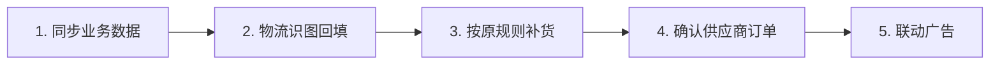

# CASE 22｜让库存真正影响补货与广告

**行业**：东南亚跨境服装电商　 **学习主题**：经营协同与价值　 **共学时间**：约10分钟

## 一句话简介

FDE团队帮一个做东南亚服装电商的十几人团队解决几千个SKU的库存、物流照片、补货和广告各管各的问题，把原SaaS数据接到飞书，让AI先识别照片、按原规则整理补货单，再让人确认，并把库存变化连到广告调整上，物流图片和数据处理从每天四五小时缩到一小时以内；后续利润效果没有完整跟踪。

[案例主页](../README.md) · [返回目录](../../README.md) · [本例JSON](case.json) · [完整访谈](#full-interview) · [原PDF](../../../sources/original-interviews.pdf#page=219)

原题：从库存割裂到业务联动：FDE用AI打通跨境电商的库存、补货与广告决策

来源范围：PDF物理页 219–228；书内页码 218–227。

**本例值得讨论的判断（编辑提炼）**：接口打通之后，要继续追问数据改变了哪个动作。

> 阅读提示：标为“访谈概括”的内容来自受访者陈述；“补充分析”是编辑解释；“迁移演练”是迁移假设。效果数字保留原文的试点、目标、估算和脱敏条件。前半部用于备课和学习，后半部完整保留原访谈。

## 1. 业务现场与行业特点

### 发生了什么｜访谈概括

服装的颜色与尺码分别形成SKU，客户每季度约新增500至800个，全年约2500至3000个，由十到十五人处理。库存集中在聚合SaaS，新品及业务信息在飞书，物流靠拍照和人工回填，补货又在Excel中计算。

员工要下载库存、填表、套自己的补货公式，再誊入模板生成供应商PDF订单；广告则在另外的平台持续投放。库存不足时广告仍可能带来无法交付的订单，因此信息割裂同时影响操作负担与业务决策。

关键现场事实：

- 10–15人团队，全年SKU估约2500–3000个
- 库存在聚合SaaS，业务在飞书，物流仍拍照
- 补货经Excel公式计算，再填模板生成供应商PDF

**原工作路径**：扒库存数据 → 看物流照片回填 → Excel算补货 → 广告独立投放

**重新定义的问题**：客户说“打通SaaS和飞书”，真正要减少的是识图、抄写、计算与跨流程错配。

依据：[原PDF物理页 220、221](../../../sources/original-interviews.pdf#page=220)；需要核实具体说法请查看[完整访谈](#full-interview)。

扩充段落主要参照：[Q1](#q1)、[Q2](#q2)；原PDF物理页 219–228。

### 为什么需要FDE｜补充分析

多SKU零售的自动化价值来自流程之间的信息连接。原补货规则未必需要推翻，先减少人工搬运与重复填报，就能让正确的数据更快进入决策；库存进一步影响广告时，则需要明确触发条件和业务确认方式。

系统割裂使人充当连接件；SKU增长放大搬运成本，缺货时广告还可能继续消耗。

要通过录屏追出业务链、解决真实API限制，并把效果归因纳入交付安排。

## 2. 解决思路怎样形成

### 从调研到方案的过程｜访谈概括

客户最初只提出打通SaaS与飞书，FDE用约一周、三四轮沟通和操作录屏追踪实际工作，才看到照片、补货、供应商下单与广告之间的连续问题，再与技术团队判断哪些用脚本、哪些需要Agent。

对接时发现API开放有限，Key刷新会影响其他团队共同使用，原先直接连接的设想不适配。团队增加Supabase作为云端数据中转层，再向飞书同步，让熟悉的业务环境能够使用库存信息。

接着用Agent识别物流照片并回填，保留人工核对；依据原有补货公式筛选SKU、整理周期与数量，经人确认生成订单。库存与广告也被关联起来，低库存时可调低额度或暂停相关投放，逐步形成跨流程联动。

| 现场信号 | 形成的决定 |
|---|---|
| 约1周、3–4轮沟通与录屏演示 | 从接口需求追到物流—补货—供应商—广告 |
| API密钥刷新影响多个团队 | 用Supabase中转，稳定同步到飞书 |
| 数据打通又暴露新机会 | 保留原补货公式，并将库存变化用于广告决策 |

依据：[原PDF物理页 222、223、225](../../../sources/original-interviews.pdf#page=222)；需要核实具体说法请查看[完整访谈](#full-interview)。

扩充段落主要参照：[Q3](#q3)、[Q5](#q5)、[Q6](#q6)；原PDF物理页 219–228。

### 这些取舍为什么重要｜补充分析

“有API”只说明存在接口，Key失效、并发使用和多团队依赖仍可能影响整个方案。这个案例说明FDE要验证真实操作条件，并在保持业务目标的同时调整技术路径。

确定性任务适合脚本和定时流程，语义理解与复杂输入处理再考虑Agent。补货规则已有明确公式时，应让计算可复现、让人员能核对输入和结果；不应将流程里所有自动动作都归为大模型自主判断。

## 3. 工作流程与人机分工

以下流程图和职责划分是依据访谈所作的业务抽象，不补造未披露的技术架构。



| 步骤 | 实际作用 |
|---|---|
| 1. 同步业务数据 | 聚合SaaS→中间库→飞书 |
| 2. 物流识图回填 | AI第一轮，人工核对 |
| 3. 按原规则补货 | 输出SKU、周期与数量 |
| 4. 确认供应商订单 | 人工确认后生成PDF |
| 5. 联动广告 | 结合库存调低或暂停，保留业务判断 |

| 角色 | 负责什么 |
|---|---|
| AI | 物流图像理解、流程判断和任务组织 |
| 系统 | 数据同步、既有补货规则与订单输出 |
| 人 | 确认识别、补货和关键经营动作 |

依据：[原PDF物理页 222、223、227](../../../sources/original-interviews.pdf#page=222)；需要核实具体说法请查看[完整访谈](#full-interview)。

## 4. 交付物、实际使用与组织采用

### 交付后怎样工作｜访谈概括

员工从看图抄数、下载填表，转为核对识别结果与补货建议，确认后生成供后续处理的PDF订单。原有业务逻辑和常用工具得到保留，机器承担跨系统搬运与第一轮信息整理。

交付包含数据中转与同步、物流识图回填、原规则补货流程、订单生成和库存广告联动。实际复制时需要重新核对接口限制、数据更新与业务规则，不能因为工具名字相同就假定连接方式也能原样适用。

| 交付物 | 交付内容 |
|---|---|
| 中转数据层 | Supabase应对密钥与共享限制 |
| 物流＋补货链路 | 识图、回填、规则计算和PDF订单衔接 |
| 库存广告联动 | 用业务状态影响投放，避免缺货还继续烧钱 |

### 实施与推广｜访谈概括

交付后团队权限被客户移除，后续经营数据未完整追踪；原PDF架构图处有Image占位。

上线过程中在图片识别、补货计算等关键节点保留人工确认，尽量降低使用者改变工具习惯的负担。交付结束后客户移除了外部团队权限，后续主要靠客户遇到问题再反馈，团队因此难以持续获取完整经营结果。

依据：[原PDF物理页 222、223、224](../../../sources/original-interviews.pdf#page=222)；需要核实具体说法请查看[完整访谈](#full-interview)。

扩充段落主要参照：[Q3](#q3)、[Q4](#q4)、[Q5](#q5)；原PDF物理页 219–228。

## 5. 实际成效与证据边界

### 原文报告的变化

| 指标 | 原来或参照 | 后来或状态 | 必须保留的限定 |
|---|---|---|---|
| 每日物流照片处理 | 约4–5小时 | 1小时以内 | AI先识别回填，人核对；访谈陈述 |
| 一次补货处理 | 至少2–3小时 | 变为看结果并确认 | 未披露新的完整耗时 |
| 经营效果 | 广告与库存割裂 | 已形成联动能力 | 营收、广告成本和利润数据不完整 |

### 如何理解效果｜补充分析

原文称物流照片和数据处理由每日四至五小时降到一小时以内，补货原先至少两三小时的搬运计算转为审核结果，但没有给出补货环节统一的新耗时。后续营收、广告成本和利润数据缺失，不能据此声称已验证广告ROI或利润提升。

**证据边界**：未追踪收益是本例关键教训；库存联动能力不等于已验证广告节约额。

依据：[原PDF物理页 224、225、228](../../../sources/original-interviews.pdf#page=224)；需要核实具体说法请查看[完整访谈](#full-interview)。

## 6. 难点、应对与可复用经验

| 难点 | 原文中的应对 |
|---|---|
| 表面接口需求掩盖全链路 | 反复演示与录屏，翻译成可执行需求 |
| 有API却难共享使用 | 增加中间数据层 |
| 交付后无法归因 | 反思在立项时设计基线与持续反馈 |

依据：[原PDF物理页 224、225、228](../../../sources/original-interviews.pdf#page=224)；需要核实具体说法请查看[完整访谈](#full-interview)。

**可复用的方法（编辑归纳）**：结合第2节的关键取舍，关注真实任务如何被重新定义、可交付结果由谁确认，以及组织如何继续使用和修改。原受访者的全部经验保留在[Q6](#q6)。

## 7. 迁移到其他工作场景的讨论｜4分钟

以下是通用研发场景中的假设练习，不代表案例客户或任何学习者所在组织已经开展或验证了这些项目。

某实验室的耗材库存、计算筛选结果、实验排程与采购互不感知。

**讨论问题**：客户交付后收回权限，FDE还能怎样验证业务价值？

**本组应交出的产物**：提出一套客户可自主保留、可定期共享的脱敏指标和回访机制。

个人思考40秒 → 小组讨论100秒 → 共识与质疑70秒 → 主持人收束30秒。

<details>
<summary>展开：迁移试点、验收与主持人参考</summary>

可将这一方法用于计算资源、样品、实验耗材与任务排期的连接。保留已有排程或补货规则，先让真实用量、预计消耗和申请记录相互对应，再明确何时提醒补充、何时需要人员调整计划。

项目开始时就约定效果记录和交接方式，即使FDE后续退出，也能由内部负责人记录处理时间、误报和实际结果。试点区分系统已联通、人员已采用和业务已改善，避免只证明数据能跑通。

**建议切口**：保留成熟规则，先连通最小数据链；库存和实验结果变化触发可审核的后续任务。

**建议验收**：建议验收：数据流延迟、手工回填时间、缺料等待、实际执行与反馈。

**适用限制**：实验排程变化可能改变科学设计；关键动作需审批，持续指标权限应在开始时约定。

**主持人参考**：参考：尊重客户权限边界；预先约定基线、汇总导出与确认责任，不依赖永久后台访问。

</details>

可以直接对Codex说：

```text
请带我学习案例22。先讲清项目做了什么，再用一个关键问题让我做判断。
讲事实时引用原PDF页码；讨论迁移方案时明确标为假设。
```

## 8. 原图与受访者介绍

[查看原案例封面与受访者介绍](../../../assets/cover_219.png)。人物姓名、职位及图片内文字以原PDF为准。

本例没有单独提取出的正文图片；封面、图内文字与全部页面仍保存在原PDF。上方流程图是编辑抽象。

<a id="full-interview"></a>

## 9. 完整原始访谈

以下6组问答逐段保留原PDF文字层的原始提取内容。原有换行、术语或转义保留，不以编辑详解替代原文。文字层未包含的图片信息，请查看上方原图及[完整PDF第219–228页](../../../sources/original-interviews.pdf#page=219)。

<details>
<summary>展开全部访谈：Q1–Q6</summary>

<a id="q1"></a>

### Q1

Q1：作为FDE，你应用AI的具体场景是什么？在这个场景下遇到
的具体问题长什么样？
这个案例表面上看是一起“系统集成”，但真正要解决的，是跨境电商业务链路上的信
息割裂。
客户是一个十几人的跨境电商团队，主要做东南亚市场，主营服装。服装行业每个颜
色、每个尺码都会形成一个独立SKU，所以SKU特别多。按照访谈中的估算，他们每个
季度新增500～800个SKU，全年SKU大概在2500～3000个。对于一个10～15人的团队
来说，这样的SKU数量和平台复杂度已经不低了。
他们过去的库存数据集中在一个多平台聚合SaaS里，各个电商平台的库存会汇总进去，
但新品开发、部分业务信息又在飞书里，两边没有打通。客户最开始找到我时，说得非
常简单，能不能把这个SaaS和飞书打通。
我没有急着把它当成一个API集成项目。如果只是集成，技术上没有太大障碍，真正要问
的是，打通以后谁用，用来解决什么业务问题。
所以我们没有急着开发，连续开了几次会，让客户录屏演示他们实际怎么工作。也正是
在这个过程中，我们才逐渐看到，库存只是整条链路上的一个环节。
工厂发货时没有用RFID或者扫码枪，物流环节仍然靠拍照、识图，再由员工人工看照
片、填写数据，追踪物流单号和进展。数据已经产生了，人还在充当那个“数据搬运
工”。
库存管理也一样。过去他们通过Excel计算补货，工作人员要从聚合SaaS里把数据扒下
来，填进自己的计算表，按自己的一套公式计算补货，再把结果填进另一个模板，最后
生成PDF发给供应商。
广告的问题更直接。他们每天在Google、TikTok等平台投广告，广告是持续烧钱的。如
果某个SKU库存已经很低，广告还在继续跑，客户继续下单，企业却发不出货，广告费
用还在继续消耗。
所以我最后看到的，是一条业务链。订单和库存数据 → 物流数据 → 补货决策 → 供应商
下单 → 广告投放。
真正值得解决的，是让这些原本割裂的环节能够互相感知。

<a id="q2"></a>

### Q2

Q2：在你参与之前，这个问题过去是怎么解决的？
过去这家团队的工具不算少，Excel、聚合SaaS、飞书都在转。最累的，是那个在各个
工具之间来回搬数据的人。
十几人的团队，业务规模还不大的时候，一个人来回搬数据也应付得过来，成本也不
高。他们补货也有一套自己的公式，工作人员看SKU过去三个月的销售，结合自己的预
测逻辑，就能算出下一次该补什么颜色、什么尺码、补多少。这套逻辑是成立的，问题
在于它被埋进了一条需要人工反复搬数据的流程里。
所以我们没有重新发明一套库存算法。客户原来的补货逻辑可以继续保留，我们要做
的，只是把其中机械、重复、跨系统的动作交给机器。
这个案例的瓶颈，在数据和人的关系上。
工作人员先把数据从一个系统里扒下来，填进Excel；Excel算完，又誊到另一个模板；
物流照片到了，再一张张人工看；广告又在另外的平台上跑。
每件事单独看都不重，可一旦连成一串，就是一条非常长的人工链路。
SKU还在涨。几十个、几百个的时候，人盯得过来；涨到几千个，人一天的时间就大量
耗在“看、抄、填、核对”上。规模越大，人越被钉在这些搬运动作上。
我们的改造，是把这条人工链路拆开，看清哪些环节必须由人做，哪些环节机器做得更
好，再把机器擅长的部分接上。工具没换，人不用再当那个中间连接件。

<a id="q3"></a>

### Q3

Q3：后来你使用AI解决这个问题的整体思路和关键步骤是什
么？
这个案例最有意思的地方，是我们一开始根本没有一个完整需求内容。
客户最初只是说，我想把两个平台打通。
如果按照传统项目交付的方式，我可能就直接拿需求、评估接口、开始开发。但FDE的
工作方式不太一样，我需要先判断客户真正想解决什么。
我们大概花了一周，进行了三四轮沟通，把客户的场景一点点收集起来，再回来和团队
讨论，哪些地方适合自动化，哪些地方可以接Agent，哪些地方其实不需要AI。
第一步，先把数据打通。
我们做的第一件事，是先把数据基础搭起来。
客户原来的核心数据在聚合SaaS里，业务管理又在飞书里，所以我们先想办法把数据同
步到飞书，让他们可以直接在熟悉的业务环境里看到实时库存。
这个过程中，碰到了整个项目里最难啃的技术问题。对方SaaS的API开放程度很低，
Key的机制也满足不了客户多个团队同时共享数据的需求。最后我们增加了一层开源的
云端数据库（Supabase）做中转，让数据先进入这个中间库，再从这里同步到飞书。
这也正是FDE做事的方式，业务目标不变，实现路径可以不断调整。
第二步，让AI处理物流照片。
数据打通之后，一个非常明显的人工瓶颈冒了出来，物流照片。以前工厂拍完照，上传
到多维表，接下来全靠员工一张张看图、回填。
这个流程其实非常适合AI。
所以我们让Agent参与“识图\+回填”，同时保留人工确认。AI负责把原来最耗时间的第
一轮识别和数据录入做掉，人只需要最后检查。这一点我很看重，AI放在这里，是因为
这段工作本来就适合它。
第三步，让AI照着原来的公式算补货。
数据打通之后，原来那套靠人扒数据、填表、计算的补货流程，就有了新的基础。
现在数据可以直接进入业务流程，Agent按照原来的补货规则进行计算，把需要补货的
SKU筛出来，同时给出预计的补货周期和数量。
人工的角色从“计算员”变成了“审核员”。如果结果没问题，确认之后就可以直接生成
PDF订单发给供应商。
第四步，再把库存和广告联系起来。
做到这里，客户又自然产生了下一层需求。既然现在已经知道库存了，那是不是可以让
库存反过来影响广告？
于是我们进一步把库存、订单以及广告投放情况结合起来。
当某个SKU库存下降到一定程度时，Agent可以判断对应广告是否还应该继续投。如果
库存不足，就先把广告额度调低，甚至暂停广告，避免一边烧广告、一边发不出货。
所以整个过程，更像是一步步往前推，打通数据，看见新问题，解决新问题，再产生新
的业务可能性。
客户一开始自己也没有把这些需求全部想清楚。很多时候，他只是知道“我现在很
痛”，但不知道技术应该怎么解决。FDE要做的，就是把这种结果导向的需求，拆成可
以落地的业务和技术问题。
Image
Image
图1：东南亚跨境电商场景下的AI Agent方案架构

<a id="q4"></a>

### Q4

Q4：相比传统方式，使用AI后的实际效果如何？
这个案例有一个特别的地方，交付结束后，客户把我们的团队权限移除了，后续的营
收、广告成本和利润数据，我们没有拿到完整的。但时间效率上的变化是比较明确的。
以前处理物流照片和数据，一个人每天大概需要花4～5个小时去看图片、写数据。现在
AI先完成识别和回填，人只需要做最后的核对，整体时间被压缩到了1小时以内。
补货也是类似。以前从不同系统扒数据、对数据、填Excel、计算，再整理成订单，至少
需要2～3个小时。现在Agent把结果算出来之后，工作人员主要负责看一眼、验证一
下，确认之后就可以生成订单。
所以我更愿意把这个项目的价值概括成三个变化。
第一，从“人工搬数据”变成“数据自动流动”；第二，从“人工计算”变成“AI计算、人
工确认”；第三，从“库存、补货、广告各自决策”变成“库存开始影响广告决策”。
尤其第三点，我认为比单纯节省几个小时更重要。
以前库存是一个结果，广告是另一个动作，两边其实是割裂的。现在库存变化可以直接
影响广告投放，业务开始从单点自动化走向了流程之间的联动。
当然，这个案例的效果跟踪还有不足。

<a id="q5"></a>

### Q5

Q5：在部署AI过程中，是否遇到了新问题或挑战？你是怎么解
决的？
这个项目真正难的地方，其实不在Agent怎么写。最难的是两件事，需求，以及现实世
界里那些“不好用的系统”。
第一个挑战，客户说出来的需求，不一定是真正需求。
客户一开始说的是“帮我把两个系统打通”。但如果我们就照着这个需求做，可能最后
只是交付了一个API接口，而没有解决他真正的问题。
所以我们反复让客户演示工作流程，甚至让他录屏。只有把“他每天到底怎么工作”看
清楚以后，我们才发现后面还有照片处理、补货、供应商下单、广告投放等一系列问
题。
这件事让我慢慢相信，FDE很重要的一个角色其实是“翻译”。
客户说的是业务语言，技术人员听到的是技术语言，中间需要有人把两者转换起来。
我自己在团队里其实就比较偏这个Echo的角色，前期咨询、快速做演示、做技术选型，
再把客户说的话整理成技术人员可以执行的需求。
甚至我当时在和技术团队开会之前，会先让AI帮我把客户的需求重新梳理一遍，再拿去
跟技术人员沟通。这本身就是一种AI优先的工作方式，AI先帮助我提高自己的理解和表
达效率，项目本身仍然由我来推进。
第二个挑战，API能不能用，和“有API”完全是两回事。
一开始我们想得很简单，有API，就可以接。
真正做起来以后才发现，SaaS方提供的API虽然能用，但Key有失效机制，一个Key也不
能被多个团队同时使用。如果A团队刷新Key，B团队原来的Key就会失效，而客户除了
我们之外，实际有多个团队需要共享这个key去拉数据。
最后我们在中间加了一层数据中转，把数据先引出来，再同步回飞书。
这件事让我印象很深，它说明了一个问题，现实世界里的AI落地，很多时候卡在模型之
外，企业原有系统的开放程度、数据结构和接口限制，往往才是真正的门槛。AI本身可
能已经能做了，但数据根本拿不出来，还是落不了地。
第三个挑战，先判断这个问题到底需不需要AI。
我们一开始考虑过Agent，但会先判断，看到一个需求，到底值不值得上Agent。
一些非常确定、规则非常死的任务，其实写一个脚本、跑一个定时任务就够了。只有当
任务开始涉及语义理解、跨系统判断，传统脚本比较难覆盖的时候，才需要引入
Agent。
所以做方案选择时，我会先问，这个问题到底需不需要AI。
能用简单自动化解决的，就不要为了追热点强行用Agent；真正需要理解、判断和跨流
程协作的部分，再把Agent放进去。

<a id="q6"></a>

### Q6

Q6：根据你的经验，我们怎么才能更好地把AI部署到实际业务
中？
做这个行业越久，我越确信，FDE真正的壁垒并不在“会不会搭一个Agent”。
因为现在代码、自动化、Agent这些东西都更容易获得了，技术本身在变便宜，真正值
钱的，是你能否理解业务、判断需求，以及知道什么方案真正适合这个客户。
我自己总结下来，有几个比较重要的经验。
第一，先解决业务问题，再决定用什么AI。
客户告诉你的往往是一个结果，“我希望库存不要断”，“我希望补货不要这么麻烦”，
“我希望广告不要浪费钱”。
但他不一定知道应该用Agent、脚本、自动化还是一个表格解决。
FDE的价值，是先把客户要的结果拆开，看清它背后对应哪条业务链路，再判断技术该
插在哪一段。
第二，不要把“需求不明确”理解成客户不知道自己要什么。
其实客户通常知道自己想要什么，他们只是不会用技术语言描述。
这个案例里，客户知道自己想把库存管理做好，也知道自己希望减少人工操作，但他不
知道API怎么接、不知道哪些流程适合自动化，也不知道库存和广告其实可以联动。
所以FDE的工作，是把客户已经存在、却一直没被清楚说出来的需求，落成可以执行的
技术方案。
第三，AI落地一定要保留人在关键节点上的判断。
这个案例里，我们没有追求100%无人化。图片识别之后，保留人工核对；补货计算之
后，人工确认；广告调整也是基于库存情况做业务判断。
我认为这是比较现实的AI落地方式，AI负责处理大量重复工作，人负责最终判断。
（Human in the loop\)
尤其在企业场景里，真正有价值的，是把人的时间从低价值操作中释放出来，让这些时
间流向更需要人的判断力的地方。
第四，FDE一定要沉淀行业方法论。
这一点，是我这两年体会特别深的地方。
如果今天做一个电商客户，明天做一个制造业客户，后天又做一个完全不同的行业，每
次都从零开始理解业务，那么交付成本会非常高。
但如果你长期深耕一个行业，很多东西就可以复用。
比如表格应该怎么设计、业务流程在哪几个环节最容易出问题、Agent应该插在哪里、
客户通常会有哪些需求，这些经验都会逐渐沉淀下来。
我认为真正可持续的FDE，是找到自己最擅长的行业和场景，把一个行业反复做深。
第五，交付之后，效果归因也是FDE工作的一部分。
这个案例最大的遗憾，就是我们当时交付完以后，没有把后续效果完整追踪下来。主要
是我们以往的合作模式也是偏向外包的方式，对于效果的追踪没有那么重视。
交付之后，只有客户在使用过程中遇到问题会回来找我们，但我们没法系统地记录和监
控到底节省了多少时间、减少了多少成本、对营收和利润产生了多少影响。
后来我们也意识到，这其实应该成为FDE服务闭环的一部分，交付、使用、反馈、迭
代、效果归因，再进入下一轮优化。团队后来也开始探索更系统的回访和数据收集方
式。
所以如果让我重新做一遍这个项目，我可能会在一开始就设计好一套“效果基线”。
项目上线前，记录人工处理需要多少时间；上线后，再持续记录需要多少时间；补货、
广告、订单等关键环节，也尽量找到可以量化的指标。
这样我们最终交付的，就既是一个“能跑的AI”，也是一套能够证明自己到底创造了多少
业务价值的解决方案。
这也是我理解的FDE，站到业务现场，和企业一起，把一个模糊的问题，逐渐变成一个
可以运行、可以使用、可以持续产生价值的东西。

</details>

[返回案例目录](../../README.md) · [本例结构化数据](case.json)
