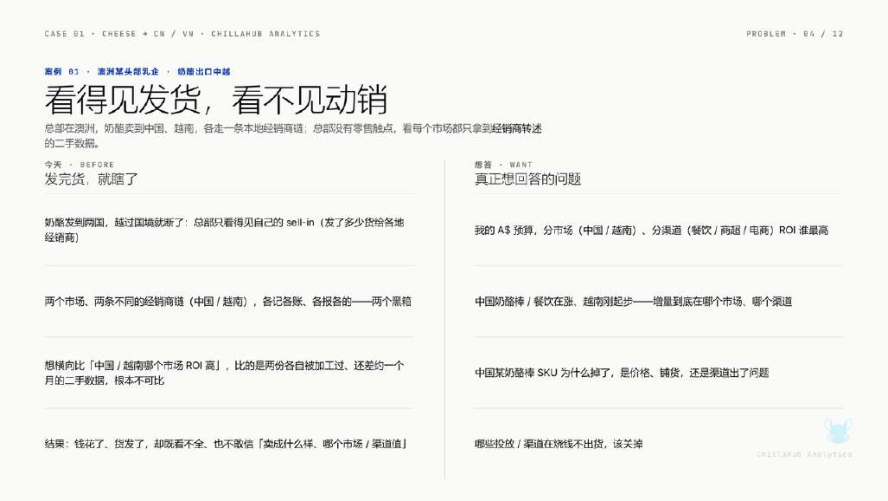
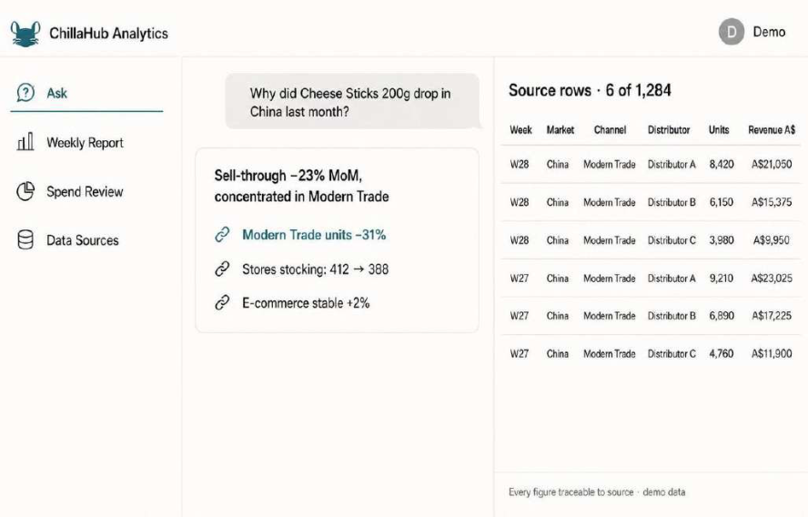
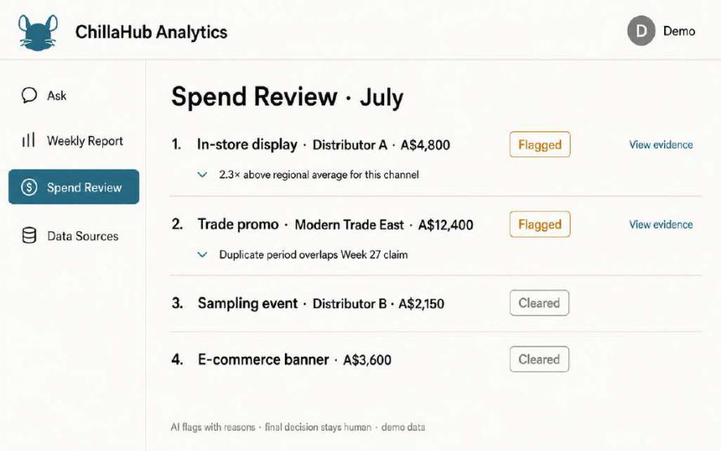
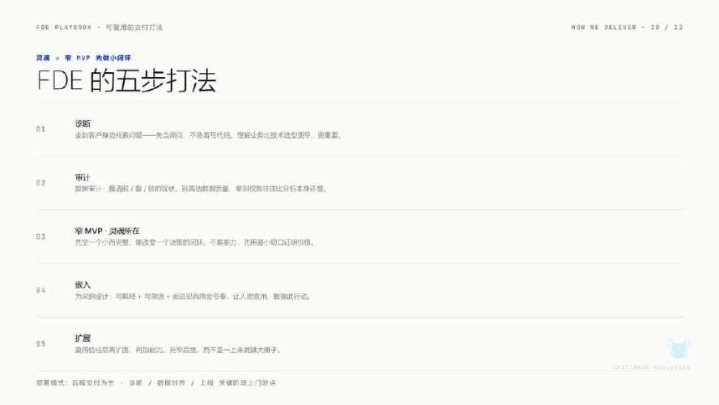

# CASE 24｜每个经营数字都能回到原始数据

**行业**：跨境快消与经销商　 **学习主题**：经营协同与价值　 **共学时间**：约10分钟

## 一句话简介

FDE团队帮一家通过经销商卖到中国和越南的澳洲奶酪企业解决总部只看得见发货、看不清终端卖了多少和市场费用是否合理的问题，把经销商的表格、票据和图片整理成统一口径，接进原系统，异常带着原始依据交给人审核，让周会少花时间对数；访谈称费用问题发现比例从不到10%提高到约30%，这些数字做过脱敏。

[案例主页](../README.md) · [返回目录](../../README.md) · [本例JSON](case.json) · [完整访谈](#full-interview) · [原PDF](../../../sources/original-interviews.pdf#page=237)

原题：从发货到动销：FDE用AI打通跨境快消的海外数据断层

来源范围：PDF物理页 237–246；书内页码 236–245。

**本例值得讨论的判断（编辑提炼）**：数据进入周会和预算决策，才走完最后一段路。

> 阅读提示：标为“访谈概括”的内容来自受访者陈述；“补充分析”是编辑解释；“迁移演练”是迁移假设。效果数字保留原文的试点、目标、估算和脱敏条件。前半部用于备课和学习，后半部完整保留原访谈。

## 1. 业务现场与行业特点

### 发生了什么｜访谈概括

客户是澳洲头部乳企，通过经销商进入中国和越南，总部缺少直接零售触点。品牌发给经销商多少，与消费者最终买走多少不同，但跨市场沟通常把这两种销量混在一起，总部也难以判断市场活动投入是否有效。

经销商通过Excel、邮件、PDF、图片甚至手写凭证反馈业务，语言、字段、单位和买赠返利记录方式不同。人工整理、翻译和反复对数造成滞后，已有BI只能展示结构化结果，无法自行解决原始数据与业务口径的不一致。

关键现场事实：

- 澳洲头部奶酪乳企，经销商进入中国与越南
- 总部没有两国零售触点，发货后缺少动销视角
- 数据来自Excel、PDF、图片和手写凭证

**原工作路径**：总部发货 → 渠道报Excel/邮件 → 人工翻译整理 → 开会先对数再判断

**重新定义的问题**：已有BI只能展示清洗后的数据，不能解决跨市场原始口径和审核证据问题。

依据：[原PDF物理页 238、239、240](../../../sources/original-interviews.pdf#page=238)；需要核实具体说法请查看[完整访谈](#full-interview)。

扩充段落主要参照：[Q1](#q1)、[Q2](#q2)；原PDF物理页 237–246。

### 为什么需要FDE｜补充分析

跨境渠道分析的前提是比较同一含义的数据。品牌发货、经销商销售与终端动销处在不同环节，单位和促销也会改变数字解释；FDE需要从数据源头确认口径，再让图表和自然语言分析建立在可追溯事实之上。

发给经销商与消费者实际购买是不同口径；单位、促销与语言差异让表面可比的数据失真。

FDE要同时理解总部与经销商，统一口径、做窄试点、降低填报负担并确保数字可追溯。

## 2. 解决思路怎样形成

### 从调研到方案的过程｜访谈概括

FDE观察总部销售运营如何接收、核对和解释数据，并远程了解经销商填报，确定总部需要什么、对方能提供什么、哪些可自动获取和哪些必须确认，将重点放在较难获得的终端动销数据。

原先设想新建海外数据平台，现场发现成熟系统和习惯已经存在，改为在原框架上叠加能力。第一版只覆盖中国的一条产品线，围绕费用是否值得做完数据进入、来源查看与周会使用，再扩到越南。

AI负责从不同文件抽取、清洗、校验和标记风险，系统负责存储、权限和流程，人员处理复杂决策与最终审核。业务可用自然语言追问SKU变化，但每个数字必须能定位原始记录，无法溯源的漂亮答案不作为可用输出。

| 现场信号 | 形成的决定 |
|---|---|
| 近距离观察总部，远程了解经销商 | 先分清Sell In与Sell Through需要什么数据 |
| 想建新海外平台，但旧流程已成熟 | 改为嵌原系统，先中国一条产品线端到端 |
| 问数答案漂亮却找不到依据 | 每个数字必须点到原始行，溯不回则不答 |

依据：[原PDF物理页 240、241、242](../../../sources/original-interviews.pdf#page=240)；需要核实具体说法请查看[完整访谈](#full-interview)。

扩充段落主要参照：[Q3](#q3)、[Q5](#q5)、[Q6](#q6)；原PDF物理页 237–246。

### 这些取舍为什么重要｜补充分析

追求解释流畅与坚持证据可追踪可能冲突，该项目明确优先保证数字能被点开核对。这会限制部分回答范围，却有助于业务人员逐渐相信结果并把它用于实际会议。

总部需要统一数据，经销商却可能感到增加填报负担。自动抽取与人工补充的组合同时照顾两边：让总部获得可比较资料，也尽量减少经销商重新整理全部内容的工作。

## 3. 工作流程与人机分工

以下流程图和职责划分是依据访谈所作的业务抽象，不补造未披露的技术架构。


| 步骤 | 实际作用 |
|---|---|
| 1. 统一原始入口 | 国家、渠道、SKU、单位、促销 |
| 2. AI抽取与校验 | 整理PDF、图像、Excel等数据 |
| 3. 风险标记 | 历史对比、区域参考、业务规则 |
| 4. 人工最终审核 | 确认费用与异常，并能查看依据 |
| 5. 周会经营决策 | 看板与追问；验证后接入越南 |

| 角色 | 负责什么 |
|---|---|
| AI | 抽取、转换、异常辅助与分析 |
| 系统 | 存储、权限、流转、数据看板与溯源 |
| 人 | 经销商确认填报，总部复核费用与预算 |

依据：[原PDF物理页 241、242、243、244](../../../sources/original-interviews.pdf#page=241)；需要核实具体说法请查看[完整访谈](#full-interview)。

## 4. 交付物、实际使用与组织采用

### 交付后怎样工作｜访谈概括

经销商按统一字段提交，能自动抽取的内容由系统先处理，再确认和补充。总部在既有看板和会议中查看结果，对异常可看到历史比较、区域参考或规则依据，并由人员决定是否进一步核实和调整。

交付同时包含数据规范、原系统接入、风险标记与来源回溯，以及覆盖正常、异常和边界情况的评估样本。包装折叠、模糊或手写等输入质量问题需要持续测试，避免只凭整洁材料的演示结果判断可交付。

| 交付物 | 交付内容 |
|---|---|
| 既有系统上的数据能力 | 增加入口、统一字段、降低经销商填报负担 |
| 可点击证据的看板 | 每个数字连接到原始数据 |
| 评估样本与治理方法 | 覆盖正常、异常与边界样本，可持续扩展 |

### 实施与推广｜访谈概括

先一国、一条产品线、一个费用价值问题；确认数据能进、数字可查、结论进入周会后扩面。

采用诊断、数据审计、小范围MVP、嵌入和扩展的推进顺序，先在一条业务链上证明可用，再增加国家与范围。总部保留最终判断，经销商降低填报门槛，双方通过一段时间的磨合建立使用信任。

依据：[原PDF物理页 241、242、243、244、246](../../../sources/original-interviews.pdf#page=241)；需要核实具体说法请查看[完整访谈](#full-interview)。

扩充段落主要参照：[Q3](#q3)、[Q4](#q4)、[Q5](#q5)；原PDF物理页 237–246。

## 5. 实际成效与证据边界

### 原文报告的变化

| 指标 | 原来或参照 | 后来或状态 | 必须保留的限定 |
|---|---|---|---|
| 费用问题发现比例 | 不到10% | 约30% | 脱敏数，绝对值经处理；分母和期间未披露 |
| 周会方式 | 前约1小时对数 | 直接讨论预算等决策 | 访谈场景描述，非标准计时研究 |
| 扩展路径 | 先中国一条产品线 | 跑通后接越南 | 截图为界面示意/demo数据 |

### 如何理解效果｜补充分析

受访者明确数字经过脱敏，费用问题发现比例由不到10%到约30%是其描述的量级，分母与抽样方法未充分展开，不能等同模型准确率、节省30%费用或利润提升。原图标注的界面与数字包含demo数据，不能当作真实客户交易或经营指标。

**证据边界**：约30%不是准确率或节约比例；截图均需保留“示意/demo数据”的原始限定。

依据：[原PDF物理页 242、243、244、245](../../../sources/original-interviews.pdf#page=242)；需要核实具体说法请查看[完整访谈](#full-interview)。

## 6. 难点、应对与可复用经验

| 难点 | 原文中的应对 |
|---|---|
| 各市场数据与单位不一致 | 数据规范＋正常/异常/边界评估集 |
| 总部不信AI、渠道嫌麻烦 | 带依据辅助标记，自动抽取后由人确认 |
| 权限与既有流程复杂 | 适配旧系统与接口，避免重建 |

依据：[原PDF物理页 242、243、244、245](../../../sources/original-interviews.pdf#page=242)；需要核实具体说法请查看[完整访谈](#full-interview)。

**可复用的方法（编辑归纳）**：结合第2节的关键取舍，关注真实任务如何被重新定义、可交付结果由谁确认，以及组织如何继续使用和修改。原受访者的全部经验保留在[Q6](#q6)。

## 7. 迁移到其他工作场景的讨论｜4分钟

以下是通用研发场景中的假设练习，不代表案例客户或任何学习者所在组织已经开展或验证了这些项目。

某研究项目汇总不同实验室或合作方的实验、计算与费用结果，字段相同但样本、单位和口径不同。

**讨论问题**：两份跨实验室结果看上去可比较，汇总前必须确认什么？

**本组应交出的产物**：写一个最小“数据契约”：对象、单位、条件、方法、版本与来源，并指定确认人。

个人思考40秒 → 小组讨论100秒 → 共识与质疑70秒 → 主持人收束30秒。

<details>
<summary>展开：迁移试点、验收与主持人参考</summary>

在跨合作方的研发数据汇总中，可以借鉴这一方法：先确认样品、批次、测量方法、单位和时间条件是否一致，再处理各方的报告、表格与记录；每个摘要结论应能回到原始实验或计算结果，无法核对的内容明确列为待确认。

试点选择一个合作项目和一种数据类型，让结果进入实际项目例会，观察会议是否从对数转向判断下一步实验或资源安排。评价同时记录口径错误、溯源成功、人工确认和决策使用情况，避免只把新看板上线当作完成。

**建议切口**：先统一样本身份、单位、方法与版本；从一个体系跑通数据输入、证据定位和研发评审。

**建议验收**：建议验收：关键数字可定位原始记录、口径一致、异常确认质量、是否改变下一步实验。

**适用限制**：算得出不等于可比；实验条件和计算方法差异必须显式保留，不能靠模型自动抹平。

**主持人参考**：参考：保留可比性条件与不可比原因；结论直接影响实验设计时，须由科学负责人复核。

</details>

可以直接对Codex说：

```text
请带我学习案例24。先讲清项目做了什么，再用一个关键问题让我做判断。
讲事实时引用原PDF页码；讨论迁移方案时明确标为假设。
```

## 8. 原图与受访者介绍

[查看原案例封面与受访者介绍](../../../assets/cover_237.png)。人物姓名、职位及图片内文字以原PDF为准。

### 原图 1｜原PDF第238页



[回到原PDF第238页](../../../sources/original-interviews.pdf#page=238)

### 原图 2｜原PDF第242页



[回到原PDF第242页](../../../sources/original-interviews.pdf#page=242)

### 原图 3｜原PDF第243页



[回到原PDF第243页](../../../sources/original-interviews.pdf#page=243)

### 原图 4｜原PDF第246页



[回到原PDF第246页](../../../sources/original-interviews.pdf#page=246)

<a id="full-interview"></a>

## 9. 完整原始访谈

以下6组问答逐段保留原PDF文字层的原始提取内容。原有换行、术语或转义保留，不以编辑详解替代原文。文字层未包含的图片信息，请查看上方原图及[完整PDF第237–246页](../../../sources/original-interviews.pdf#page=237)。

<details>
<summary>展开全部访谈：Q1–Q6</summary>

<a id="q1"></a>

### Q1

Q1：作为FDE，你应用AI的具体场景是什么？在这个场景下遇到
的具体问题长什么样？
我所在的团队长期服务跨境贸易和消费品企业，帮助企业处理海外市场的数据分析和业
务数字化问题。我本人是快消行业出身，过去几年一直在亚太做快消咨询，帮品牌方做
出口和海外市场运营，因此比较清楚企业在进入海外市场时会遇到哪些真实问题。
这个案例服务的是澳洲一家头部乳企，做奶酪。他们拓展海外市场时，选择通过经销商
模式进入中国和越南市场。对于很多消费品企业来说，这是非常常见的路径：总部负责
品牌、供应链和产品，经销商负责当地销售和渠道运营。总部在澳洲，在这两个市场里
一个零售触点都没有，货发出去，过了国境就断了。
图1：总部只看得见发货，两国动销是黑箱
但问题也随之出现。
一开始接触这个项目时，很多人会认为这只是一个数据对接问题：把经销商的Excel接进
来，统一格式就行了。但真正进入现场之后，我发现事情远比想象复杂。
对总部来说，发货量只是中间指标，真正重要的是消费者最后购买了多少产品。在业务
里，我们通常会区分两个概念：一个是Sell In，也就是品牌方把货卖给经销商；另一个
是Sell Through，也就是消费者最终从渠道买走多少。Sell Through更能反映真实市场
需求、营销投入效果和消费者反馈，但在跨境场景下，这类数据往往最难获得。
过去，海外业务的信息流转主要依靠人工：总部把订单、发货信息发送给经销商，经销
商再通过Excel、邮件等方式反馈销售情况，中间还涉及语言转换、业务解释和数据整
理。看似只是传递数据，但实际上每一步都会产生损耗。
首先是信息滞后。总部看到的数据可能已经是几周甚至更久之前的数据。
其次是数据失真。比如总部问“销售情况怎么样”，不同角色理解可能不同。有人理解
为卖给经销商多少，有人理解为消费者购买多少。如果业务理解不到位，数据口径从一
开始就可能错。
第三是人工成本很高。过去大量时间花在整理数据、开会解释、沟通确认，真正需要推
动的市场业务反而被搁置了。
这个问题的本质，在于业务现场、数据流程和执行方式之间的脱节，远不止技术层面。
作为FDE，我的工作就是进入现场把真实问题拆出来，找到AI能力和业务流程的结合
点。

<a id="q2"></a>

### Q2

Q2：在你参与之前，这个问题过去是怎么解决的？
在AI介入之前，企业主要依靠人工流程解决。
传统方式在早期阶段是有效的。经销商规模有限，市场变化不复杂，人工沟通能够支撑
业务运行。通常流程是：总部发货 → 经销商接收产品 → 经销商整理销售数据 → 销售人
员制作Excel → 业务人员翻译、整理，再反馈总部。
但随着业务规模扩大，问题逐渐暴露。
首先，数据标准不统一。不同国家、不同渠道的数据格式完全不同。有些数据来自
Excel，有些来自PDF，有些甚至是图片或者手写凭证。尤其在销售端，数据非常复杂：
字段名称不统一、销售单位不一致、促销活动规则不同、买赠、返利等业务信息难以结
构化。比如，同样是一批销售数据，不同市场可能会用不同方式记录“买多少送多少”
的促销活动，如果没有业务理解，很难判断真实销售情况。
其次，审核成本高。过去很多市场费用、营销费用主要靠人工审核。比如经销商提交市
场活动费用，总部人员需要判断：这个费用是否合理？这个活动是否真实发生？这个金
额是否符合行业水平？但因为材料很多，人工很难做到精细判断。
最终结果就是：企业知道需要管理，但没有足够的人力去管理。
过去企业也尝试过引入BI工具和报表系统，希望把经销商数据统一管理起来。但问题在
于，这些工具只能处理已经结构化的数据，而海外经销商的原始数据恰恰是非结构化
的。工具上线后，数据清洗和整理仍然靠人工，系统只是换了一个地方看Excel。BI解决
的是把数画成图，解决不了两个市场口径不一样——把两份不可比的数据画成漂亮的图，
只是让不可比这件事更隐蔽了。企业花了钱，但没有解决核心问题。
传统方案的根本缺陷，是缺少一个既理解业务现场、又能把AI能力翻译成可用系统的
人。

<a id="q3"></a>

### Q3

Q3：后来你使用AI解决这个问题的整体思路和关键步骤是什
么？
我的解决思路分为三步。
第一步，进入现场，重新梳理业务流程。
我近距离观察了总部的销售运营团队，看他们日常怎么接收经销商数据、怎么核对、怎
么开会沟通；也通过远程方式了解了经销商侧的数据填报流程。摸清全貌之后，我们开
始明确：总部需要什么数据？经销商能够提供什么数据？哪些数据可以自动获取？哪些
数据必须人工确认？
比如，Sell In数据相对容易，因为它通常来自总部发货系统，结构比较标准；Sell
Through数据更难，因为它来自渠道末端，数据来源复杂。所以我们的重点是重新设计
数据流转方式，从数据源头就把口径对齐。
第二步，拆解AI、人和系统分别承担什么工作。
我们认为，大模型的角色很明确：集中处理过去人工最消耗时间的部分。
AI主要负责从PDF、图片、Excel等非结构化数据中抽取信息，帮助完成数据清洗和格式
转换，识别异常数据，辅助生成分析结果。
专业系统负责数据存储、数据管理、权限控制、业务流程流转。
人工负责最终判断、复杂业务决策、异常情况处理。
整个流程从过去的“人工传递 → 人工整理 → 人工审核”，变成“AI抽取 → AI校验 → 风
险标记 → 人工最终审核”。简单来说，就是把数据流转从“人为校验”变成“机器辅助
校验 \+ 人工决策”。
第三步，让AI真正进入业务流程。
最初我的设想是搭建一个专门的海外数据平台，让经销商数据直接接入新系统。但现场
走了一圈后发现，企业总部已经有一套成熟的管理系统在跑，海外业务的员工和经销商
都习惯了这套流程。推翻重建不现实，更好的方式是在原有系统上做能力叠加：保留现
有的框架和习惯，AI作为一层能力嵌入其中。另外我们没有一上来就铺大摊子。第一版
只做中国、只做一条产品线，只回答一个问题：这条线的钱花得值不值。就这一条线端
到端做完整：数据能进来、数字点得开、结论能进周会。跑通了，越南才接进来。
很多AI项目失败，是因为最后只是生成一个报告。但企业真正需要的是：销售人员能看
到数据，总部能快速判断市场情况，管理人员能发现异常。AI嵌入已有系统后，总部可
以新增数据入口，经销商按照统一字段提交数据，AI负责处理复杂数据，最终结果进入
企业数据看板。数据打通后，业务的人可以用大白话直接问，比如“这个SKU为什么掉
了”。但我们有一条硬约束：不是模型直接吐一个答案，而是模型帮你定位到那一行原
始数据，每个数字都点得开、看得见来源。有些问题模型本来可以答得更漂亮，但溯不
回去，我们就不让它答。
图2：每个数字都点得开（界面示意，demo数据）

<a id="q4"></a>

### Q4

Q4：相比传统方式，使用AI后的实际效果如何？
这个项目带来的价值，主要体现在三个方面。先说明一句，下面的数字做过脱敏，量级
是对的，绝对值做了处理。
第一，业务效果：减少市场费用浪费。
过去企业依靠人工审核市场费用，能够发现的问题比例不到10%。引入AI辅助后，通过
异常识别、历史数据对比和行业经验规则，可以发现约30%左右的问题。虽然不是
100%自动判断，但对于企业来说，已经意味着减少了相当一部分不必要支出。
比如，系统会根据历史活动、区域情况、类似案例进行交叉比较，标记异常费用。最终
仍由人工确认，但审核效率明显提高。
图3：AI先标记，人做决策（界面示意，demo数据）
第二，流程变化：从经验管理变成数据管理。
过去海外业务管理高度依赖个人经验。某个负责人熟悉市场，就能判断数据是否合理；
换一个人，判断能力可能下降。AI介入之后，企业开始把这些经验沉淀下来：什么数据
异常？什么费用合理？什么情况需要进一步审核？企业能力不再只存在于个人身上。最
直观的变化是周会。以前的周会，前一个小时是在对数，这个数对不对、你那份和我这
份为什么不一样。现在数已经在那儿了，会议直接从要不要动预算开始。提问方式也变
了：以前他们说“给我一份报告”，现在直接问“这个SKU为什么掉了，是价格、铺货，
还是渠道出了问题”。能问出这么具体的问题，说明他们开始信这套东西了。
第三，长期价值：建立企业的数据能力。
对于跨境企业来说，一次数据整理能解决当下的问题，但更长远的价值在于：未来进入
更多国家、面对更多经销商、管理更多销售渠道时，企业手里有一套可复制的数据治理
方式。

<a id="q5"></a>

### Q5

Q5：在部署AI过程中，是否遇到了新问题或挑战？你是怎么解
决的？
AI落地最大的挑战不在模型。我们自己的说法是：难点不在技术层，技术大概只占
20%。
第一个挑战：数据质量问题。
很多人认为AI项目最难的是模型，但实际落地时，数据才是最棘手的环节。前面提到销
售数据来源复杂、格式不一，真正进入开发阶段后，这个问题的难度会被放大：不同国
家的数据习惯差异很大，很难用一套规则覆盖所有情况。此外，数据准确性也是落地的
关键门槛。比如一张发票可能是PDF，也可能是图片；可能清晰，也可能手写、折叠、
模糊。如果不针对这些边界情况做充分测试，模型上线后一定会出问题。
我们的解决方式是双层的。一方面先建立数据规范，再利用AI处理非结构化数据，现在
视觉语言模型对于图片、票据等内容识别能力提升明显，很多过去需要专门训练的问题
可以直接利用成熟模型完成。另一方面，我们建立了一套评估样本，收集正常案例、异
常案例和边界案例，持续测试模型在真实场景下的表现。对于FDE来说，这套样本非常
重要：只有知道模型在真实环境里的表现，才能放心交付。
第二个挑战：业务团队和经销商的接受度。
总部团队最初对AI的判断结果持保留态度。他们习惯了自己看Excel、凭经验判断数据是
否合理，现在系统自动标记异常，有些人会怀疑：“AI说的就一定对吗？”经销商侧也存
在顾虑：统一字段提交意味着要改变原有的填报习惯，增加了操作步骤。
我们的做法是分两步走。对总部团队，先让AI做辅助标记，保留人的最终决策权。每一
处风险标记都附带依据（历史对比、区域参考、行业规则），让审核人员能看到判断逻
辑，每个结论都有迹可循。当业务人员发现AI确实能帮他们发现之前漏掉的问题时，信
任就自然建立起来了。对经销商，我们尽量降低填报门槛，能自动抽取的字段由AI完
成，经销商只需要确认和补充。两边的磨合花了一段时间，但一旦跨过信任门槛，推进
速度明显加快。
第三个挑战：企业权限和流程问题。
很多企业已有成熟系统，FDE不能简单推倒重建。尤其海外企业，权限审批流程比较复
杂。所以我们的方式通常是适配已有系统、增加接口、调整流程，避免推倒重建。

<a id="q6"></a>

### Q6

Q6：根据你的经验，我们怎么才能更好地把AI部署到实际业务
中？
从我的经验来看，AI落地最重要的一点，是不要从技术出发。
第一，FDE首先需要理解业务。
很多企业第一反应是：“我们有什么模型？”“我们能不能做Agent？”“我们能不能接
入大模型？”但真正的问题应该是：业务哪里最痛？哪里最浪费时间？哪里过去依靠人
工经验？
客户最终买单的，永远是解决问题产生的价值。
第二，FDE需要成为业务和技术之间的连接者。
一个纯技术工程师，如果不了解行业，很难发现真正的问题。而一个懂业务的人，可以
知道哪些数据重要、哪些流程可以优化、哪些结果企业真正关心。FDE正是需要具备这
种业务判断力，才能把技术能力用在真正产生价值的地方。
第三，AI项目成功关键在落地细节。
模型能力越来越强，通用能力越来越完善。未来企业之间竞争的重点，将逐渐从模型能
力转向对业务的理解深度。FDE需要关注：用户是否愿意使用？流程是否适配？成本是
否接受？结果是否可靠？我们内部把交付固化成五步：诊断、数据审计、窄MVP、嵌
入、扩展。顺序不能乱，理解业务永远在技术选型前面，赢得信任之后才扩面。
图4：五步打法：顺序不能乱，业务在技术前
模型是入场券。领域加交付，才是护城河。评判一个FDE项目，不看demo多炫，看客
户有没有真的改变决策方式。

</details>

[返回案例目录](../../README.md) · [本例结构化数据](case.json)
